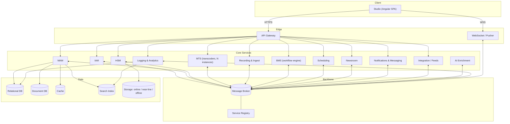
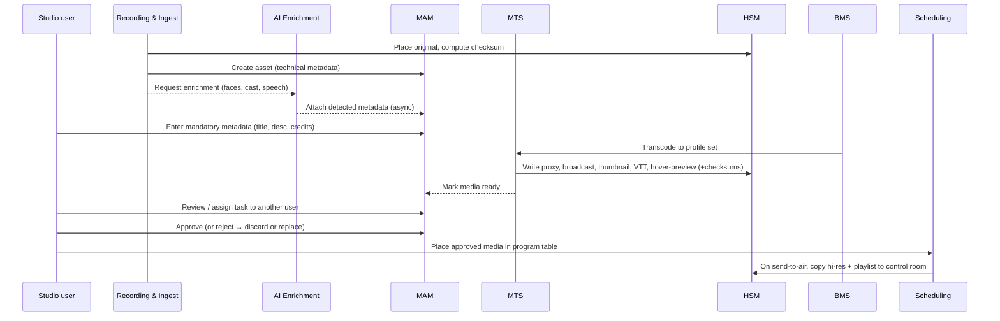

# Atlas Automation — Technical Brief

> The master reference for the Atlas platform. It expands the original draft into a
> structured document and is the parent for the more detailed specifications
> ([Architecture](architecture/02-system-architecture.md),
> [Service Catalog](architecture/03-service-catalog.md),
> [Requirements](requirements/05-functional-requirements.md), and the
> [Roadmap](roadmap/08-roadmap.md)).

## 1. Purpose and scope

Atlas is automation software for the media industry — television, radio, news, and live
events. It is the next generation of the Atlas Automation platform originally built by
this team more than ten years ago. The goal of the rebuild is not a feature port but a
re-platforming: a **service-based (microservices)** system that is more maintainable,
extendable, cross-platform, secure, and operable by a small team.

The platform is:

- **Multilingual** — UI and content metadata in multiple languages, including RTL layouts.
- **Themeable** — per-tenant and per-user visual theming.
- **Multi-channel / multi-station** — one deployment can operate several stations of
  different types (e.g. a TV channel and a radio station) with isolation between them.
- **Process-flow driven** — business workflows are configurable, not hard-coded.

This document defines the vision, principles, the service landscape, the core end-to-end
flows, and the cross-cutting concerns. Detailed contracts live in the linked specs.

## 2. Design principles

1. **Each service is standalone and independently deployable.** A service owns its data
   and its lifecycle. Some services are singletons; others (e.g. transcoders) scale to
   many instances on demand and are torn down when the queue drains.
2. **Communicate through the broker, not through direct coupling.** Services exchange
   **commands**, **progress updates**, **responses**, and **events** over a message
   broker. Messages may be private (point-to-point to one service) or broadcast to all
   interested subscribers. Synchronous request/response is reserved for the API surface;
   internal work is asynchronous and event-driven.
3. **Configuration over code for workflows.** Business process flows, ingest rules,
   transcode profiles, and validation rules are data that operators can change without a
   deploy.
4. **Secure by default.** Authentication and authorization are centralized; every service
   validates tokens and enforces permissions; file and service access are least-privilege.
5. **Observability is a feature.** Every user and system action is logged; progress and
   state changes are streamed; the system is measurable end to end.
6. **Cross-platform.** Services run on Linux or Windows; Studio runs in any modern browser.
7. **Graceful degradation.** A failure in one service (e.g. AI enrichment) must not block
   the critical path (ingest → metadata → transcode → schedule).

## 3. System at a glance

## 4. Core services

The services below are described in full in the [Service Catalog](architecture/03-service-catalog.md).
This section gives the intent of each and completes the descriptions from the draft.

### 4.1 HSM — Hierarchical Storage Manager
Manages asset files and their physical placement across three tiers:

- **Online** — media needed day-to-day for current schedules; fast storage.
- **Near-line** — accessible on demand with modest latency; larger, cheaper storage.
- **Offline** — backup storage or tape/object-archive; longest restore time.

HSM performs the file-system operations (copy, move, delete), tracks each asset's tier and
online/offline status, restores assets on request, verifies checksums, and copies
high-resolution files and playlists to control-room network destinations when a schedule is
sent to air. It is the single authority over where bytes physically live.

### 4.2 IAM — Identity and Access Management
Owns users, groups, roles, permission rules, and authentication.

- Media organizations are structured into **departments** by content, region, or
  discipline (e.g. a news network with weather, sports, and politics groups; an
  entertainment channel with classic, comedy, and animation departments). **Groups** model
  these departments or role-based cohorts such as "editors."
- A user belongs to one or more groups. There is a central list of **permission rules**;
  rules can be assigned to users and to groups. A user's effective permissions are the
  **union** of their own rules and the rules of every group they belong to (group grants
  are additive, so a group can widen but not silently narrow a user's access — see
  [FR-IAM](requirements/05-functional-requirements.md#iam) for the exact resolution rules).
- Authentication issues a short-lived **access token** and a longer-lived **refresh
  token** following JWT best practices; the access token authorizes every subsequent call
  based on the user's effective permissions.

### 4.3 MTS — Media Transcoding System
Transcodes all accepted incoming media to predefined **profiles** using FFmpeg. MTS is the
canonical horizontally-scaled service: when media is ingested, uploaded, or recorded, the
platform can spin up additional MTS instances to drain the transcode queue, then remove
them. At minimum, ingest produces a **proxy (low-resolution)** version and a **thumbnail**;
the full profile set (below) is produced as the asset advances through the workflow. A
transcode command carries the preset and the input/output paths.

### 4.4 MAM — Media/Metadata & Asset Management
The system of record for media metadata — some entered by users, some generated
automatically. A small set of **core fields** applies to every asset (title, duration,
description, file type, resolution, aspect ratio, audio channels). Beyond that, metadata is
**type- and category-specific**, so Atlas persists structured/core data in a **relational
database** and flexible/extensible data in a **document (NoSQL) store**, with a
**cache** in front to keep reads fast and data flow consistent. A **search index** provides
advanced search across both stores. MAM does not move bytes (that is HSM); it describes and
indexes them.

MAM also owns the platform's **classification and discovery layer** (see
[§4.9](#49-classification--discovery-tags-subjects-categories-people)): tags, subjects,
categories, and a **people/cast register**. These are the primary means of organizing and
finding assets.

### 4.5 Recording & Ingest Management
Media enters as files, or as recordings of streams/broadcasts converted into files (e.g. a
24-hour recording split into 1-hour segments). **Folder watchers** monitor drop locations
and pull in new content. Every file must satisfy predefined, customizable
**characteristics** — container/format, minimum size, matching aspect ratio, and so on —
before it is accepted. Files that pass become candidate assets awaiting metadata.

### 4.6 Studio
The application interface — an **Angular** SPA on a web server, talking to the platform API.
Studio is the only user-facing interface; access is permission-gated. Its shell is a **VS
Code-style workbench** — an activity-bar icon rail opening panels of collapsible views, a
multi-tab editor area, a bottom status bar, and a minimizable transfer/notification tray, with
light/dark/high-contrast theming ([D9](#9-resolved-decisions)). Full structure, dashboard,
welcome/what's-new, and the history/diff viewer are in the
[Studio Front-End Architecture & UX](architecture/studio-frontend.md).

- Responsive, **desktop- and tablet-first**, rich in UI elements (trees, tabs, resizable
  panels). Users personalize their workspace; layout changes are saved server-side and
  restored at next login.
- Studio holds a **WebSocket** connection for live change notification: **public** changes
  apply to everyone (e.g. new media added), **private** changes target the user (incoming
  messages, task updates).

**Main pages** (expanded from the draft):
- Customizable **dashboard** — reports, charts, latest updates, inbox, tasks, notifications.
- **Search / navigate media** (simple and advanced) — view and edit metadata, tags,
  description, shot-list, and type/category-specific custom fields.
- **Ingest / import** — uploaded and recorded media listed for permitted users to review
  and import by entering initial metadata.
- **Media editor** — video, audio, **and** image, with *basic-NLE* capability (not a full
  NLE). Loads a list of media, shows a preview, and renders output server-side that appears
  on the import page. Scope (see [§4.10](#410-media-editor-scope)):
  - **Video** — trim/cut, merge, static **and animated titles**, and **logo/graphic
    overlays**.
  - **Audio** — edit audio files on their own, and add/replace/fade audio on video.
  - **Image** — crop, resize, and simple **layer** compositing.
- **Schedule** — build and edit broadcast/stream program tables.
- **Newsroom** — full multimedia newsroom workflow management.
- **User management** — users, groups, rules.
- **Inbox** — incoming tasks; send, receive, and forward messages to users or groups.
- **Import/Export management** — build and edit import feeds (JSON/XML) and custom output
  APIs for third-party applications.
- **Social & web content management.**
- **Logs / analytics / statistics.**

### 4.7 BMS — Business Process Management System
The workflow engine. Atlas ships preset process flows; users **author, duplicate and modify**
flows for a specific category, type, or asset usage in a **visual, drag-and-drop designer in
Studio** ([D8](#9-resolved-decisions)). A flow is a versioned **JSON definition** that is
**losslessly convertible to BPMN 2.0** for interop with standard tools; the durable engine
(Temporal) executes it, issuing commands to other services and reacting to their events. Human-in-
the-loop review steps can sit at multiple points in a flow. The canonical default flow is
[Section 5](#5-canonical-end-to-end-flow).

### 4.8 Supporting services (assessed from the draft's open list)
The draft listed candidate services to keep, merge, or drop. The assessment:

| Candidate | Decision | Notes |
|-----------|----------|-------|
| Service registry | **Keep** | Needed for dynamic MTS instances and health/discovery. Can be a lightweight function of the broker/orchestrator rather than a bespoke service. |
| WebSocket / pusher | **Keep as its own service** | Fan-out of broker events to clients is a distinct scaling concern from the API. |
| API gateway / central API provider | **Keep** | Single ingress for auth, routing, rate-limiting, aggregation. |
| Firewall & security (file/service access) | **Keep as a cross-cutting capability**, not a single service | Enforced at gateway, per-service token validation, and HSM file-access rules. |
| Central database & cache vs per-service DB | **Hybrid** | Each service owns its schema; MAM's relational+document+cache is shared infrastructure, not shared schemas. See [Data model](architecture/04-messaging-and-data.md). |
| 3rd-party integrations (EPG, HbbTV launchers) | **Keep as the Integration/Feeds service** | Consolidates inbound feeds and outbound publishing. |
| API / feed creator | **Merge into Integration/Feeds** | Same domain as third-party I/O. |
| Log management | **Keep as Logging & Analytics** | Central audit + metrics + analytics. |
| AI (suggestions, detection, metadata generation) | **Keep as AI Enrichment**, off the critical path | Async enrichment that augments MAM; never blocks ingest. |
| Messaging / chat | **Merge into Notifications & Messaging** | User↔user/group messaging shares delivery with system notifications. |

Net service list after assessment: **HSM, IAM, MTS, MAM, Recording & Ingest, BMS,
Scheduling, Newsroom, Notifications & Messaging, Integration/Feeds, AI Enrichment,
Logging & Analytics**, plus the **backbone** (API Gateway, WebSocket service, Service
Registry, Message Broker) and the **data plane** (relational, document, cache, search,
storage). Scheduling and Newsroom are called out from Studio pages into their own services
because they carry substantial server-side domain logic.

### 4.9 Classification & discovery (tags, subjects, categories, people)
_This capability was implicit in the original draft and is made explicit here._ Finding the
right asset quickly is a first-class requirement, so Atlas organizes assets along several
complementary axes, all owned by MAM and projected into the search index:

- **Categories** — a hierarchical taxonomy an asset belongs to (e.g. *News → Politics*,
  *Entertainment → Comedy*). Categories often align with departments/groups in
  [IAM](#42-iam--identity-and-access-management) and can drive workflow and permissions.
- **Subjects / topics** — what an asset is *about* (e.g. "Election 2026", "Climate"),
  typically drawn from a **controlled vocabulary** so terms stay consistent and searchable.
- **Tags** — free-form or controlled keywords for flexible, ad-hoc labelling.
- **People / cast register** — a database of persons (presenters, cast, contributors) used
  both to enrich metadata and to **find assets by who is in or made them**. A person record
  is deliberately minimal: **name, role in the particular media, and optionally an image**
  (see [privacy scope](#6-cross-cutting-concerns) and
  [NFR-CMP](requirements/06-non-functional-requirements.md#compliance--data-governance)).
  AI face-matching ([§4.8](#48-supporting-services-assessed-from-the-drafts-open-list)) can
  *suggest* people for confirmation but never auto-creates on-air metadata.

Controlled vocabularies (categories, subjects, roles) are operator-managed configuration.
All four axes power **faceted search** — narrowing by category, subject, tag, and person
together — which is the main day-to-day way users locate media.

### 4.10 Media editor scope
The built-in editor is intentionally **basic-NLE**, not a full non-linear editor
([resolved decision D3](#9-resolved-decisions)). It spans three media kinds:

| Kind | In scope | Out of scope (Post-v1.0) |
|------|----------|--------------------------|
| **Video** | Trim/cut, merge, static & animated titles, logo/graphic overlay | Multi-track timelines, transitions, colour grading, VFX |
| **Audio** | Standalone audio edit; add/replace/fade audio on video | Multi-track mixing, mastering |
| **Image** | Crop, resize, simple layer compositing | Advanced retouching, non-destructive filters |

All edits are described in Studio; the actual render happens **server-side** (video/audio via
FFmpeg-based workers, images via an image-processing worker) and the result lands on the
Import page as a new asset version.

## 5. Canonical end-to-end flow

The default process flow, expanded from the draft. BMS coordinates it; each numbered step
maps to service commands and events.

1. **Ingest.** A medium enters via web upload, FTP, or folder watch (assume a 4K video
   meeting minimum requirements). Technical metadata (file info) and optional AI-driven
   detection (faces, cast, etc.) are derived; a **checksum** is generated for future
   integrity checks.
2. **Mandatory metadata.** The user enters basic metadata (title, description, main
   credits). This step is required. Every user and system action is **logged and stored**;
   some logs are visible to certain users, all are retained server-side.
3. **Transcode.** MTS picks up the original and produces a proxy low-res version, a
   high-res broadcastable version, a thumbnail, a **VTT-based** scrub filmstrip, and a
   simple hover preview. Each output gets its own checksum.
4. **Ready.** Media is usable. A user with sufficient access reviews the content or creates
   a **task** for another user by assigning the media to them.
5. **Approval.** A **manual human review** approves media to be broadcast-usable
   ([D7](#9-resolved-decisions)). An approval carries an **expiry** ("usable-until") inherited
   from the asset's category (overridable per asset); when it lapses the media becomes unusable and
   requires **re-review**. On rejection, media is either discarded — **retained then purged** after a
   configured window — or **replaced** by an updated version, which **clones the previous version's
   metadata to a new asset ID** (uploaded or produced in Studio's editor).
6. **Schedule.** A user with schedule-edit access places the media in program tables.
7. **Send to air.** When part or all of a schedule is sent to the control room, the
   **high-resolution files and the playlist are copied to a network destination**. The
   playlist is exported in a **standard format consumable by third-party playout software** —
   the first target is **Cinegy Air's MCRList** (`mcrs_playlist` XML), fully specified in
   [Playout Export — MCRList](integrations/14-playout-mcrlist-format.md) — so Atlas integrates
   with existing control-room systems rather than driving hardware itself
   ([resolved decision D1](#9-resolved-decisions)). The exporter is pluggable for other
   playout systems.

## 6. Cross-cutting concerns

- **Multi-tenancy / multi-channel.** A single deployment isolates stations/channels;
  assets, schedules, users, and themes are scoped per channel, with shared infrastructure.
  See [Architecture §Tenancy](architecture/02-system-architecture.md#tenancy).
- **Security.** Centralized auth (IAM), per-service token validation, least-privilege file
  access via HSM, gateway-level rate limiting and WAF. See
  [Architecture §Security](architecture/02-system-architecture.md#security).
- **Offline / air-gapped operation.** Some deployments run in **isolated networks with no
  internet** ([A9](README.md#assumptions-register)). All core functions — including AI
  enrichment — MUST work fully offline; any cloud-dependent feature (vendor AI, cloud
  transcode burst) is an **optional plug-in**, never a dependency.
- **Internationalization.** UI strings and select metadata fields are localizable; RTL
  supported; time zones and channel-local calendars respected in scheduling.
- **People data / privacy.** The people/cast register stores only **name, role in the media,
  and an optional image**, used for metadata and search. No broader biometric profiling is
  performed; face-matching only proposes matches against this limited register for human
  confirmation. See [NFR-CMP](requirements/06-non-functional-requirements.md#compliance--data-governance).
- **Auditability.** Immutable action log; every state transition is attributable to a user
  or a service.
- **Media integrity.** Checksums on every rendition; periodic near-line/offline
  verification sweeps by HSM.
- **Resilience.** The critical path degrades gracefully when non-critical services
  (AI, analytics) are unavailable.

## 7. Media profiles (default set)

| Rendition | Purpose | Notes |
|-----------|---------|-------|
| Original | Master / source of truth | Immutable; checksummed; may be tiered to near-line/offline. |
| Proxy (low-res) | Editing & browsing | Created at ingest with the thumbnail. |
| Broadcast (high-res) | On-air playout | Conforms to channel delivery spec. |
| Thumbnail | Grid/list poster | Created at ingest. |
| VTT filmstrip | Scrub preview in the player | Sprite + WebVTT cues. |
| Hover preview | Lightweight preview on mouse-over | Short low-bitrate clip. |

Profiles are **configurable per channel/type**; the table above is the shipped default.

## 8. What "done" means per milestone

The [Roadmap](roadmap/08-roadmap.md) defines four milestones; in brief:

- **MVP** — one channel, ingest → metadata → transcode → search → schedule, with IAM,
  logging, and the WebSocket live-update spine. Real workflow, single tenant.
- **Beta** — approval workflow, tasks/inbox, media editor (basic), Newsroom (core),
  multi-channel isolation, integration feeds (inbound EPG).
- **v1.0 (first stable full-feature)** — full workflow authoring in BMS, AI enrichment,
  HbbTV/EPG publishing, social/web content, analytics, HA and near-line/offline automation.
- **Post-v1.0** — multi-tenant SaaS scale, marketplace of profiles/flows, advanced editor.

## 9. Resolved decisions

The six original open questions (**D1–D6**) were settled by the stakeholder; further decisions
(**D7–D8**) were settled as the design matured and were validated by the
[reference implementation](../reference/README.md). They are recorded here as decisions that the
rest of the documentation reflects.

| # | Question | Decision |
|---|----------|----------|
| **D1** | Playout integration | **Integrate, don't build (for now).** Atlas exports **standard playlist formats** + hi-res files for third-party playout software; the first target is **Cinegy Air MCRList** ([format spec](integrations/14-playout-mcrlist-format.md)), and the exporter is pluggable. A **channel-in-the-box** (CG, playout, etc.) integrated with the automation solution is a **future / Post-v1.0** ambition ([A10](README.md#assumptions-register)). |
| **D2** | Legacy migration | **Out of scope.** No existing legacy-Atlas data will be converted in this project ([A11](README.md#assumptions-register)). If ever needed, it is a separate project. |
| **D3** | Editor depth | **Basic-NLE across video, audio, and image** — trim/merge, static & animated titles, logo/graphic overlay; audio edit and add/replace/fade on video; image crop/resize/layers. A full NLE is Post-v1.0. See [§4.10](#410-media-editor-scope). |
| **D4** | AI approach | **AI is an online-first feature.** Full enrichment (detection, STT, face-matching) runs against **cloud/vendor providers** and is available to connected deployments. **Air-gapped deployments get a limited local AI tier** — lightweight **suggestions and simple tasks only** — or no AI. The critical media path never depends on AI either way. See [§10](#10-ai-strategy-online-first-with-a-limited-offline-tier). |
| **D5** | Cast / privacy scope | **Minimal people register** — name, role in the media, optional image — for metadata and search only. No broader biometric profiling. See [§4.9](#49-classification--discovery-tags-subjects-categories-people) and [NFR-CMP](requirements/06-non-functional-requirements.md#compliance--data-governance). |
| **D6** | First customer & team | **1–3 channels, 10–100 concurrent users**, served by the **smallest agile team** ([A6/A7](README.md#assumptions-register)). Sizing baseline and team plan follow in docs [07](requirements/07-hardware-requirements.md) and [09](roadmap/09-resourcing-estimates.md). |
| **D7** | Review, approval & expiry | **Manual review is the gate.** Media requires a **manual human approval** before it is broadcast-usable; an approval carries an **expiry** ("usable-until") that is **inherited from the asset's category** and overridable per asset — on lapse the asset becomes unusable and needs **re-review**. **Rejected** media is retained for a configured window then **purged**. MAM's internal scheduler drives expiry/purge; Scheduling enforces **approved-and-not-expired at send-to-air**. AI never auto-approves. See [FR-APP-5…8](requirements/05-functional-requirements.md#approval), [FR-TAX-7](requirements/05-functional-requirements.md#classification), and the [Review Lifecycle plan](roadmap/15-review-lifecycle-implementation-plan.md). |
| **D8** | Workflow authoring | **Studio gets a visual, drag-and-drop workflow designer** ([Foblex Flow](https://flow.foblex.com/)) over a versioned **JSON DSL that is losslessly convertible to BPMN 2.0** (interop with standard tools). Flows execute on a durable runtime (**Temporal**) via an `Effects` boundary, so the interpreter is engine-independent. See [FR-BMS-7…10](requirements/05-functional-requirements.md#workflow) and the [Workflow DSL & Designer design](architecture/bms-workflow-dsl-and-designer.md). |
| **D9** | Studio UX shell | **A VS Code-style "workbench"** — an activity-bar icon rail opening panels of collapsible views, a **multi-tab editor area** for many item types, a bottom **status bar**, and a minimizable **transfer/notifications tray** — with **light / dark / high-contrast** theming. Everything mutable has a **git-diff-style history viewer** ("log/diff everything"). See the [Studio Front-End Architecture & UX](architecture/studio-frontend.md), [FR-UI](requirements/05-functional-requirements.md#studio), and [FR-AUD](requirements/05-functional-requirements.md#audit). |

## 10. AI strategy: online-first, with a limited offline tier

AI enrichment is treated as an **online-first, value-add feature** ([D4](#9-resolved-decisions)),
not a platform dependency. This keeps the offline/air-gapped story simple and avoids forcing
a heavy on-prem GPU footprint on every customer.

**Two tiers behind one provider abstraction:**

- **Online (full) tier — cloud/vendor providers.** For connected deployments, full-strength
  enrichment — face-matching against the limited
  [people register](#49-classification--discovery-tags-subjects-categories-people),
  speech-to-text/subtitles, object/logo/shot detection, summaries — runs against managed
  cloud AI. Best accuracy, no local GPU capex, pay per use. This is the **primary** experience
  and the only tier that ships some features (e.g. high-accuracy STT).
- **Offline (limited) tier — small local models, optional.** Air-gapped sites get a
  **reduced** capability: lightweight **suggestions and simple tasks** (e.g. basic tagging
  hints, shot-change detection, rough transcript) on a **small local model** that can run on
  modest hardware — or they run with **no AI at all**. It is explicitly *not* expected to
  match the online tier's accuracy.

**Invariants (both tiers):**
- AI is **always off the critical path** and produces **suggestions for human confirmation** —
  it never blocks ingest/approval and never auto-writes mandatory metadata or creates people.
- The platform is **fully operable with AI disabled**; air-gapped installs remain valid with
  the limited tier or none.

**Why this is better than "self-hosted-first":** it removes the requirement to reproduce
cloud-grade accuracy on-prem, shrinks the mandatory GPU footprint (see
[Hardware §7](requirements/07-hardware-requirements.md#7-gpu-guidance)), and lets the online
tier ship first. Recommendation: **build the provider abstraction, ship the online tier as
the default, add the small offline model as a later, optional add-on for air-gapped sites.**

---
_Next: [System Architecture](architecture/02-system-architecture.md)._
