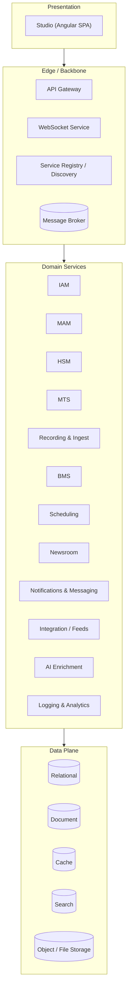
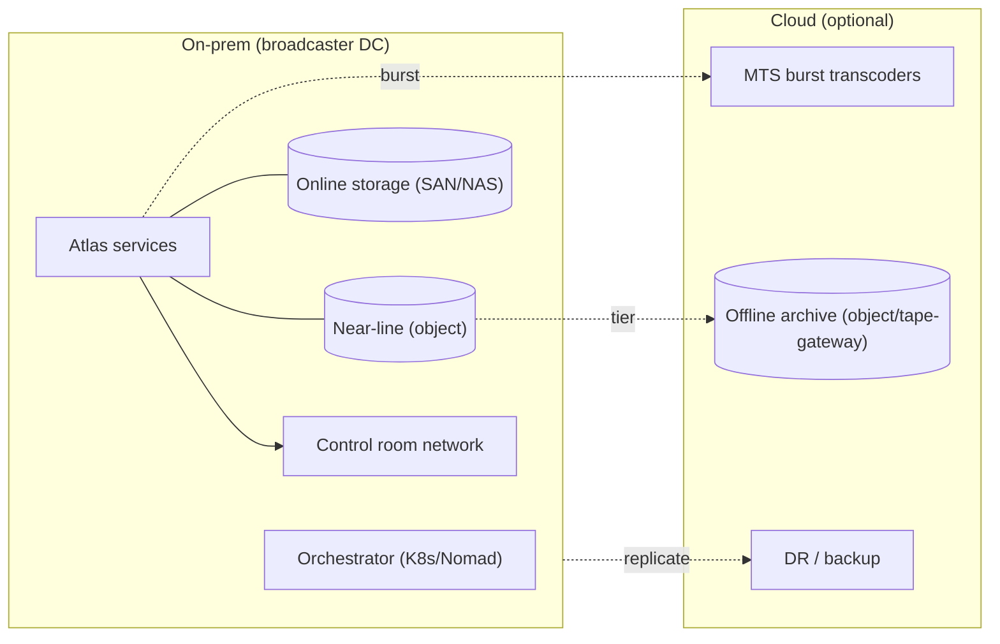
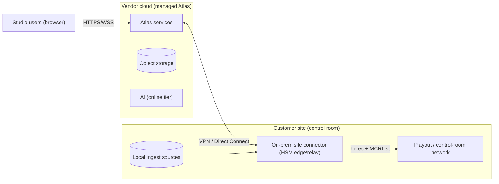

# System Architecture

> Runtime topology, cross-cutting services, tenancy, security, and deployment shapes.
> Parent: [Technical Brief](../01-technical-brief.md). Sibling detail:
> [Service Catalog](03-service-catalog.md), [Messaging & Data](04-messaging-and-data.md).

## 1. Architectural style

Atlas is a **microservices** system with an **event-driven backbone** and a thin
synchronous edge. The rules of engagement:

- **Edge is synchronous, core is asynchronous.** Studio talks HTTPS to an **API Gateway**
  and WSS to a **WebSocket service**. Behind the gateway, services coordinate through the
  **message broker** using commands, events, progress, and responses.
- **Database-per-service ownership.** No service reads another service's tables. Shared
  data is exchanged through events or the owning service's API. The relational, document,
  cache, and search engines are shared *infrastructure*, but schemas/namespaces are owned
  per service (see [Data](04-messaging-and-data.md)).
- **Choreography by default, orchestration where it pays.** Most flows are choreographed
  (services react to events). The **BMS** workflow engine orchestrates the multi-step
  business flows that operators author, because those need visibility, retries, and
  human-in-the-loop steps.
- **Idempotency and correlation everywhere.** Every message carries a `correlationId` and a
  `messageId`; consumers are idempotent so at-least-once delivery is safe.

## 2. Logical layers

- **Presentation** — Studio only; all logic server-side.
- **Edge/Backbone** — ingress, discovery, and the message bus. Cross-cutting, no domain
  logic.
- **Domain services** — the business capabilities. Each is independently deployable and
  scalable.
- **Data plane** — the persistence and search engines the domain services use.

## 3. Backbone services

### 3.1 API Gateway
Single ingress for Studio and third parties. Responsibilities:
- TLS termination, routing to services, and **request aggregation** (composing one Studio
  view from several services where useful, via a thin backend-for-frontend layer).
- **AuthN/AuthZ enforcement point**: validates the JWT access token on every request,
  checks coarse-grained permission scopes, and forwards user/permission context downstream.
- **Rate limiting**, request/response size limits, WAF rules, and API versioning.
- Emits access logs to [Logging & Analytics](03-service-catalog.md#logging--analytics).

### 3.2 WebSocket Service (Pusher)
Bridges broker events to connected Studio clients. It subscribes to broker topics,
applies per-user permission filtering, and pushes:
- **Public** channels — data everyone (in a channel/tenant) may see (e.g. new media).
- **Private** channels — per-user streams (messages, task updates, job progress).

It holds no domain logic; it is a permission-aware fan-out with backpressure and
reconnection/resume support.

### 3.3 Service Registry / Discovery
Tracks live service instances and their health. Critical for **MTS elasticity** (new
transcoder instances register on start, deregister on drain) and for the gateway/broker to
route to healthy instances. In practice this is provided by the orchestrator
(Kubernetes/Nomad) plus the broker's own subject/consumer model rather than a bespoke
service; a thin registry API exposes the current topology for dashboards.

### 3.4 Message Broker
The communication backbone. See [Messaging & Data](04-messaging-and-data.md) for topology,
delivery guarantees, and the event catalog. Recommendation: **NATS JetStream** (light ops,
strong at commands + streams) or **RabbitMQ** (mature routing); **Kafka** if the program
decides on heavy event-sourcing/replay and long-retention audit as first-class.

## 4. Tenancy and multi-channel

A single Atlas deployment serves multiple **channels/stations** (a "tenant" is typically a
channel or a station family). Model:

- **Isolation logical, infrastructure shared.** Every domain row/document carries a
  `channelId`; queries are always channel-scoped; cross-channel access requires an explicit
  permission. This is *soft* multi-tenancy (shared services, partitioned data).
- **Where stronger isolation is needed** (e.g. a hosting provider running rival
  broadcasters), storage buckets, search indices, and broker subjects can be partitioned
  per tenant, up to fully separate deployments for the highest isolation tier.
- **Per-channel configuration** — themes, ingest rules, transcode profiles, workflow
  definitions, retention policies, and localization are all channel-scoped configuration.

Tenancy tiers (choose per customer):

| Tier | Data isolation | Compute | Use case |
|------|----------------|---------|----------|
| Shared | `channelId` row-scoping | Shared services | Multiple channels, one broadcaster |
| Partitioned | Separate buckets/indices/subjects | Shared services | Broadcaster with strict inter-brand rules |
| Dedicated | Separate everything | Separate cluster | Hosted rivals / sovereignty requirements |

## 5. Security

Security is cross-cutting, enforced in depth rather than by a single "firewall" service.

### 5.1 Authentication
- IAM issues **JWT access tokens** (short TTL, e.g. 5–15 min) and **refresh tokens**
  (longer TTL, rotating, revocable). Tokens carry `sub`, `channelId`(s), roles, and a
  permission-version claim so revocation invalidates stale grants.
- Support for SSO (OIDC/SAML) federation to a broadcaster's IdP is a v1.0 target.
- Optional MFA for privileged roles.

### 5.2 Authorization
- **Effective permissions = union of the user's own rules and every group's rules.** Rules
  are additive grants; there is no per-rule "deny that overrides allow" in the base model
  (an explicit deny-list is a v1.0 option if a customer needs it). The exact algorithm is
  specified in [FR-IAM](../requirements/05-functional-requirements.md#iam).
- The **gateway** enforces coarse scopes; each **service** enforces fine-grained,
  resource-level checks (e.g. "edit metadata of assets in the Sports department").
- **HSM** enforces file-access least privilege: services request file operations through
  HSM rather than touching storage directly, so storage credentials never leave HSM.

### 5.3 Transport & data protection
- TLS everywhere (client↔edge and service↔service, mTLS internally).
- Secrets in a vault; no secrets in config files or images.
- Encryption at rest for storage tiers and databases; per-tenant keys in the dedicated tier.
- PII (cast/contributor data, user accounts) tagged and subject to retention/erasure policy.

### 5.4 Auditing
Every state change and privileged read is logged with actor, resource, channel, and
correlation id to [Logging & Analytics](03-service-catalog.md#logging--analytics). Audit
logs are append-only and retained per policy.

## 6. Observability

- **Logs** — structured JSON, correlation-id propagated, shipped to the central store and
  search index.
- **Metrics** — each service exposes counters/histograms (queue depth, transcode duration,
  API latency, restore times); scraped by the monitoring stack.
- **Traces** — distributed tracing across gateway → services → broker for the critical
  path.
- **Health** — liveness/readiness endpoints feed the registry and orchestrator.

## 7. Deployment shapes

Per [Assumption A1](../README.md#assumptions-register), Atlas is **on-prem-first,
cloud-optional**.

- **All-on-prem** — everything in the broadcaster's DC; cloud used only for offsite DR.
- **Hybrid** — steady-state on-prem; **MTS bursts to cloud** for ingest spikes; offline
  tier is cloud object/tape-gateway. This is the recommended default.
- **Cloud-hosted / SaaS (managed service)** — Atlas runs in the vendor's cloud and the
  customer subscribes per channel/seat instead of installing anything. Covered in detail
  below.

Containers everywhere; orchestrated by Kubernetes (or Nomad for lighter on-prem). MTS runs
as a scalable job/deployment driven by queue depth (KEDA or equivalent).

### 7.1 Cloud-hosted / SaaS (managed service) {#saas}

A customer who does **not** run their own datacentre — or simply prefers OPEX to CAPEX — can
buy Atlas as a **vendor-hosted subscription** rather than an install. The same containers and
contracts are used; nothing in the architecture has to change. **It works**, with two things
to design for deliberately:

1. **The last mile to playout.** Playout stays in the broadcaster's control room
   ([A10](../README.md#assumptions-register)), so a cloud-hosted Atlas must still deliver
   hi-res files + the [MCRList playlist](../integrations/14-playout-mcrlist-format.md) onto
   the **on-prem control-room network** where `src_path` resolves. This needs a small
   **on-prem site connector** (a lightweight HSM edge/relay agent, or a site-to-site
   VPN/Direct-Connect) that receives send-to-air outputs and writes them locally. Studio,
   MAM, scheduling and AI are all fine over the public internet; only the media hand-off and
   any on-prem ingest sources need the connector.
2. **Media egress economics & latency.** Broadcast masters are large; hosting them in cloud
   object storage and copying hi-res back to the control room means real **bandwidth and
   egress cost**. Size the site link and cache hot/near-air media at the edge. This is the
   main reason a heavy-ingest, single-site broadcaster may still prefer on-prem or hybrid.

**Tenancy.** SaaS uses the **Partitioned** or **Dedicated** tenancy tier (§4) per subscriber;
early customers can be single-tenant-per-cluster for isolation and simplicity, with true
large-scale multi-tenant SaaS a Post-v1.0 concern (see the [Roadmap](../roadmap/08-roadmap.md)).
**AI** is a natural fit here — the [online tier](../requirements/05-functional-requirements.md#ai)
is available by default, no on-prem GPU. **Air-gapped customers cannot use SaaS** by
definition ([A9](../README.md#assumptions-register)); it is an option *alongside* on-prem, not
a replacement. Commercial/licensing implications are noted in
[Resourcing §4](../roadmap/09-resourcing-estimates.md#cost).

## 8. Failure and degradation model

| If this fails… | Then… | Critical path affected? |
|----------------|-------|-------------------------|
| AI Enrichment | Enrichment queued/retried; manual metadata still works | No |
| Analytics/Logging (read path) | Dashboards stale; writes buffered | No |
| WebSocket service | Studio falls back to polling; work continues | Degraded UX only |
| MTS (all instances) | Transcode queue backs up; alerts fire; ingest continues | Yes — blocks "ready" |
| MAM | Metadata read/write blocked | Yes |
| HSM | File ops blocked; playout copy blocked | Yes |
| Broker | Services buffer/retry; hard dependency | Yes — HA required |

Critical-path services (MAM, HSM, MTS, broker, IAM, gateway) are the priority for
**high-availability** work in [Roadmap Phase 3](../roadmap/08-roadmap.md).

## 9. Technology recommendations (non-binding)

The backend baseline is **Node.js (LTS) + TypeScript** across all services
([A2](../README.md#assumptions-register)) — a deliberate single-language choice that lets the
message envelope, event contracts, and client types be shared as packages between services
*and* the Angular Studio, which is a real force-multiplier for a small team. The per-service
framework picks and the two places a native/compiled **escape hatch** is worth it are in
[Service Catalog §Recommended implementation stack](03-service-catalog.md#recommended-implementation-stack).

| Concern | Recommendation | Alternatives |
|---------|----------------|--------------|
| Backend services (control-plane + domain) | Node.js LTS + TypeScript, **NestJS** | .NET 8/C#, Java/Spring, Go |
| Thin high-throughput edges (gateway/BFF, WebSocket) | Node.js + **Fastify** (or NestJS-on-Fastify) | Go, Rust |
| CPU/IO hot paths (HSM hashing & byte movement, very-high-fanout WS) | Node worker-threads; **native addon** (N-API / Rust via napi-rs) or a small Go/Rust worker *only where profiling proves it* | Go, Rust service |
| Transcode compute | **FFmpeg** subprocess (language-agnostic; Node supervises) | +NVENC/QSV/VAAPI |
| ML inference (offline AI tier) | Sidecar model server (Python / ONNX Runtime), called over local HTTP/gRPC | — |
| Durable workflow runtime (BMS) | Temporal (**TypeScript SDK**) or broker-backed saga | — |
| SPA | Angular (given) | — |
| Broker | NATS JetStream | RabbitMQ, Kafka |
| Relational | PostgreSQL | SQL Server |
| Document | MongoDB | PostgreSQL JSONB |
| Cache | Redis | Valkey |
| Search | OpenSearch / Elasticsearch | Meilisearch (small) |
| Object storage | MinIO (on-prem) / S3 (cloud) | Ceph |
| Orchestration | Kubernetes | Nomad |

**Escape-hatch policy.** Default every service to Node/TypeScript. Only introduce a native
addon or a tiny Go/Rust worker for a *specific* hot loop proven by profiling — never a second
whole-language stack for a service without evidence. See
[Resourcing §Stack rationale](../roadmap/09-resourcing-estimates.md#stack-rationale) for how
this affects hiring and estimates.

---
_Next: [Service Catalog](03-service-catalog.md)._
