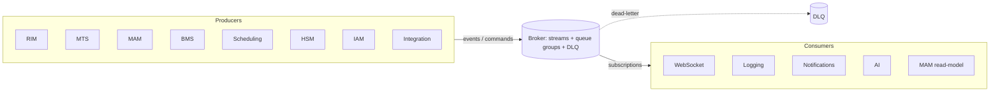
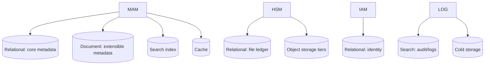

# Messaging & Data Model

> Broker topology and delivery semantics, the message envelope, the event catalog, and the
> persistence strategy. Parent: [System Architecture](02-system-architecture.md). Services:
> [Service Catalog](03-service-catalog.md).

## 1. Messaging model

Atlas services exchange four kinds of message:

| Kind | Direction | Delivery | Example |
|------|-----------|----------|---------|
| **Command** | point-to-point, private | at-least-once, durable | "transcode asset X to profile P" |
| **Event** | publish/subscribe, broadcast | at-least-once, durable, replayable | "asset X is ready" |
| **Progress** | publish/subscribe | best-effort, ephemeral OK | "transcode X 42%" |
| **Response** | point-to-point (reply) | at-least-once | result of a command |

- **Private** messages target one service (a command queue or a reply subject).
- **Broadcast** messages are events any subscriber may consume (MAM, WebSocket, Logging,
  Notifications, …).
- **Progress** is high-volume and lossy-tolerant; it drives progress bars, not state.

### 1.1 Subject / topic naming

```
atlas.<channelId>.<domain>.<entity>.<action>
```

Examples:
- `atlas.ch12.ingest.asset.accepted`
- `atlas.ch12.transcode.job.progress`
- `atlas.*.asset.*.ready` (wildcard subscription, all channels)

Commands use a `cmd.` prefixed subject bound to a durable queue group so any instance of the
target service (e.g. one of many MTS workers) can pick them up:
- `atlas.ch12.cmd.transcode.job.create`

### 1.2 Delivery guarantees & idempotency

- **At-least-once** for commands and events; consumers **must be idempotent** keyed on
  `messageId` (dedupe window) and/or natural keys.
- **Ordered per entity** where it matters (per `assetId`) via subject partitioning / ordered
  consumers.
- **Dead-letter** subjects for poison messages; ret/backoff policy per consumer.
- **Replay**: events retained long enough to rebuild read models and for audit; retention is
  per-domain (asset lifecycle events retained longer than progress).

### 1.3 Message envelope

Every message shares an envelope so tracing, tenancy, and idempotency are uniform:

```json
{
  "messageId": "01J8Z...",          // ULID, unique per message
  "correlationId": "01J8Y...",      // ties a whole flow together
  "causationId": "01J8X...",        // the message that caused this one
  "type": "transcode.completed",    // <domain>.<entity>.<action>
  "channelId": "ch12",
  "actor": { "kind": "service|user", "id": "mts-7|user-42" },
  "occurredAt": "2026-07-21T10:15:00Z",
  "schemaVersion": 1,
  "payload": { }                     // type-specific, versioned
}
```

Contracts are versioned (`schemaVersion`); additive changes only within a major version.
Consumers ignore unknown fields (tolerant reader). Schema:
[envelope.schema.json](schemas/envelope.schema.json).

## 2. Broker topology



- **Streams** persist events per domain with retention and replay.
- **Queue groups** load-balance commands across scaled instances (MTS, HSM workers).
- **Reply subjects** carry responses back to the caller.
- **DLQ** captures messages that exceed retry limits, with alerting.

Recommended brokers per [A4](../README.md#assumptions-register): **NATS JetStream** (default),
**RabbitMQ** (routing-heavy), **Kafka** (if event-sourcing/long audit is first-class).

## 3. Event catalog (core)

Grouped by domain; payload keys abbreviated. Machine-readable **[JSON Schema payloads](schemas/)**
(draft 2020-12) back every event below, composed with the shared
**[message envelope](schemas/envelope.schema.json)**.

### Ingest
| Event | Emitter | Key payload | Consumers |
|-------|---------|-------------|-----------|
| `ingest.detected` | RIM | source, path, size | Logging |
| `ingest.accepted` | RIM | assetId, tech metadata, checksum | MAM, MTS, AI, Logging |
| `ingest.rejected` | RIM | reason, rule | Notifications, Logging |
| `recording.segment.completed` | RIM | recorderId, segment | RIM, Logging |

### Transcode
| Event | Emitter | Key payload | Consumers |
|-------|---------|-------------|-----------|
| `transcode.job.create` (cmd) | BMS/RIM | assetId, preset, in/out | MTS |
| `transcode.started` | MTS | jobId, assetId | Logging |
| `transcode.progress` | MTS | jobId, pct | WebSocket |
| `transcode.completed` | MTS | assetId, renditions[] +checksums | MAM, HSM, Logging |
| `transcode.failed` | MTS | assetId, error | Notifications, BMS, Logging |

### Asset lifecycle
| Event | Emitter | Key payload | Consumers |
|-------|---------|-------------|-----------|
| `asset.created` | MAM | assetId, core fields | AI, Search, Logging |
| `asset.updated` | MAM | assetId, changed fields | WebSocket, Search, Logging |
| `asset.ready` | MAM | assetId | WebSocket, BMS, Notifications |
| `asset.approved` | MAM | assetId, approver, expiresAt? | Scheduling, Integration, Logging |
| `asset.rejected` | MAM | assetId, reason, retainUntil? | Notifications, Logging |
| `asset.expired` | MAM | assetId, expiredAt (scheduler; → re-review) | Scheduling, Notifications, Logging |
| `asset.replaced` | MAM | oldId, newId | Scheduling, Logging |
| `asset.deleted` | MAM | assetId, reason (scheduler purge / manual) | HSM, Logging |
| `person.created` / `person.linked` | MAM | personId, assetId, role | Search, Logging |
| `taxonomy.updated` | MAM | category/subject/tag change | Search, WebSocket |
| `ai.suggestion.raised` | AI | assetId, suggested people/tags | MAM, Notifications |

### Storage
| Event | Emitter | Key payload | Consumers |
|-------|---------|-------------|-----------|
| `file.placed` | HSM | assetId, tier, path | MAM, Logging |
| `file.moved` | HSM | assetId, from→to tier | MAM, Logging |
| `restore.completed` | HSM | assetId | Scheduling, Notifications |
| `checksum.mismatch` | HSM | assetId, rendition | Notifications, Logging (alert) |
| `playout.export.completed` | HSM | scheduleId, destination | Scheduling, Logging |

### Workflow / scheduling / people
| Event | Emitter | Key payload | Consumers |
|-------|---------|-------------|-----------|
| `workflow.step.requested` | BMS | instanceId, stepId, stepKind, target | target service, Logging |
| `workflow.task.created` | BMS | taskId, assignee, assetId | Notifications |
| `workflow.completed` | BMS | instanceId, outcome | Notifications, Logging |
| `editor.render.requested` (cmd) | Studio/BFF | editProjectId, timeline, outputProfile | MTS |
| `schedule.updated` | Scheduling | scheduleId, items | Integration (EPG), WebSocket |
| `schedule.validated` | Scheduling | scheduleId, valid, issues[] | WebSocket, Logging |
| `schedule.sent-to-air` | Scheduling | scheduleId | HSM, Logging |
| `permissions.changed` | IAM | userId | Gateway/cache, WebSocket |
| `ai.enrichment.completed` | AI | assetId, results | MAM, Notifications |

### Identity / configuration
| Event | Emitter | Key payload | Consumers |
|-------|---------|-------------|-----------|
| `user.created` | IAM | userId, username, state | Notifications, Logging |
| `user.updated` | IAM | userId, changed[] | WebSocket, Logging |
| `group.membership.changed` | IAM | userId, groupId, action | Gateway/cache, WebSocket, Logging |
| `config.changed` | any owning service | area, tier, configVersion | all services, Studio |

### Newsroom / integration / messaging / alerts
| Event | Emitter | Key payload | Consumers |
|-------|---------|-------------|-----------|
| `story.updated` | Newsroom | storyId, status | WebSocket, Logging |
| `rundown.updated` | Newsroom | rundownId | WebSocket, Logging |
| `rundown.ready` | Newsroom | rundownId | Scheduling, Notifications, Logging |
| `feed.item.received` | Integration | feedId, itemId, targetType | Newsroom, MAM, Logging |
| `publish.completed` | Integration | connectorId, subjectRef, destination | Logging |
| `publish.failed` | Integration | connectorId, subjectRef, error | Notifications, Logging |
| `message.sent` | Notifications | id, from, to[] | WebSocket, Logging |
| `notification.raised` | Notifications | id, userId, type, severity | WebSocket |
| `task.created` | Notifications | id, assignee, kind, subjectRef | WebSocket, Logging |
| `task.updated` | Notifications | id, state | WebSocket, BMS, Logging |
| `ai.enrichment.failed` | AI | assetId, task, error | Notifications, Logging |
| `alert.raised` | Logging | alertId, source, kind, severity | Notifications |
| `gateway.access.logged` | API Gateway | requestId, method, path, status | Logging |

> **Machine-readable.** Every event above has a payload contract under
> [`schemas/events/`](schemas/README.md#index); the `type` values validate against the shared
> [envelope](schemas/envelope.schema.json).

## 4. Persistence strategy

Per [A/architecture](02-system-architecture.md#1-architectural-style), **each service owns
its schema**; the engines are shared infrastructure.



### 4.1 Why relational **and** document (from the draft)
- **Relational** holds the **core fields** required for *every* asset (title, duration,
  description, file type, resolution, aspect ratio, audio channels) and all
  referential/consistency-critical data (schedules, users, rights, file ledger).
- **Document** holds **type/category-specific** and evolving fields (a sports clip's teams
  and scoreline; a movie's chapters; a news story's wire references) without schema churn.
- **Cache** (memory-based) fronts hot reads to keep the data flow consistent and fast, as
  the draft anticipates.
- **Search index** projects both stores for simple and advanced search.

### 4.2 Consistency
- Within a service: transactional (relational) with the document/search updated via the
  service's own outbox → broker to avoid dual-write anomalies.
- Across services: **eventual consistency** via events; read models (search index, MAM
  cache, dashboards) are rebuildable by replay.
- The **outbox pattern** guarantees "state changed ⇒ event published" exactly once from the
  producer's perspective.

### 4.3 Data ownership map

| Data | Owner | Store(s) |
|------|-------|----------|
| Users, groups, roles, rules | IAM | Relational + cache |
| Core asset metadata | MAM | Relational |
| Extensible metadata, shot-lists | MAM | Document |
| Tags, categories, subjects (vocabularies) | MAM | Relational + document |
| People / cast register (name, role, image) | MAM | Relational + object (image) |
| Search corpus | MAM (+Logging) | Search index |
| File locations, tiers, checksums | HSM | Relational + object |
| Transcode jobs | MTS | Queue + relational |
| Ingest queue, rules, watchers | RIM | Relational |
| Workflow defs + instances | BMS | Relational + durable timers |
| Schedules, items, rights | Scheduling | Relational |
| Rundowns, stories, scripts | Newsroom | Relational + document |
| Messages, tasks, inbox | Notifications | Relational |
| Feeds, connectors, mappings | Integration | Relational |
| Audit, logs, metrics | Logging | Search + cold |

### 4.4 Retention & tiering
- **Assets** follow HSM tiering (online → near-line → offline) by policy (age, usage,
  schedule proximity).
- **Events**: lifecycle events long-retained (audit/replay); progress short-retained.
- **Logs/audit**: hot in search for N days, then cold storage per compliance policy.
- **PII**: tagged for retention/erasure per [NFR-SEC](../requirements/06-non-functional-requirements.md#security--privacy).

---
_Next: [Functional Requirements](../requirements/05-functional-requirements.md)._
