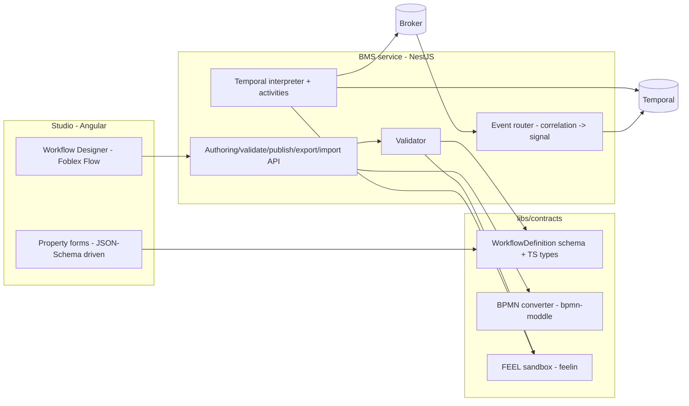

# BMS Workflow DSL, Designer, Engine & BPMN Converter — Technical Design

> The implementation-level blueprint behind [BMS](services/bms.md) §3.2/§3.3: the exact
> definition model, step-kind catalog, expression language, validation, persistence, the Temporal
> interpreter, the BPMN 2.0 converter, and the Foblex Flow canvas. Machine-readable contract:
> [`workflow-definition.schema.json`](schemas/workflow-definition.schema.json). Build plan:
> [bms-plan](../roadmap/services/bms-plan.md).
>
> Goal: enough precision that the schema, converter, engine, and canvas can be built in parallel
> against frozen contracts.

## 0. Component map



Three deployables share **one contracts package**: the Angular canvas, the BMS backend, and the
pure converter/FEEL libs used by both.

## 1. Definition model

The [`WorkflowDefinition`](schemas/workflow-definition.schema.json) is a directed graph:
`steps[]` (nodes) + `transitions[]` (edges) + `vars[]` (typed instance state). It is the **single
source of truth** — edited by the canvas, stored as `jsonb`, executed by the interpreter,
converted to/from BPMN. Generate `libs/contracts` TS types from the schema (`json-schema-to-typescript`)
so canvas and backend share `WorkflowDefinition`, `Step`, `Transition`, per-kind config types.

**Invariants** (enforced by schema + validator, §6):

- Exactly one `start`; ≥1 `end`. Every `Step.id`/`Transition.id` unique. Every `from`/`to`
  references an existing step.
- `position` is presentation-only; the engine never reads it (so re-layout can't change behavior).
- A published version is **immutable**; edits create a new draft → new version on publish. Running
  instances carry their own frozen copy (§10.6), so editing never disturbs them.

## 2. Step-kind catalog

Each kind = one canvas node type = one config `$def` = one BPMN element = one interpreter handler.

| kind | BPMN element | Config (`$def`) | Waits? |
|------|--------------|-----------------|:------:|
| `start` | Start Event | `StartConfig` (optional event trigger) | on trigger |
| `end` | End Event | `EndConfig` (terminate?/status) | — |
| `command` | Service Task | `CommandConfig` (request + optional await) | if `await` |
| `human-task` | User Task | `HumanTaskConfig` (assignee, dueIn, escalation) | yes |
| `wait-event` | Message/Signal Catch Event | `WaitEventConfig` (event + correlate) | yes |
| `timer` | Timer Event | `TimerConfig` (duration/date/cron) | yes |
| `branch` | Exclusive (XOR) Gateway | `BranchConfig` (default edge) | — |
| `parallel` | Parallel (AND) Gateway | `ParallelConfig` (split/join) | at join |
| `sub-flow` | Call Activity | `SubFlowConfig` (workflowId/version) | yes |

### 2.1 `command` — Service Task

Emits a command event and (optionally) awaits its completion. The common request/response step.

```jsonc
{ "id": "s_transcode", "kind": "command", "name": "Transcode",
  "retry": { "maxAttempts": 3, "backoff": { "type": "exponential", "initial": "PT30S", "factor": 2, "max": "PT10M" } },
  "onError": "compensate",
  "config": {
    "action": "transcode",
    "request": { "event": "transcode.job.create",
                 "input": { "profile": "= vars.profile", "assetId": "= vars.assetId" } },
    "await":   { "event": "transcode.completed",
                 "output": { "vars.renditions": "= incoming.renditions" } } } }
```

Runtime (§10.3): activity publishes `request.event` with envelope `correlationId = instanceId::stepId`
and `input` evaluated via FEEL; the interpreter then blocks on a signal correlated by that id;
`await.output` maps the completion payload into `vars`. No `await` ⇒ fire-and-forget.

### 2.2 `human-task` — User Task

```jsonc
{ "id": "s_review", "kind": "human-task", "name": "Review & approve",
  "config": { "taskType": "approve", "assignee": { "role": "editor" },
              "reviewPointId": "pre-schedule", "dueIn": "PT4H",
              "escalation": { "after": "PT2H", "action": "notify", "to": { "role": "chief-editor" } } } }
```

Runtime: activity emits `workflow.task.created` (→ Notifications) with `assignee`, `reviewPointId`,
`dueAt = now + dueIn`; the interpreter waits for a `taskCompleted` signal (from
`POST /tasks/{id}/complete`, or from a correlated `asset.approved`/`asset.rejected` when
`taskType=approve`, closing the [review loop](../roadmap/15-review-lifecycle-implementation-plan.md#ws-g--bms-multi-point-review-step)).
`dueIn`/`escalation` arm Temporal timers.

### 2.3 `wait-event` — Message/Signal Catch

Blocks for an event **not** triggered by a prior command (e.g. an approval done elsewhere). BMS
registers a correlation subscription `{event, correlateKey}` → `instanceId::stepId` (§9.2); the
router signals when a matching event arrives. `timeout` (step-level) → BPMN boundary timer.

### 2.4 `timer` — Timer Event

`mode: duration` → `wf.sleep(ISO8601)`, `date` → sleep until, `cron` → next-fire via a durable
schedule. Deterministic through Temporal's timer API only.

### 2.5 `branch` — Exclusive (XOR) Gateway

Diverging: evaluate outgoing transitions' `when` (FEEL boolean) **in authored order**; take the
first true; else `config.default`. Validator requires either full coverage or a default (§6).
Converging (many in-edges, one out): pass-through.

### 2.6 `parallel` — Parallel (AND) Gateway

`mode: split` starts every outgoing path concurrently; `mode: join` waits for **all** incoming
paths. Interpreter uses `Promise.all` over sub-paths (§10.4). A split must be matched by a join
(validator checks structured pairing; unstructured graphs are rejected with a clear message).

### 2.7 `sub-flow` — Call Activity

`await wf.executeChild(atlasWorkflow, { args: [childDef, mappedInput] })`; `output` maps child
result into parent `vars`. `version: "latest"` resolves at **publish** time and is frozen into the
parent version (so the parent stays deterministic).

## 3. Expression language — FEEL

All expressions (`when`, every `DataMapping` value, `correlate`, `assignee.expression`,
`trigger.filter`) are **FEEL** (Friendly Enough Expression Language, the DMN/BPMN standard),
prefixed `=` by convention. Chosen because a FEEL string **is** a legal BPMN
`conditionExpression language="feel"` — conditions round-trip to BPMN with zero translation.

- **Engine:** a JS FEEL library (e.g. `feelin`, bpmn.io). Wrapped in `libs/contracts/feel` and
  used by both the validator (compile-check) and the interpreter (evaluate).
- **Context** exposed to every expression:
  `{ vars, incoming (the event/task payload), steps (map of prior step outputs), now, instance }`.
- **Sandboxed & deterministic:** no host access, no I/O, no wall-clock except `now` (Temporal time);
  pure function of context. Compile every expression at **validate** time; a parse error is a
  publish-blocking error bound to the owning step/edge.

## 4. Variables & data flow

- `vars[]` declares typed, named instance state with optional `initial`.
- Data moves only through **`DataMapping`** (`{ "targetPath": "= feelExpr" }`): `command.request.input`
  (into the command payload), `*.output` (from a completion/task payload into `vars`), `sub-flow`
  input/output. Target paths are dotted into `vars` (`"vars.renditions"`).
- The interpreter holds `vars` in workflow state (Temporal-persisted); mutations happen only via
  mappings, so state changes are auditable and replay-deterministic.

## 5. Palette contract

`GET /workflows/palette` returns, per kind: `{ kind, label, icon, category, configSchema }` where
`configSchema` is the JSON-Schema `$def` for that kind's config (sliced from the definition schema).
The canvas renders the palette from this and generates **property forms from `configSchema`**
(§12.3), so adding a kind is: new `$def` + interpreter handler + BPMN mapping — **no canvas code**.

## 6. Validation

Run on `POST /workflows/{id}/validate` (live, non-blocking feedback) and again inside `publish`
(blocking). Two tiers:

**Tier 1 — schema.** Ajv (2020-12) against `workflow-definition.schema.json`. Structural: kinds,
required per-kind config, id patterns, `maxContains:1` on `start`.

**Tier 2 — graph & semantic** (custom, returns `{stepId|transitionId, severity, message}[]`):

| Rule | Severity |
|------|----------|
| Every `transition.from/to` resolves to a step | error |
| Exactly one `start`; ≥1 `end` | error |
| **Reachability** — every step reachable from `start` (BFS) | error (unreachable) |
| Every non-`end` step has ≥1 outgoing edge; no dangling | error |
| `branch` outgoing edges cover all cases or define `default` | error |
| `parallel split` is matched by a `parallel join` (structured) | error |
| Every FEEL expression compiles; referenced `vars`/paths are declared | error / warning |
| `command.await.event`, `wait-event.event` are known broker subjects | warning |
| `sub-flow.workflowId` exists and is published | error |
| `compensation` references an existing step | error |
| Unreachable-after-terminate, unused `vars` | warning |

Algorithm: build adjacency from `transitions`; BFS from `start` for reachability; walk gateway
pairing with a stack; compile every expression through the FEEL wrapper collecting diagnostics.

## 7. Persistence (PostgreSQL)

Definitions are versioned; the running state of record lives in **Temporal**, mirrored here for
query/visibility.

```sql
-- Definition header (one row per logical workflow) + immutable versions.
CREATE TABLE workflow (
  id          text PRIMARY KEY,            -- ULID
  channel_id  text NOT NULL,
  name        text NOT NULL,
  scope       jsonb NOT NULL DEFAULT '{}', -- {categoryId?, mediaType?, usage?}
  latest_version integer NOT NULL DEFAULT 0
);
CREATE TABLE workflow_version (
  workflow_id text NOT NULL REFERENCES workflow(id),
  version     integer NOT NULL,
  status      text NOT NULL CHECK (status IN ('draft','published')),
  graph       jsonb NOT NULL,              -- the full WorkflowDefinition
  created_by  text, created_at  timestamptz NOT NULL DEFAULT now(),
  published_by text, published_at timestamptz,
  PRIMARY KEY (workflow_id, version)
);
CREATE UNIQUE INDEX one_draft_per_wf ON workflow_version (workflow_id)
  WHERE status = 'draft';                  -- at most one open draft

-- Instance mirror (Temporal is authoritative; this powers list/search + the overlay).
CREATE TABLE workflow_instance (
  id           text PRIMARY KEY,           -- = Temporal workflowId
  workflow_id  text NOT NULL, version integer NOT NULL,
  channel_id   text NOT NULL, asset_id text,
  state        text NOT NULL,              -- running|waiting|compensating|completed|failed
  current_steps jsonb NOT NULL DEFAULT '[]',
  started_at   timestamptz NOT NULL DEFAULT now(), ended_at timestamptz,
  FOREIGN KEY (workflow_id, version) REFERENCES workflow_version(workflow_id, version)
);

CREATE TABLE human_task (
  id text PRIMARY KEY, instance_id text NOT NULL REFERENCES workflow_instance(id),
  step_id text NOT NULL, channel_id text NOT NULL,
  assignee text, task_type text, review_point_id text,
  state text NOT NULL DEFAULT 'open',      -- open|completed|escalated|cancelled
  due_at timestamptz, created_at timestamptz NOT NULL DEFAULT now(), completed_at timestamptz
);

-- Append-only; powers the "where is this asset in its flow" overlay (FR-BMS-6).
CREATE TABLE step_history (
  id bigserial PRIMARY KEY, instance_id text NOT NULL, step_id text NOT NULL,
  event text NOT NULL,                     -- entered|awaiting|completed|failed|compensated
  at timestamptz NOT NULL DEFAULT now(), result jsonb
);
CREATE INDEX ix_step_history_instance ON step_history (instance_id, at);
```

## 8. REST API (concrete)

Beyond [`bms.yaml`](openapi/bms.yaml), the concrete request/response shapes:

```http
POST /api/v1/workflows/{id}/validate        # body: WorkflowDefinition (draft)
200 { "valid": false, "issues": [
       { "stepId": "s_gate", "severity": "error", "message": "branch has no default and edges don't cover all cases" },
       { "transitionId": "t_ok", "severity": "error", "message": "FEEL parse error at col 7" } ] }

POST /api/v1/workflows/{id}/publish
200 { "workflowId": "01J9...", "version": 4, "publishedAt": "2026-07-24T10:00:00Z" }
422 { "code": "VALIDATION_FAILED", "issues": [ ... ] }        # never publishes an invalid graph

GET  /api/v1/workflows/{id}/export?format=bpmn   ->  application/xml (BPMN 2.0 + DI + atlas: ext)
POST /api/v1/workflows/import  (application/xml)  ->  201 WorkflowDefinition (draft) | 422 {unsupported:[...]}
```

## 9. Command/event integration

### 9.1 Correlation by envelope echo (command steps)
BMS emits a command with `envelope.correlationId = "{instanceId}::{stepId}"`. Platform convention
([messaging](04-messaging-and-data.md)): a service **echoes `correlationId`** on its completion
event. The **event router** consumes completion subjects, parses `correlationId → (instanceId,
stepId)`, and `signalWorkflow(instanceId, "completion", {stepId, payload})`. No correlation store
needed for the request/response case.

### 9.2 Correlation by subscription (wait-event)
For events with no originating command, when a `wait-event`/approval step activates the interpreter
registers `{channelId, event, correlateKey}` → `instanceId::stepId` in a `correlation` table (or
Redis). The router evaluates the step's `correlate` FEEL over each incoming event, finds the
subscription, and signals. Subscriptions are removed when the step completes or times out.

### 9.3 Idempotency
Command activities carry an idempotency key `{instanceId}:{stepId}:{attempt}`; services dedupe.
The router de-dupes signals on `(instanceId, stepId, messageId)` — at-least-once delivery is safe.

## 10. Temporal interpreter

One **generic** Temporal Workflow interprets any definition; there is no per-flow code generation.

### 10.0 The `Effects` boundary (built + tested)

The interpreter's **control-flow logic is separated from Temporal** behind an `Effects` interface
(emit / wait / sleep / evalFeel / runChild / appendHistory). The pure interpreter goes through it
and never touches broker/DB/clock/Temporal directly — which makes it deterministic and unit-testable
with a simulated driver, **no Temporal server needed**. This is implemented and green in
[`reference/bms-workflow/src/engine/`](../../reference/bms-workflow/README.md): `interpreter.ts`
(pure) + `sim.ts` (in-memory driver) with tests covering happy/reject paths, retry+backoff,
compensation-in-reverse, await-timeout, parallel split/join, sub-flow, and human-task escalation.

Production supplies a **Temporal adapter** implementing the same `Effects`:

| `Effects` method | Temporal binding |
|------------------|------------------|
| `emitCommand` | an **activity** that publishes the command (envelope `correlationId = instanceId::stepId:attempt`) |
| `waitForCompletion` / `waitForEvent` / `waitForTask` | `await wf.condition(() => inbox.has(stepId), timeout)`; `inbox` filled by a **signal** the event router sends |
| `sleep` | `wf.sleep(ms)` (durable timer) |
| `now` | `wf.now()` (deterministic) |
| `createTask` / `escalate` | activities emitting `workflow.task.created` / escalation notifications |
| `runChild` | `wf.executeChild(atlasWorkflow, { args: [childDef, input] })` |
| `appendHistory` | activity writing `step_history` (feeds the FR-BMS-6 overlay) |

The interpreter is passed `def` as a workflow **argument** (pinned per instance, §10.6); only the
adapter is Temporal-specific, so the tested logic ships unchanged.

### 10.1 Shape
```ts
// workflow (deterministic). def is passed in and frozen for this instance's life.
export async function atlasWorkflow(def: WorkflowDefinition, startCtx: StartContext) {
  const vars = initVars(def.vars, startCtx);
  const inbox = new Map<string, any>();                 // stepId -> completion payload
  wf.setHandler(completionSignal, ({ stepId, payload }) => inbox.set(stepId, payload));
  wf.setHandler(taskSignal,       ({ stepId, payload }) => inbox.set(stepId, payload));
  const compensations: string[] = [];                    // saga stack of completed step ids
  await runFrom(def, findStart(def), { vars, inbox, compensations });
}
```
Activities (non-deterministic I/O) are thin: `emitCommand`, `emitTaskCreated`, `mirrorState`,
`appendHistory`. All broker/DB access is in activities; the workflow body is pure control flow.

### 10.2 Step loop
`runFrom(step)` dispatches on `step.kind`, records `entered`/`completed` history (via activity),
maps outputs into `vars`, then follows outgoing transitions. Waiting steps use
`await wf.condition(() => inbox.has(step.id), toMs(step.timeout))`; a false return = timeout →
`onError`.

### 10.3 command
```ts
await retry(step.retry, async () => {
  await acts.emitCommand({ event: cfg.request.event, correlationId: `${wfId}::${step.id}`,
                           payload: feelObject(cfg.request.input, ctx) });
  if (cfg.await) {
    const got = await wf.condition(() => inbox.has(step.id), toMs(step.timeout));
    if (!got) throw new StepTimeout(step.id);
    applyMapping(cfg.await.output, inbox.get(step.id), vars);
  }
});
compensations.push(step.id);
```

### 10.4 parallel / branch / sub-flow
- **branch:** pick edge by FEEL `when` order → default; continue on the chosen edge.
- **parallel split→join:** `await Promise.all(outEdges.map(e => runPath(e.to, stopAtJoin)))`.
- **sub-flow:** `const r = await wf.executeChild(atlasWorkflow, { workflowId: childId(), args:[childDef, feelObject(cfg.input, ctx)] }); applyMapping(cfg.output, r, vars);`

### 10.5 determinism rules
Definition is a workflow **argument** (not fetched inside); FEEL eval is pure; time only via
`wf.now()`; ids via `wf.uuid4()`; all side effects in activities. This guarantees replay-safe
history.

### 10.6 versioning & pinning
Instance carries its **own frozen `def`** (started with it), so editing/publishing a new version
never affects running instances. Interpreter **code** changes use Temporal `patched()`/Worker
Versioning so long-running instances replay on the code they started with.

### 10.7 compensation (saga)
On unrecoverable failure, pop `compensations` in reverse and run each step's `compensation` handler
(itself a `command`), then move the instance to `Failed`. `onError: "fail"` skips compensation;
`onError: { transitionTo }` routes to an explicit error path instead.

## 11. BPMN 2.0 converter (`libs/contracts/bpmn`)

Pure, dependency-light (server + browser). Uses **`bpmn-moddle`** to read/write BPMN 2.0 XML with a
custom **`atlas:` moddle extension** for engine policy. `bpmn-js` is **not** required (we render on
Foblex Flow); moddle alone does XML↔object.

### 11.1 Element mapping (DSL ⇄ BPMN)
| DSL | BPMN element | Notes |
|-----|--------------|-------|
| `start` (+trigger) | `bpmn:startEvent` (+`bpmn:messageEventDefinition`) | trigger event → message ref |
| `end` (terminate?) | `bpmn:endEvent` (+`bpmn:terminateEventDefinition`) | |
| `command` | `bpmn:serviceTask` | request/await/input/output in `atlas:` ext |
| `human-task` | `bpmn:userTask` | assignee/dueIn/escalation in `atlas:` ext |
| `wait-event` | `bpmn:intermediateCatchEvent` + message/signal def | |
| `timer` | `bpmn:*` timer event (`bpmn:timerEventDefinition`) | duration/date/cron |
| `branch` | `bpmn:exclusiveGateway` | `default` → gateway `default` attr |
| `parallel` | `bpmn:parallelGateway` | split/join by degree |
| `sub-flow` | `bpmn:callActivity` (`calledElement`) | version in `atlas:` ext |
| `transition` | `bpmn:sequenceFlow` | `when` → `bpmn:conditionExpression` (feel) |
| `position` | `bpmndi:BPMNShape` bounds / `BPMNEdge` waypoints | see §11.3 |

**ID rule (NCName safety).** BPMN/XML `id` attributes must be valid `NCName`s — they **cannot start
with a digit**, so a raw ULID (`01J9…`) is an *illegal* BPMN id. The converter therefore prefixes on
export — process id `wf_{ulid}`; step/transition ids already start with a letter (`s_*`, `t*`) and pass
through — and strips the prefix on import. (Verified: the golden fixture round-trips through
`bpmn-moddle` with **zero warnings** only after this prefixing.) The real ULID remains the canonical
id in the DSL and in `workflow_version`.

### 11.2 Extension elements (moddle descriptor)
Engine-only policy with no native BPMN control-flow lives under `atlas:` so standard tools still
open the diagram:
```jsonc
// atlas.moddle.json (registered with bpmn-moddle)
{ "name": "Atlas", "prefix": "atlas", "uri": "http://atlas.example/bpmn",
  "types": [
    { "name": "Retry", "superClass": ["Element"],
      "properties": [ {"name":"maxAttempts","isAttr":true,"type":"Integer"},
                      {"name":"backoffType","isAttr":true,"type":"String"},
                      {"name":"initial","isAttr":true,"type":"String"},
                      {"name":"max","isAttr":true,"type":"String"},
                      {"name":"factor","isAttr":true,"type":"Real"} ] },
    { "name": "Io", "superClass": ["Element"],
      "properties": [ {"name":"mappings","type":"Mapping","isMany":true} ] },
    { "name": "Mapping", "properties": [ {"name":"target","isAttr":true,"type":"String"},
                                         {"name":"source","isAttr":true,"type":"String"} ] },
    { "name": "Await", "superClass": ["Element"],
      "properties": [ {"name":"event","isAttr":true,"type":"String"},
                      {"name":"correlate","isAttr":true,"type":"String"} ] },
    { "name": "Assignment", "superClass": ["Element"],
      "properties": [ {"name":"userId","isAttr":true,"type":"String"},
                      {"name":"role","isAttr":true,"type":"String"},
                      {"name":"reviewPointId","isAttr":true,"type":"String"},
                      {"name":"dueIn","isAttr":true,"type":"String"} ] } ] }
```
Attached to each element's `bpmn:extensionElements`. A vanilla BPMN tool ignores `atlas:*` but keeps
it on save (moddle preserves unknown-but-declared extensions), so **round-trips through third-party
tools stay lossless**.

### 11.3 Diagram interchange (layout)
`position.{x,y}` → `bpmndi:BPMNShape/dc:Bounds` (fixed per-kind width/height); transitions →
`bpmndi:BPMNEdge` with `di:waypoint`s (default straight source→target, overridable). Import reads
bounds back into `position`.

### 11.4 Import validation & round-trip guarantee
Import parses via moddle, maps recognized elements, reads `atlas:` ext; **unsupported BPMN
constructs** (e.g. event sub-processes, complex/inclusive gateways not in our subset) produce a
`422` listing them rather than silently dropping. **Contract test:** `dsl → toBPMN → fromBPMN → dsl`
is deep-equal after canonicalization (id/order-normalized) — a CI gate on every DSL change (§14).

### 11.5 Example (excerpt)
```xml
<bpmn:serviceTask id="s_transcode" name="Transcode">
  <bpmn:extensionElements>
    <atlas:Retry maxAttempts="3" backoffType="exponential" initial="PT30S" factor="2" max="PT10M"/>
    <atlas:Await event="transcode.completed"/>
    <atlas:Io><atlas:Mapping target="vars.renditions" source="= incoming.renditions"/></atlas:Io>
  </bpmn:extensionElements>
  <bpmn:incoming>t1</bpmn:incoming><bpmn:outgoing>t2</bpmn:outgoing>
</bpmn:serviceTask>
<bpmn:sequenceFlow id="t_ok" sourceRef="s_gate" targetRef="s_end_ok">
  <bpmn:conditionExpression xsi:type="bpmn:tFormalExpression" language="feel">= vars.verdict = "approved"</bpmn:conditionExpression>
</bpmn:sequenceFlow>
```

## 12. Studio canvas (Angular + Foblex Flow)

> **Projection layer built + tested.** The library-agnostic core — a `GraphView` view-model
> (`toGraph`), pure edit operations (`addStep`/`connect`/`moveStep`/`setStepConfig`/`removeStep`/…,
> each returning a new definition), schema-driven property forms (`formFor`), and
> validation/status overlays (`applyIssues`/`applyStatus`) — is implemented and green in
> [`reference/bms-workflow/src/canvas/`](../../reference/bms-workflow/README.md) (8 tests: projection,
> build-a-valid-flow-via-ops, position-is-presentation-only, edge/step removal, schema-derived forms,
> marker overlay). Only the **thin Foblex binding + Angular shell** below remains app-side.

### 12.1 Architecture
A standalone `WorkflowDesignerComponent`. The **`WorkflowDefinition` is the source of truth** held
in an Angular **signal**; the Foblex Flow node/edge model is a *projection* of the `GraphView` kept
in two-way sync. Swapping the library later means re-mapping only `GraphView → Foblex`, never the
definition.

```
WorkflowDesignerComponent
├── PaletteComponent          # GET /workflows/palette -> draggable step kinds
├── FlowCanvas (@foblex/flow)  # nodes/edges <- projection of definition signal
│   └── StepNode (per kind)    # template chosen by kind; shows name + state color
├── PropertyPanelComponent    # dynamic form from the kind's configSchema (§12.3)
├── ValidationGutter          # issues from /validate, mapped to node/edge ids
└── Toolbar                    # validate · publish · export/import BPMN · versions
```

### 12.2 Model binding
- Drop from palette → append a `Step` (default config from schema, `position` = drop point) → signal
  update → Foblex renders the node.
- Foblex "connect" event → append a `Transition {from,to}`; a branch's out-edges expose a FEEL
  `when` editor.
- Node drag → write `position` back (presentation-only).
- Debounced (~400 ms) `POST /validate` → paint error/warn markers on nodes/edges; **Publish**
  disabled while any `error`.

### 12.3 Property forms from JSON Schema
Property panels are generated from each kind's `configSchema` (e.g. `@ngx-formly` with a
JSON-Schema preset, or a small custom renderer). FEEL fields get a FEEL input with client-side
parse hints (reuse the `feel` lib). **New step kind ⇒ zero canvas code** — the palette + schema
drive the form.

### 12.4 Live-instance overlay (FR-BMS-6)
Open an instance → subscribe over [WebSocket](services/websocket.md) to its `step_history`; color
nodes (done/active/waiting/failed) on the **same** definition graph. Read-only mode.

### 12.5 Offline
Canvas, validation (schema + FEEL parse can run client-side), and the BPMN converter are pure JS —
they work air-gapped. Only publish/persist needs the backend.

## 13. Observability (designer/engine specifics)

Beyond [bms.md §12](services/bms.md#12-observability): `validate` calls + error rates, publish
rate + rejected-publish count, BPMN import/export counts + unsupported-element hits, interpreter
signal-wait durations per step kind, timeout/compensation counts, correlation-store size, child-flow
depth. Every step transition → `step_history` + structured log with `correlationId`.

## 14. Testing

| Level | Target |
|-------|--------|
| Unit | validator rules (each row in §6); FEEL sandbox (determinism, no host access); mapping application. |
| Schema | golden valid/invalid definitions vs `workflow-definition.schema.json` (see scratch validator). |
| **BPMN round-trip** | `dsl→BPMN→dsl` deep-equal (canonicalized); exported XML opens in a stock BPMN tool; third-party BPMN import maps or fails-with-report. |
| Interpreter | Temporal `TestWorkflowEnvironment`: command await/timeout/retry/compensation; branch/parallel/sub-flow; **replay determinism** on recorded histories. |
| Correlation | envelope-echo and subscription paths; duplicate-signal idempotency. |
| Canvas | projection sync (definition⇄Foblex), validation marker mapping, publish-gating, overlay coloring. |
| E2E | author in canvas → publish → run the canonical flow on Temporal → overlay reflects progress; export→import elsewhere. |

## 15. Build order & module inventory

1. **Contracts:** `workflow-definition.schema.json` (done) → generated TS types → FEEL wrapper.
2. **Validator** (Tier 1 Ajv + Tier 2 graph) — pure lib, testable headless.
3. **BMS authoring API** (`/workflows`, `/palette`, `/validate`, `/publish`) + persistence (§7).
4. **Interpreter + activities + event router** on Temporal (§10, §9).
5. **BPMN converter** + `atlas.moddle.json` + round-trip tests (§11).
6. **Canvas** (Foblex Flow projection, palette forms, validation, overlay, export/import) (§12).

Each layer is independently testable against the frozen schema, so 2/3/4/5/6 parallelize after 1.

**Reference files (validated fixtures to build against):** [`workflows/`](workflows/README.md) —
preset definitions (all 9 kinds), [`palette.json`](workflows/palette.json),
[`atlas.moddle.json`](workflows/atlas.moddle.json), and the golden
[`canonical-ingest-to-air.bpmn`](workflows/fixtures/canonical-ingest-to-air.bpmn) (bpmn-moddle
round-trip: 0 warnings).

**Working reference implementation:** [`reference/bms-workflow/`](../../reference/bms-workflow/README.md)
implements steps 1–6 as **tested code** (29 passing tests) — the types, the Tier-1+Tier-2 validator,
the FEEL parse-check, the DSL⇄BPMN converter (**lossless `DSL → BPMN → DSL` round-trip** on all three
presets), the **pure interpreter** over the `Effects` boundary (§10.0; happy/reject paths, retry,
compensation, timeout, parallel, sub-flow, escalation), and the **library-agnostic canvas core**
(§12; projection, edit ops, schema-driven forms). Lift it into `libs/contracts` + the BMS service +
the Studio canvas.

---
_Related: [BMS spec](services/bms.md) · [BMS plan](../roadmap/services/bms-plan.md) ·
[WorkflowDefinition schema](schemas/workflow-definition.schema.json) ·
[Workflow assets](workflows/README.md) ·
[Review Lifecycle plan](../roadmap/15-review-lifecycle-implementation-plan.md)._
