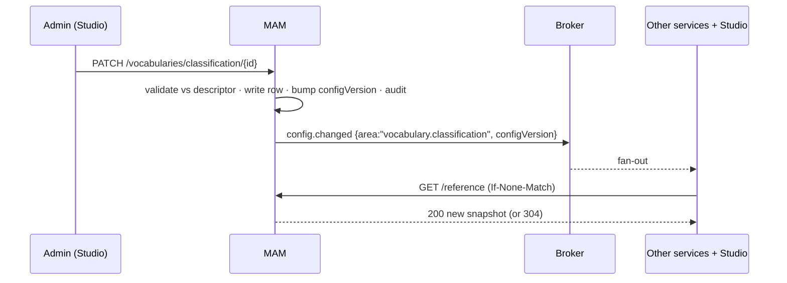

# Configuration & Reference Data

> Where the system's "static lists" actually live — media types, message types, classifications,
> profiles, thresholds — and which of them an **admin may change at runtime** without a deploy.
> The short answer: **not all of them, and not all in the same place.** One test sorts them
> ([§1](#1-the-sorting-test)), four tiers hold them ([§2](#2-the-four-tiers)), and one library
> plus one cached snapshot serve them ([§5](#5-delivery--the-versioned-snapshot)).
>
> Satisfies [FR-PLat-4](../requirements/05-functional-requirements.md#platform) and
> [FR-CFG-*](../requirements/05-functional-requirements.md#configuration). Related:
> [Data Model §5](data-model.md#5-the-configuration--reference-data-aggregate) ·
> [Authorization Model](authorization-model.md) · [Audit & diff](services/logging-analytics.md).

## 0. Recommendation in one paragraph

**Yes — put them in a database, but only three of the four kinds, and never as bare rows.**
Values that **code branches on** stay in `@atlas/contracts` as frozen enums; making them
admin-editable buys an admin the power to create a value nothing in the system can handle.
Everything else goes to the database, with its **shape declared in code** (a descriptor) and its
**value stored as data** — which is what makes the admin UI generatable, the change validatable,
and the drift detectable in CI. Values are read from a **versioned, cached snapshot**, never
row-by-row per request, and they are **seeded from files in the repo** so an environment's
reference data is a reviewable, promotable artifact rather than hand-typed prod state.

## 1. The sorting test

For any list of values, ask **one** question:

> **Does application code branch on the value?**
> (a `switch`, a handler lookup, a stored-procedure path, a rendered component chosen by it)

- **Yes** → the value is **behaviour**. New values need new code. It is a **contract enum** (Tier 0).
- **No, but the value has behaviour *attached* to it** → the *kind* is code, the *entry* is data.
  It is a **registry** (Tier 1).
- **No — it is a label users pick from** → **vocabulary** (Tier 2).
- **It's a knob, not a list** (a number, a duration, a flag, a template) → **setting** (Tier 3).

The failure mode this test prevents: an admin adds `mediaType = "hologram"`, MTS has no profile for
it, HSM has no tier policy, Studio has no player, BMS's workflow selector falls through — and
nothing surfaces an error until an asset is stuck. **Admins compose; they do not invent behaviour.**

## 2. The four tiers

| Tier | What it is | Where it lives | Admin-editable? | Changes via |
|:----:|-----------|----------------|-----------------|-------------|
| **0** | **Contract enums** — code branches on them | `@atlas/contracts` + JSON Schema `enum` | ❌ No | Release + `schemaVersion` bump |
| **1** | **Registries** — code-known *kind* + data-managed *entries* | Descriptor in code, rows in DB (owning service) | ✅ Entries, attributes, enable/disable | Admin UI + audit |
| **2** | **Vocabularies** — pure labels, no behaviour | Rows in DB (MAM) | ✅ Full CRUD (deprecate, never delete) | Admin UI + audit |
| **3** | **Settings** — typed scalars/objects, scoped | Descriptor in code, value in DB | ✅ Value only, within declared bounds | Admin UI + audit |

### 2.1 Tier 0 — contract enums (frozen)

These stay exactly where they are today. Inventoried from the current schemas:

| Enum | Why it is behaviour |
|------|--------------------|
| `Tier` (`online`/`near-line`/`offline`) | HSM's placement and restore logic switch on it |
| `storage.status` (`available`/`restoring`/`missing`/`quarantined`) | Gates whether a file may be exported to air |
| `RenditionKind` | MTS produces each kind; Studio picks a player/viewer per kind |
| Workflow node `kind` (`start`…`sub-flow`) | The interpreter has one executor per node kind |
| Gateway `split`/`join`, retry `fixed`/`exponential`, `onError` `fail`/`compensate`, timer `duration`/`date`/`cron` | Each is a distinct code path in the engine |
| Rule `effect` (`allow`/`deny`) | The evaluator's decision algebra |
| Schedule state, workflow-definition state, asset lifecycle state | State machines with coded transitions |
| `provenance.producedBy`, deletion `reason`, actor `kind`, diff change kind | Discriminated unions in contracts |
| Vocabulary `kind` in `taxonomy.updated` | The **set of vocabularies** is code (each has its own table, index and UI); the **terms** are Tier 2 |
| Field `type` (`string`/`number`/…) in FieldSchema | The form renderer and validator switch on it |

**Rule:** a Tier-0 change is a **pull request**, gets a schema-version bump, and CI diffs the
contract. That is the point — [contracts-first](../roadmap/16-system-implementation-plan.md) with
`additionalProperties: false` and generated TypeScript only works if these are stable.

> **Corollary — never `enum` a Tier 1/2 list in a JSON Schema.** If classifications were an
> `enum`, every admin edit would be a contract change, a regenerated type, and a redeploy.
> Use `{ "type": "string", "x-atlas-vocabulary": "classification" }` and validate against the
> cached snapshot at runtime ([§5](#5-delivery--the-versioned-snapshot)).

### 2.2 Tier 1 — registries (the important middle)

A registry entry is a **DB row whose `kind` (or `handler`) is a Tier-0 value**. Code supplies the
behaviour; the admin supplies the catalogue: which entries exist, their labels, icons, ordering,
defaults, and whether they are enabled for this channel.

| Registry | Code-known part | Admin-editable part | Owner |
|----------|-----------------|---------------------|-------|
| **Media types** | the handful of handlers (`video`, `audio`, `photo`, `live-event`) — player, probe, default rendition set | label, icon, enabled, sort order, default FieldSchema, default workflow, default category defaults | MAM |
| **Notification / message types** | the emitting event (`asset.approved`, `transcode.failed`, …) and its payload | title/body **template** per locale, severity, default delivery channels (in-app/email/push), default per-role opt-in, grouping key | Notifications |
| **Transcode profiles** | the FFmpeg runner + parameter grammar | any number of named profiles, their parameters, which `RenditionKind` they produce, per-channel/per-media-type applicability | MTS |
| **Acceptance rules** | the rule predicates (container, min size, aspect) | rule sets per channel/source, thresholds, accept vs. quarantine vs. reject | RIM |
| **Storage targets & tier policies** | tier semantics, the copy/move engine | targets, endpoints, credential refs, age/usage/proximity thresholds | HSM |
| **Ingest sources** | one adapter per `sourceKind` (`upload`/`ftp`/`watch`/`recorder`) | any number of watchers/recorders, their paths, credentials, schedules | RIM |
| **AI capabilities** | one adapter per `task` (`faces`, `stt`, …) | which are enabled, provider binding, thresholds, online/offline tier | AI |
| **Workflow definitions** | the node executors | the graphs themselves — already fully data ([BMS DSL](bms-workflow-dsl-and-designer.md)) | BMS |
| **Human-task templates** | task `kind` (`approve`/`edit`/`review`/`generic`) | per-template label, form fields, SLA, default assignee group | BMS |
| **Field schemas** | field `type` renderers/validators | which fields exist per media type / category | MAM |
| **Roles** | permission strings ([Authz §3](authorization-model.md#3-permissions)) | any number of roles bundling any grants | IAM |

**Validation rule (normative).** Creating a registry entry SHALL fail if its `kind`/`handler` is not
a Tier-0 value the running code declares. This is a one-line check against the descriptor registry
and it is the entire safety property of Tier 1.

**Disabling ≠ deleting.** An entry in use is `enabled: false` (hidden from pickers, existing
references keep resolving), never removed.

### 2.3 Tier 2 — vocabularies (pure data)

Already partly modelled ([Data Model §1.3](data-model.md#13-taxonomy--vocab-entities--owned-by-mam-relational)).
Code never branches on a term.

`CATEGORY` · `STRUCTURE` · `CLASSIFICATION` · `SUBJECT` · `TAG` — plus **cast/crew roles**,
**rejection reasons**, **genres**, **supply types**, **production groups**, **languages**.

Shared shape — contract: [`vocabulary-term.schema.json`](schemas/vocabulary-term.schema.json).

```jsonc
{
  "id": "01J9ZK…",            // stable; this is what assets reference
  "vocabulary": "classification",
  "channelId": "ch12",
  "key": "current-affairs",   // stable slug for integrations/imports; unique per vocabulary+channel
  "labels": { "en": "Current affairs", "fa": "…" },   // mutable, i18n
  "parentId": null,           // only for hierarchical vocabularies (category)
  "sortOrder": 20,
  "deprecatedAt": null,       // set instead of deleting
  "replacedById": null        // set by a merge, so old references still resolve
}
```

Four rules that keep vocabularies safe to hand to an admin:

1. **Stable id, mutable label.** Assets reference the **id**, never the label — so renaming
   "Current affairs" to "News & analysis" never rewrites a single asset row, and history stays honest.
2. **Deprecate, never delete.** `deprecatedAt` removes a term from pickers while every existing
   reference, archived asset, and audit entry still resolves. Hard delete is only offered when the
   reference count is zero, and it is audited.
3. **Merge is a first-class operation**, not a delete-and-retag: `replacedById` redirects old
   references and the merge is one audited event, reversible from the change history.
4. **A `key` alongside the id** so inbound feeds and imports can map external values to terms
   without knowing Atlas ULIDs.

Governance is `taxonomy:admin` ([Authz §3](authorization-model.md#3-permissions)), which already
exists and is already scopable to a category subtree.

### 2.4 Tier 3 — settings (descriptor in code, value in data)

This is the tier that most deserves a shared mechanism, because otherwise every service grows its
own bespoke admin screen. **Declare the setting in code; store only the value.**

```ts
// libs/reference/src/descriptors/hsm.ts — shipped with the service that reads it
export const hsmSettings = defineSettings('hsm', {
  'sweep.cron':            { type: 'cron',     default: '0 3 * * *', scope: 'deployment' },
  'sweep.throughputMBps':  { type: 'int',      default: 200, min: 10, max: 5000, scope: 'deployment' },
  'restore.concurrency':   { type: 'int',      default: 4,  min: 1, max: 64,     scope: 'channel' },
  'checksum.algorithm':    { type: 'oneOf',    default: 'sha256', options: ['sha256','xxh3'],
                             scope: 'deployment', restart: true },
  'retention.rejectedDays':{ type: 'duration', default: 'P30D', scope: 'channel',
                             description: 'How long a rejected asset is kept before purge.' },
  'export.destination':    { type: 'string',   scope: 'channel', sensitive: false, required: true },
});
```

Contract: [`setting-descriptor.schema.json`](schemas/setting-descriptor.schema.json).

| Descriptor field | What it buys you |
|------------------|------------------|
| `type` + `min`/`max`/`options`/`pattern` | Validation on write, in **one** place, server *and* client |
| `default` | A working system with an empty settings table; defaults ship with the code that reads them |
| `scope` | Which levels may set it (§2.5) — prevents a channel admin editing a deployment-wide knob |
| `sensitive` | Value is stored via **vault reference**, redacted in the API, masked in the UI and in diffs |
| `restart` | Studio warns; the service reports "pending restart" rather than silently ignoring |
| `description` + `label` | The **admin UI is generated**, not hand-written per setting |
| `deprecated`/`replacedBy` | A renamed setting migrates its value and CI flags orphaned rows |

**The payoff:** adding an admin-tunable knob is *one descriptor line*. No migration, no API route,
no Angular form, no docs drift — Studio's Settings page renders from the descriptor registry
([Studio](studio-frontend.md)).

### 2.5 Scope & resolution order

Settings resolve like the category model already does — **nearest wins, per key**
([Data Model §2.2](data-model.md#22-inheritance-model)):

```
code default  →  deployment  →  channel  →  category  →  user
   (Tier 3)      (ops)         (tenant)    (where meaningful)  (preferences)
```

A descriptor's `scope` names the **deepest** level allowed to set it. Resolution returns both the
value **and its origin level**, so Studio can show *"inherited from channel"* with a **Reset to
inherited** action — the same affordance as category field inheritance.

## 3. What this is *not*: bootstrap configuration

Two things are called "config" and must not be merged:

| | **Bootstrap config** | **Reference data & settings** (this doc) |
|---|---|---|
| Examples | DB URL, broker URL, port, JWKS URI, vault address, log level | Retention days, profiles, vocabularies, notification templates |
| Needed | **before** the database exists | after the service is up |
| Source | env vars + mounted secrets | database, via the snapshot |
| Changed by | ops, via deploy | **admins, at runtime** |
| Library | `service-kit` (already built) | **`@atlas/reference`** (new) |

Keeping them separate matters: a service must boot and report unhealthy-but-alive even when the
settings store is unreachable, falling back to code defaults.

## 4. Ownership — federate, do not centralise

**Recommendation: the service that *acts on* a setting owns its rows.** This is already how the
[service catalog](03-service-catalog.md) reads — HSM owns tier policies and storage targets, RIM
owns acceptance rules and watchers, MTS owns profiles, MAM owns vocabularies and field schemas, BMS
owns workflow definitions, IAM owns roles.

A central "config service" was considered and **rejected**: it would put a synchronous dependency in
front of every service's hot path, invert the ownership the catalog already establishes, and become
a deployment-order bottleneck. What was actually missing is not a service — it is **one library and
one read surface**:

```
@atlas/contracts   ── Tier-0 enums + descriptor types
        ▲
@atlas/reference   ── descriptor registry, validation, resolution, snapshot client (browser-safe)
        ▲                        ▲                          ▲
 owning services          API Gateway / BFF               Studio
 (own rows, publish       (aggregates one snapshot,       (renders generated
  their descriptors)       one configVersion, ETag)        admin UI + resolves)
```

Genuinely global settings with no natural owner (branding, default locale/timezone, deployment
name, global retention floor) live in a thin **Platform Settings module** — small enough to start
inside the gateway/BFF deployment and split out later if it grows.

## 5. Delivery — the versioned snapshot

Do **not** query reference rows per request. Reuse the pattern already proven for permissions
([Authz §6](authorization-model.md#6-delivery--caching)):

1. Each owning service exposes `GET /reference` returning **its** registries, vocabularies and
   resolved settings, plus a monotonic `configVersion`.
2. The **BFF aggregates** them into one snapshot with a combined `configVersion` + `ETag`; Studio
   and services cache it and revalidate cheaply.
3. Any admin change bumps `configVersion` and emits **`config.changed`**
   (`{ scope, area, keys[], configVersion }`); holders refresh. Convergence is bounded by the
   cache TTL, and nothing polls.
4. **Validation reads the snapshot, not the DB** — so validating "is this a known classification?"
   is an in-memory set lookup on every service and in the browser.
5. **Air-gapped-safe** ([FR-PLat-7](../requirements/05-functional-requirements.md#platform)): the
   snapshot is local state; a stale snapshot keeps the system fully operational.



## 6. Seed-as-code & environment promotion

The one place a plain database is genuinely the *wrong* answer on its own.

- **Defaults ship as seed files** in the repo (`seed/reference/*.json`), applied idempotently by the
  migration runner on first boot. A fresh install is fully usable with no manual data entry, and the
  starter roles, media types, classifications and notification templates are **code-reviewed**.
- **Export / import** any subset as a signed bundle: `atlas ref export --area notifications` →
  review the diff → `atlas ref import` into staging, then production. Reference data stops being
  hand-typed prod state and becomes a **promotable artifact**.
- **Drift report** in CI: seed vs. live, so "someone changed a transcode profile on prod in March"
  is a diff, not an archaeology exercise.
- Import is **additive and idempotent** keyed on `(vocabulary, key)` / setting key — never a
  destructive replace.

## 7. Change control, audit & diff

Every Tier 1/2/3 write goes through the **same** audit and change-history pipeline as asset edits
([Audit & History](services/logging-analytics.md#64-change-history--diff-read-model),
[FR-AUD-*](../requirements/05-functional-requirements.md#audit)) — actor, timestamp, before/after,
correlation id — and is rendered with the same git-like visual diff in Studio. This is what makes
"admin-editable" safe: **every list in the system is versioned and blameable.**

- Sensitive values are **redacted in diffs**, showing only *changed*.
- **Rollback** = apply the previous version of the row; it is an ordinary audited write.
- Bulk vocabulary operations (merge, deprecate, reorder) are **one** audit entry, not N.

## 8. Permissions

| Permission | Covers |
|-----------|--------|
| `taxonomy:admin` | Tier 2 vocabularies (already scopable to a category subtree) |
| `metadata:admin` | Field schemas |
| `config:read` | Read the snapshot / settings pages (implicitly granted with any admin role) |
| `config:admin` | Tier 1 registries + Tier 3 settings, **scoped by level** — a channel admin may set `scope: channel` keys, only a deployment admin may set `scope: deployment` |
| existing per-area grants | `storage:admin` (targets/tier policies), `workflow:admin`, `feed:admin`, `user:admin` remain the finer-grained authority for their own registries |

`config:admin` is added to the [permission table](authorization-model.md#3-permissions); the
scope-by-level check is an ordinary rule predicate, not a new mechanism.

## 9. Anti-patterns (explicitly rejected)

| Anti-pattern | Why it fails here |
|--------------|-------------------|
| A `settings` table of `(key, value TEXT)` with no descriptor | No validation, no defaults, no UI, no typing, no rename path — becomes a junk drawer |
| Making Tier-0 enums admin-editable "for flexibility" | Creates values no code handles; failures surface late and far away |
| Vocabularies as JSON-Schema `enum`s | Every admin edit becomes a contract change + redeploy |
| A central config service on the request path | Synchronous dependency in every hot path; inverts catalog ownership |
| Reading config rows per request | A DB round-trip per validation; defeats the air-gapped/offline story |
| Hard-deleting a vocabulary term | Breaks historical assets and audit readability |
| Storing secrets as setting values | Use `sensitive: true` + a vault reference; only HSM/IAM hold real credentials ([NFR-SEC-4](../requirements/06-non-functional-requirements.md#security--privacy)) |

## 10. Build order (fits the existing plan)

| Step | Deliverable | Phase |
|------|-------------|:-----:|
| 1 | `@atlas/reference` lib — descriptor types, `defineSettings`, validator, resolver, snapshot client | Phase 0, with the other foundation libs |
| 2 | Settings table + `config.changed` + `GET /reference` in `service-kit`'s service template | Phase 0/1 |
| 3 | Tier-2 vocabularies in MAM (already required by [FR-TAX-4](../requirements/05-functional-requirements.md#classification)) | MVP |
| 4 | Per-service registries as each service is built (they are already in each service's domain model) | per service |
| 5 | Studio generated Settings + Vocabulary admin pages | Beta |
| 6 | Seed bundles, export/import CLI, CI drift report | Beta → v1.0 |

---
_Related: [Data Model §5](data-model.md#5-the-configuration--reference-data-aggregate) ·
[Authorization Model](authorization-model.md) · [Service Catalog](03-service-catalog.md) ·
[System Implementation Plan](../roadmap/16-system-implementation-plan.md) ·
[FR-CFG](../requirements/05-functional-requirements.md#configuration)._
