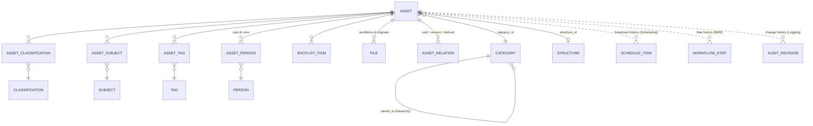
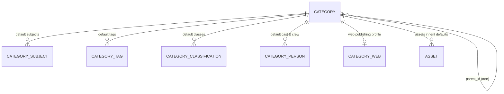
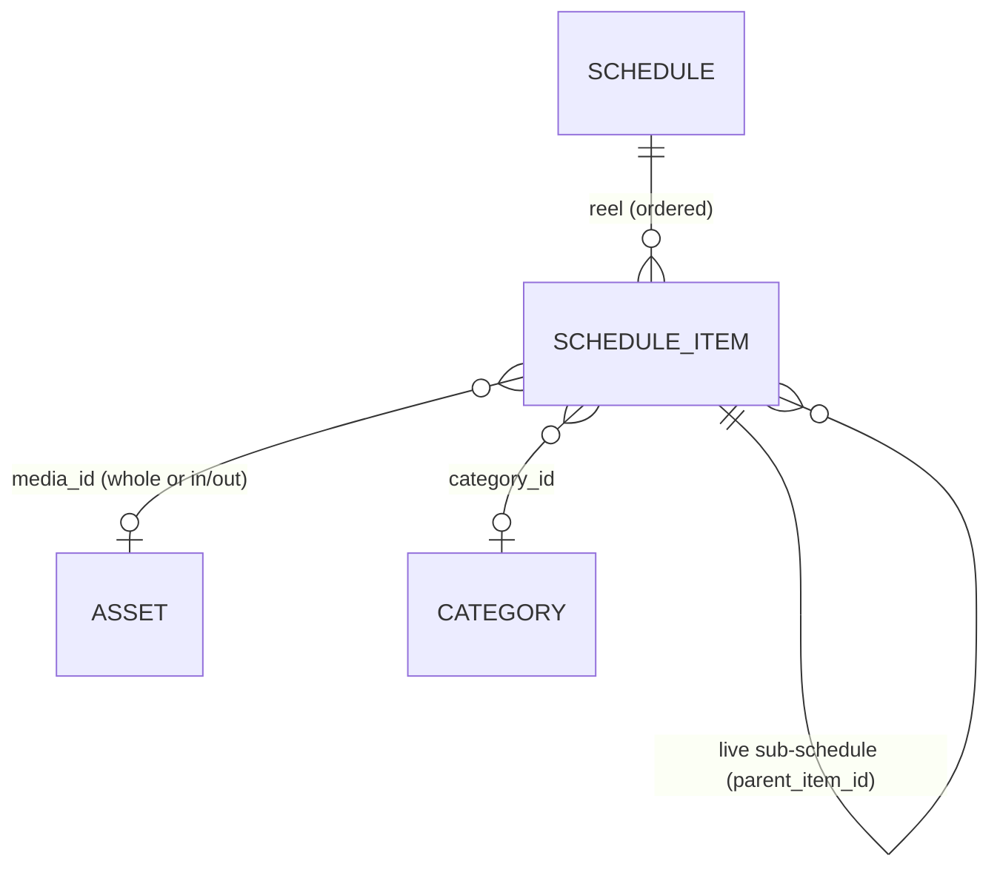
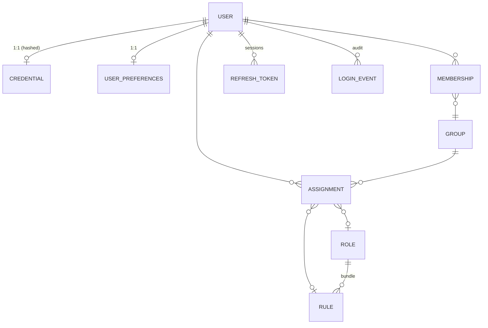

# Domain Data Model

> The logical entity model for Atlas, starting with the **Asset aggregate** — the platform's central
> object. This is a *logical* model: it spans services, each the system of record for its part
> (MAM = metadata, HSM = files, Scheduling = broadcast history, BMS = flow, Logging = change history).
> Physical schemas live in each [service spec](services/); the machine contracts are the
> [event schemas](schemas/) and [OpenAPI stubs](openapi/).
>
> Conventions: ids are **ULIDs**; `xref`/join tables are many-to-many; every row carries `channelId`
> (tenant scope) and is audited ([FR-AUD](../requirements/05-functional-requirements.md#audit)).

## 1. The Asset aggregate



Solid lines = MAM-owned; dotted lines = **cross-service read views** (§1.9).

### 1.1 Asset (core) — owned by [MAM](services/mam.md) (relational)

| Field | Type | Notes |
|-------|------|-------|
| `id` | ULID | Identity. A **new media file** ⇒ a **new id** (§1.7), not a metadata edit. |
| `channelId` | ChannelId | Tenant scope. |
| `title` | string | |
| `description` | text | Summary. |
| `mediaType` | ref → media-type vocab | The media **kind** — **video, photo, audio, live event, …**; one per asset. Drives the extensible field schema + the expected file set. |
| `categoryId` | ULID → Category | Hierarchical taxonomy (§1.3). |
| `structureId` | ULID → Structure? | Editorial format/genre — animation, drama, news, … (one per asset, §1.3). |
| _classification_ | **many** → Classification (xref) | **One or more content classes** from an operator-managed, updatable list — stored as `AssetClassification`, not a column (§1.3). |
| `state` | enum | `created · processing · ready · approved · rejected · expired` ([MAM lifecycle](services/mam.md#31-asset-lifecycle)). |
| `episodeNo` | integer? | For serialised content. |
| `durationSec` | number | Editorial duration (canonical; technical duration mirrored on files). |
| `allowedBroadcastCount` | integer? | Rights: max airings. Usage is **derived from the media's placement count in schedules** (§3.8) — every placement counts; advisory warning when exceeded. |
| `recommendedBroadcastStart` | date? | **Advisory** editorial window start (distinct from the hard `expiresAt`). |
| `recommendedBroadcastEnd` | date? | Advisory window end. |
| `expiresAt` | date-time? | **Enforced** usable-until → re-review ([review lifecycle](../roadmap/15-review-lifecycle-implementation-plan.md)). |
| `retainUntil` | date-time? | For rejected media: purge time. |
| `version` | integer | Version number within the id's version chain (§1.7). |
| `replacesId` | ULID? | The prior version this supersedes (media-file change). |
| `createdBy` | user id | |
| `createdAt` | date-time | |

Extensible, type/category-specific fields live in **AssetExtended** (document store) keyed by
`assetId` — governed by **FieldSchema** per `mediaType`/category ([FR-MAM-2](../requirements/05-functional-requirements.md#mam)).
Editorial/production fields (`genre`, `supplyType`, `productionGroup`, `productionDate`) and the
classification/subject/tag/cast defaults are **inherited from the asset's category** (§2.2),
overridable per asset.

### 1.2 Classification axes (they are distinct)

An asset is classified on several independent axes — kept separate so each can be governed and
searched on its own:

| Axis | Entity | Cardinality | Example |
|------|--------|-------------|---------|
| **Media type** | media-type vocab (`mediaType`) | **one** | **video, photo, audio, live event** |
| **Category** | `CATEGORY` (hierarchical) | one | Sports › Football › Highlights |
| **Structure** | `STRUCTURE` | zero/one | animation, drama, news |
| **Classification** | `CLASSIFICATION` (controlled, **operator-updatable**) | **many (xref)** | content classes an operator maintains |
| **Subjects** | `SUBJECT` (controlled) | many (xref) | "Olympics", "Climate" |
| **Tags** | `TAG` (free-form) | many (xref) | ad-hoc keywords |

These are **independent axes**: media type is the *kind* (video/photo/audio/live event), structure
is the *format/genre*, and classification is *content-related* — an asset may carry **several**
classifications drawn from a list operators can extend ([FR-TAX-4](../requirements/05-functional-requirements.md#classification)).

### 1.3 Taxonomy & vocab entities — owned by MAM (relational)

- **Category** — `id, channelId, parentId?, name, path, defaultExpiry?` (hierarchy; `defaultExpiry`
  inherited by descendants + media, [FR-TAX-7](../requirements/05-functional-requirements.md#classification)).
- **Structure** — `id, channelId, name` (animation/drama/news/…); may carry a default file-set /
  workflow hint.
- **Classification** — `id, channelId, label` — a **controlled, operator-updatable** list of
  content classes ([FR-TAX-4](../requirements/05-functional-requirements.md#classification)); an
  asset carries **one or more**.
- **Subject** — `id, channelId, vocabularyId, term` (controlled). **Tag** — `id, channelId, label`.
- Joins: **AssetClassification**(assetId, classificationId), **AssetSubject**(assetId, subjectId),
  **AssetTag**(assetId, tagId).

### 1.4 Cast & crew — `ASSET_PERSON` (join) + `PERSON`

The "casts" xref: people **in front of and behind** the camera, each with a role for this asset.

- **Person** — `id, channelId, name, imageRef?` (minimal PII, [D5](../01-technical-brief.md#9-resolved-decisions)).
- **AssetPerson** — `assetId, personId, roleForAsset, roleClass` where `roleClass ∈ {on-screen,
  crew}` and `roleForAsset` is the specific role: presenter/guest/cast (on-screen) or
  **producer/director/editor/…** (crew). AI face-match may *suggest* on-screen people for confirmation
  ([FR-PPL-5](../requirements/05-functional-requirements.md#people)).

### 1.5 Files {#15-files}

**Every file in the system is a record** carrying its **technical info** and **integrity checksum**.
Machine contract: [`file.schema.json`](schemas/file.schema.json).

**Cardinality (normative).** A **file belongs to exactly one asset** and is **never shared** between
assets; an **asset has many files** (original, broadcast/hi-res, proxy/low-res, thumbnail, …). The link
is a plain `assetId` FK on the file — **not** a many-to-many join. Uniqueness is
`(assetId, kind, variant)`, so an asset can hold several files of one kind when they're genuinely
distinct (subtitle languages, numbered thumbnails). The expected set **varies by category / BMS
settings** ([FR-MTS-7](../requirements/05-functional-requirements.md#transcode)).

| Field | Type | Notes |
|-------|------|-------|
| `id` | ULID | |
| `channelId` | ChannelId | |
| `assetId` | ULID → Asset | **exactly one**; exclusive |
| `kind` | enum | `original · broadcast · proxy · thumbnail · vtt-filmstrip · hover-preview` |
| `variant` | string? | disambiguates same-kind files (subtitle language, thumbnail index) |
| `storage.path` / `.targetId` | string | HSM-resolved location |
| `storage.tier` | enum | `online · near-line · offline` |
| `storage.status` | enum | `available · restoring · missing · quarantined` (quarantined on checksum mismatch) |
| `checksum` | {algorithm, value} | **system-generated on placement**, re-verified by integrity sweeps |
| `lastVerifiedAt` | date-time? | last integrity check |
| `sizeBytes` | integer | |
| `technical` | object | container, video/audio codec, duration, width/height, aspect, frame rate, audio channels, bitrate (ffprobe-derived, additive) |
| `provenance` | object | `producedBy` (ingest/transcode/editor/import), `jobId`, `profile` |
| `createdAt` / `deletedAt?` | date-time | row retained after purge for audit |

**Ownership split.** [HSM](services/hsm.md) is the **system of record** for `storage.*`, `checksum`,
and verification (it is the only component that touches bytes); [MAM](services/mam.md) references the
**logical set** per asset and serves it in the asset's Files tab. Technical info is captured at
production time (RIM probe on ingest, MTS on transcode) and stored with the file.

**Originals vs rushes.** The camera/recorder material an item was made *from* is modelled as
**separate assets** linked by [`ASSET_RELATION`](#18-rush--original--other-relations--asset_relation) —
not as extra files on this asset. A `kind=original` file is *this* asset's own source file.

### 1.6 Shot list — `SHOTLIST_ITEM` — owned by MAM

`id, assetId, startTc, endTc, thumbnailRef?, description` — an ordered list of notable segments
([FR-MAM-3](../requirements/05-functional-requirements.md#mam)). Timecodes reference the asset's
timeline; `thumbnailRef` points at a filmstrip frame.

### 1.7 Versions (media-file changes) vs. metadata edits

Two different mechanisms — **do not conflate**:

- **Version** = a **new media file** supersedes the old → **a new Asset `id`** with metadata cloned,
  linked by `replacesId` (prev) and discoverable as the next version (the asset whose
  `replacesId = this.id`). Emits `asset.replaced(oldId,newId)`; Scheduling swaps references. This is
  the "Versions" tab (prev/next).
- **Metadata edit** = a field change on the **same** `id` → recorded as a **revision** in the
  [change-history/diff](services/logging-analytics.md#64-change-history--diff-read-model) (FR-AUD),
  **not** a new version.

### 1.8 Rush / original & other relations — `ASSET_RELATION`

`assetId, relatedAssetId, relationType` where `relationType ∈ {rush, source-original, derived-from,
part-of, related}`. The **Rush / Original** tab lists the raw camera/recorder assets used to make this
item (`rush`/`source-original`); relations are directional and auditable.

### 1.9 Cross-service read views (dotted edges)

Assembled by the [asset editor](studio-frontend.md#2-panels-view-containers--their-views), not stored on the asset:

| Tab / view | Source (system of record) | Shape |
|------------|---------------------------|-------|
| **Flow** | [BMS](services/bms.md) `WorkflowInstance` + `StepHistory` + `HumanTask` | who assigned to whom, which task, what the assignee did, when |
| **Broadcast history** | [Scheduling](services/scheduling.md) `ScheduleItem` where `assetId` matches | each past/scheduled airing (channel, date/time); usage count vs `allowedBroadcastCount` |
| **Change history / diff** | [Logging](services/logging-analytics.md#64-change-history--diff-read-model) `AUDIT_REVISION` | git-style field-level diffs of metadata edits |

`allowedBroadcastCount` is **enforced at scheduling** (Scheduling warns/blocks when past+scheduled
airings would exceed it) — a rights guard alongside the approved-and-not-expired guard.

### 1.10 Edit projects — `EditProject` (owned by MAM) {#110-edit-projects--editproject-owned-by-mam}

The [media editor](services/media-editor.md)'s durable artifact — an **edit decision list** over one
asset's renditions, not a new mechanism. `id, channelId, sourceAssetId, mediaKind (video/audio/photo),
state (draft→rendering→rendered/failed), timeline{ clips[]: {renditionRef, inSec, outSec, transitionIn?,
filters[]} }, outputProfile?, renderJobId?, outputAssetId?` in MAM's **document store** beside
`AssetExtended`.

**Non-destructive:** clips reference source renditions by id + in/out; a **render** produces a
**new** file (a new [version](#17-versions-media-file-changes-vs-metadata-edits) of `sourceAssetId`,
or a new asset), via `editor.render.requested → MTS → transcode.completed`. The timeline is
re-openable; the rendered file is derived from it. Participates in the normal audit/diff history.

## 2. The Category aggregate

Categories are a **folder-like tree** that organizes assets into **channel departments, programs,
seasons, …**. Their defining trait is **inheritance**: a category **inherits settings/metadata from
its parent**, and **media inherits from its category** — so defaults set high in the tree flow down to
every asset, overridable at each level. This generalizes the category-default-expiry
([FR-TAX-7](../requirements/05-functional-requirements.md#classification)) into a full settings model.



### 2.1 Category (core) — owned by [MAM](services/mam.md) (relational)

| Group | Fields |
|-------|--------|
| **Identity / hierarchy** | `id`, `channelId`, `parentId?`, `path` (materialized), `title` |
| **Organizational** | `kind` (**department → program → season → …**) — the node's role in the tree |
| **Inheritable media defaults** | `structureId?`, `genre?`, `supplyType?`, `productionGroup?`, `productionDate?`, + xref defaults: **subjects**, **classifications**, **tags**, **cast & crew** (people + role) |
| **Inheritable policies** | `keepDuration?` (**online-retention after use** → HSM demotes to near-line/offline; null = keep online **indefinitely**, §2.5); `reviewNeeded` (bool — media here requires approval); `mediaAddable` (bool — may media be added **directly** here) |
| **EPG** | `showInEpg` (bool), `epgTitle`, `epgDescription` |
| **Web/platform profile** | see §2.4 (`CATEGORY_WEB`) |
| **Audit** | `createdBy`, `createdAt` |

Xref joins mirror the asset's: **CategorySubject**, **CategoryTag**, **CategoryClassification**,
**CategoryPerson** (personId + role). `kind`, `mediaAddable`, and the EPG/web fields are
**category-level** (not inherited onto media); the rest are inherited (§2.2).

**Multi-level, multi-purpose tree.** A branch is typically **department → program → season**
(department optional), but nests **arbitrarily deep — up to ~20 levels**. `mediaAddable` is normally
**false on the organizational (ancestor) nodes** — media is added at the leaf/season level, not to a
department or program directly.

### 2.2 Inheritance model

Inheritance is **live per-field**, resolved through two cascades: **category ← ancestor categories**,
then **media ← its category**.

- **Resolution:** for any inheritable field, walk **up** the tree; the **nearest ancestor** that
  defines a value is the **effective** value — **unless the child category or the individual asset
  overrides it locally** (like CSS inheritance). Media shows the effective inherited value with an
  "inherited" indicator until overridden. Editing a category's value therefore **propagates** to every
  descendant/asset that hasn't overridden it.
- **Per-role cast inheritance.** Cast & crew inherit **per role**, not as a whole list: an asset
  inherits each role's default and may **override individual roles**. E.g. a program category sets a
  single **producer** (all episodes inherit it), while the **director** is overridden on each episode —
  effective cast = category role-defaults **merged with** the asset's per-role overrides (asset wins per role).
- **Policies** (`reviewNeeded`, `mediaAddable`) are likewise resolved live — `reviewNeeded` gates the
  [approval requirement](../requirements/05-functional-requirements.md#approval) for media in the category.
- **Exception — approval expiry.** The [review-lifecycle](../roadmap/15-review-lifecycle-implementation-plan.md#2-model-recap)
  `expiresAt` is **snapshotted at approval time** (not live), deliberately, so a later category edit
  never mass-re-expires already-approved media. That is a separate `defaultExpiry`
  ([FR-TAX-7](../requirements/05-functional-requirements.md#classification)) from `keepDuration` (§2.5).

### 2.3 EPG fields

`showInEpg` + `epgTitle` / `epgDescription` supply the **EPG export** ([Integration/Feeds](services/integration-feeds.md),
[FR-INT-3](../requirements/05-functional-requirements.md#integration)) — a program/season category's
titles drive its EPG entries; assets/schedule items refine per airing.

### 2.4 Web / platform publishing profile — `CATEGORY_WEB`

A category defines how its media publishes to the **website / other platforms** (driven by
[Integration/Feeds](services/integration-feeds.md), [FR-INT-5](../requirements/05-functional-requirements.md#integration)):

| Field | Meaning |
|-------|---------|
| `webState` | default web state of media — `published` / `unpublished` |
| `sendTrigger` | when media is pushed to web — `on-approval` / `on-broadcast` / `manual` |
| `webKeepDuration` | how long media stays published on the web |
| `publishStart` / `publishEnd` | web publish window |
| `webCategory` | the target category on the website/platform |
| `webTitle` / `webSummary` / `webDescription` | web-facing metadata (defaults; media may override) |
| `featured` | bool — feature this content on the platform |

Media inherit this profile; the actual per-asset web publish state + timing is tracked when the
trigger fires and reported back via delivery receipts (Integration/Feeds).

### 2.5 Cross-domain wiring

| Category setting | Drives |
|------------------|--------|
| `reviewNeeded` | whether media here needs manual approval ([Review lifecycle](../roadmap/15-review-lifecycle-implementation-plan.md)) |
| `keepDuration` | **online-retention after use** → [HSM](services/hsm.md) demotes media from **online** to near-line/offline once used up (e.g. after its [`allowedBroadcastCount`](#11-asset-core--owned-by-mam-relational) airings) or after the duration elapses post-use; **null = keep online indefinitely**. Not a deletion, not the usable-until expiry. |
| `defaultExpiry` (FR-TAX-7) | media **usable-until** → re-review ([Review lifecycle](../roadmap/15-review-lifecycle-implementation-plan.md)) — distinct from `keepDuration` |
| `mediaAddable` | gate on adding media **directly** to this node (usually false above the leaf level) |
| EPG + web fields | [Integration/Feeds](services/integration-feeds.md) EPG + web/social publishing |
| default metadata (structure/subjects/classification/tags/cast/…) | live-inherited values on media (§2.2) |

> **Three orthogonal time/usage knobs** — keep them distinct: `allowedBroadcastCount` (how many
> airings), `keepDuration` (how long **online** after use → HSM tier), and `expiresAt`/`defaultExpiry`
> (usable-until → re-review). A clip may be usable for 3 airings, kept online 30 days after the last,
> then near-lined — while still being *approved and usable* until its separate expiry.

## 3. The Schedule aggregate

A channel's schedule is a **reel**: an ordered sequence of items across a **broadcast day**, each with
a `start` and `duration`, the next beginning where the previous ends. Items **must not overlap**; gaps
are discouraged but tolerated. Some items are **fixed** (time-locked anchors).



### 3.1 Schedule (header) — owned by [Scheduling](services/scheduling.md) (relational)

`id, channelId, broadcastDate, state (draft/validated/sending/sent/failed)`. Scoped per **channel +
broadcast day** (a channel-local day boundary, e.g. 06:00→06:00, not necessarily midnight).

### 3.2 ScheduleItem

| Field | Type | Notes |
|-------|------|-------|
| `id` | ULID | |
| `scheduleId` | ULID → Schedule | |
| `parentItemId` | ULID? → ScheduleItem | set for items **inside a live item's sub-schedule** (§3.5) |
| `seq` | integer | order within the reel/sub-reel |
| `start` | datetime | materialized (§3.6); locked when `fixed` |
| `duration` | interval | |
| `fixed` | bool | **time-locked anchor** — its `start` cannot shift (§3.4) |
| `itemType` | enum | `media · live · title · filler · break · …` |
| `mediaId` | ULID? → Asset | the media to play; **null for `live`** |
| `mediaIn` / `mediaOut` | timecode? | **part of media** — in/out applied by playout (§3.3) |
| `mediaTitle` | string? | defaults from the media's title; **overridable** for on-air display |
| `categoryId` | ULID? → Category | |
| `categoryTitle` | string? | defaults from the category; **overridable** |
| `episode` | integer? | |
| `description` | text | **control-room notes** |
| `repeat` | bool | this airing is a **repeat / rebroadcast** of a past item |
| `featured` | bool | mark as important for the control room |

### 3.3 Partial media (in/out)

An item may play **part** of its media: `mediaIn`/`mediaOut` timecodes define the sub-clip; the
**playout software applies them**. `duration` follows `mediaOut − mediaIn` (or is set explicitly for
`live`/`title`/etc.).

### 3.4 The reel & the `fixed` anchor

- **Intended shape:** ordered by `start`; `item[i+1].start ≥ item[i].start + item[i].duration` (no
  overlap). A **gap** is `>`.
- **Where it's enforced — the client.** The **schedule editor** maintains the reel: it **prevents the
  user from saving overlaps** and **flags gaps** (gaps are never hard-blocked — they're legitimate).
  The **backend does not hard-block either**: it persists the rows it is given and keeps the write path
  thin ([FR-SCH-9](../requirements/05-functional-requirements.md#scheduling)). Validation is available
  as an **explicit, on-demand** call, not a per-write gate (§3.6).
- **Flow:** non-fixed items **reflow** — changing an earlier item's duration shifts the `start` of the
  following non-fixed items to keep the reel tight. This is **editor behavior**; the backend stores the
  resulting `start`s.
- **Anchors:** a **`fixed`** item's `start` is locked (e.g. a title at 10:00 sharp). Reflow happens
  only **between anchors**, so an anchor **bounds the recompute window**; an edit that would push a
  preceding item over the next anchor, or open a gap before it, is surfaced to the user.

### 3.5 Live items & sub-schedules

An `itemType = live` item has **no `mediaId`** — it's streamed from the studio — but MAY contain a
**sub-schedule**: child `ScheduleItem`s (`parentItemId` = the live item) that play *within* the live
block, structured exactly like the top-level reel.

**Nesting is exactly one level**: a sub-schedule item may **not** itself be a live item with children
(`parentItemId` is never set on an item that already has children).

### 3.6 Storage & performance (recommended)

The reel is stored as **rows with a materialized `start` + `duration` + `seq` + computed `end`** — not
purely as an ordered list of durations. Rationale:

- **Reads are cheap** — "what's on air at T" and range queries hit an index on
  `(channelId, broadcastDate, start)` (and a `(start, end)` range index).
- **The write path stays thin** — the backend does **no per-write overlap/gap validation** (§3.4); it
  persists the `start`s the editor computed. Reflow is bounded client-side by fixed anchors, so even a
  ~20-hour reel recalculates a small window.
- **Validation is explicit** — a **`POST /schedules/{id}/validate`** call (and the pre-flight before
  send-to-air) reports gaps/overlaps/availability **on demand**, so the cost is paid once when it
  matters rather than on every keystroke or save.
- The alternative (store only `duration` + order, derive `start`) makes inserts trivial but every
  time-query a scan — worse for the control-room read patterns. The materialized hybrid is the better
  trade for broadcast.

### 3.7 Operations: copy / duplicate & overwrite

A **copy** operation duplicates a **time-range** of items (or a whole day) into another date at a
**target offset** — e.g. copy `17:00–20:00` of day A to `06:00–09:00` of day B — with a choice to
**merge** into or **overwrite** the destination range. Fixed anchors and category/media title overrides
travel with the copy; media references are reused (a repeat, so it counts against
[`allowedBroadcastCount`](#11-asset-core--owned-by-mam-relational)).

### 3.8 Cross-domain wiring

| Schedule concept | Drives |
|------------------|--------|
| `mediaId` (approved & not expired) | the **air guard** at send-to-air ([FR-SCH-3](../requirements/05-functional-requirements.md#scheduling), [review lifecycle](../roadmap/15-review-lifecycle-implementation-plan.md)); past items = an asset's **broadcast history** |
| media **use count in schedules** | rights: the airings used against [`allowedBroadcastCount`](#11-asset-core--owned-by-mam-relational) are **derived from how many times the media is placed in schedules** — every placement counts. `repeat` is an **informational flag** for the control room, not the counting mechanism ([FR-SCH-8](../requirements/05-functional-requirements.md#scheduling)). |
| send-to-air | HSM copies hi-res + exports the **MCRList** playlist; `mediaIn/Out` honored by playout |
| `fixed`, gaps, overlaps | validation ([FR-SCH-2](../requirements/05-functional-requirements.md#scheduling)) |

## 4. The Identity aggregate

Owned by [IAM](services/iam.md). The **authorization semantics** (how grants are scoped, compiled and
evaluated) are specified in the **[Authorization Model](authorization-model.md)**; this section is the
entity/field model.



### 4.1 User

| Field | Type | Notes |
|-------|------|-------|
| `id` | ULID | |
| `username` | string, unique | login handle |
| `name` | string | display / full name |
| `email` | string? | notifications, password reset |
| `state` | enum | `active · disabled · locked · pending` |
| `channelIds` | ChannelId[] | channels the user may see (scope also carried per-grant) |
| `permVersion` | integer | bumped on **any** grant/membership change → fast revocation ([FR-IAM-8](../requirements/05-functional-requirements.md#iam)) |
| `lastPasswordChange` | date-time? | drives password-age policy |
| `mustChangePassword` | bool | forces rotation at next login |
| `failedLoginCount` | integer | lockout counter |
| `lockedUntil` | date-time? | temporary lockout |
| `lastLogin` | date-time? | denormalized from the latest `LOGIN_EVENT` |
| `lastIp` | string? | denormalized (full history in `LOGIN_EVENT`) |
| `mfaEnrolled` | bool | MFA state ([FR-IAM-10](../requirements/05-functional-requirements.md#iam)) |
| `idpProvider` / `idpSubject` | string? | SSO federation identity ([FR-IAM-9](../requirements/05-functional-requirements.md#iam)) |
| `avatarRef` | ref? | optional image |
| `createdAt` / `createdBy` / `updatedAt` / `disabledAt?` | | audit |

### 4.2 Supporting entities

| Entity | Key fields | Notes |
|--------|-----------|-------|
| **Credential** | userId, hash (argon2id), algorithm, updatedAt | separate row; **never** plaintext; absent for pure-SSO users |
| **UserPreferences** | userId, locale, timezone, theme, workspaceLayout | powers per-user theme ([FR-UI-10](../requirements/05-functional-requirements.md#studio)) and workspace persistence ([FR-UI-3](../requirements/05-functional-requirements.md#studio)) |
| **Group** | id, channelId?, name, description | |
| **Membership** | userId, groupId | a user is in 0..n groups ([FR-IAM-2](../requirements/05-functional-requirements.md#iam)) |
| **Role** | id, name, description | a named bundle of rules |
| **Rule** (grant) | id, effect, permissions[], scope{channelIds, categoryPaths, states, ownedOnly}, fieldGroups[] | contract: [`policy-rule.schema.json`](schemas/policy-rule.schema.json) |
| **Assignment** | subject (userId **or** groupId) → roleId **or** ruleId | rules attach to users *and* groups ([FR-IAM-3](../requirements/05-functional-requirements.md#iam)) |
| **RefreshToken** | id, userId, hash, familyId, expiresAt, revokedAt, rotatedFrom | rotating family; reuse ⇒ revoke family |
| **LoginEvent** | id, userId, at, ip, userAgent, result (success/failure/mfa), sessionId? | append-only; source of `lastLogin`/`lastIp` |

### 4.3 Effective policy

`effective(U) = rules(U) ∪ rules(groups(U))`, flattened through roles, **compiled once per
`permVersion`** and served by `GET /users/me/effective-permissions`. Both the services and Studio
evaluate it with the same function — see [Authorization Model §5–6](authorization-model.md#5-evaluation-normative).

## 5. The Configuration & Reference-Data aggregate {#5-the-configuration--reference-data-aggregate}

> The system's admin-editable "static lists". Full design, tiering rules and delivery model:
> **[Configuration & Reference Data](configuration-and-reference-data.md)**
> ([FR-CFG](../requirements/05-functional-requirements.md#configuration)).

Not one aggregate but **four tiers**, separated by a single test — *does code branch on the value?*

| Tier | Entity | Stored where | Editable |
|:----:|--------|--------------|----------|
| **0** | Contract enum (`Tier`, `RenditionKind`, node kinds, states, `effect`) | `@atlas/contracts` + JSON Schema — **not a row** | release only |
| **1** | **RegistryEntry** — `id, channelId?, registry, kind (Tier-0), key, labels, enabled, sortOrder, config{…}, createdBy/At` | relational, **owned by the acting service** | entries + attributes |
| **2** | **VocabularyTerm** — `id, vocabulary, channelId, key, labels{}, parentId?, sortOrder, external{}, deprecatedAt?, replacedById?, usageCount` — contract: [`vocabulary-term.schema.json`](schemas/vocabulary-term.schema.json) | relational (MAM) | full CRUD (deprecate/merge, **never delete in use**) |
| **3** | **SettingValue** — `area, key, scopeLevel, scopeId?, value, updatedBy, updatedAt` against a code-shipped **SettingDescriptor** — contract: [`setting-descriptor.schema.json`](schemas/setting-descriptor.schema.json) | relational, owned by the acting service | value only, within declared bounds |

### 5.1 Resolution

Settings resolve **nearest-wins per key**, the same shape as category inheritance (§2.2):

```
code default → deployment → channel → category → user
```

A descriptor names the **deepest** level allowed to set the key; resolution returns the value **and
its origin level**, so Studio can render *"inherited from channel"* + *reset to inherited*.

### 5.2 Delivery

Reference data is read from a **versioned snapshot**, never row-by-row per request — the same
pattern as `permVersion`: each owning service exposes `GET /reference` with a `configVersion`, the
BFF aggregates one snapshot with an `ETag`, and writes emit
[`config.changed`](schemas/events/config.changed.payload.schema.json). Validating "is this a known
classification?" is therefore an in-memory set lookup, on every service and in the browser, and a
stale snapshot keeps an air-gapped site fully operable.

### 5.3 Cross-domain wiring

| Referencing | Points at | Note |
|-------------|-----------|------|
| `ASSET.mediaType`, `structureId`, `AssetClassification`, `AssetSubject`, `AssetTag` | VocabularyTerm / registry entry **ids** | ids are stable; labels are free to change (§1.2–1.3) |
| `ASSET_PERSON.roleForAsset` | `cast-role` vocabulary | operator-managed per [FR-TAX-4](../requirements/05-functional-requirements.md#classification) |
| `CATEGORY.keepDuration`, `reviewNeeded`, `defaultExpiry` | SettingValue at `scopeLevel: category` | category *is* a settings scope, not a parallel mechanism |
| HSM `TierPolicy` / `StorageTarget`, RIM acceptance rules/watchers, MTS profiles, BMS definitions, IAM roles | RegistryEntry (Tier 1) | already in each service's domain model — this names the shared pattern |
| Every write | audit + change-history | same diff pipeline as content edits ([FR-CFG-9](../requirements/05-functional-requirements.md#configuration)) |

## 6. The Newsroom aggregate {#6-the-newsroom-aggregate}

> Owned by [Newsroom](services/newsroom.md). News-only; optional for other customers.

| Entity | Key fields | Store |
|--------|-----------|-------|
| **Rundown** | `id, channelId, date/slot, state (draft→ready→onair→done), orderedStoryIds[]` | relational |
| **Story** | `id, rundownId?, channelId, slug, assignee, status (assigned→writing→review→ready→onair), estDuration` | relational |
| **Script** | `storyId, body (rich text), mediaRefs[] {assetId, inSec, outSec}, presenter` | document |
| **WireItem** | `id, channelId, source, receivedAt, content, usedInStoryId?` | document |
| **Assignment** | `storyId, userId, role, dueAt` | relational |

- **Rundown ⇄ Story** is ordered (`orderedStoryIds[]`); a story may exist unslotted (`rundownId`
  null) and be placed later. Reordering is a `rundown.updated`; status changes are `story.updated`.
- **Script.mediaRefs** point at MAM assets with in/out — the same partial-media convention as
  [schedule items](#33-partial-media-inout) and [edit clips](#110-edit-projects--editproject-owned-by-mam).
- **WireItem** arrives via [`feed.item.received`](services/integration-feeds.md) (Integration) and
  is promoted into a Story by an editor.
- **Hand-off:** `rundown.ready` → [Scheduling](services/scheduling.md) turns a bulletin into
  schedule items; collaborative editing rides the [WebSocket service](services/websocket.md).

## 7. The Notifications, Tasks & Inbox aggregate {#7-the-notifications-tasks--inbox-aggregate}

> Owned by [Notifications & Messaging](services/notifications.md). Both system→user and user↔user
> delivery, unified because both are permission-aware fan-out.

| Entity | Key fields | Store |
|--------|-----------|-------|
| **Task** | `id, channelId, assignee (+assigneeKind user/group), kind (approve/edit/review/generic), subjectRef {entityType,entityId}, state (open→forwarded→done/cancelled), dueAt, forwardOf?, workflowInstanceId?` | relational |
| **Notification** | `id, channelId, userId, type (Tier-1 registry key), subjectRef, severity, read, createdAt` | relational |
| **Message** | `id, channelId, from, to[] {kind,id}, threadId?, body, sentAt` | relational |
| **InboxState** | `userId, unreadCounts, lastSeen` | relational + cache |
| **Preference** | `userId, per-type channel (live/email/push), digest cadence` | relational |

- **Task** is the actionable inbox item; a **BMS human step** materializes as a task
  (`workflow.task.created` → `task.created`), and completing it emits `task.updated` that **advances
  the waiting BMS instance**. This is the one place Tasks feed back into workflow.
- **Notification** is informational (job done, mention, alert); **Message** is chat. Both fan out
  through the [WebSocket service](services/websocket.md), gated by the recipient's policy.
- **`subjectRef`** uses the shared [`EntityRef`](schemas/common.schema.json) so a task/notification
  can point at any entity (asset, schedule, story, workflow instance) uniformly.
- **Notification `type`** is a [Tier-1 registry](configuration-and-reference-data.md#22-tier-1--registries-the-important-middle):
  the *code* emits it; the *template, severity, default channels and per-role opt-ins* are admin data.

## 8. The Integration & Feeds aggregate {#8-the-integration--feeds-aggregate}

> Owned by [Integration / Feeds](services/integration-feeds.md). All third-party inbound/outbound.

| Entity | Key fields | Store |
|--------|-----------|-------|
| **InboundFeed** | `id, channelId, source, format (json/xml), schedule, mappingId, targetType` | relational |
| **OutboundFeed** | `id, channelId, shape, auth, triggerOn (event/schedule), destination` | relational |
| **Connector** | `id, channelId, kind (epg/hbbtv/social/web), config, credentialRef` | relational (creds in **vault**) |
| **MappingTemplate** | `id, sourcePaths→atlasFields, transforms` | relational / document |
| **DeliveryLog** | `id, feedId, runAt, status, receipt, error?` | relational |

- **Feeds/connectors are [Tier-1 registries](configuration-and-reference-data.md#22-tier-1--registries-the-important-middle)**
  — the *kind* is code (one adapter per connector kind), the *instances/mappings* are admin data.
- **Inbound** emits `feed.item.received` (→ Newsroom wires, MAM assets); **outbound** emits
  `publish.completed` / `publish.failed`, triggered by `schedule.updated` (EPG) or `asset.approved`
  (web/social). Credentials live in the vault; destinations are **allow-listed** per channel.
- **`MappingTemplate.sourcePaths→atlasFields`** maps external values onto Atlas ids using the
  vocabulary **`key`** ([§5](#5-the-configuration--reference-data-aggregate)), not ULIDs — so an
  import never needs to know internal ids.

## 9. The Audit & Revision aggregate {#9-the-audit--revision-aggregate}

> Owned by [Logging & Analytics](services/logging-analytics.md#64-change-history--diff-read-model).
> A **read-model projected from the audit stream** — every service is the source, Logging is the
> library. This is what powers "log/diff everything" ([FR-AUD](../requirements/05-functional-requirements.md#audit)).

| Entity | Key fields | Store |
|--------|-----------|-------|
| **AuditEvent** | `id, channelId, entityType, entityId, revision, actor, at, origin {service, action, correlationId}, delta (field-level before→after)` | append-only log + search |
| **EntityHistory** (projection) | keyed `(entityType, entityId)` → ordered revisions; periodic **snapshots** every _k_ revisions | search + cold |

- **Emit contract (normative).** Every mutating action carries a `delta` in its audit event; the
  owning service produces it at write time (it alone knows the prior state). The
  [envelope](schemas/envelope.schema.json) already carries `actor`/`correlationId`.
- **Uniform coverage.** Works for entities that version in their owner (assets, workflow defs,
  schedules — the diff aligns to their version chain) **and** those that don't (a tag rename, a
  permission change, a config edit — reconstructed from deltas). Config/vocabulary/setting changes
  ([§5](#5-the-configuration--reference-data-aggregate)) flow through this **same** pipeline.
- **Read:** `GET /history/{entityType}/{id}` (timeline) and `…/diff?from&to` (git-style field diff),
  **permission-filtered** (needs `logs:read` **and** read access to the entity). Sensitive values
  are redacted.

## Field-level permissioning

Editing is gated **per field group** by the user's effective policy — a write grant may name the
groups it covers (asset: `core`, `taxonomy`, `cast`, `rights`, `shotlist`, `files`, `web`), so "edit
metadata but not rights" is expressible. Studio calls the shared evaluator and renders a field
**read-only** when the group isn't granted; the owning service **re-enforces** the same decision.
Full semantics + the grant contract: **[Authorization Model](authorization-model.md)**
([FR-UI-13](../requirements/05-functional-requirements.md#studio), [FR-IAM-7](../requirements/05-functional-requirements.md#iam)).

## Ownership map

| Part of the aggregate | System of record | Store |
|-----------------------|------------------|-------|
| Asset core, extensible, taxonomy, cast, shot-list, version chain, relations | **MAM** | relational + document + search |
| Files: location, tier/state, integrity hash | **HSM** | location ledger + object/tape |
| Broadcast history + count enforcement | **Scheduling** | relational |
| Flow history | **BMS** | relational + durable timers |
| Change history / diff | **Logging & Analytics** | search + cold |
| Users, groups, roles, rules, sessions | **IAM** | relational + cache |
| Vocabularies (classification/subject/structure/tag/roles) | **MAM** | relational + search |
| Registries & settings | **the service that acts on them** (HSM, RIM, MTS, BMS, IAM…); global-only residue in a thin Platform Settings module | relational |

## Future aggregates (to model next)

Modeled: **Asset** (§1, incl. Files, EditProject), **Category** (§2), **Schedule** (§3),
**Identity** (§4), **Configuration & reference data** (§5), **Newsroom** (§6),
**Notifications/Tasks/Inbox** (§7), **Integration/Feeds** (§8), **Audit/Revision** (§9).

Remaining, and where they already live:

- **Workflow** (definition, instance, task) — the definition is fully specified by
  [the DSL schema](schemas/workflow-definition.schema.json); the **instance/step-history/human-task**
  runtime shape lives in [BMS §3](services/bms.md) and is surfaced as the asset **Flow** view
  ([§1.9](#19-cross-service-read-views-dotted-edges)). Lift into a numbered §10 if it needs a
  cross-service diagram.

> Aggregates are numbered (§1, §2, §3, …) and appended; the cross-cutting sections above are
> **unnumbered** so their anchors stay stable as aggregates are added.

---
_Related: [MAM spec](services/mam.md) · [HSM spec](services/hsm.md) · [Studio asset editor](studio-frontend.md) ·
[Functional Requirements §MAM/Classification/People](../requirements/05-functional-requirements.md#mam)._
