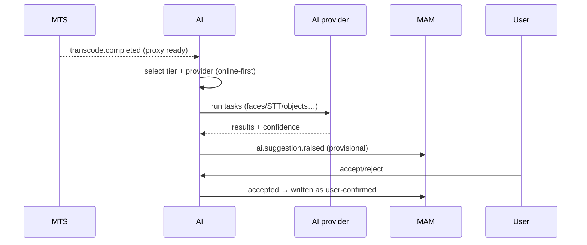

# AI Enrichment — Service Specification

> AI-derived metadata and suggestions — **off the critical path**, **online-first**. Summary
> card: [Service Catalog §AI Enrichment](../03-service-catalog.md#ai-enrichment). Template:
> [services/README](README.md#spec-template).

## 1. Purpose & boundaries

AI Enrichment **augments** assets with machine-derived metadata and **suggestions**: faces
matched against the [people register](mam.md), object/logo detection, shot detection, scene
classification, speech-to-text/subtitles, language ID, keywords, and summaries. It is
**provider-abstracted and online-first** — full enrichment runs against cloud/vendor providers;
air-gapped sites get an optional small local model for suggestions/simple tasks, or nothing.
The platform runs fully with **AI disabled**, and AI **never blocks** ingest or approval.

**In scope:** the provider abstraction (online cloud/vendor + optional offline sidecar);
enrichment job orchestration; face-matching against the limited register (suggestions only);
STT/subtitles; suggestion intake for human confirmation.

**Out of scope:** storing final metadata ([MAM](mam.md) records results as *derived/
suggestions*); the model inference runtime itself (a **sidecar** for offline; the vendor's
service for online); auto-writing mandatory/on-air metadata (**forbidden** —
[FR-AI-3](../../requirements/05-functional-requirements.md#ai)); creating people
([FR-PPL-5](../../requirements/05-functional-requirements.md#people)).

## 2. Requirements covered

- [FR-AI-1…9](../../requirements/05-functional-requirements.md#ai) — derive metadata at ingest;
  STT/subtitles + language ID; **suggestions only** for mandatory fields; **never block** the
  critical path; **provider-abstraction** (cloud + local); **online (full) tier** primary;
  **offline (limited) tier** optional/Post; operable **AI-disabled**; face-matching only against
  the register.
- [FR-PPL-5](../../requirements/05-functional-requirements.md#people) — face-matching suggests,
  never auto-creates/auto-writes.
- NFR: [NFR-AVAIL-3](../../requirements/06-non-functional-requirements.md#availability) (must
  not block ingest→approval), [NFR-INT-5](../../requirements/06-non-functional-requirements.md#interop)
  (online-first, degrades offline), [NFR-CMP-1a](../../requirements/06-non-functional-requirements.md#compliance)
  (matching only against the limited register, human-confirmed).

## 3. Domain model

| Entity | Key fields | Store |
|--------|-----------|-------|
| **EnrichmentJob** | id, assetId, tasks[], tier (online/offline), provider, state, attempts | Queue + relational |
| **ProviderConfig** | id, tier, vendor, endpoint, credentialRef, capabilities, enabled | Relational (creds in vault) |
| **Suggestion** | id, assetId, kind (person/tag/subject/caption), value, confidence, state (proposed/accepted/rejected) | Relational (mirrored to MAM) |
| **ModelBundle** (offline) | id, task, version, localPath | Object/local store |

Suggestions are **first-class and provisional** — they live until a human accepts/rejects them;
acceptance is what writes to MAM (as user-confirmed), never the AI directly.

## 4. Public API

> **Contracts:** REST → [OpenAPI stub](../openapi/ai-enrichment.yaml) · events → [payload schemas](../schemas/).

Mostly event-triggered; thin sync surface:

| Method | Path | Purpose | Authz |
|--------|------|---------|-------|
| `POST` | `/enrich` | Enqueue enrichment for an asset (normally event-triggered). | service |
| `GET` | `/jobs/{id}` | Job status. | `asset:read`/service |
| `GET/POST` | `/providers` | Configure providers/tiers (enable/disable, credentials). | `ai:admin` |
| `POST` | `/suggestions/{id}/accept` · `/reject` | Human confirmation (writes accepted to MAM). | `asset:write` |

## 5. Messaging

- **Emits:** `ai.enrichment.completed` (assetId, results), `ai.suggestion.raised` (assetId,
  suggested people/tags — to MAM + Notifications), `ai.enrichment.failed`.
- **Consumes:** `asset.created`, `transcode.completed` (proxy available → enrich).

See [Messaging §Asset lifecycle](../04-messaging-and-data.md#asset-lifecycle).

## 6. Key flows

### 6.1 Enrich → suggest → confirm

### 6.2 Tier selection & degradation
Online-first: if a provider is configured and reachable, run the **full** tier. If air-gapped
(or online disabled), fall back to the **optional offline sidecar** for suggestions/simple tasks
only — or skip enrichment entirely. Either way, **the asset proceeds**; failure emits
`ai.enrichment.failed` and never blocks ingest/approval
([FR-AI-4](../../requirements/05-functional-requirements.md#ai),
[NFR-AVAIL-3](../../requirements/06-non-functional-requirements.md#availability)).

## 7. Dependencies

- **Cloud/vendor AI provider** (online tier — internet; opex, no local GPU) **or** a
  **local model sidecar** (offline tier — Python/ONNX Runtime on a small optional GPU/CPU).
- **MAM** (people register for matching + suggestion sink), **MTS** (proxy to analyze),
  **broker**, **vault** (provider credentials).

## 8. Scaling & performance

- **Fully async, queue-driven, scale-to-many.** Online tier scales by concurrency against the
  provider (no local GPU); offline tier scales on the modest local hardware present.
- **No mandatory on-prem GPU pool** — the reversal recorded in
  [A12b](../../README.md#assumptions-register)/[D4](../../01-technical-brief.md#9-resolved-decisions).
- Non-critical: latency is best-effort; it must never gate the pipeline.

## 9. Failure modes & degradation

| Failure | Effect | Mitigation |
|---------|--------|-----------|
| Provider/internet down | No/partial enrichment | Retry; fall back to offline tier or skip; **asset proceeds**. |
| AI disabled entirely | No suggestions | Fully supported mode ([FR-AI-8](../../requirements/05-functional-requirements.md#ai)); manual metadata only. |
| Low-confidence/incorrect result | Bad suggestion | Human-in-the-loop gate; nothing auto-written to mandatory fields. |
| Offline model weaker | Reduced accuracy | Expected + documented ([FR-AI-7](../../requirements/05-functional-requirements.md#ai)); suggestions/simple tasks only. |

## 10. Security & data sensitivity

- **Online tier sends media/frames to an external provider** → per-deployment consent, provider
  allow-list, and PII awareness; disabled by default in air-gapped/sensitive installs.
- **Face-matching is constrained**: only against the limited people register (name/role/optional
  image), producing **suggestions for confirmation** — no open-ended biometric identification
  ([NFR-CMP-1a](../../requirements/06-non-functional-requirements.md#compliance)).
- Provider credentials in vault; enrichment results audited as derived.

## 11. Configuration

Which tasks are enabled per channel/type; provider selection + credentials per tier;
online/offline/disabled mode per deployment; confidence thresholds for surfacing suggestions;
offline model bundles (in the [offline install bundle](../../13-glossary.md)).

## 12. Observability

- **Metrics:** jobs by tier/state, provider latency + error rate, suggestions raised/accepted/
  rejected (acceptance rate = quality signal), cost/usage (online opex), offline model load.
- **Logs:** per-job provider + task + result summary (no raw media).
- **Traces:** asset→enrich→suggestion correlation.

## 13. Implementation notes

- **Node.js + NestJS orchestrator** calling cloud provider SDKs over HTTP (online); the
  **offline tier is a separate Python/ONNX-Runtime sidecar** the Node service calls over local
  HTTP/gRPC — ML inference is deliberately **not** in Node
  ([Catalog §stack](../03-service-catalog.md#recommended-implementation-stack)). Provider
  abstraction is a strategy interface so vendors/models swap behind one contract
  ([FR-AI-5](../../requirements/05-functional-requirements.md#ai)).

## 14. Open questions / future

- Which cloud/vendor provider(s) to certify first, and per-region data-residency options.
- Which air-gapped customers (if any) want the offline sidecar, and the model set for it.
- Embeddings for semantic/vector search in [MAM](mam.md) (Post-v1.0).

---
_Related: [MAM](mam.md) · [MTS](mts.md) ·
[Brief §10 AI strategy](../../01-technical-brief.md#10-ai-strategy-online-first-with-a-limited-offline-tier)._
