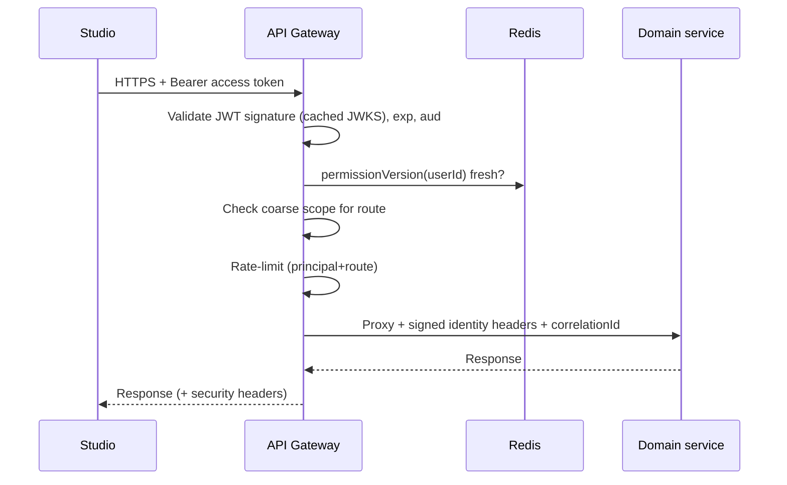

# API Gateway — Service Specification

> Single synchronous ingress for Studio and third parties. Summary card:
> [Service Catalog §API Gateway](../03-service-catalog.md#31-api-gateway). Template:
> [services/README](README.md#spec-template).

## 1. Purpose & boundaries

The API Gateway is the **only** HTTPS entry point to Atlas. It terminates TLS, authenticates
every request, enforces coarse-grained authorization, routes to the owning service, and — via
a thin **backend-for-frontend (BFF)** layer — composes a few Studio views that would otherwise
need several round-trips. It is deliberately **stateless and thin**: no domain logic, no data
of its own beyond short-lived caches.

**In scope:** TLS termination; JWT validation; coarse scope checks; routing; request/response
aggregation for named Studio views; rate limiting and quotas; request/response size limits;
API versioning; WAF/edge rules; access logging; correlation-id origination.

**Out of scope:** fine-grained, resource-level authorization (each service does its own — see
[IAM](iam.md) and [FR-IAM-7](../../requirements/05-functional-requirements.md#iam)); business
logic; persistence; WebSocket fan-out (that is the [WebSocket service](websocket.md)); token
issuance (that is [IAM](iam.md)).

## 2. Requirements covered

- Enforcement point for [FR-IAM-6](../../requirements/05-functional-requirements.md#iam)
  (authorize each request) and [FR-UI-5](../../requirements/05-functional-requirements.md#studio)
  (gate pages/actions by effective permissions).
- Originates the correlation id underpinning
  [FR-PLat-5](../../requirements/05-functional-requirements.md#platform) (audited actions).
- Serves [FR-PLat-7](../../requirements/05-functional-requirements.md#platform): no dependency
  on the public internet — runs fully air-gapped.
- NFR targets: [NFR-PERF-1](../../requirements/06-non-functional-requirements.md#performance)
  (read p95 < 300 ms — the gateway's own overhead budget is a small slice of this),
  [NFR-SEC-1/2/3](../../requirements/06-non-functional-requirements.md#security--privacy)
  (TLS, token model, defense-in-depth authz).

## 3. Domain model

The gateway owns **no domain data**. It holds only ephemeral, rebuildable state:

| State | Store | Notes |
|-------|-------|-------|
| JWKS public keys | In-memory + short TTL | Fetched from IAM; used to validate JWT signatures locally (no per-request call to IAM). |
| Permission-version cache | Redis (short TTL) | Maps `userId → permissionVersion`; invalidated on `permissions.changed` so revocation takes effect within one token TTL ([FR-IAM-8](../../requirements/05-functional-requirements.md#iam)). |
| Rate-limit counters | Redis | Sliding-window / token-bucket per principal + route. |
| Route table | Config + registry | Static config plus healthy-instance discovery from the orchestrator. |

## 4. Public API

> **Contracts:** REST → [OpenAPI stub](../openapi/api-gateway.yaml) · events → [payload schemas](../schemas/).

The gateway exposes **every** service's public API under one host; it does not add its own
domain endpoints. Two categories are gateway-native:

| Method | Path | Purpose | Authz |
|--------|------|---------|-------|
| `GET` | `/healthz`, `/readyz` | Liveness/readiness for the orchestrator. | None |
| `GET` | `/api/v1/bff/{view}` | Aggregated Studio views (e.g. `bff/asset-detail/{id}` = MAM core + HSM location + MTS job status + AI suggestions in one response). | Access token + composed downstream checks |

All other paths (`/api/v1/assets`, `/auth/*`, `/api/v1/schedules`, …) are **proxied** to the
owning service after auth. The gateway forwards a signed internal header set
(`x-atlas-user`, `x-atlas-channel`, `x-atlas-scopes`, `x-correlation-id`) so downstream
services trust the established identity without re-parsing the JWT.

## 5. Messaging

Mostly synchronous, but it participates in two async concerns:

- **Emits** `gateway.access.logged` (batched) to [Logging](logging-analytics.md) — or ships
  access logs directly to the log pipeline; and `alert.raised` conditions (e.g. auth failure
  spikes) via metrics, not the domain bus.
- **Consumes** `permissions.changed` (from [IAM](iam.md)) to invalidate the permission-version
  cache, and service-registry/health signals to update routing.

No commands; the gateway issues **synchronous** calls downstream, not broker commands.

## 6. Key flows

### 6.1 Authenticated request

### 6.2 BFF aggregation
For a named view the gateway fans out to several services **in parallel**, applies a per-view
timeout, and assembles a partial response if a non-critical part is slow (e.g. AI suggestions
missing → the rest of the asset detail still returns). Aggregation is read-only; writes always
target a single owning service.

## 7. Dependencies

- **IAM** — JWKS endpoint (keys) and the `permissions.changed` stream.
- **Redis** — rate-limit counters + permission-version cache.
- **Every domain service** — as proxy targets.
- **Orchestrator / registry** — healthy-instance discovery.
- **Logging** — access-log sink.

## 8. Scaling & performance

- **Stateless horizontal scale**: run N replicas behind an L4 load balancer; any replica
  serves any request. Scale on CPU + request rate.
- Token validation is **local** (cached JWKS) → no IAM round-trip on the hot path.
- Gateway self-overhead budget: **< 10 ms p95** added latency, well inside
  [NFR-PERF-1](../../requirements/06-non-functional-requirements.md#performance).
- Handles the WebSocket **upgrade** handshake auth, then hands the connection to the
  [WebSocket service](websocket.md) (or routes the upgrade there directly).

## 9. Failure modes & degradation

| Failure | Effect | Mitigation |
|---------|--------|-----------|
| A downstream service is down | 502/503 for that route only | Circuit-breaker per route; other routes unaffected; BFF returns partial. |
| IAM JWKS unreachable | Cannot refresh keys | Serve from cached keys until TTL; alert; keys rotate slowly. |
| Redis down | Rate-limit + permission-version cache unavailable | Fail-open on rate-limit (log), fail-safe on authz (fall back to per-request IAM check or short-deny), alert. |
| Gateway replica dies | LB routes around it | Multiple replicas; no session affinity needed. |

The gateway is **on the critical path** ([Architecture §8](../02-system-architecture.md#8-failure-and-degradation-model)):
it must be HA (≥2 replicas) at v1.0 ([NFR-AVAIL-2](../../requirements/06-non-functional-requirements.md#availability)).

## 10. Security & data sensitivity

- **TLS 1.2+** externally; forwards over the internal mesh (mTLS —
  [NFR-SEC-1](../../requirements/06-non-functional-requirements.md#security--privacy)).
- Validates `exp`, `aud`, `iss`, signature, and permission-version on every request.
- **Coarse scopes only** here; resource-level checks are enforced in depth by each service —
  the gateway is a filter, never the sole authority
  ([NFR-SEC-3](../../requirements/06-non-functional-requirements.md#security--privacy)).
- WAF rules, request/body size caps, and per-principal quotas blunt abuse.
- Holds **no secrets** beyond the internal-header signing key (from the vault) and public JWKS.

## 11. Configuration

Route table + upstream timeouts; per-route required scopes; rate-limit policies per role/route;
body-size limits; CORS allow-list; TLS certs (from vault/cert-manager); BFF view definitions;
JWKS URL + refresh interval. All per-deployment; no per-request config.

## 12. Observability

- **Metrics:** request rate, status-class counts, per-route latency histograms, upstream
  error rate, rate-limit rejections, auth-failure rate, circuit-breaker state.
- **Logs:** structured access log (principal, route, status, latency, correlationId) — the
  audit spine for [FR-PLat-5](../../requirements/05-functional-requirements.md#platform).
- **Traces:** the gateway **starts** the trace and correlation id and propagates them to every
  downstream ([NFR-OBS-3](../../requirements/06-non-functional-requirements.md#observability)).

## 13. Implementation notes

- **Node.js + Fastify** — chosen for low per-request overhead and first-class hooks; a thin
  IO-bound proxy is Node's sweet spot ([Catalog §stack](../03-service-catalog.md#recommended-implementation-stack)).
- Libraries: `@fastify/http-proxy` / `undici` for upstreaming, `jose` for JWT/JWKS,
  `@fastify/rate-limit` (Redis store), `@fastify/helmet` for security headers.
- Prefer running this behind (or as) the ingress controller; heavy L7 concerns (TLS, WAF) may
  also be delegated to an ingress/Envoy layer with the Fastify app owning auth + BFF.
- **Escape hatch:** none expected — no CPU-bound work here.

## 14. Open questions / future

- Whether to keep BFF aggregation in the gateway or split a dedicated BFF service as Studio
  grows (revisit if aggregation logic accretes).
- GraphQL/edge-cache layer for read-heavy Studio views (Post-v1.0 consideration).
- Public-facing partner API throttling tiers if the SaaS model
  ([Architecture §7.1](../02-system-architecture.md#saas)) adds external subscribers.

---
_Related: [WebSocket Service](websocket.md) · [IAM](iam.md) ·
[Messaging & Data](../04-messaging-and-data.md)._
