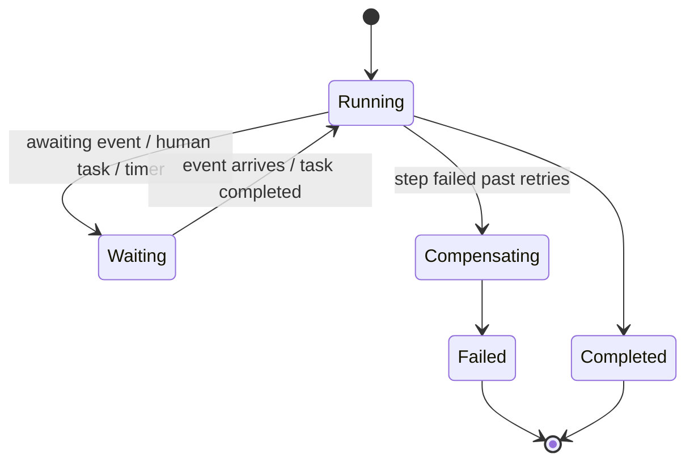
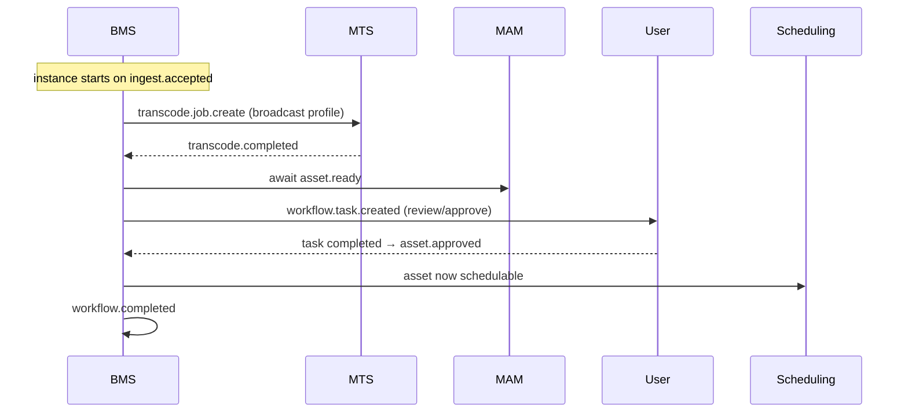

# BMS — Business Process Management System (Workflow Engine) — Service Specification

> Authors and executes configurable workflows that orchestrate the other services and human
> steps. Summary card:
> [Service Catalog §BMS](../03-service-catalog.md#bms--business-process-management-system).
> Template: [services/README](README.md#spec-template).

## 1. Purpose & boundaries

BMS is the **orchestrator**. Where most flows are choreographed (services react to events), BMS
runs the multi-step **business flows operators author** — the ones that need visibility,
retries, timeouts, and **human-in-the-loop** steps (approval, task assignment). It ships preset
flows (the canonical ingest-to-air), lets operators duplicate/modify/author flows per
category/type/usage in a **visual drag-and-drop designer in Studio**, and shows each asset's
position in its flow.

**Editor vs. engine — the key split.** A flow is **data**: a versioned **workflow definition**
(JSON graph of steps + connections). The Studio **designer edits that definition**; the durable
**engine executes a compiled form of it**. The two never share code — the same definition drives
both, so a new flow needs no deploy ([FR-BMS-7](../../requirements/05-functional-requirements.md#workflow)).

**In scope:** workflow **definitions** (authoring, versioning, publish, **validation**); the
**visual designer** contract (palette, definition schema); **BPMN 2.0 export/import** of
definitions ([FR-BMS-10](../../requirements/05-functional-requirements.md#workflow)); a durable
**execution engine** (issue commands, await events, retries/timeouts, compensations); human steps
(approval/tasks); SLA timers; flow-instance visibility.

**Out of scope:** the work itself (BMS commands MTS/HSM/etc., it doesn't transcode or move
files); the task **inbox/UI** ([Notifications](notifications.md) delivers tasks BMS creates);
approval **policy** on the asset record ([MAM](mam.md) holds lifecycle state). The **manual
path can bypass BMS** — automated flows are its domain.

## 2. Requirements covered

- [FR-BMS-1…9](../../requirements/05-functional-requirements.md#workflow) — preset flows incl.
  the canonical ingest-to-air; duplicate/modify; author new scoped flows; orchestrate via
  commands+events with retries/timeouts; human-in-the-loop steps; show current position;
  **visual drag-and-drop designer** (FR-BMS-7) with a **step palette** (FR-BMS-8) and
  **validation + immutable versioning on publish** (FR-BMS-9).
- Drives [FR-APP-1/2](../../requirements/05-functional-requirements.md#approval) (review →
  task → approval) and [FR-PLat-4](../../requirements/05-functional-requirements.md#platform)
  (flows configurable without a deploy).
- NFR: [NFR-MNT-2](../../requirements/06-non-functional-requirements.md#maintainability)
  (versioned contracts), reliability of long-running orchestration.

## 3. Domain model

| Entity | Key fields | Store |
|--------|-----------|-------|
| **WorkflowDefinition** | id, channelId, scope (category/type/usage), version, steps[], published | Relational |
| **Step** | id, kind (command/wait-event/human-task/timer/branch), config, retry/timeout, compensation | Relational (in def) |
| **WorkflowInstance** | id, defId+version, assetId, state, currentStep, vars, startedAt | Relational + durable timers |
| **HumanTask** | id, instanceId, assignee, kind (approve/edit), state, dueAt | Relational (mirrors to Notifications) |
| **StepHistory** | instanceId, step, event, at, result | Relational (audit/visibility) |

Instances are **pinned to the definition version** they started on, so editing a flow never
corrupts running instances.

### 3.1 Instance state



### 3.2 Definition = designer model

> **Deep dive:** the full model, step-kind catalog, FEEL, validator, Temporal interpreter, BPMN
> converter and canvas architecture are specified in
> [BMS Workflow DSL, Designer, Engine & BPMN Converter](../bms-workflow-dsl-and-designer.md);
> machine-readable contract: [`workflow-definition.schema.json`](../schemas/workflow-definition.schema.json).

The `WorkflowDefinition` is a **directed graph** — the exact thing the Studio canvas manipulates.
One schema (published in the shared `contracts` package) serves editor, storage, and engine:

| Designer concept | Definition | Runtime meaning |
|------------------|-----------|-----------------|
| **Node on canvas** | `Step { id, kind, config, position, retry/timeout, compensation }` | an activity/wait the engine runs |
| **Palette kinds** ([FR-BMS-8](../../requirements/05-functional-requirements.md#workflow)) | `command` (service action) · `wait-event` · `human-task` (assign/approve) · `timer` · `branch` (condition) · `parallel` (split/join) · `sub-flow` | how the step executes |
| **Edge** | `transitions[] { from, to, when? }` | control flow / branch conditions |
| **Canvas variables/mapping** | `vars`, per-step input/output binding | data passed between steps |

`position` (canvas x/y) is **presentation-only** metadata the engine ignores — so layout
round-trips without affecting execution. **Validation** ([FR-BMS-9](../../requirements/05-functional-requirements.md#workflow))
runs on the definition (reachability, no dangling edges, bound references, type-correct
connections) before publish; **publish freezes an immutable version** and running instances stay
pinned to theirs.

### 3.3 BPMN 2.0 alignment & interop

**Decision:** the internal model is our **own JSON DSL**, but its step kinds are a **curated
subset of BPMN element types**, so a definition is **losslessly convertible to/from BPMN 2.0**
([FR-BMS-10](../../requirements/05-functional-requirements.md#workflow)) — keeping the system
modular and interoperable with standard BPMN tooling. The mapping is deterministic:

| DSL step `kind` | BPMN 2.0 element |
|-----------------|------------------|
| start / end (endpoints) | Start Event / End Event |
| `command` (service action) | **Service Task** |
| `human-task` (assign / approve) | **User Task** |
| `wait-event` | Message/Signal **Intermediate Catch Event** |
| `timer` | **Timer** Intermediate/Boundary Event |
| `branch` (condition) | **Exclusive (XOR) Gateway** |
| `parallel` (split/join) | **Parallel (AND) Gateway** |
| `sub-flow` | **Call Activity / Sub-Process** |
| `transitions[] { from, to, when? }` | **Sequence Flow** (+ `conditionExpression`) |
| `compensation` | Boundary **Error/Compensation Event** |
| retry/timeout/SLA, var mapping | BPMN **extension elements** (namespaced) |
| `position` (canvas x/y) | **BPMN DI** (`BPMNShape` / `BPMNEdge`) |

Engine-specific policy that has no native BPMN control-flow (retry/backoff, SLA, data binding)
rides in **namespaced extension elements** — the same technique Camunda/Zeebe use — so a standard
BPMN tool still imports the diagram, and Atlas round-trips the full fidelity. Layout maps to
**BPMN DI**, so Foblex Flow node positions survive export/import. The converter is a pure library
in `contracts`; [bpmn-js](https://bpmn.io/toolkit/bpmn-js/) may be used to serialize/parse the
BPMN XML.

## 4. Public API

> **Contracts:** REST → [OpenAPI stub](../openapi/bms.yaml) · events → [payload schemas](../schemas/).

| Method | Path | Purpose | Authz |
|--------|------|---------|-------|
| `GET/POST/PATCH` | `/workflows` | Definition CRUD (authoring) — the designer reads/writes this. | `workflow:admin` |
| `GET` | `/workflows/palette` | Step kinds + their config schemas (drives the designer palette + property panels). | `workflow:admin` |
| `POST` | `/workflows/{id}/validate` | Validate a draft graph without publishing (live designer feedback). | `workflow:admin` |
| `POST` | `/workflows/{id}/publish` | Validate + publish a new immutable definition version. | `workflow:admin` |
| `GET` | `/workflows/{id}/export?format=bpmn` | Export the definition as **BPMN 2.0** XML (with DI layout). | `workflow:admin` |
| `POST` | `/workflows/import` | Import a **BPMN 2.0** file → a draft definition (validated). | `workflow:admin` |
| `GET` | `/instances`, `/instances/{id}` | Running flow state + position. | `workflow:read` |
| `POST` | `/instances/{id}/signal` | External signal (e.g. human task done). | service/`workflow:act` |
| `POST` | `/tasks/{id}/complete` | Complete a human-in-the-loop step. | task assignee |

## 5. Messaging

- **Emits:** `workflow.step.requested` (the observable record that a step is due; a **command**
  step is carried out by issuing the target service's own command, e.g. a transcode step issues
  `transcode.job.create`), `workflow.task.created` (→ Notifications, a human step),
  `workflow.completed`.
- **Consumes:** the **completion events of every service it orchestrates** — `ingest.accepted`,
  `transcode.completed`/`failed`, `asset.ready`/`approved`/`rejected`, `restore.completed`,
  `schedule.sent-to-air`, etc. — to advance waiting instances.

See [Messaging §Workflow/scheduling](../04-messaging-and-data.md#workflow--scheduling--people).

## 6. Key flows

### 6.1 Canonical ingest-to-air (preset)



### 6.2 Retries, timeouts, compensation
Each step carries retry/backoff and a timeout; a step that exhausts retries triggers a
**compensation** path (e.g. mark asset rejected, notify) rather than hanging. Durable timers
survive restarts — a wait step resumes exactly where it paused.

### 6.3 Authoring in the visual designer

```mermaid
sequenceDiagram
    participant User as Operator (Studio)
    participant Canvas as Designer (Foblex Flow)
    participant BMS
    participant Engine as Durable engine
    Canvas->>BMS: GET /workflows/palette (step kinds + config schemas)
    User->>Canvas: drag steps, connect edges, set properties
    Canvas->>BMS: POST /workflows/{id}/validate (draft graph)
    BMS-->>Canvas: errors/warnings (unreachable, unbound, bad edge)
    User->>Canvas: Publish
    Canvas->>BMS: POST /workflows/{id}/publish
    BMS->>BMS: validate → freeze immutable version N
    BMS->>Engine: register/compile definition vN (interpreter)
    Note over Engine: new instances start on vN; running ones stay pinned
```

The canvas is **thin**: it renders the `WorkflowDefinition` graph, edits it against the palette's
config schemas, and calls validate/publish (and export/import BPMN). **All semantics live in the
definition + engine**, not the editor — so swapping the canvas library or adding a step kind never
touches execution. **Live instance overlay:** the same graph, colored by `StepHistory`, powers the
"where is this asset in its flow" view ([FR-BMS-6](../../requirements/05-functional-requirements.md#workflow)).

## 7. Dependencies

- **Durable workflow runtime** (Temporal via its TypeScript SDK, or a broker-backed saga) for
  timers/retries/state.
- **Every orchestrated service** (via events/commands), **Notifications** (tasks),
  **relational store**, **broker**.

## 8. Scaling & performance

- **Stateful engine**, scaled by **partitioning instances** (e.g. by `assetId`/`channelId`).
- Throughput is orchestration overhead, not heavy compute — Node fits; the durable runtime
  handles persistence/timers.
- Critical path for **automated** flows; the manual path can proceed if BMS is degraded.

## 9. Failure modes & degradation

| Failure | Effect | Mitigation |
|---------|--------|-----------|
| BMS down | Automated flows pause | Durable state; instances resume on recovery; manual path unaffected. |
| Orchestrated service fails a step | Step retries then compensates | Retry/backoff + compensation; DLQ + alert. |
| Duplicate completion event | Risk of double-advance | Idempotent step handling keyed on instance+step+messageId. |
| Definition edited mid-flight | — | Running instances stay on their pinned version. |

## 10. Security & data sensitivity

- Authoring is privileged (`workflow:admin`); publishing a flow is audited.
- Human tasks route only to permitted assignees; task actions are audited (who approved what).
- BMS holds no media/PII — it references assets and users by id.

## 11. Configuration

Preset flows shipped as defaults; per-channel/type/usage flow definitions authored without a
deploy ([FR-PLat-4](../../requirements/05-functional-requirements.md#platform)); step
retry/timeout/compensation policies; SLA timers; task-assignment rules.

## 12. Observability

- **Metrics:** running/waiting/failed instances, step latency, retry/compensation rates, SLA
  breaches, task age.
- **Logs:** step history (the visibility feature) — every transition with cause.
- **Traces:** instance correlation id across all orchestrated service calls.

## 13. Implementation notes

- **Node.js + NestJS** for authoring/visibility APIs; **Temporal (TypeScript SDK)** for durable
  execution keeps orchestration **in-language** — or a broker-backed saga if Temporal isn't
  adopted. Definitions are data (JSON/DSL), interpreted by the engine, so new flows need no
  deploy.
- Keep step handlers idempotent and side-effect-guarded.
- **Designer canvas (Studio, Angular): [Foblex Flow](https://flow.foblex.com/)** (`@foblex/flow`,
  MIT) — Angular-native, signals-based, built for workflow builders (drag-to-connect, minimap,
  snapping, waypoints). Keep it **thin over our definition schema**; all semantics stay in the
  definition + engine so the library remains swappable. *(The MIT npm package is what ships; full
  source is a separate paid license.)*
- **Definition format: own JSON DSL, BPMN-aligned (decided).** The DSL is the internal model
  (ergonomic for the canvas + a clean Temporal mapping); a pure **converter** in `contracts` does
  lossless **BPMN 2.0** export/import (§3.3), with [bpmn-js](https://bpmn.io/toolkit/bpmn-js/) for
  XML/DI serialization. Design the DSL step kinds as a **BPMN subset from day one** so the mapping
  stays deterministic.

## 14. Open questions / future

- **Decided:** Studio gets a **visual drag-and-drop designer** ([Foblex Flow](https://flow.foblex.com/))
  over an **own JSON DSL** that is **losslessly convertible to BPMN 2.0** (§3.3) for tool interop.
- Sub-workflows / reusable flow fragments and a shared step library.
- Whether Temporal is adopted platform-wide (also useful for HSM restore sagas).
- How far to expose expressions/conditions in the designer (safe expression language vs. free code)
  — and how those serialize into BPMN `conditionExpression`.

---
_Related: [MTS](mts.md) · [MAM](mam.md) · [Notifications & Messaging](notifications.md) ·
[Brief §5 canonical flow](../../01-technical-brief.md#5-canonical-end-to-end-flow)._
