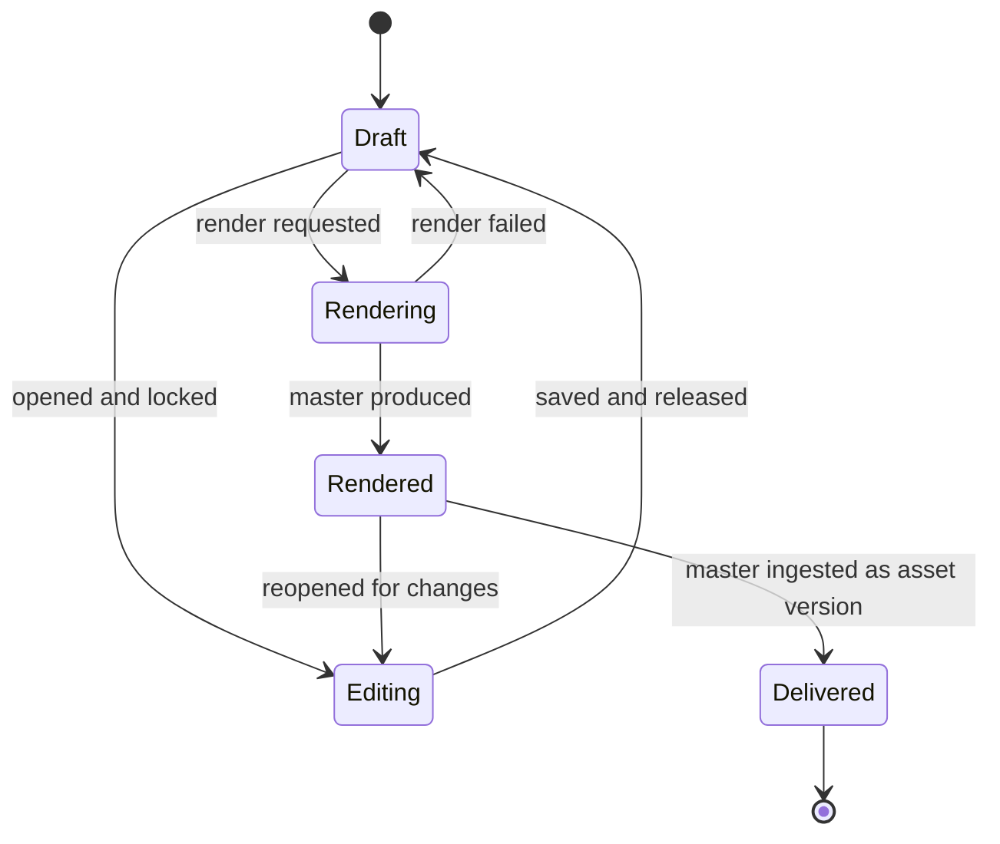
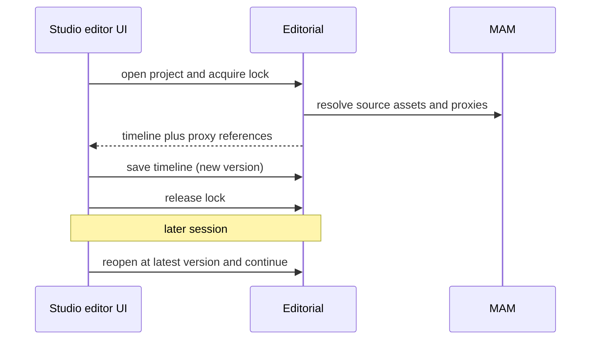
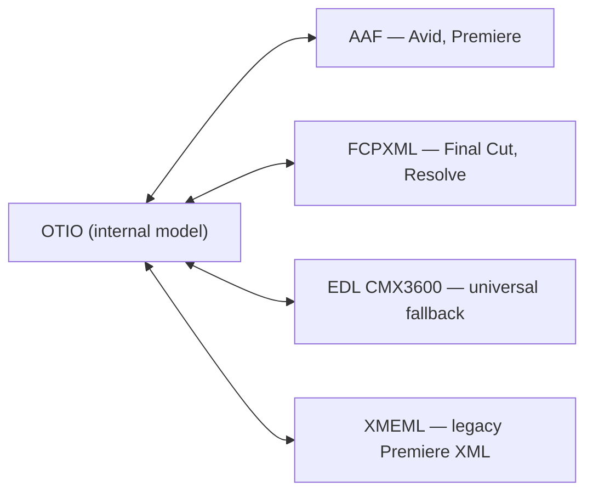

# Editorial (Web Editor & Projects) — Service Specification

> Post-production: persistent editing projects, the browser-based timeline editor, and
> interchange with desktop NLEs. **New in the [lifecycle expansion](../../strategy/19-production-lifecycle-scope.md)
> — the flagship of v2.0**, and its largest single commitment. Template:
> [services/README](README.md#spec-template).

## 1. Purpose & boundaries

Editorial owns the **edit decision** — a persistent, reopenable project describing how source
clips are assembled into a finished piece — and the interchange of that decision with desktop
NLEs. It does **not** encode media: rendering an edit is a job for [MTS](mts.md); storing bytes
is [HSM](hsm.md); the finished master rejoins the platform as an ordinary asset version.

**In scope:** editing projects (save, reopen, continue later); the timeline/edit-decision model;
browser playback coordination; cut/trim/merge, titles, overlays, audio adjust, image edit;
server-side render orchestration; project versioning and locking; **interchange** (OTIO, AAF,
FCPXML, EDL); review of cuts with frame-accurate comments.

**Out of scope:** colour grading, VFX/compositing, sound design and mastering — ⚪ excluded
([lifecycle §4](../../strategy/19-production-lifecycle-scope.md#4-post-production)); the render
itself (MTS); media storage (HSM); native project files (`.prproj`, `.aep`, `.drp`) — **not
interchangeable**, see [§6.3](#63-interchange).

> **Relationship to the v1.0 Media Editor — read this first.** The v1.0 editor is specified as a
> **capability, not a service**: [media-editor.md](media-editor.md) — Studio does the editing, MAM
> persists the `EditProject` document, MTS renders via `editor.render.requested`. That decision is
> correct for v1.0 and **stands unchanged**.
>
> This document is the **v2.0 promotion** that the capability spec explicitly anticipates
> ("*if a future scope grows the editor into a collaborative, server-side timeline engine, promote
> it to a service then — the contracts stay the same*"). It is triggered by the
> [lifecycle expansion](../../strategy/19-production-lifecycle-scope.md#4-post-production): a
> server-side timeline engine, frame-accurate playback, versioning/locking, and NLE interchange
> exceed what Studio+MAM+MTS should carry.
>
> **The contracts are preserved on promotion** — `EditProject` and `editor.render.requested`
> keep their shape; ownership of `EditProject` moves from MAM to this service, and the timeline
> body becomes OTIO-compatible. Nothing in the v1.0 build is wasted, and **the v1.0 editor scope
> does not change** — which is what protects the GA date.

## 2. Requirements covered

- [FR-EDT-11…20](../../requirements/05-functional-requirements.md#editor) — project persistence,
  timeline model, playback, render, locking/versioning, cut review, and interchange
  import/export.
- Builds on [FR-EDT-1…10](../../requirements/05-functional-requirements.md#editor) (v1.0
  basic-NLE operations, unchanged).
- Feeds [FR-APP-4](../../requirements/05-functional-requirements.md#approval) (editor output as
  replacement media).
- Standards: **OpenTimelineIO** as the internal model
  ([Standards §4](../../integrations/20-standards-and-fims.md#4-the-broader-standards-stack)).

## 3. Domain model

| Entity | Key fields | Store |
|--------|-----------|-------|
| **EditProject** | id, channelId, projectId?, title, ownerId, state, currentVersion, lockedBy? | Relational |
| **Timeline** | projectId, version, tracks[] (video/audio), OTIO-compatible structure | Document |
| **Clip** | trackRef, sourceAssetId, sourceIn/Out, timelineIn/Out, enabled | Document (in timeline) |
| **EffectSpec** | clipRef/trackRef, kind (title/overlay/fade/transform/audio-gain), params | Document |
| **RenderJob** | id, projectId, version, presetId, mtsJobId, state, outputAssetId? | Relational |
| **ProjectVersion** | projectId, version, savedBy, savedAt, note | Relational |
| **ReviewNote** | id, projectId, version, timecode, author, body, resolved | Relational |
| **InterchangeRecord** | id, projectId, direction, format, fidelityReport | Relational |

**The timeline is stored in an OTIO-compatible shape.** Interchange then becomes adapters at the
boundary rather than a translation layer bolted on late
([lifecycle §4.2](../../strategy/19-production-lifecycle-scope.md#42-interchange-what-is-actually-possible)).

### 3.1 Project state

## 4. Public API

> **Contracts:** REST → [OpenAPI stub](../openapi/editorial.yaml) · events → [payload schemas](../schemas/).

| Method | Path | Purpose | Authz |
|--------|------|---------|-------|
| `GET/POST` | `/projects` | List/create editing projects. | `edit:read`/`edit:write` |
| `GET/PATCH` | `/projects/{id}` | Open/update a project. | `edit:write` |
| `POST` | `/projects/{id}/lock` · `/unlock` | Acquire/release the edit lock. | `edit:write` |
| `GET/PUT` | `/projects/{id}/timeline` | Read/save the timeline (OTIO-compatible). | `edit:write` |
| `GET` | `/projects/{id}/versions` | Version history. | `edit:read` |
| `POST` | `/projects/{id}/render` | Request a server-side render (delegates to MTS). | `edit:render` |
| `GET/POST` | `/projects/{id}/notes` | Frame-accurate review comments. | `edit:read` |
| `GET` | `/projects/{id}/export?format=otio\|aaf\|fcpxml\|edl` | Export for a desktop NLE. | `edit:read` |
| `POST` | `/projects/import` | Import OTIO/AAF/FCPXML/EDL to a new project. | `edit:write` |

## 5. Messaging

- **Emits:** `edit.project.created`, `edit.project.saved`, `edit.render.requested`,
  `edit.render.completed`, `edit.interchange.completed`, `edit.note.added`.
- **Consumes:** `transcode.completed` (render finished → create the output asset version),
  `transcode.failed`, `asset.ready` (source media usable in a timeline), `asset.replaced`
  (source swapped under a project — flag affected timelines).

`edit.render.requested` maps to MTS's `editor.render.requested`
([MTS messaging](mts.md#5-messaging)), keeping the render path unchanged.

## 6. Key flows

### 6.1 Edit, save, resume

### 6.2 Render to a deliverable
A render compiles the timeline into an FFmpeg filter/concat graph and delegates to
[MTS](mts.md); on completion the master is registered through the normal ingest path so
approval, scheduling, and playout need no special case
([lifecycle §5](../../strategy/19-production-lifecycle-scope.md#5-where-the-completed-media-rejoins-the-existing-platform)).

### 6.3 Interchange

Two facts to communicate honestly, in the UI and in sales:

1. **Native project files are not interchangeable.** `.prproj` is proprietary and undocumented;
   "send to Premiere" means **AAF or FCPXML**, which Premiere imports. Every vendor works this
   way.
2. **Interchange is lossy.** Cuts, clip references, and basic transitions survive; complex
   effects, plugins, and grades do not. Each import/export produces a **fidelity report**
   (`InterchangeRecord`) listing what was dropped — turning a support complaint into an
   expectation set up front.

## 7. Dependencies

- **MAM** (source assets, output versions), **MTS** (render + scrub-optimised proxies),
  **HSM** (bytes), **IAM** (locks/permissions), **WebSocket** (collaborative presence, render
  progress), **broker**, relational + document stores.

## 8. Scaling & performance

- The service itself is **light** — it stores decisions, not media. Scale stateless replicas.
- **The performance problem is browser playback, not the API.** Frame-accurate multi-clip
  playback requires **scrub-optimised proxies** (segmented, keyframe-dense, short GOP) — an
  [MTS profile change](mts.md), not a UI feature. Budget for this explicitly; it is the most
  commonly underestimated part of web editing.
- Render cost lands on MTS and scales with the existing worker pool.

## 9. Failure modes & degradation

| Failure | Effect | Mitigation |
|---------|--------|-----------|
| Editorial down | No editing | **Not on the media critical path**; ingest→air unaffected. |
| Lost lock / concurrent edit | Overwritten work | Explicit locks + versioned saves; never last-write-wins on a timeline. |
| Source asset replaced or expired | Timeline references stale media | Consume `asset.replaced`; flag affected projects rather than silently re-pointing. |
| Render fails | No master | `transcode.failed` surfaces to the editor; timeline is intact; retry. |
| Interchange fidelity loss | Unmet expectations | Fidelity report on every import/export ([§6.3](#63-interchange)). |

## 10. Security & data sensitivity

- Unreleased edits are **commercially sensitive**: project-scoped permissions, and proxies
  served through the same authorization as any other asset.
- Render and export actions are audited (who produced which master).
- Imported interchange files are **untrusted input** — parse defensively (XML entity expansion,
  path traversal in media references); AAF/FCPXML parsers are a real attack surface.

## 11. Configuration

Scrub-proxy profile; supported interchange formats; lock timeout; version-retention policy;
render presets; maximum timeline complexity (tracks/clips) per tier; whether import is enabled.

## 12. Observability

- **Metrics:** active projects/locks, saves per session, render success rate and duration,
  interchange operations by format, fidelity-loss rate, playback stall rate (client-reported).
- **Logs:** project lifecycle, lock acquisition/expiry, interchange with fidelity summary.
- **Traces:** project → render → MTS job → output asset.

## 13. Implementation notes

- **Node.js + NestJS**; timeline persisted as an **OTIO-compatible document**. OTIO's reference
  implementation is Python — so interchange adapters run as a **sidecar** (the same pattern as
  the [AI offline tier](ai-enrichment.md)) rather than being reimplemented in TypeScript. This
  is the second sanctioned escape hatch from pure Node
  ([Catalog §stack](../03-service-catalog.md#recommended-implementation-stack)).
- Browser playback: MSE-based player over segmented scrub proxies; the render graph is compiled
  server-side to FFmpeg filter graphs and handed to MTS.
- Prefer explicit locks over CRDT/OT for v2.0 — collaborative multi-user timeline editing is a
  separate, much larger problem.

## 14. Open questions / future

- **Commercial validation before build:** at ~60–100 PW this is the expansion's dominant cost —
  confirm customers will use a web editor rather than staying in Premiere
  ([lifecycle §6](../../strategy/19-production-lifecycle-scope.md#6-delivery-consequence-this-is-a-v20-horizon)).
- Real-time collaborative editing (multi-user timeline) — deferred.
- AI-assisted editing (auto rough-cut, silence removal, shot matching), building on
  [AI Enrichment](ai-enrichment.md) — the feature Avid markets hardest.
- Whether image editing stays here or splits into its own lighter surface.

---
_Related: [MTS](mts.md) · [MAM](mam.md) · [Planning](planning.md) ·
[Lifecycle Scope §4](../../strategy/19-production-lifecycle-scope.md#4-post-production)._
