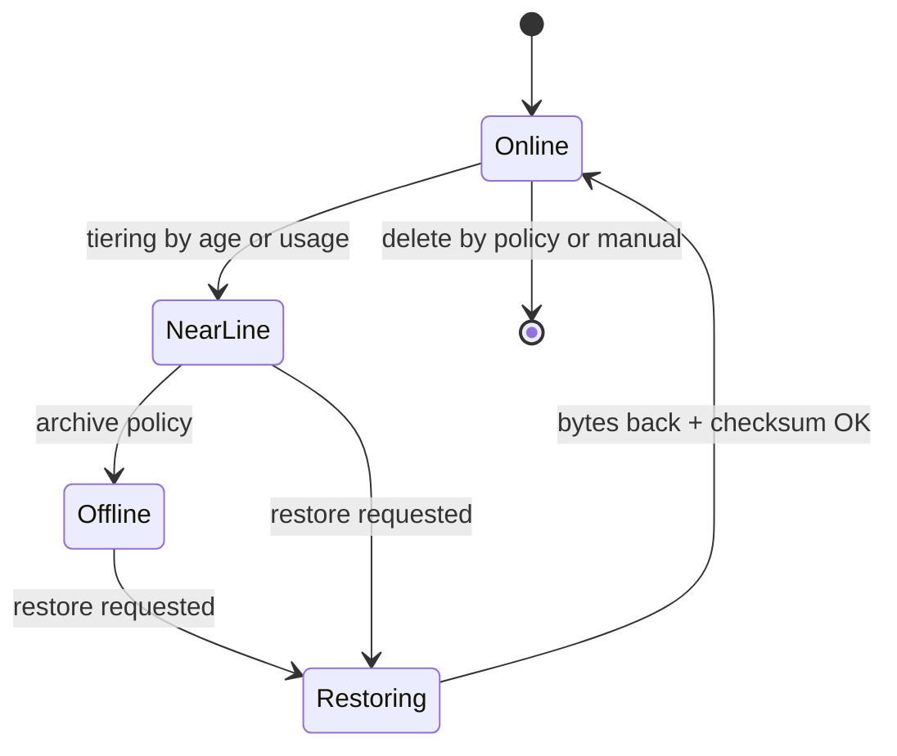
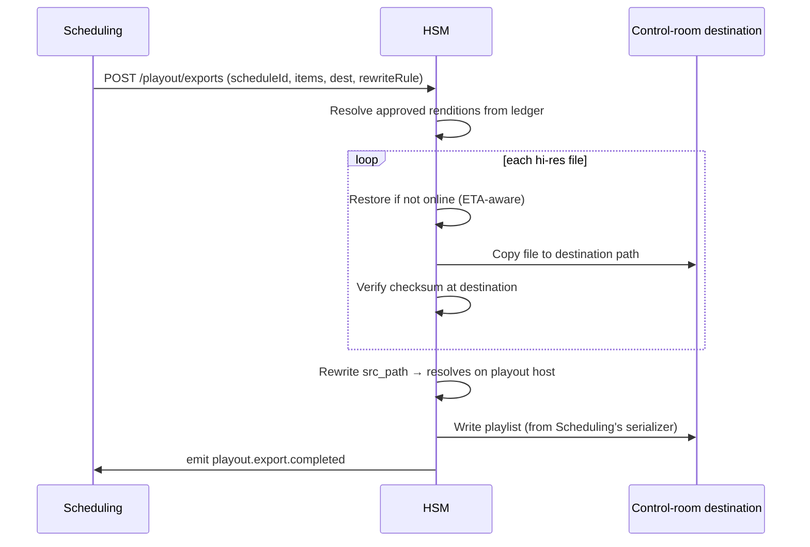

# HSM — Hierarchical Storage Manager — Service Specification

> Authority over where asset bytes physically live and every file operation on them. Summary
> card: [Service Catalog §HSM](../03-service-catalog.md#hsm--hierarchical-storage-manager).
> Template: [services/README](README.md#spec-template).

## 1. Purpose & boundaries

HSM is the **only** component that touches storage. It places, copies, moves, and deletes files
across **online / near-line / offline** tiers; tracks each rendition's location and status;
restores archived assets on demand; verifies integrity via checksums and periodic sweeps; and,
at send-to-air, copies hi-res files + the playlist to the control-room destination. It enforces
storage **least privilege**: other services request file operations through HSM and never hold
storage credentials.

**In scope:** the file-location ledger; tiering policy execution; copy/move/delete/restore;
checksum compute + verification + integrity sweeps; send-to-air file delivery (including the
control-room **path rewrite**); the on-prem **site connector** role in the
[SaaS deployment](../02-system-architecture.md#saas).

**Out of scope:** *what* a file means ([MAM](mam.md) owns metadata); *how* to encode it
([MTS](mts.md)); *which* files a schedule needs ([Scheduling](scheduling.md) decides, HSM
delivers); playlist **format** ([Scheduling](scheduling.md) serializes; HSM transports).

## 2. Requirements covered

- [FR-HSM-1…5](../../requirements/05-functional-requirements.md#hsm) — manage online/near-
  line/offline tiers; change status + copy/move/delete; on-demand restore with ETA; checksum on
  ingest and via sweeps; **all file ops go through HSM**.
- Executes send-to-air delivery for
  [FR-SCH-4](../../requirements/05-functional-requirements.md#scheduling) and the
  path-rewrite/approved-only constraint of
  [FR-SCH-5a](../../requirements/05-functional-requirements.md#scheduling).
- NFR: [NFR-SEC-4](../../requirements/06-non-functional-requirements.md#security--privacy)
  (only HSM holds storage credentials),
  [NFR-AVAIL-6](../../requirements/06-non-functional-requirements.md#availability) (asset
  masters protected by tiering + checksum),
  [NFR-PERF-7](../../requirements/06-non-functional-requirements.md#performance) (2-hour
  playlist export < 10 min), [NFR-CAP-4](../../requirements/06-non-functional-requirements.md#capacity)
  (tier semantics).

## 3. Domain model

| Entity | Key fields | Store |
|--------|-----------|-------|
| **FileEntry** (the [File](../schemas/file.schema.json) record — HSM is SoR) | id, channelId, **assetId (exactly one — files are never shared)**, kind, variant?, storage{targetId, path, tier, status}, checksum{algorithm,value}, lastVerifiedAt, sizeBytes, technical{container,codecs,duration,dimensions,bitrate,…}, provenance{producedBy,jobId,profile}, createdAt/deletedAt? — [Data Model §1.5](../data-model.md#15-files) | Relational (ledger) |
| **StorageTarget** | id, tier, kind (SAN/NAS/object/tape-gw), endpoint, credentialRef | Relational (creds in vault) |
| **TierPolicy** | id, channelId, rules (age / **usage (broadcast count, category keep-duration)** / schedule-proximity → target tier) | Relational |
| **Operation** | id, kind (copy/move/delete/restore/export), state, progress, retries | Relational (queue) |
| **RestoreRequest** | id, assetId, requestedBy, eta, state | Relational |
| **ExportJob** | id, scheduleId, destination, files[], pathRewriteRule, state | Relational |

**The ledger is authoritative** for physical location; MAM references assets, HSM answers
"where are its bytes and are they intact?".

### 3.1 Tier & restore state

## 4. Public API

> **Contracts:** REST → [OpenAPI stub](../openapi/hsm.yaml) · events → [payload schemas](../schemas/).

| Method | Path | Purpose | Authz |
|--------|------|---------|-------|
| `GET` | `/assets/{id}/location` | Current tier/status/checksum of each rendition. | `asset:read` |
| `POST` | `/assets/{id}/restore` | Request restore to online; returns ETA. | `asset:restore` |
| `POST` | `/files/operations` | Copy/move/delete (internal, permissioned; not user-facing). | Service |
| `POST` | `/playout/exports` | Copy schedule outputs (hi-res + playlist) to a network destination with path rewrite. | Service (from Scheduling) |
| `GET` | `/operations/{id}` | Progress of a long-running op. | `asset:read` / service |
| `GET/POST` | `/tier-policies`, `/storage-targets` | Administration. | `storage:admin` |

## 5. Messaging

- **Emits:** `file.placed` (assetId, tier, path), `file.moved` (from→to tier),
  `restore.completed` (assetId), `checksum.verified`, `checksum.mismatch` (assetId, rendition —
  **alert**), `playout.export.completed` (scheduleId, destination).
- **Consumes:** `transcode.completed` (place new renditions + record checksums),
  `schedule.sent-to-air` (trigger export), `asset.deleted` (remove bytes per policy).

See [Messaging §Storage](../04-messaging-and-data.md#storage).

## 6. Key flows

### 6.1 Send-to-air export (the integration-critical one)

The **path rewrite** ([FR-SCH-5a](../../requirements/05-functional-requirements.md#scheduling))
is HSM's responsibility: the `src_path` written into the
[MCRList](../../integrations/14-playout-mcrlist-format.md) must resolve **on the playout host**,
so HSM's copy destination and the rewritten paths agree. This is the coupling flagged as the
main [playout integration risk](../../integrations/14-playout-mcrlist-format.md).

### 6.2 Integrity sweep
A scheduled sweep re-hashes stored files and compares against the ledger
([FR-HSM-4](../../requirements/05-functional-requirements.md#hsm)); a mismatch emits
`checksum.mismatch` (alert) and can trigger restore-from-replica. Sweeps are throttled to avoid
starving live I/O.

## 7. Dependencies

- **Object/file storage** (online SAN/NAS, near-line object, offline tape-gateway/cloud
  archive); credentials from **vault**.
- **Control-room network** (or the **site connector** in SaaS) as the export destination.
- **Relational store** for the ledger; **broker**; **Scheduling** (export trigger + serialized
  playlist); **MTS** (rendition outputs).

## 8. Scaling & performance

- **Horizontally scalable file-op workers** pulling from the operation queue (queue group);
  throughput-bound by storage and network, not CPU — except hashing.
- **Hashing/byte-movement is the one CPU/IO-heavy path**: Node streams + worker-threads handle
  most of it; the [escape hatch](../03-service-catalog.md#recommended-implementation-stack) is a
  native hasher (Rust via napi-rs) or a small Go/Rust file-mover **only if profiling shows Node
  can't saturate the storage path**.
- Meets the **2-hour playlist export < 10 min** target
  ([NFR-PERF-7](../../requirements/06-non-functional-requirements.md#performance)) by
  parallelizing per-file copies over the control-room LAN and pre-restoring near-air media.

## 9. Failure modes & degradation

| Failure | Effect | Mitigation |
|---------|--------|-----------|
| HSM down | **File ops + playout copy blocked** (critical path) | HA; operations queue is durable and resumes. |
| Storage target unreachable | Ops to that tier fail | Retry/backoff; alert; other tiers unaffected. |
| Checksum mismatch | Integrity risk | Emit alert; quarantine; restore from replica/near-line copy. |
| Restore ETA exceeded | Schedule at risk | Surface ETA to Scheduling; pre-restore policy for near-air assets. |
| Export path unresolved on playout host | Playout can't read media | Validate rewrite rule against destination before completing; approved-only guard. |

## 10. Security & data sensitivity

- **Sole holder of storage credentials** ([NFR-SEC-4](../../requirements/06-non-functional-requirements.md#security--privacy));
  every other service requests ops via HSM
  ([FR-HSM-5](../../requirements/05-functional-requirements.md#hsm)).
- Encryption at rest per tier; per-tenant keys in the dedicated tenancy tier
  ([NFR-SEC-5](../../requirements/06-non-functional-requirements.md#security--privacy)).
- File-op requests are permissioned and audited; export destinations are allow-listed per
  channel to prevent exfiltration.
- HSM file-op code is **correctness-critical** → extra review, not AI-fast-tracked.

## 11. Configuration

Storage targets per tier (endpoints, credential refs); per-channel tier policies (age/usage/
schedule-proximity thresholds); checksum algorithm; sweep schedule + throttle; per-channel
control-room destinations and **path-rewrite rules**; restore concurrency limits; delete/retention
policy.

## 12. Observability

- **Metrics:** operations by kind/state, copy/restore throughput + duration, queue depth,
  restore ETA accuracy, checksum-verify rate, mismatch count, tier occupancy, export duration.
- **Logs:** every file op (asset, from→to, actor, result); export details.
- **Alerts:** `checksum.mismatch`, DLQ, restore-ETA breach, storage-target down
  ([NFR-OBS-4](../../requirements/06-non-functional-requirements.md#observability)).

## 13. Implementation notes

- **Node.js + NestJS** API + **worker processes** for byte movement/hashing (worker-threads or
  a separate worker deployment consuming the op queue). Streamed I/O throughout; never buffer
  whole masters. `node:crypto` streaming hashes; storage SDKs (S3/MinIO, filesystem, tape-gw
  APIs). **Escape hatch** reserved for the hot copy/hash loop.
- The **site connector** (SaaS) is a thin HSM edge deployment that receives export payloads and
  writes them onto the on-prem control-room network.

## 14. Open questions / future

- Partial-file/growing-file operations for edit-while-ingest.
- Multi-site replication topology + DR RPO/RTO drills
  ([NFR-AVAIL-5/6](../../requirements/06-non-functional-requirements.md#availability)).
- LTO/tape library driver matrix vs. cloud-archive-only for the offline tier.

---
_Related: [Scheduling](scheduling.md) · [MTS](mts.md) ·
[MCRList format](../../integrations/14-playout-mcrlist-format.md) ·
[Messaging §Storage](../04-messaging-and-data.md#storage)._
