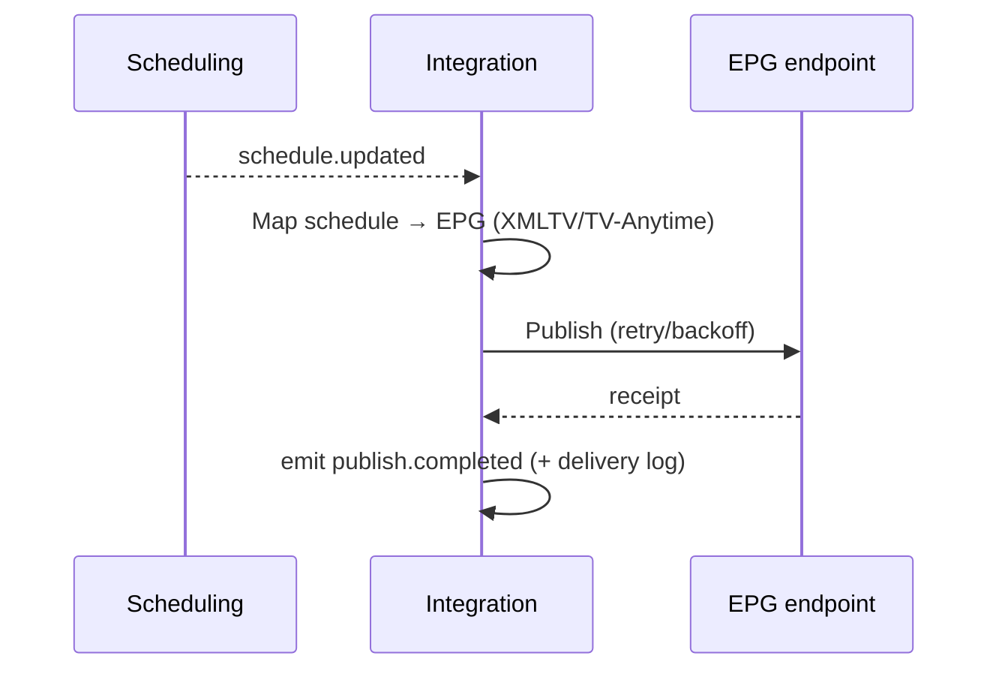

# Integration / Feeds — Service Specification

> All third-party inbound and outbound data — the feed authoring engine and connectors. Summary
> card: [Service Catalog §Integration](../03-service-catalog.md#integration--feeds). Template:
> [services/README](README.md#spec-template).

## 1. Purpose & boundaries

Integration is Atlas's **boundary to the outside world of data** (not media bytes — that is
[RIM](rim.md)/[HSM](hsm.md)). Operators author **inbound feeds** that map external JSON/XML into
Atlas assets/metadata, and **outbound APIs/feeds** that expose Atlas data to third parties.
Prebuilt **connectors** cover EPG publish, HbbTV launchers, social publishing, and website
content. It handles scheduling, retries, transform mapping, and delivery receipts. **EPG and web
publishing are configured on the [category](../data-model.md#2-the-category-aggregate)**: its EPG
fields feed EPG entries ([FR-INT-6](../../requirements/05-functional-requirements.md#integration)),
and its **web-publishing profile** — state, send trigger (on-approval / on-broadcast), publish
window, web metadata, featured — drives outbound web/social publishing
([FR-INT-7](../../requirements/05-functional-requirements.md#integration)); media inherit it.

**In scope:** inbound feed authoring (JSON/XML + field mapping); outbound API/feed authoring
(custom shapes + auth); connectors (EPG, HbbTV, social, web); wire intake for
[Newsroom](newsroom.md); transform/mapping, scheduling, retries, delivery logs.

**Out of scope:** media ingest ([RIM](rim.md)); the program table itself ([Scheduling](scheduling.md)
owns schedules; Integration publishes EPG *from* them); identity for partner access
([IAM](iam.md) issues service accounts/keys). **External connectors are internet features** →
optional and disabled in air-gapped installs
([FR-PLat-8](../../requirements/05-functional-requirements.md#platform)).

## 2. Requirements covered

- [FR-INT-1…5](../../requirements/05-functional-requirements.md#integration) — inbound JSON/XML
  import feeds with mapping; customized output APIs/feeds; EPG publish from schedules; HbbTV
  launcher create/update; social + website publishing.
- Feeds [FR-NRC](../../requirements/05-functional-requirements.md#newsroom) wires.
- NFR: [NFR-INT-3](../../requirements/06-non-functional-requirements.md#interop) (documented
  REST + webhook/event APIs — see the
  [Third-Party Developer Guide](../../integrations/10-third-party-developer-guide.md)),
  [NFR-INT-4](../../requirements/06-non-functional-requirements.md#interop) (EPG/HbbTV/MOS/VTT
  standards).

## 3. Domain model

| Entity | Key fields | Store |
|--------|-----------|-------|
| **InboundFeed** | id, channelId, source, format (json/xml), schedule, mapping, targetType | Relational |
| **OutboundFeed** | id, channelId, shape, auth, triggerOn (event/schedule), destination | Relational |
| **Connector** | id, kind (epg/hbbtv/social/web), config, credentialRef | Relational (creds in vault) |
| **MappingTemplate** | id, sourcePaths→atlasFields, transforms | Relational/document |
| **DeliveryLog** | id, feedId, runAt, status, receipt, error? | Relational |

## 4. Public API

> **Contracts:** REST → [OpenAPI stub](../openapi/integration-feeds.yaml) · events → [payload schemas](../schemas/).

| Method | Path | Purpose | Authz |
|--------|------|---------|-------|
| `GET/POST` | `/feeds/in` | Author/list inbound import feeds + mappings. | `integration:admin` |
| `GET/POST` | `/feeds/out` | Author/list outbound APIs/feeds. | `integration:admin` |
| `GET/POST` | `/connectors` | Configure EPG/HbbTV/social/web connectors. | `integration:admin` |
| `POST` | `/feeds/{id}/run` | Trigger a feed run on demand. | `integration:run` |
| `GET` | `/feeds/{id}/deliveries` | Delivery log/receipts. | `integration:read` |
| `*` | `/pub/{outboundFeed}` | The published outbound endpoint(s) for third parties. | service account / key |

## 5. Messaging

- **Emits:** `feed.item.received` (inbound item mapped → e.g. a Newsroom wire or an asset stub),
  `publish.completed`, `publish.failed`.
- **Consumes:** `schedule.updated` (publish EPG), `asset.approved` (publish to web/social).

## 6. Key flows

### 6.1 Outbound EPG publish

### 6.2 Inbound feed import
A scheduled/triggered inbound feed fetches JSON/XML, applies the **mapping template** to shape
it into Atlas fields, and emits `feed.item.received` (e.g. a Newsroom wire, or metadata to
attach). Malformed items are logged and skipped, not fatal to the run.

## 7. Dependencies

- **Scheduling** (EPG source), **MAM** (asset/metadata targets), **Newsroom** (wires),
  **IAM** (partner service accounts/keys), **broker**, **relational store**, external endpoints
  (connected deployments only).

## 8. Scaling & performance

- **Worker-per-feed**, scaled with feed volume; runs are independent and retriable.
- Node fits perfectly — JSON/XML transforms + HTTP are its ecosystem's strength.
- Outbound published APIs scale statelessly behind the gateway.

## 9. Failure modes & degradation

| Failure | Effect | Mitigation |
|---------|--------|-----------|
| External endpoint down | Publish fails | Retry/backoff, DLQ, `publish.failed` + delivery log; not on media critical path. |
| Malformed inbound data | Item skipped | Per-item validation; log + continue; alert on high failure ratio. |
| Air-gapped install | External connectors disabled | Feature is optional/plug-in; core unaffected ([FR-PLat-8](../../requirements/05-functional-requirements.md#platform)). |
| Bad mapping template | Wrong/empty output | Dry-run/preview before publish; versioned templates. |

## 10. Security & data sensitivity

- Connector credentials + partner keys are **secrets** (vault); outbound feeds authenticate
  callers via IAM service accounts.
- Only **approved** content is published outward (consumes `asset.approved`, not drafts).
- Egress destinations are configured/allow-listed; delivery receipts audited.

## 11. Configuration

Inbound sources + schedules + mapping templates; outbound feed shapes + auth + triggers;
connector configs (EPG format, HbbTV endpoints, social/web targets); retry/backoff; enable/
disable external connectors per deployment.

## 12. Observability

- **Metrics:** feed runs, success/failure ratios, publish latency, items imported, retry/DLQ.
- **Logs:** per-run delivery log with receipts + errors.
- **Traces:** schedule/asset event → publish correlation.

## 13. Implementation notes

- **Node.js + NestJS** with worker-per-feed; `fast-xml-parser`/`xmlbuilder2` for XML, native
  JSON; `undici` for HTTP; JSONPath/JMESPath-style mapping for templates. Sandboxed/limited
  transform expressions (no arbitrary code execution from templates).

## 14. Open questions / future

- A connector SDK/marketplace so third parties add their own (Post-v1.0).
- Webhook subscriptions for third parties vs. pull feeds.
- GraphQL outbound surface for richer partner queries.

---
_Related: [Scheduling](scheduling.md) · [MAM](mam.md) · [Newsroom](newsroom.md) ·
[Third-Party Developer Guide](../../integrations/10-third-party-developer-guide.md)._
