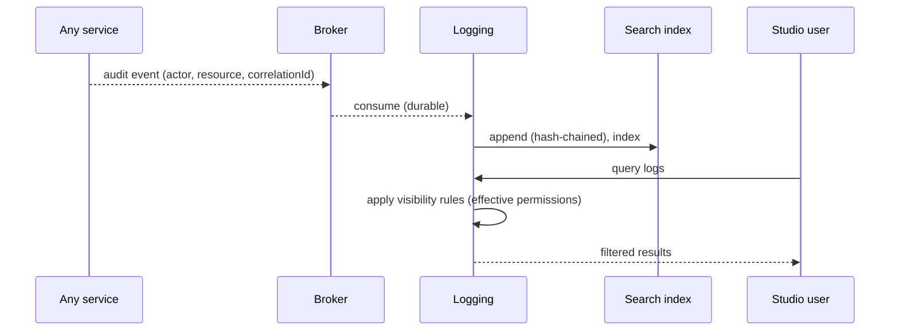
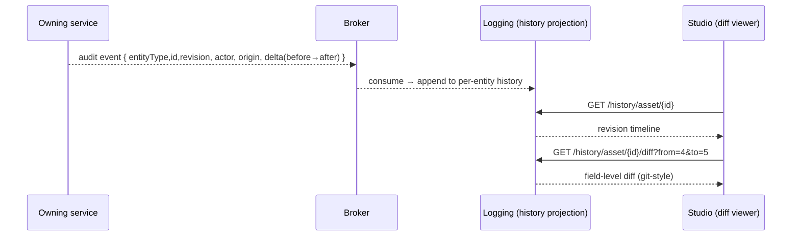

# Logging & Analytics — Service Specification

> Central audit log, operational metrics, and analytics/statistics. Summary card:
> [Service Catalog §Logging & Analytics](../03-service-catalog.md#logging--analytics). Template:
> [services/README](README.md#spec-template).

## 1. Purpose & boundaries

Logging & Analytics is the **audit sink and reporting brain**. It ingests structured logs and
audit events from every service (append-only), stores operational metrics, powers the Studio
Logs/Analytics/Statistics pages, and enforces **permission-filtered** log visibility ("some logs
visible to some users, all retained"). It is non-critical to the media path but **critical for
compliance and operations**.

**In scope:** append-only audit/log ingestion from all services; metrics store + dashboards;
permission-filtered log queries; analytics reports (ingest volumes, transcode throughput,
restore times, user activity); threshold alerting; the **per-entity change-history & diff read
model** that powers Studio's history/diff viewer ([FR-AUD](../../requirements/05-functional-requirements.md#audit)).

**Out of scope:** *emitting* audit events (each service does, via the envelope's `actor`/
`correlationId`); infra metrics scraping/tracing backends (Prometheus/OTel collectors feed it,
but the platform's observability stack is infrastructure —
[Architecture §6](../02-system-architecture.md#6-observability)); business decisions.

## 2. Requirements covered

- [FR-LOG-1…3](../../requirements/05-functional-requirements.md#analytics) — retain all
  action/audit logs append-only; permission-filtered visibility; analytics/statistics reports
  + charts.
- [FR-AUD-1…5](../../requirements/05-functional-requirements.md#audit) — record every mutation
  (who/when/where/before→after); maintain **per-entity change history**; serve the **history/diff
  viewer** read model; append-only + permission-filtered; deep-link a revision from the audit log.
- [FR-PLat-5](../../requirements/05-functional-requirements.md#platform) — every action logged
  with actor, resource, channel, correlation id (this service is the **store** for that spine).
- NFR: [NFR-SEC-7](../../requirements/06-non-functional-requirements.md#security--privacy)
  (append-only, tamper-evident, retention), [NFR-CMP-2](../../requirements/06-non-functional-requirements.md#compliance)
  (broadcast/regulatory as-run/audit retention),
  [NFR-OBS-1…4](../../requirements/06-non-functional-requirements.md#observability).

## 3. Domain model

| Entity | Key fields | Store |
|--------|-----------|-------|
| **AuditEvent** | id, channelId, actor, action, resourceType/id, correlationId, at, before/after? | Search index (hot) + cold |
| **LogRecord** | service, level, message, correlationId, fields, at | Search index (hot) + cold |
| **Metric** | name, labels, value, at | Metrics store (TSDB) |
| **Report** | name, definition (query + viz), schedule? | Relational |
| **RetentionPolicy** | scope, hotDays, coldRetention, legalHold? | Relational |
| **VisibilityRule** | logCategory → required permission | Relational |

Audit records are **append-only** and **tamper-evident** (e.g. hash-chained per channel) so the
log itself is trustworthy for compliance.

## 4. Public API

> **Contracts:** REST → [OpenAPI stub](../openapi/logging-analytics.yaml) · events → [payload schemas](../schemas/).

| Method | Path | Purpose | Authz |
|--------|------|---------|-------|
| `GET` | `/logs` | Browse logs (permission-filtered). | `logs:read` (scoped) |
| `POST` | `/logs/query` | Structured/faceted log query. | `logs:read` (scoped) |
| `GET` | `/history/{entityType}/{id}` | Revision timeline for one entity (who/when/where per revision). | `logs:read` (+ entity read) |
| `GET` | `/history/{entityType}/{id}/diff?from={rev}&to={rev}` | Field-level diff between two revisions (default: previous→latest). | `logs:read` (+ entity read) |
| `GET` | `/metrics` | Operational metrics for dashboards. | `ops:read` |
| `GET` | `/reports/{name}` | Run/fetch an analytics report. | `analytics:read` |
| `GET/POST` | `/retention-policies`, `/visibility-rules` | Governance config. | `compliance:admin` |

## 5. Messaging

- **Consumes:** essentially **all events** — it is the audit sink for the whole
  [broker topology](../04-messaging-and-data.md#2-broker-topology) (`ingest.*`, `transcode.*`,
  `asset.*`, `file.*`, `restore.*`, `schedule.*`, `permissions.changed`, `workflow.*`, …).
- **Emits:** `alert.raised` on thresholds (SLO burn, queue depth, checksum mismatch, DLQ) —
  consumed by [Notifications](notifications.md) and ops.

## 6. Key flows

### 6.1 Audit ingestion & query

### 6.2 Analytics reports
Reports aggregate over the index/metrics store (ingest volumes, transcode throughput, restore
times, user activity — [FR-LOG-3](../../requirements/05-functional-requirements.md#analytics))
and render as the Studio Statistics charts. Heavy aggregation lives in the search engine/TSDB,
not the Node service.

### 6.3 Retention & tiering
Logs/audit are **hot in search for N days**, then rolled to **cold storage** per policy, with
optional **legal hold**. PII in logs is tagged for the retention/erasure workflow
([NFR-SEC-8](../../requirements/06-non-functional-requirements.md#security--privacy)).

### 6.4 Change history & diff read model

The **history/diff viewer** in Studio ([Front-End §6](../studio-frontend.md#6-history--diff)) reads a
projection Logging builds from the audit stream ([FR-AUD](../../requirements/05-functional-requirements.md#audit))
— **no polling of the owning services**.

- **Emit contract.** Each mutating action carries, in its audit event, `{ entityType, entityId,
  revision, actor, at, origin (service/action/correlationId), delta }`, where `delta` is a
  **field-level before→after** (a JSON-diff for structured fields; a text delta for long text). The
  owning service produces it at write time (it knows the prior state) — the [envelope](../schemas/envelope.schema.json)
  already carries `actor`/`correlationId`; the `delta` rides in the audit payload.
- **Projection.** Logging appends each to a **per-entity history** keyed by `(entityType, entityId,
  revision)` — an append-only, ordered change log. Snapshots may be materialized every _k_ revisions
  so a full state is cheap to reconstruct.
- **Read.** `GET /history/{entityType}/{id}` returns the revision timeline; `…/diff?from&to`
  returns (or recomputes) the field-level diff between two revisions. Results are **permission-filtered**
  — the caller needs both `logs:read` and read access to the entity.
- **Coverage.** Works uniformly for entities that already version in their owning service (assets,
  workflow definitions, schedules — the diff aligns to their version chain) and for those that don't
  (a tag rename, a permission change — reconstructed from the audit deltas).

## 7. Dependencies

- **Search index** (OpenSearch — hot logs/audit), **cold storage** (object/archive), **metrics
  store** (TSDB), **broker** (event source), **IAM** (permission-filtering),
  **Notifications** (alert delivery).

## 8. Scaling & performance

- **Write-heavy ingest**: scale the ingestion pipeline + index shards; ≥10k events/s on the
  broker at target infra ([NFR-CAP-3](../../requirements/06-non-functional-requirements.md#capacity)).
- Node streams handle the pipeline; aggregation pushed down to the search/TSDB engines.
- Query latency bounded by index sizing; retention/rollup keeps the hot set small.

## 9. Failure modes & degradation

| Failure | Effect | Mitigation |
|---------|--------|-----------|
| Logging down | Dashboards stale; **audit events buffered on the broker** | Non-critical to media path; durable events replay on recovery (no audit loss). |
| Index down | Log query/search unavailable | Ingest buffers; core services keep running; alert. |
| Cold storage down | Rollup stalls | Hot set grows temporarily; alert; resume rollup. |
| Backpressure from event volume | Ingest lag | Scale pipeline; sample non-audit logs, never sample audit. |

## 10. Security & data sensitivity

- **Append-only + tamper-evident** audit (hash-chained), retained per compliance policy
  ([NFR-SEC-7](../../requirements/06-non-functional-requirements.md#security--privacy),
  [NFR-CMP-2](../../requirements/06-non-functional-requirements.md#compliance)).
- **Permission-filtered visibility** — a user sees only logs their effective permissions allow,
  though **all** are retained ([FR-LOG-2](../../requirements/05-functional-requirements.md#analytics)).
- Logs may contain PII → tagging + retention/erasure; access to raw logs is itself audited.

## 11. Configuration

Retention policies (hot days, cold retention, legal hold) per scope; visibility rules (log
category → required permission); report definitions + schedules; alert thresholds; sampling
policy (audit never sampled); PII-field tagging.

## 12. Observability

- **Metrics (of itself):** ingest rate, index lag, query latency, rollup status, alert volume,
  dropped/sampled non-audit logs.
- **Logs:** its own pipeline health (meta-logging, bounded).
- Serves as the backend for the platform's [observability](../02-system-architecture.md#6-observability)
  dashboards ([NFR-OBS-1…4](../../requirements/06-non-functional-requirements.md#observability)).

## 13. Implementation notes

- **Node.js + NestJS/Fastify** ingest API + broker consumers; OpenSearch JS client for hot
  store; a TSDB (Prometheus/VictoriaMetrics) for metrics; object storage for cold. Hash-chain
  audit records per channel for tamper-evidence. Push aggregations down to the engines; keep the
  Node layer thin.

## 14. Open questions / future

- SIEM export / external audit forwarding for enterprise compliance.
- As-run log reconciliation with playout for regulatory proof-of-broadcast.
- Anomaly detection on operational metrics (Post-v1.0).

---
_Related: [Architecture §6 Observability](../02-system-architecture.md#6-observability) ·
[Notifications & Messaging](notifications.md) ·
[NFR §Compliance](../../requirements/06-non-functional-requirements.md#compliance)._
