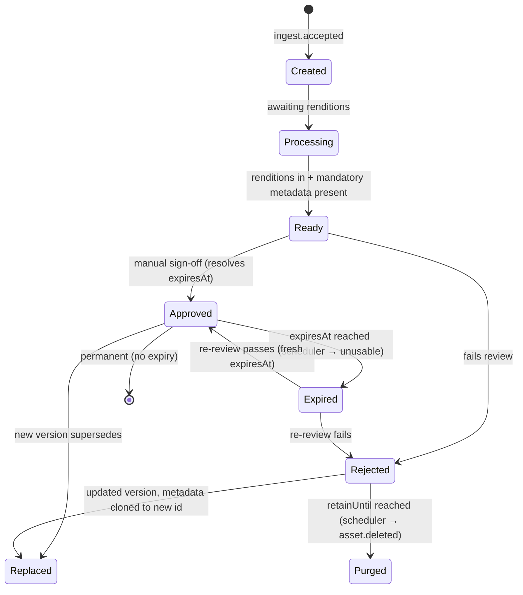

# MAM — Metadata & Asset Management — Service Specification

> System of record for media metadata and the searchable catalog — the busiest domain service.
> Summary card: [Service Catalog §MAM](../03-service-catalog.md#mam--mediametadata--asset-management).
> Template: [services/README](README.md#spec-template).

## 1. Purpose & boundaries

MAM is the **system of record for what an asset is**: its core and extensible metadata, its
renditions' logical references, its classification (tags, categories, subjects), the people
associated with it, and its lifecycle state (created → ready → approved, with **time-bounded
approval** and **rejected-retention** handled by an internal scheduler). It projects all of
this into a **search index** and fronts hot reads with a **cache**. Physical bytes belong to
[HSM](hsm.md); MAM holds the meaning and the catalog.

**In scope:** core metadata (relational); extensible type/category fields (document); field-
schema definitions; versioning + metadata cloning on replacement; tags/categories/subjects and
their controlled vocabularies; **category-inherited media expiry** and the **scheduler** that
expires approvals (→ re-review) and purges retention-expired rejects; the review-verdict record
(with retained history); the **people/cast register**; simple + advanced **faceted** search; the
metadata cache; asset lifecycle events.

**Out of scope:** file location/integrity ([HSM](hsm.md)); encoding ([MTS](mts.md)); who may
see what beyond storing owner/department for authz (enforced with [IAM](iam.md) rules); workflow
orchestration ([BMS](bms.md)); AI inference ([AI](ai-enrichment.md) — MAM records its
*suggestions/results*).

## 2. Requirements covered

- [FR-MAM-1…8](../../requirements/05-functional-requirements.md#mam) — core fields; extensible
  fields + schema editor; tags/description/shot-list; simple + advanced search; mandatory-
  metadata gate; versioning + clone-on-replace; cached reads; derived-vs-entered provenance.
- [FR-TAX-1…6](../../requirements/05-functional-requirements.md#classification) — tags,
  category taxonomy, subjects/controlled vocabularies, faceted filtering, indexing.
- [FR-PPL-1…5](../../requirements/05-functional-requirements.md#people) — people register
  (name/role/optional image), asset-person association, search-by-person, AI-suggestion intake.
- [FR-APP-2/3/5/6/7/8](../../requirements/05-functional-requirements.md#approval) — manual
  approval gate; multi-point review with retained verdict history; **media expiry → re-review**;
  **rejected-retention → purge**; replacement semantics (with [BMS](bms.md)).
- [FR-TAX-7](../../requirements/05-functional-requirements.md#classification) — category default
  expiry inherited by descendant categories/media.
- NFR: [NFR-PERF-2](../../requirements/06-non-functional-requirements.md#performance) (search
  p95 < 500 ms), [NFR-CAP-1](../../requirements/06-non-functional-requirements.md#capacity) (≥5M
  assets), [NFR-CAP-2](../../requirements/06-non-functional-requirements.md#capacity) (≥200
  updates/s), [NFR-CMP-1/1a](../../requirements/06-non-functional-requirements.md#compliance)
  (minimal people PII).

## 3. Domain model

> Full logical model incl. cross-service relations (files, broadcast history, flow): the
> **[Domain Data Model — Asset aggregate](../data-model.md#1-the-asset-aggregate)**. MAM owns the
> rows below.

| Entity | Key fields | Store |
|--------|-----------|-------|
| **Asset** | id, channelId, title, description, mediaType (video/photo/audio/live-event), categoryId, structureId?, state, episodeNo?, durationSec, allowedBroadcastCount?, recommendedBroadcastStart?, recommendedBroadcastEnd?, version, replacesId?, **expiresAt?**, **retainUntil?**, createdBy, createdAt | Relational (core) |
| **AssetExtended** | assetId, type/category-specific fields | Document |
| **FileRef** | fileId → [File](../schemas/file.schema.json), assetId, kind, variant?, plus mirrored `checksum`/`tier`/`sizeBytes`/`technical` for display. A file belongs to **exactly one** asset (no sharing); an asset has many. HSM is SoR — see [Data Model §1.5](../data-model.md#15-files) | Relational |
| **ShotListItem** | id, assetId, startTc, endTc, thumbnailRef?, description | Relational |
| **AssetRelation** | assetId, relatedAssetId, relationType (rush/source-original/derived-from/part-of) | Relational (join) |
| **ReviewVerdict** | id, assetId, verdict (approved/rejected), by (user), at, reason?, reviewPointId?, expiresAt? — **history retained** | Relational |
| **FieldSchema** | id, mediaType/category, field defs (name/type/validation) | Document + relational index |
| **Tag** / **AssetTag** | Tag: id, channelId, label, controlled? · join: assetId, tagId | Relational |
| **Category** | id, channelId, parentId?, path, title, kind (dept/program/season, nests ~20 deep), **inheritable media defaults** (structure/subjects/classification/tags/cast/genre/supply/production — live per-field, cast per-role), **policies** (`keepDuration`→HSM online-retention, `reviewNeeded`, `mediaAddable`), EPG + web-publishing profile — full model in [Data Model §2](../data-model.md#2-the-category-aggregate) | Relational |
| **Structure** | id, channelId, name (animation/drama/news/…) | Relational |
| **Classification** / **AssetClassification** | Classification: id, channelId, label (operator-updatable, many-per-asset) · join: assetId, classificationId | Relational |
| **Subject** / **AssetSubject** | Subject: id, channelId, vocabularyId, term · join: assetId, subjectId | Relational |
| **Person** | id, channelId, name, imageRef? | Relational + object (image) |
| **AssetPerson** (cast & crew) | assetId, personId, roleForAsset, roleClass (on-screen/crew) | Relational (join) |
| **MetadataProvenance** | assetId, field, source (user/AI/technical), confidence? | Relational/document |

Provenance ([FR-MAM-8](../../requirements/05-functional-requirements.md#mam)) keeps
**AI/derived** metadata distinct from **user-entered** — AI never silently overwrites mandatory
fields ([FR-AI-3](../../requirements/05-functional-requirements.md#ai)).

### 3.1 Asset lifecycle



**Review is a manual verdict** ([FR-APP-6](../../requirements/05-functional-requirements.md#approval))
that [BMS](bms.md) can request at multiple points ([FR-APP-5](../../requirements/05-functional-requirements.md#approval));
each verdict is recorded and its history retained. Only a **currently-valid** `Approved` asset
(not `Expired`) is schedulable ([FR-SCH-3](../../requirements/05-functional-requirements.md#scheduling)).
`expiresAt` defaults from the asset's category (nearest ancestor, [FR-TAX-7](../../requirements/05-functional-requirements.md#classification))
and is overridable per asset; absent ⇒ permanent. An **internal scheduler** fires the
`Approved → Expired` (at `expiresAt`) and `Rejected → Purged` (at `retainUntil`) transitions.

## 4. Public API

> **Contracts:** REST → [OpenAPI stub](../openapi/mam.yaml) · events → [payload schemas](../schemas/).

| Method | Path | Purpose | Authz |
|--------|------|---------|-------|
| `GET/POST/PATCH` | `/assets`, `/assets/{id}` | Core + extensible metadata CRUD. | `asset:read`/`asset:write` (dept-scoped) |
| `POST` | `/assets/{id}/versions` | Create a new version (clone metadata on replace). | `asset:write` |
| `POST` | `/assets/{id}/approve` · `/reject` | Lifecycle verdict (approve body MAY set `expiresAt`; reject body MAY set `reason`/`retainUntil`). | `asset:approve` |
| `GET` | `/assets/{id}/verdicts` | Retained review-verdict history for the asset. | `asset:read` |
| `GET` | `/search?q=…` | Simple search. | `asset:read` |
| `POST` | `/search` | Advanced **faceted** search (category + subject + tag + person). | `asset:read` |
| `GET/POST` | `/field-schemas` | Define type/category custom fields. | `metadata:admin` |
| `GET/POST` | `/tags`, `/categories`, `/subjects` | Controlled vocabularies. | `taxonomy:admin` |
| `GET/POST/PATCH` | `/people` | People register. | `people:admin` |
| `POST` | `/assets/{id}/people` | Associate a person + role with an asset. | `asset:write` |

## 5. Messaging

- **Emits:** `asset.created`, `asset.updated`, `asset.ready`, `asset.approved` (with optional
  `expiresAt`), `asset.rejected` (with optional `retainUntil`), `asset.expired` (approval lapsed →
  re-review required), `asset.replaced`, `asset.deleted` (purge after rejected-retention),
  `person.created`, `person.linked`, `taxonomy.updated`.
- **Consumes:** `ingest.accepted` (create asset), `transcode.completed` (attach renditions →
  `asset.ready` when complete), `ai.enrichment.completed` + `ai.suggestion.raised` (record as
  *suggestions/derived*), `file.moved` (mirror location/status). The **internal scheduler**
  (not a broker consumer) fires expiry/purge from stored `expiresAt`/`retainUntil`.

See [Messaging §Asset lifecycle](../04-messaging-and-data.md#asset-lifecycle).

## 6. Key flows

### 6.1 Ready assembly

```mermaid
sequenceDiagram
    participant RIM
    participant MAM
    participant MTS
    participant SRCH as Search index
    RIM->>MAM: ingest.accepted → create Asset (Created)
    MAM->>SRCH: index core fields (asset.created)
    MTS-->>MAM: transcode.completed (renditions[])
    MAM->>MAM: attach renditions; mandatory metadata present?
    MAM->>MAM: → Ready; emit asset.ready
    MAM->>SRCH: update projection
```

### 6.2 Faceted search
Advanced search hits the **search index** (not the relational store) and narrows by multiple
axes at once — category ∧ subject ∧ tag ∧ person — plus free text
([FR-TAX-5](../../requirements/05-functional-requirements.md#classification)). The index is a
**read model** rebuilt by event replay; writes update it via the outbox to avoid dual-write
drift ([Messaging §4.2](../04-messaging-and-data.md#42-consistency)).

### 6.3 Replacement
On replace, MAM **clones** the prior version's metadata to a **new asset id** and emits
`asset.replaced(oldId,newId)` so [Scheduling](scheduling.md) can swap references
([FR-MAM-6](../../requirements/05-functional-requirements.md#mam),
[FR-APP-3](../../requirements/05-functional-requirements.md#approval)).

## 7. Dependencies

- **Data plane:** relational (core), document (extensible), search index (OpenSearch), cache
  (Redis), object storage via HSM for person images.
- **HSM** (rendition location), **MTS** (results), **AI** (suggestions), **broker**.

## 8. Scaling & performance

- **Read-heavy**: scale read replicas + cache; index asynchronously. Search p95 < 500 ms over
  the baseline library ([NFR-PERF-2](../../requirements/06-non-functional-requirements.md#performance));
  ≥5M assets ([NFR-CAP-1](../../requirements/06-non-functional-requirements.md#capacity)); ≥200
  metadata updates/s ([NFR-CAP-2](../../requirements/06-non-functional-requirements.md#capacity)).
- Writes are transactional in relational; document + index updated via outbox.
- Node fits well — pure IO-bound orchestration across four stores; TS types model the extensible
  schema.

## 9. Failure modes & degradation

| Failure | Effect | Mitigation |
|---------|--------|-----------|
| MAM down | **Metadata read/write blocked** (critical path) | HA replicas; cache serves some reads. |
| Search index down/lagging | Search stale/unavailable; core CRUD still works | Rebuildable read model; fall back to relational lookups by id. |
| Cache down | Slower reads | Serve from relational; repopulate. |
| Duplicate consume (at-least-once) | Risk of double-create | Idempotency keyed on `assetId`/`messageId`. |

## 10. Security & data sensitivity

- Resource-level authz: department/channel-scoped rules
  ([FR-IAM-7](../../requirements/05-functional-requirements.md#iam)) enforced here, not just at
  the gateway.
- **People PII is deliberately minimal** — name, role, optional image — for metadata/search
  only, with review/erasure support and no broader biometric profiling
  ([NFR-CMP-1/1a](../../requirements/06-non-functional-requirements.md#compliance),
  [FR-PPL-2](../../requirements/05-functional-requirements.md#people)).
- AI results are stored as **suggestions/derived**, never auto-written to mandatory on-air
  metadata ([FR-AI-3](../../requirements/05-functional-requirements.md#ai)).

## 11. Configuration

Core-field set; per-type/category field schemas; controlled vocabularies (categories, subjects,
roles) editable without deploy ([FR-TAX-4](../../requirements/05-functional-requirements.md#classification));
**per-category default expiry** (absolute date or relative duration, inherited by descendants —
[FR-TAX-7](../../requirements/05-functional-requirements.md#classification)); **rejected-retention
period** before purge ([FR-APP-8](../../requirements/05-functional-requirements.md#approval));
scheduler tick/lookahead for expiry/purge; mandatory-metadata policy per type; cache TTLs;
index/analyzer config (multilingual, RTL).

## 12. Observability

- **Metrics:** read/write rates, search latency (simple/faceted), index lag, cache hit ratio,
  lifecycle transition counts, mandatory-metadata rejection rate, **assets nearing/at expiry,
  re-reviews raised, scheduler lag, rejected-retention purge counts**.
- **Logs:** metadata changes with provenance (user vs AI vs technical).
- **Traces:** ingest→ready and search request spans.

## 13. Implementation notes

- **Node.js + NestJS**; Prisma/`pg` (relational), Mongo driver (document), OpenSearch JS client
  (index), `ioredis` (cache). Outbox table + relay to the broker. Strict TS DTOs shared with
  Studio for the extensible-schema forms.
- Index projections are versioned and rebuildable; keep an offline reindex path.

## 14. Open questions / future

- Vocabulary governance/merge tooling as taxonomies grow.
- Semantic/vector search over AI embeddings (Post-v1.0) — additive to faceted search.
- Bulk-edit + saved-search/collections UX depth.

---
_Related: [HSM](hsm.md) · [MTS](mts.md) · [AI Enrichment](ai-enrichment.md) ·
[Scheduling](scheduling.md) · [Messaging §Asset lifecycle](../04-messaging-and-data.md#asset-lifecycle)._
