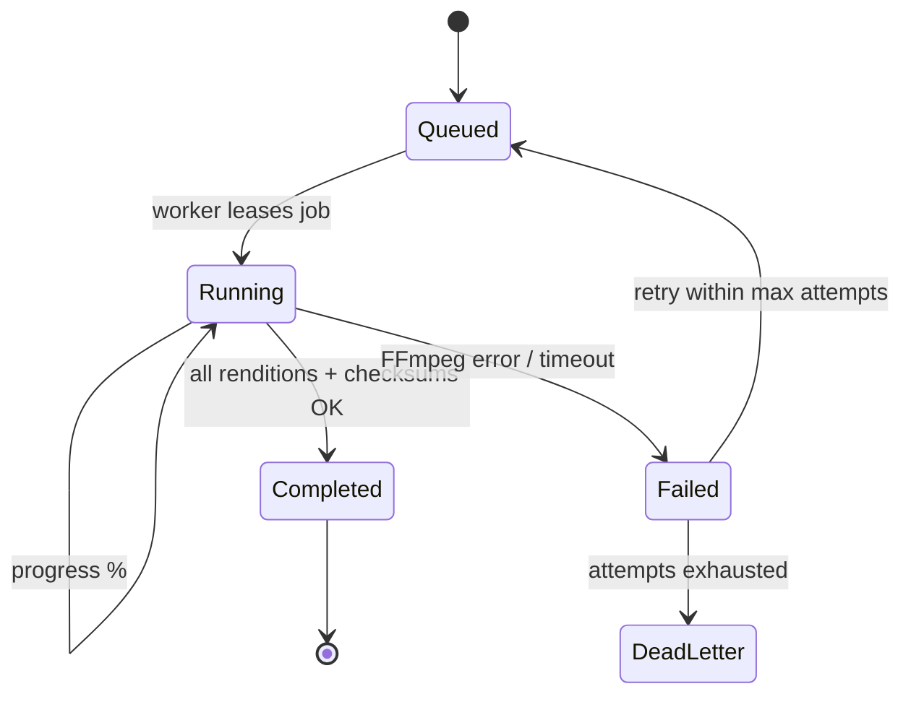
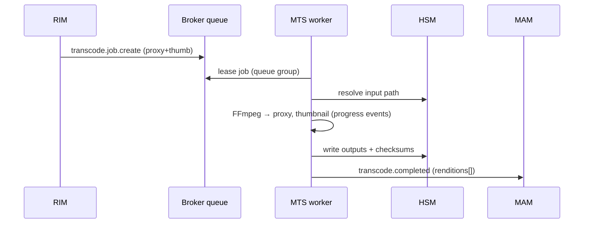

# MTS — Media Transcoding System — Service Specification

> FFmpeg-based transcoding to configured profiles; the canonical scale-to-many service. Summary
> card: [Service Catalog §MTS](../03-service-catalog.md#mts--media-transcoding-system). Template:
> [services/README](README.md#spec-template).

## 1. Purpose & boundaries

MTS turns accepted media into the **rendition set** other parts of Atlas need: proxy, broadcast
(hi-res), thumbnail, VTT scrub filmstrip, and hover preview — plus any channel/type-specific
profiles. It is **queue-driven and elastic**: workers scale up with queue depth and drain away
when idle. The heavy compute is FFmpeg (+GPU); the Node service **supervises** it.

**In scope:** consuming transcode commands; running FFmpeg per profile; producing renditions +
per-rendition checksums; progress/completion/failure events; profile presets; GPU acceleration
where available; server-side **editor render** jobs.

**Out of scope:** where inputs/outputs live ([HSM](hsm.md) provides paths and stores bytes);
what to encode-and-when ([BMS](bms.md)/[RIM](rim.md) decide); metadata ([MAM](mam.md)).

## 2. Requirements covered

- [FR-MTS-1…8](../../requirements/05-functional-requirements.md#transcode) — FFmpeg transcode to
  profiles; proxy+thumbnail at ingest; broadcast + VTT + hover renditions; per-rendition
  checksum; progress/completion events; elastic scaling on queue depth; per-channel/type
  profiles; optional GPU.
- Renders [FR-EDT-2](../../requirements/05-functional-requirements.md#editor) editor output
  server-side.
- NFR: [NFR-PERF-4](../../requirements/06-non-functional-requirements.md#performance) (proxy+thumb
  < 3 min for 10-min HD, 1 GPU worker), [NFR-PERF-5](../../requirements/06-non-functional-requirements.md#performance)
  (±15% linear scaling to 20 workers).

## 3. Domain model

| Entity | Key fields | Store |
|--------|-----------|-------|
| **TranscodeJob** | id, assetId, channelId, presetIds[], inputRef, outputRefs[], state, attempts, node | Queue + relational |
| **Preset/Profile** | id, channelId?, mediaType, target (codec/res/bitrate/container), rules | Relational (config) |
| **RenditionResult** | jobId, kind, path, checksum, size, duration, codecInfo | Relational (then handed to MAM/HSM) |
| **WorkerLease** | jobId, workerId, heartbeatAt | Cache (visibility timeout) |

### 3.1 Job state machine

## 4. Public API

> **Contracts:** REST → [OpenAPI stub](../openapi/mts.yaml) · events → [payload schemas](../schemas/).

Deliberately thin — MTS is queue-driven, not user-facing:

| Method | Path | Purpose | Authz |
|--------|------|---------|-------|
| `POST` | `/jobs` | Enqueue a transcode (normally from BMS/RIM, not users). | Service |
| `GET` | `/jobs/{id}` | Job status/progress. | `asset:read` / service |
| `GET/POST` | `/profiles` | Manage transcode profiles per channel/type. | `config:admin` (read: `config:read`) |
| `GET/PUT` | `/profiles/{id}` | Read or replace one profile; `enabled: false` retires it — never deleted. | `config:admin` |
| `GET` | `/workers` | Current worker topology (for dashboards). | ops |

## 5. Messaging

- **Consumes (commands/events):** `transcode.job.create` (cmd — assetId, preset, in/out; from
  BMS/RIM — a BMS transcode step issues this command), `ingest.accepted` (auto proxy+thumb),
  `editor.render.requested` (cmd — flatten an edit timeline; from the
  [media editor](media-editor.md)).
- **Emits:** `transcode.started` (jobId, assetId), `transcode.progress` (jobId, pct — **best-
  effort**, drives progress bars), `transcode.completed` (assetId, renditions[] + checksums —
  consumed by MAM + HSM), `transcode.failed` (assetId, error — to Notifications/BMS).

See [Messaging §Transcode](../04-messaging-and-data.md#transcode).

## 6. Key flows

### 6.1 Ingest-triggered rendition set

### 6.2 Elasticity
Workers are a **scale-to-many** deployment driven by **queue depth** (KEDA or equivalent):
scale out when the backlog grows, scale in when it drains
([FR-MTS-6](../../requirements/05-functional-requirements.md#transcode)). Each worker leases a
job with a **visibility timeout + heartbeat**; a dead worker's job returns to the queue for
another to pick up (at-least-once → idempotent output naming prevents duplicates).

### 6.3 Editor render
The Studio editor's operations (trim/merge/titles/overlay/audio/image —
[FR-EDT](../../requirements/05-functional-requirements.md#editor)) compile to an FFmpeg/filter
graph rendered here server-side; output lands on the Import page as a new asset version.

## 7. Dependencies

- **FFmpeg (+NVENC/QSV/VAAPI)** — the encoder; **GPU** optional.
- **HSM** — input/output byte paths (never direct storage).
- **Broker** — command queue + events.
- **MAM** — receives rendition results.

## 8. Scaling & performance

- The **canonical elastic service**: stateless workers, queue-group load balancing, autoscale
  on depth. Linear throughput to ~20 workers within ±15%
  ([NFR-PERF-5](../../requirements/06-non-functional-requirements.md#performance)).
- **Language is nearly irrelevant to throughput** here — the work is in FFmpeg/GPU as a
  subprocess; Node just spawns, parses progress, and manages lifecycle. No native escape hatch
  needed.
- Proxy+thumb for a 10-min HD file in **< 3 min on one GPU worker**
  ([NFR-PERF-4](../../requirements/06-non-functional-requirements.md#performance)).
- **Cloud burst** allowed only in connected deployments; air-gapped runs on local workers
  ([FR-PLat-8](../../requirements/05-functional-requirements.md#platform)).

## 9. Failure modes & degradation

| Failure | Effect | Mitigation |
|---------|--------|-----------|
| All workers down | Transcode backlog; **blocks "ready"** (critical path) | Autoscale + alerts; ingest continues, renditions catch up. |
| FFmpeg failure on a file | That job fails | Retry with backoff; DLQ + `transcode.failed` → notify/BMS after max attempts. |
| Worker dies mid-job | Job orphaned | Visibility timeout returns it to the queue; idempotent output naming. |
| GPU unavailable | Slower CPU transcode | Fall back to CPU profiles; scale wider. |

## 10. Security & data sensitivity

- Workers hold no storage credentials — I/O via HSM.
- Media content may be sensitive/embargoed; workers run in the trusted network; outputs
  checksummed and handed to HSM.
- FFmpeg command construction is **input-sanitized** (no shell injection from filenames/metadata).

## 11. Configuration

Profiles per channel/media type (codec/resolution/bitrate/container); the default rendition set;
GPU vs CPU selection + concurrency per worker; autoscale thresholds (queue depth, min/max
workers); retry/backoff + max attempts; cloud-burst enable (connected only).

### 11.1 The profile registry (EP-16.6) — decided

Transcode profiles are a **Tier-1 registry**
([configuration §2.2](../configuration-and-reference-data.md#22-tier-1--registries-the-important-middle)):
the code owns the FFmpeg runner and a **parameter grammar**; an administrator owns the catalogue.

- **Authority is `config:admin`**, scoped by level (configuration §8) — a channel administrator
  writes that channel's profiles; only an unscoped grant writes a platform-wide one (no
  `channelId`). Reading needs `config:read`. This replaces the `transcode:admin` this document
  once named: that permission was in no catalogue and no role, and configuration §8 lists the
  per-area grants that stay finer-grained — transcode is not among them.
- **A profile is a STRUCTURED target, never raw FFmpeg arguments**: a `RenditionKind` (Tier 0 —
  a write naming a kind the code does not declare fails), a container, a video target (codec,
  frame size and fit, frame rate, scan, chroma, bit rate or quality, GPU encoder) and an audio
  target. MTS compiles it to arguments from an allowlist. Raw arguments in an admin-editable field
  would let a profile add an input (`-i /etc/…`), change the muxer or write a side file anywhere
  the process can — an admin page is not a place to hand out a shell.
- **Resolution** when a job names a preset id: the channel's profile of that id, then a
  platform-wide one, then the built-in preset. So `broadcast` can be redefined per channel — a
  house frame rate and 1080i — without the built-in changing for anyone else.
- **Disabled, never deleted**: `enabled: false` hides a profile from new jobs; an enqueue naming
  it is refused. A job resolves its presets when it RUNS, so an edited profile applies to jobs
  still queued, as a re-run would.
- **GPU with CPU fallback**: a profile may ask for an NVENC or QSV encoder. Whether the node can
  actually use it is tested once per process with a one-frame encode (a build that LISTS
  `h264_nvenc` on a node without the card is the common case); if not, the job encodes on the
  CPU and says so in its rendition — mts.md §9's fallback, made visible.
- Every write is audited (`entityType: transcode-profile`) in the transaction of the change.
- **Studio** edits it in the Admin panel's Transcode profiles view: the structured form, MTS's 422
  placed under the field each rule names, a 409 offered as a reload rather than retried, and
  "Redefine for this channel" on a platform profile a channel administrator cannot write.
- **Scaling** past one replica still waits on shared storage (HSM, EP-14): the work area is
  ReadWriteOnce. The lease already lets N workers share the queue.

## 12. Observability

- **Metrics:** queue depth, jobs running/completed/failed, per-profile transcode duration,
  realtime factor, GPU/CPU utilization, worker count, retry/DLQ rate.
- **Logs:** per-job FFmpeg invocation + result; failure stderr (sanitized).
- **Traces:** correlation id from ingest/BMS through render to `transcode.completed`.

## 13. Implementation notes

- **Node.js + NestJS orchestrator** over **FFmpeg** subprocesses (`child_process`/`execa`);
  parse FFmpeg progress (`-progress`) into `transcode.progress` events. Workers are a separate,
  autoscaled deployment consuming the queue group. `fluent-ffmpeg` optional for graph building;
  prefer explicit args for control.
- Idempotent, content-addressed output paths so retries/duplicates converge.

### 13.1 As built — EP-16 first slice (the decisions that differ from the sketch above)

Details and reasons: [`apps/mts/README.md`](../../../apps/mts/README.md).

- **Fastify, from `nx g service`, not NestJS** — the same shape as every other Atlas service.
- **The queue is a table.** `transcode.job.create` becomes a `queued` row (with its seen-mark and
  audit, one transaction) and is acked at once; workers lease rows by compare-and-set. A job that
  lived only as an unacked message could not be read by `GET /jobs/{id}`, counted or resumed, and
  an encode inside the message handler outlives any sane ack deadline.
- **The worker runs in the service's pod**, one job at a time — scaling is more pods (§8), not a
  second deployment. Pinned to **one replica** for now, because inputs and renditions live on a
  ReadWriteOnce work volume until HSM provides shared storage; the code already scales.
- **Retries by cause**: a refusal of the input dead-letters at once, a tool/machine fault backs off
  (30 s doubling) and dead-letters after 3 attempts, a drain requeues with the attempt returned.
  `transcode.failed` only when the platform gives up.
- **Progress is a Progress message, not an Event** (EP-16.4): `transcode.progress` on
  `live.<channel>.transcode.progress`, core NATS, outside the durable stream — never stored,
  replayed or audited (messaging §1.1) — throttled to about one per job per second; and `percent`
  on the job row for anyone who polls. Never through the outbox: a per-tick message there would
  cost what a domain event costs and be hash-chained into the audit log once per tick.
- **Outputs are named by job and preset** (`renditions/<jobId>/<preset>.<ext>`), which gives the
  convergence this section asks of content addressing without hashing a file before it exists.
- **Until HSM**, `inputPath` must resolve inside MTS's own work root; the dev overlay renders a
  sample clip there so the smoke suite can transcode end to end.

## 14. Open questions / future

- Per-scene/segment parallel transcode for very long files.
- HDR/loudness (EBU R128) normalization profiles.
- Editor render farm isolation vs. sharing the ingest transcode pool under load.

---
_Related: [RIM](rim.md) · [HSM](hsm.md) · [MAM](mam.md) ·
[Messaging §Transcode](../04-messaging-and-data.md#transcode)._
