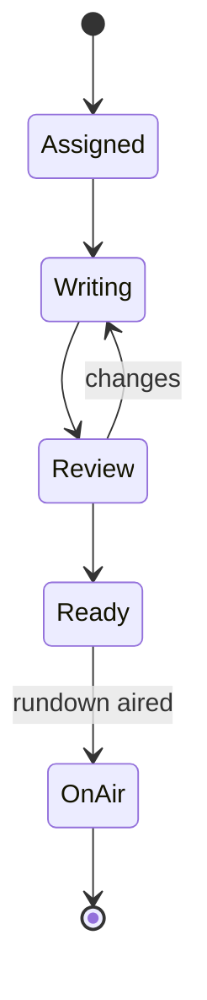

# Newsroom — Service Specification

> Multimedia newsroom workflow: rundowns, stories, scripts, and media association. Summary card:
> [Service Catalog §Newsroom](../03-service-catalog.md#newsroom). Template:
> [services/README](README.md#spec-template).

## 1. Purpose & boundaries

Newsroom is the **editorial front end for news production**: journalists build **rundowns**
(the ordered running order of a bulletin), write **stories** and **scripts** that reference
media assets, ingest wires/feeds, collaborate in real time, and hand a finished rundown to
[Scheduling](scheduling.md) for air. It is **feature-critical for news customers and optional
for others** — a bounded, self-contained domain that reuses the platform's media, search, and
messaging.

**In scope:** rundowns, stories, scripts with media references; assignment + status; wire/feed
intake (via [Integration](integration-feeds.md)); collaborative editing; handoff to Scheduling;
a MOS-style integration surface for newsroom/playout devices.

**Out of scope:** the asset store ([MAM](mam.md)); the program table + send-to-air
([Scheduling](scheduling.md)); the editor renders ([MTS](mts.md)); general chat/tasks
([Notifications](notifications.md)).

## 2. Requirements covered

- [FR-NRC-1…3](../../requirements/05-functional-requirements.md#newsroom) — rundowns/stories/
  scripts with media references; assignment + status tracking; MOS-style device integration
  (Could/Post).
- Consumes classification/people from MAM to find assets; produces rundowns Scheduling can air.
- NFR: real-time collaboration via [WebSocket](websocket.md)
  ([NFR-PERF-3](../../requirements/06-non-functional-requirements.md#performance)).

## 3. Domain model

| Entity | Key fields | Store |
|--------|-----------|-------|
| **Rundown** | id, channelId, date/slot, state, orderedStoryIds[] | Relational |
| **Story** | id, rundownId?, slug, assignee, status, estDuration | Relational |
| **Script** | storyId, body (rich text), mediaRefs[] (assetId + in/out), presenter | Document |
| **WireItem** | id, source, receivedAt, content, usedInStoryId? | Document |
| **Assignment** | storyId, userId, role, dueAt | Relational |

### 3.1 Story status

## 4. Public API

> **Contracts:** REST → [OpenAPI stub](../openapi/newsroom.yaml) · events → [payload schemas](../schemas/).

| Method | Path | Purpose | Authz |
|--------|------|---------|-------|
| `GET/POST/PATCH` | `/rundowns`, `/rundowns/{id}/order` | Rundown CRUD + reordering. | `news:read`/`news:write` |
| `GET/POST/PATCH` | `/stories` | Story CRUD + assignment/status. | `news:write` |
| `GET/PUT` | `/scripts/{storyId}` | Script editing (collaborative). | `news:write` |
| `GET` | `/wires` | Incoming wire/feed items. | `news:read` |
| `POST` | `/rundowns/{id}/handoff` | Send rundown to Scheduling. | `news:send` |

## 5. Messaging

- **Emits:** `story.updated`, `rundown.updated`, `rundown.ready` (→ Scheduling handoff).
- **Consumes:** `asset.ready` (media becomes usable in scripts), `feed.item.received` (wires
  from Integration).

## 6. Key flows

### 6.1 Rundown to air
A rundown of stories (each with a script + media refs) is edited collaboratively; when `Ready`,
handoff creates/updates a [Scheduling](scheduling.md) entry so the bulletin airs through the
same send-to-air path as any schedule. Media referenced in scripts must be **approved** to be
airable ([FR-SCH-3](../../requirements/05-functional-requirements.md#scheduling)).

### 6.2 Collaborative editing
Scripts/rundowns support concurrent editing; changes broadcast via the
[WebSocket service](websocket.md) so the newsroom sees live reordering and status. Conflict
handling is last-write-wins per field with presence indicators (CRDT/OT is a Post-v1.0
consideration).

## 7. Dependencies

- **MAM** (media/search), **Integration** (wires/feeds), **Scheduling** (handoff),
  **WebSocket** (live collab), **relational + document stores**, **broker**.

## 8. Scaling & performance

- **Collaboration-heavy**, modest data volume; scale API replicas; real-time via WebSocket.
- Node fits (IO-bound editorial CRUD + live updates).

## 9. Failure modes & degradation

| Failure | Effect | Mitigation |
|---------|--------|-----------|
| Newsroom down | News production halts (news customers) | HA for news deployments; non-news customers unaffected (optional service). |
| WebSocket down | No live collab | Fall back to polling/refresh; edits still save. |
| Handoff to Scheduling fails | Bulletin not scheduled | Retry; surface error; manual schedule fallback. |

## 10. Security & data sensitivity

- Editorial content can be **embargoed/sensitive** pre-air; access is role-scoped
  (`news:*`) and audited.
- Presenter/contributor names reference the [people register](mam.md) (minimal PII).

## 11. Configuration

Rundown templates + slots per channel; wire sources (via Integration); MOS device endpoints;
assignment/status vocabularies; script formatting/prompter options.

## 12. Observability

- **Metrics:** active rundowns, story status distribution, collab session count, handoff
  success rate, wire intake rate.
- **Logs:** story/rundown transitions, handoffs.
- **Traces:** wire→story→rundown→schedule correlation.

## 13. Implementation notes

- **Node.js + NestJS**; document store for rich script bodies; live collab over the WebSocket
  service. MOS integration is a protocol adapter (Post-v1.0). Rich-text stored as structured
  content, not raw HTML.

## 14. Open questions / future

- Depth of MOS integration (which devices/objects) — currently Could/Post
  ([FR-NRC-3](../../requirements/05-functional-requirements.md#newsroom)).
- CRDT/OT for true concurrent script editing.
- Teleprompter / lower-third automation and social-first story variants.

---
_Related: [MAM](mam.md) · [Scheduling](scheduling.md) · [Integration / Feeds](integration-feeds.md) ·
[WebSocket](websocket.md)._
