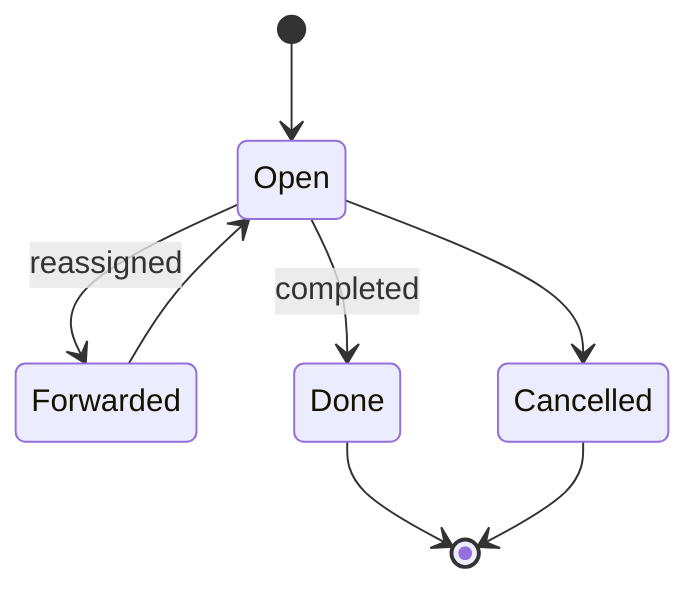
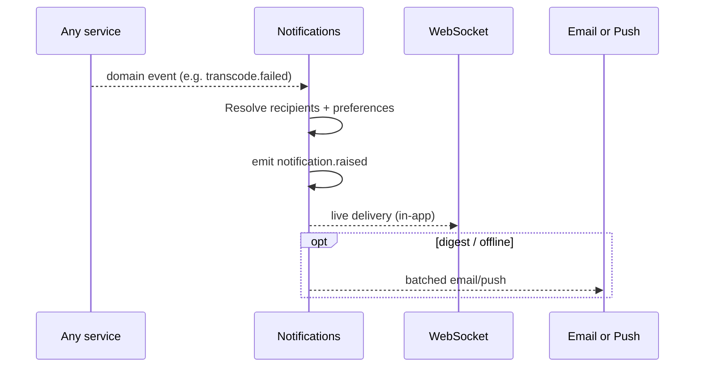

# Notifications & Messaging — Service Specification

> System notifications **and** user↔user/group messaging and tasks — unified because both are
> permission-aware delivery. Summary card:
> [Service Catalog §Notifications](../03-service-catalog.md#notifications--messaging). Template:
> [services/README](README.md#spec-template).

## 1. Purpose & boundaries

This service owns everything that lands in a user's **inbox**: assigned **tasks**, direct and
group **messages**, and **system notifications** (job done, approval needed, mention). It is
unified because tasks, messages, and notifications are all "deliver this to the right people,
respecting permissions, live and/or by digest". Live delivery rides the
[WebSocket service](websocket.md); optional email/push handles digests.

**In scope:** inbox; tasks (assign/forward/complete); direct + group messages; system
notifications with per-user preferences; delivery routing (live via WebSocket, digest via
email/push).

**Out of scope:** *deciding* a task exists ([BMS](bms.md) creates workflow tasks; MAM/MTS/HSM
raise events that become notifications); the live transport itself ([WebSocket](websocket.md));
identity/permissions ([IAM](iam.md)).

## 2. Requirements covered

- [FR-MSG-1…4](../../requirements/05-functional-requirements.md#messaging) — inbox of tasks +
  messages; send/receive/forward to users or groups; notifications for relevant events; live
  via WebSocket + optional email/push digest.
- Delivers tasks from [FR-APP-1](../../requirements/05-functional-requirements.md#approval)
  (review→task) and [FR-BMS-5](../../requirements/05-functional-requirements.md#workflow)
  (human-in-the-loop steps).
- NFR: non-critical to the media path but important to UX
  ([Architecture §8](../02-system-architecture.md#8-failure-and-degradation-model)).

## 3. Domain model

| Entity | Key fields | Store |
|--------|-----------|-------|
| **Message** | id, channelId, from, to (users/groups), body, threadId?, sentAt | Relational |
| **Task** | id, channelId, assignee, kind, subjectRef (assetId/instanceId), state, dueAt, forwardOf? | Relational |
| **Notification** | id, userId, type, subjectRef, read, createdAt | Relational |
| **InboxState** | userId, unreadCounts, lastSeen | Relational + cache |
| **Preference** | userId, per-type channel (live/email/push), digest cadence | Relational |

### 3.1 Task state

## 4. Public API

> **Contracts:** REST → [OpenAPI stub](../openapi/notifications.yaml) · events → [payload schemas](../schemas/).

| Method | Path | Purpose | Authz |
|--------|------|---------|-------|
| `GET` | `/inbox` | Unified inbox (tasks + messages + notifications). | self |
| `GET/POST` | `/messages` | List/send direct or group messages. | `message:send` |
| `GET/POST/PATCH` | `/tasks`, `/tasks/{id}` | Create/list/update; forward or complete. | assignee/creator |
| `PATCH` | `/notifications/{id}` | Mark read/dismiss. | self |
| `GET/PUT` | `/preferences` | Per-user delivery preferences. | self |

## 5. Messaging

- **Emits:** `message.sent`, `task.created`, `task.updated`, `notification.raised` — consumed by
  the [WebSocket service](websocket.md) for live delivery.
- **Consumes (to raise notifications):** many — `asset.approved`, `asset.rejected`,
  `workflow.task.created`, `transcode.failed`, `ingest.rejected`, `restore.completed`,
  `checksum.mismatch`, mentions, etc.

## 6. Key flows

### 6.1 Event → notification → live + digest

### 6.2 Task assignment & forwarding
A reviewer assigns media to another user ([FR-APP-1](../../requirements/05-functional-requirements.md#approval))
or BMS creates a workflow task; the assignee sees it in the inbox live, can **forward** it, and
**complete** it — completion signals [BMS](bms.md) where the task came from a workflow.

## 7. Dependencies

- **WebSocket** (live delivery), **IAM** (recipient resolution + permissions), **BMS**
  (workflow tasks), **broker**, **relational store**, optional **SMTP/push provider** (digest;
  external → disabled in air-gapped per [FR-PLat-8](../../requirements/05-functional-requirements.md#platform)).

## 8. Scaling & performance

- **Stateless API + broker-backed delivery**; scale replicas. Fan-in of many event types →
  recipient resolution is the main cost (cache group memberships).
- Node fits (IO-bound). Email/push are async workers.

## 9. Failure modes & degradation

| Failure | Effect | Mitigation |
|---------|--------|-----------|
| Service down | No new inbox items | Non-critical to media path; events are durable and processed on recovery. |
| WebSocket down | No live pop-ups | Items still appear on inbox refresh; digest still sends. |
| Email/push provider down | No digests | Retry/queue; in-app delivery unaffected; disabled entirely when air-gapped. |
| Duplicate event | Duplicate notification | Idempotency keyed on source `messageId` + recipient. |

## 10. Security & data sensitivity

- Recipients resolved via **effective permissions** — a notification must not reveal a resource
  the user can't access; message content is private to participants.
- Email/push is an **external** channel → per-deployment opt-in, off in air-gapped installs.
- Message content and read state are audited minimally (metadata, not necessarily body).

## 11. Configuration

Notification-type catalog + default routing; per-user preferences + digest cadence; email/push
provider (connected deployments only); group-message policies; retention for
messages/notifications.

## 12. Observability

- **Metrics:** notifications raised/delivered, task open/complete/forward rates, inbox unread
  distribution, email/push success, delivery latency.
- **Logs:** task lifecycle, delivery attempts/results.
- **Traces:** source-event correlation id through to delivery.

## 13. Implementation notes

- **Node.js + NestJS/Fastify**; broker consumers for event→notification; async worker for
  email/push (`nodemailer`/provider SDK). Cache group memberships (from IAM) for fast recipient
  fan-out. Reuse the [WebSocket](websocket.md) private-channel model for live delivery.

## 14. Open questions / future

- Threaded conversations / read receipts depth.
- Escalation rules for overdue workflow tasks (SLA-driven re-notify).
- Mobile push app vs. web push only.

---
_Related: [WebSocket](websocket.md) · [BMS](bms.md) · [IAM](iam.md) ·
[Messaging & Data](../04-messaging-and-data.md)._
