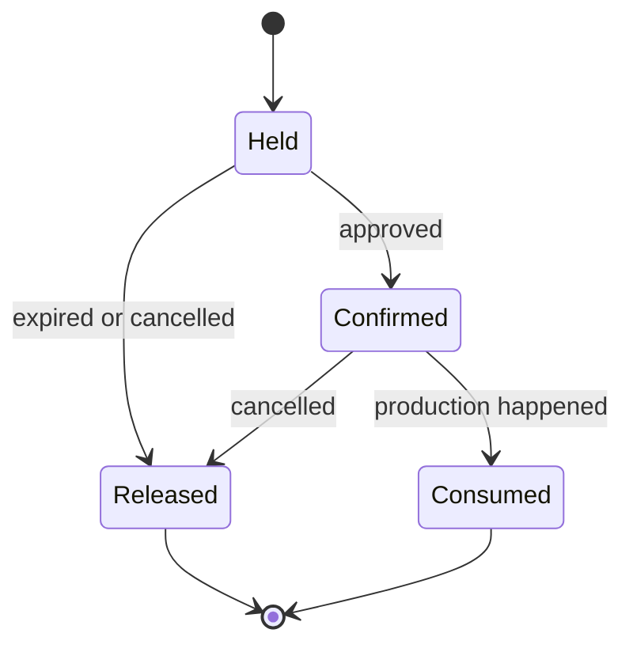
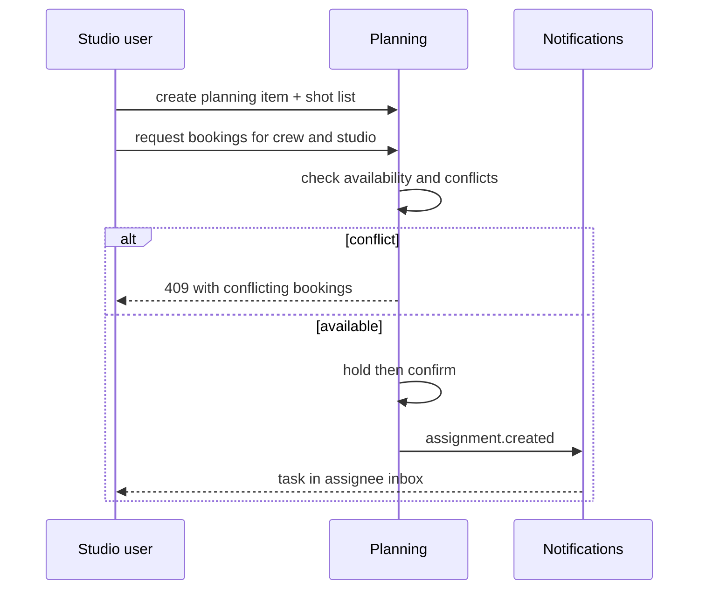

# Planning & Resource Scheduling — Service Specification

> Pre-production: projects, editorial planning, assignments, and the booking of people,
> facilities, and equipment. **New in the [lifecycle expansion](../../strategy/19-production-lifecycle-scope.md)
> — primarily v2.0**, with the news subset in v1.0. Template:
> [services/README](README.md#spec-template).

## 1. Purpose & boundaries

Planning owns everything that happens **before** media exists: what the organisation intends to
make, who will make it, when, and with which resources. Its outputs are structured commitments —
a booking, an assignment, a shot list — that later stages consume.

**In scope:** projects/productions; editorial and coverage planning (stories, events); briefs
and assignments; **resource scheduling** (crew, studios, edit suites, cameras, vehicles, rooms)
with conflict detection; availability; call sheets; script breakdown into requirements; shot
lists; lightweight cost tracking against rate cards.

**Out of scope:** the **program table / playlist** — that is the existing
[Scheduling service](scheduling.md) and a completely different domain
([see the naming warning](../../strategy/19-production-lifecycle-scope.md#21-two-different-things-called-scheduling));
**full budgeting/accounting** and **HR/payroll** (integrate at the boundary); script *writing*
for long-form (integrate Final Draft/Celtx); storyboard *drawing*; the media itself
([MAM](mam.md)).

## 2. Requirements covered

- [FR-PLN-1…12](../../requirements/05-functional-requirements.md#planning) — projects, planning
  items, assignments, resources and bookings, conflict detection, availability, call sheets,
  breakdown, shot lists, cost tracking, and the Planning→Scheduling link.
- Feeds [FR-PRD](../../requirements/05-functional-requirements.md#production) (shot logging
  against the shot list) and the news planning path used by [Newsroom](newsroom.md).
- NFR: standard platform targets; **not** on the media critical path.

## 3. Domain model

| Entity | Key fields | Store |
|--------|-----------|-------|
| **Project** | id, channelId, title, type (production/coverage/series), state, window, ownerId | Relational |
| **PlanningItem** | id, projectId?, kind (story/event/programme), title, plannedFor, status, coverageNotes | Relational |
| **Assignment** | id, planningItemId, assigneeRef (user/group), role, brief, dueAt, state | Relational |
| **Resource** | id, channelId, kind (person/facility/equipment/vehicle), name, attributes, availabilityRules | Relational |
| **Booking** | id, resourceId, projectId/planningItemId, from, to, state (held/confirmed/released) | Relational |
| **ScriptBreakdown** | id, scriptRef, elements[] (kind: cast/prop/location/vfx, label, sceneRef) | Document |
| **ShotListEntry** | id, planningItemId, order, description, sceneRef, requiredResourceIds[], capturedAssetIds[] | Relational |
| **RateCard / CostLine** | id, scope, unit, rate; estimated vs actual per project | Relational |

`projectId` is reserved as a **first-class scope alongside `channelId`** in MAM/BMS from v1.0
so planning attaches to existing entities without a migration
([lifecycle §6](../../strategy/19-production-lifecycle-scope.md#6-delivery-consequence-this-is-a-v20-horizon)).

### 3.1 Booking state

**Conflict detection is the service's defining logic**: a resource cannot be double-booked for
overlapping intervals unless its `availabilityRules` permit shared use. Holds expire so
provisional planning does not lock resources forever.

## 4. Public API

> **Contracts:** REST → [OpenAPI stub](../openapi/planning.yaml) · events → [payload schemas](../schemas/).

| Method | Path | Purpose | Authz |
|--------|------|---------|-------|
| `GET/POST/PATCH` | `/projects` | Project CRUD. | `planning:read`/`planning:write` |
| `GET/POST/PATCH` | `/planning-items` | Stories/events/programmes being planned. | `planning:write` |
| `GET/POST/PATCH` | `/assignments` | Assign work with a brief and due date. | `planning:assign` |
| `GET/POST` | `/resources` | Crew, facilities, equipment registry. | `planning:admin` |
| `GET` | `/resources/availability` | Availability query over a time window. | `planning:read` |
| `POST` | `/bookings` | Book a resource (returns 409 on conflict). | `planning:book` |
| `PATCH` | `/bookings/{id}` | Confirm/release a booking. | `planning:book` |
| `GET` | `/planning-items/{id}/call-sheet` | Generated call sheet. | `planning:read` |
| `GET/POST` | `/breakdowns`, `/shot-lists` | Script breakdown and shot lists. | `planning:write` |
| `POST` | `/planning-items/{id}/promote-to-schedule` | Create/link a program-table slot. | `schedule:write` |

## 5. Messaging

- **Emits:** `project.created`, `planning.item.updated`, `assignment.created`,
  `assignment.completed`, `booking.confirmed`, `booking.conflict.detected`,
  `shotlist.updated`, `planning.promoted-to-schedule`.
- **Consumes:** `asset.created`/`asset.ready` (link captured footage back to the shot list /
  planning item), `task.updated` (assignment progress from [Notifications](notifications.md)),
  `schedule.updated` (reconcile a promoted slot).

## 6. Key flows

### 6.1 Plan to booked resources

### 6.2 Planning to broadcast schedule
A planned programme can **pre-populate a program-table slot** before its media exists — the
loop that makes the "one spine" claim real
([lifecycle §5](../../strategy/19-production-lifecycle-scope.md#5-where-the-completed-media-rejoins-the-existing-platform)).
The slot references the planning item; when a finished asset is later approved, it fills the
slot. [Scheduling](scheduling.md) still enforces approved-and-not-expired at export
([FR-SCH-3](../../requirements/05-functional-requirements.md#scheduling)).

### 6.3 Breakdown to requirements
Tagging a script's elements (cast, props, locations, VFX) generates the **requirement set** that
resource scheduling consumes — the cheapest, highest-value piece of pre-production glue, and the
reason breakdown is built rather than only integrated.

## 7. Dependencies

- **IAM** (people as assignees/resources), **Notifications** (assignment delivery),
  **Scheduling** (promote-to-slot), **MAM** (captured footage linkage), **Newsroom** (news
  planning shares planning items), **broker**, relational + document stores.
- **External (integrate):** HR for contracts/payroll; finance/ERP for budgets; Final Draft/Celtx
  (FDX/Fountain) for long-form scripts.

## 8. Scaling & performance

Low volume, high value — hundreds of bookings/day, not thousands/second. Standard stateless API
replicas. The only non-trivial computation is **interval-overlap conflict detection**; use
range types/exclusion constraints in PostgreSQL so the database enforces non-overlap rather than
application code racing.

## 9. Failure modes & degradation

| Failure | Effect | Mitigation |
|---------|--------|-----------|
| Planning down | No new planning/bookings | **Not on the media critical path**; ingest→air unaffected. |
| Concurrent booking race | Double-booking | DB-level exclusion constraint, not app-level checks. |
| Stale holds | Resources appear busy | Holds auto-expire. |
| Promote-to-schedule fails | Slot missing | Retry; planning item retains intent; manual slot creation as fallback. |

## 10. Security & data sensitivity

- **Staffing data is people data.** Keep it minimal — availability and role, *not* HR records,
  salary, or personal contact beyond what a call sheet needs; PII tagged for retention/erasure
  ([NFR-SEC-8](../../requirements/06-non-functional-requirements.md#security--privacy)).
- Unannounced projects can be **commercially sensitive** — project-scoped permissions, and
  planning items support restricted visibility.
- Cost data is restricted to a finance-facing role.

## 11. Configuration

Resource kinds + attribute schemas; availability rule templates (shifts, maintenance windows);
hold expiry; booking approval policy; call-sheet templates; rate cards; per-channel project
types; whether promote-to-schedule is enabled.

## 12. Observability

- **Metrics:** bookings created/confirmed/conflicted, utilisation per resource kind, assignment
  cycle time, planned-vs-aired conversion rate, holds expired.
- **Logs:** booking and assignment changes with actor.
- **Traces:** planning item → assignment → captured asset → schedule slot.

## 13. Implementation notes

- **Node.js + NestJS**; PostgreSQL **`tstzrange` + GiST exclusion constraints** for
  conflict-free bookings (the single most important implementation choice here); document store
  for breakdown element trees. iCalendar (RFC 5545) export for bookings so crew calendars
  subscribe. Call sheets render server-side to PDF.

## 14. Open questions / future

- Depth of long-form breakdown vs. integrating Movie Magic/StudioBinder.
- Whether crew availability syncs bidirectionally with external HR/rostering.
- Multi-project resource optimisation (suggesting schedules) — a later, AI-assisted possibility.

---
_Related: [Scheduling](scheduling.md) (broadcast, distinct) · [Newsroom](newsroom.md) ·
[Editorial](editorial.md) · [Lifecycle Scope](../../strategy/19-production-lifecycle-scope.md)._
