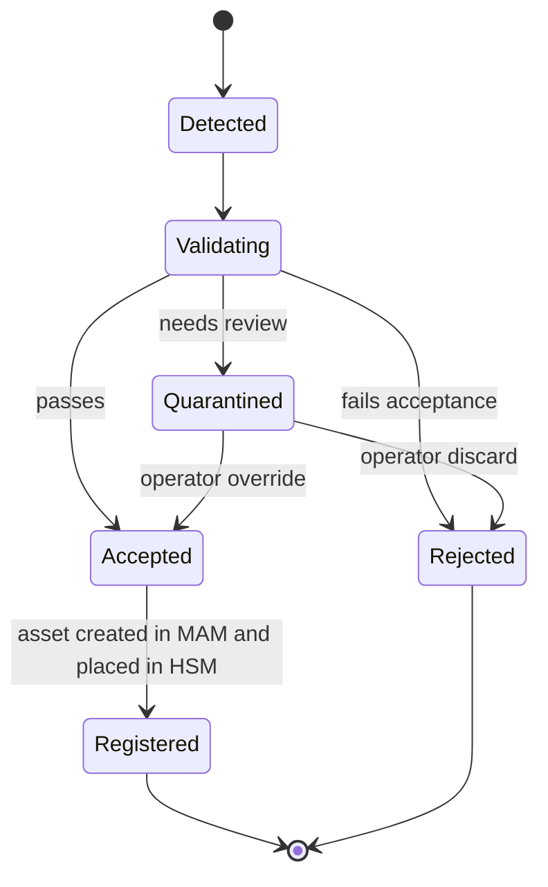
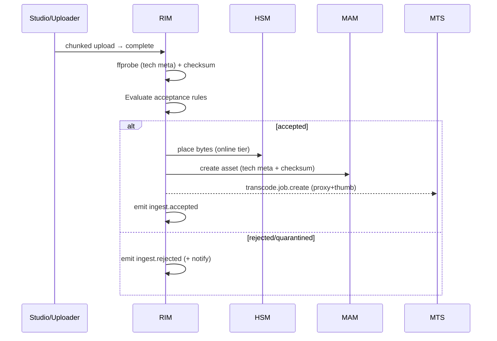

# RIM — Recording & Ingest Management — Service Specification

> The entry point: brings media in from files, watchers, FTP/upload, and recording. Summary
> card: [Service Catalog §RIM](../03-service-catalog.md#recording--ingest-management-rim).
> Template: [services/README](README.md#spec-template).

## 1. Purpose & boundaries

RIM is how bytes **enter** Atlas. It detects or receives incoming media, validates it against
per-source **acceptance rules**, extracts technical metadata, computes an initial checksum, asks
[HSM](hsm.md) to place the bytes, creates the asset in [MAM](mam.md), and requests the first
proxy+thumbnail from [MTS](mts.md). It also **records** live streams/broadcasts and segments
them into files.

**In scope:** web/chunked upload endpoints; FTP and folder-watch sources; stream/broadcast
recording + segmentation; acceptance-rule evaluation; technical-metadata extraction (ffprobe);
initial checksum; ingest queue + quarantine; the Ingest/Import page's backing API.

**Out of scope:** where bytes physically live and integrity over time ([HSM](hsm.md)); the
rendition set beyond kicking off the first proxy ([MTS](mts.md)); the metadata system of record
([MAM](mam.md)); business workflow around approval ([BMS](bms.md)).

## 2. Requirements covered

- [FR-ING-1…7](../../requirements/05-functional-requirements.md#ingest) — upload/FTP/watch,
  resumable uploads, recording+segmentation, acceptance rules, reject/quarantine with reason +
  notification, technical metadata + checksum on accept, and appearance on the Ingest page.
- Feeds [FR-HSM-4](../../requirements/05-functional-requirements.md#hsm) (ingest-time checksum),
  [FR-MTS-2](../../requirements/05-functional-requirements.md#transcode) (initial proxy+thumb).
- NFR: [NFR-PERF-6](../../requirements/06-non-functional-requirements.md#performance) (≥100
  items/hour sustained), [NFR-PERF-4](../../requirements/06-non-functional-requirements.md#performance)
  (proxy+thumb < 3 min, via MTS).

## 3. Domain model

| Entity | Key fields | Store |
|--------|-----------|-------|
| **IngestJob** | id, channelId, source, state, receivedPath, size, techMeta, checksum, reason?, assetId? | Relational |
| **Source** | id, channelId, kind (upload/ftp/watch), connection config, enabled | Relational |
| **Recorder** | id, channelId, input (SDI/stream URL), segmentDuration, schedule, state | Relational |
| **AcceptanceRuleSet** | id, channelId, scope (source/type), rules[] (container, minSize, aspect, …) | Relational |
| **Segment** | recorderId, index, path, tcIn/tcOut, checksum | Relational |

### 3.1 Ingest state machine

## 4. Public API

> **Contracts:** REST → [OpenAPI stub](../openapi/rim.yaml) · events → [payload schemas](../schemas/).

| Method | Path | Purpose | Authz |
|--------|------|---------|-------|
| `POST` | `/uploads` | Start a chunked/resumable upload; returns an upload id. | `ingest:write` |
| `PUT` | `/uploads/{id}/parts/{n}` | Upload a chunk (resumable). | `ingest:write` |
| `POST` | `/uploads/{id}/complete` | Finalize → creates an IngestJob. | `ingest:write` |
| `GET` | `/ingest/queue` | The Ingest/Import page listing. | `ingest:read` |
| `POST` | `/ingest/{id}/accept` · `/reject` | Manual disposition of a quarantined job. | `ingest:approve` |
| `GET/POST` | `/watchers`, `/recorders`, `/acceptance-rules` | Source/recorder/rule administration. | `ingest:admin` |

## 5. Messaging

- **Emits:** `ingest.detected` (source, path, size), `ingest.accepted` (assetId, tech metadata,
  checksum — the fan-out that triggers MAM/MTS/AI), `ingest.rejected` (reason, rule),
  `recording.segment.completed` (recorderId, segment).
- **Consumes:** `acceptance-rules.updated` (reload rules). Recording schedules may be driven by
  [Scheduling](scheduling.md)/[BMS](bms.md) commands.
- **Commands issued (sync/async):** HSM place-file; MAM create-asset; MTS
  `transcode.job.create` for the initial proxy+thumbnail.

See [Messaging §Ingest](../04-messaging-and-data.md#ingest).

## 6. Key flows

### 6.1 Upload → accepted asset

### 6.2 Recording & segmentation
A recorder captures an SDI/stream input via an FFmpeg process, writing rolling segments of the
configured duration ([FR-ING-3](../../requirements/05-functional-requirements.md#ingest)); each
completed segment becomes an ingest job (checksum + place + register) and emits
`recording.segment.completed`. Segmentation is crash-safe: a partially written segment is
finalized or discarded on restart.

## 7. Dependencies

- **HSM** — place incoming bytes; RIM never writes storage directly
  ([FR-HSM-5](../../requirements/05-functional-requirements.md#hsm)).
- **MAM** — create the asset record.
- **MTS** — first proxy+thumbnail.
- **FFmpeg/ffprobe** — technical metadata + capture/segmentation.
- **Relational store**, **broker**, **Notifications** (reject alerts).

## 8. Scaling & performance

- **Upload endpoints scale statelessly**; large files are chunked/resumable
  ([FR-ING-2](../../requirements/05-functional-requirements.md#ingest)) and streamed to HSM to
  bound memory.
- **Watchers are singletons per source** (one owner per watched folder to avoid double-pickup —
  use a leader lock).
- **Recorders scale per capture channel** (one process per input).
- Sustains **≥100 items/hour** without queue growth
  ([NFR-PERF-6](../../requirements/06-non-functional-requirements.md#performance)); checksum +
  ffprobe are the per-item cost — offload hashing to worker-threads.

## 9. Failure modes & degradation

| Failure | Effect | Mitigation |
|---------|--------|-----------|
| HSM unavailable | Can't place bytes → ingest stalls | Queue jobs in `Accepted`, retry; alert (critical path). |
| MTS backed up | Proxies late, asset still registered | Ingest doesn't block on transcode; proxy arrives later. |
| Watcher double-pickup | Duplicate ingest | Leader lock + idempotency on source path + checksum. |
| Recorder crash mid-segment | Partial file | Finalize/discard on restart; segment checksummed before registration. |
| Malformed/oversized upload | Rejected | Acceptance rules + size caps; quarantine with reason. |

## 10. Security & data sensitivity

- Upload endpoints are authenticated and size/type-limited; scanned per acceptance rules.
- FTP credentials and watcher paths are secrets (vault) — RIM holds source connection config,
  not storage credentials (those stay in HSM).
- All dispositions audited (who accepted/rejected what, and why).

## 11. Configuration

Per-channel sources (upload/FTP/watch) and their connection details; acceptance rule sets
(container/format, min size, aspect-ratio match, custom checks —
[FR-ING-4](../../requirements/05-functional-requirements.md#ingest)); recorder inputs, segment
durations, and recording schedules; chunk size + resumable-upload TTL; quarantine policy.

## 12. Observability

- **Metrics:** ingest rate (items/hour), accept/reject/quarantine ratios, time-to-register,
  checksum+ffprobe duration, watcher lag, recorder health, upload throughput/resume rate.
- **Logs:** every disposition with reason and rule id.
- **Traces:** correlation id from upload/detect through place→register→proxy.

## 13. Implementation notes

- **Node.js + NestJS** with worker processes/threads. Streamed chunked upload (`busboy`/tus-
  style resumable); `child_process` around **ffprobe/FFmpeg** for metadata and capture;
  worker-threads for checksum on large files (escape hatch to a native hasher only if profiling
  demands). `chokidar`/native inotify for folder watch behind a leader lock.
- Stream bytes to HSM rather than buffering whole files.

## 13a. As built (EP-15.1)

`apps/rim` — Fastify, not NestJS, like every other service here. The upload is the first arrow of
§6.1 and FR-ING-2, with one decision the stub left open made explicit: **the server sizes the parts.**
`POST /uploads` answers with `partSizeBytes` (8 MiB, `ATLAS_UPLOAD_PART_BYTES`) and `partCount`;
every part but the last is exactly that long, and a part of any other length is refused before it
is stored. `GET /uploads/{id}` lists the parts held, so a resume needs no client-side bookkeeping;
a part sent again wins; completion with a hole is a 409 that names the holes. Completion assembles
in part order, hashing the bytes written — the job's `checksum` is of those — and commits the
`IngestJob` (state `detected`), `ingest.detected` and the `audit.recorded` delta in one
transaction; asking again returns the same job. Staging is a volume of RIM's own, swept on the
resumable-upload TTL (§11), and the received file waits there for HSM: RIM does not write storage
(FR-HSM-5). The tus protocol was not adopted — the three-verb shape above is what Studio's
uploader (EP-20.3, progress in the EP-20.8 tray) needs, and the gateway carries only a per-prefix body cap for it.
`apps/rim/README.md` has the semantics and the configuration.

**EP-15.3 acceptance, EP-15.6 the queue and review.** Validation follows completion as its own
transaction, guarded by the state it read, so the request's validator and the recovery loop's
cannot both apply a verdict; a job left `detected` by a crash is picked up by the sweep tick.
The `AcceptanceRuleSet` of §3 is as designed — per channel, scoped to every job, a source kind or
a source, `rules[]` — with the vocabulary `container` / `minSizeBytes` / `maxSizeBytes` /
`aspectRatio` (a Tier-0 enum, in `rim.yaml`), each rule saying whether failing it rejects or
quarantines; the worst failure decides. One thing §3.1 left implicit is now explicit: a rule
that cannot be evaluated from what is known quarantines rather than passes. The review is
`accept`/`reject` on a `quarantined` job only. `ingest.rejected` is emitted for a hold
and a refusal alike (`quarantined` says which); `ingest.accepted` waits for 15.5, since its
contract carries MAM's `assetId`. Rejected bytes are discarded from staging; the row is the
record. The §4 table's `/ingest/queue` is a keyset page, and `GET /ingest/{id}` was added for the
uploader to poll. Studio's Ingest panel is switched on against it.

**EP-15.4 the probe.** `Validating` is persisted as §3.1 draws it: the job is taken there
(guarded by `detected`), ffprobe reads the received file as a child process outside any
transaction — §13's `child_process` around ffprobe, not a worker pool; the checksum is already
computed while the parts are assembled, so nothing here needs a worker thread — and the verdict
commits guarded by `validating`. The report becomes `TechnicalMetadata` (the `$def` §5's
`ingest.accepted` carries) on the job. What the tool says about the bytes is a verdict — a file
it refuses is quarantined with its words — and what goes wrong with the tool is not: the job
stays `validating`, readiness shows it, the loop retries. ffprobe ships in RIM's image only
(`APK_PACKAGES=ffmpeg`); §9's "malformed upload → rejected" is, as built, "held for a person".

**EP-15.2 folder watchers.** A `Source` of kind `watch` (§3) is a `Watcher` at `/watchers`
(`ingest:admin`, audited, disabled not deleted). Four decisions this document left open:
**polling, not the inotify §13 suggests** — a drop folder is usually a network share, and inotify
on one sees only this host's writes; **settled** means size and mtime unchanged for the watcher's
`settleSeconds`, re-checked after the copy; the **leader lock** of §8 is a lease row per watcher
(holder, expiry) taken by compare-and-set and renewed each scan, because a rolling update runs two
pods at once; and §9's **"idempotency on source path + checksum"** is a pickup ledger keyed
(watcher, name, checksum) committed in the job's transaction, with size and mtime kept so a file
already taken is not read again, and the source removed only after the commit. The watch root is
shared by every channel, so a watcher's path is relative to `<root>/<channelId>/` and contained on
the real path — a channel administrator cannot watch another channel's drops, by symlink or
otherwise. A watched file becomes the same `IngestJob` a completed upload does. The audit trail of
RIM's administration — watchers and acceptance rule sets — reads under `ingest:admin` in the log.

## 14. Open questions / future

- Growing-file / while-recording ingest (edit-while-ingest) — Post-v1.0.
- Live stream ingest (SRT/RTMP/RIST) breadth and hardware SDI capture matrix.
- Pre-ingest virus/content scanning hook for untrusted upload sources.

---
_Related: [HSM](hsm.md) · [MTS](mts.md) · [MAM](mam.md) ·
[Messaging §Ingest](../04-messaging-and-data.md#ingest)._
