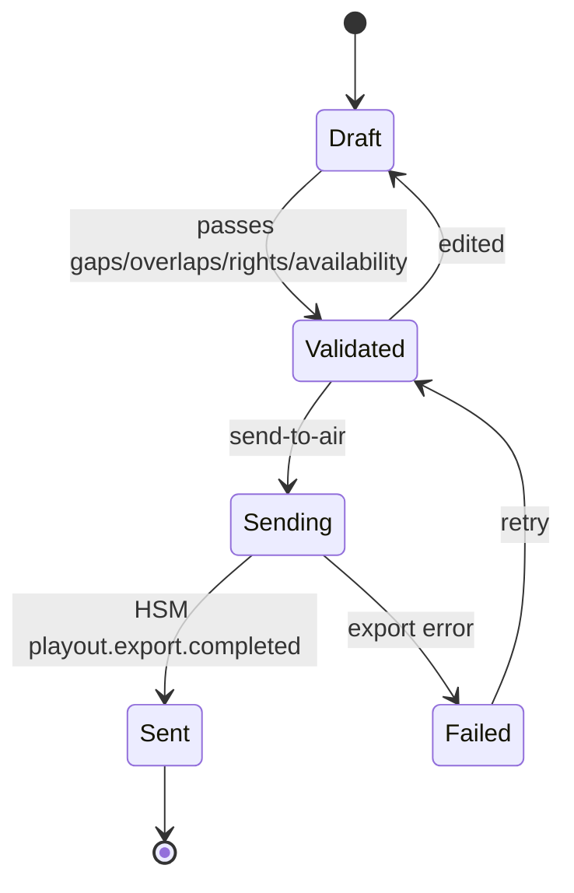
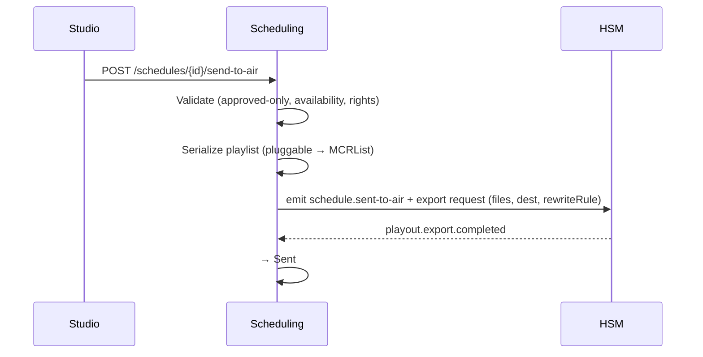

# Scheduling — Service Specification

> Builds and edits program tables and drives send-to-air hand-off. Summary card:
> [Service Catalog §Scheduling](../03-service-catalog.md#scheduling). Template:
> [services/README](README.md#spec-template).

## 1. Purpose & boundaries

Scheduling owns the **program table** per channel — the ordered, time-stamped list of what airs
when — and drives **send-to-air**: it validates a schedule, serializes the playlist into a
third-party format, and asks [HSM](hsm.md) to deliver hi-res files + that playlist to the
control room. It is the source of the **playlist format contract**; HSM is the transport.

**In scope:** program-table CRUD per channel (time zones, local calendars); schedule validation
(gaps/overlaps, rights windows, rendition availability); the **pluggable playlist serializer**
(first target [Cinegy Air MCRList](../../integrations/14-playout-mcrlist-format.md)); triggering
send-to-air; feeding EPG export (via [Integration](integration-feeds.md)).

**Out of scope:** copying bytes / path rewrite mechanics ([HSM](hsm.md) executes those); driving
playout/CG hardware — a "channel-in-the-box" is **out of scope**
([FR-SCH-7](../../requirements/05-functional-requirements.md#scheduling),
[D1](../../01-technical-brief.md#9-resolved-decisions)); approval of media ([MAM](mam.md)/[BMS](bms.md)).

## 2. Requirements covered

- [FR-SCH-1…7](../../requirements/05-functional-requirements.md#scheduling) — program-table
  CRUD; gap/overlap + rendition-availability validation; **approved-only** scheduling; copy
  hi-res + playlist to the control room; **standard-format, pluggable** export (MCRList first);
  `src_path` resolves on the playout host + approved-only references
  ([FR-SCH-5a](../../requirements/05-functional-requirements.md#scheduling)); time-zone/local-
  calendar correctness; channel-in-the-box explicitly out (Won't-yet).
- NFR: [NFR-PERF-7](../../requirements/06-non-functional-requirements.md#performance) (2-hour
  export < 10 min, executed by HSM), [NFR-INT-4](../../requirements/06-non-functional-requirements.md#interop)
  (MCRList/standard playlist export).

## 3. Domain model

> The schedule is a **reel** — ordered items with materialized `start` + `duration`, `fixed`
> time-locked anchors, partial-media in/out, and live sub-schedules (**one level**). Full model:
> **[Domain Data Model §3](../data-model.md#3-the-schedule-aggregate)**.
>
> **Validation posture:** reel correctness (no overlaps, gap awareness, anchor reflow) is maintained
> **in the schedule editor**. This service keeps a **thin write path** — it persists the items it is
> given and does **not** hard-block overlaps or gaps — and offers validation as an **explicit,
> on-demand** call plus a pre-flight before send-to-air ([FR-SCH-2/9](../../requirements/05-functional-requirements.md#scheduling)).

| Entity | Key fields | Store |
|--------|-----------|-------|
| **Schedule** | id, channelId, broadcastDate, timezone, state (draft/validated/sending/sent/failed) | Relational |
| **ScheduleItem** | id, scheduleId, **parentItemId?** (live sub-schedule), seq, **start**, duration, **fixed**, itemType (media/live/title/filler/…), assetId?/renditionKind, **mediaIn/mediaOut?**, **mediaTitle?/categoryId/categoryTitle?** (overridable), episode?, description (control-room notes), **repeat**, **featured**, secondaryEvents (logo/audio) | Relational |
| **RightsWindow** | id, assetId/category, validFrom, validTo, territory | Relational |
| **ExportProfile** | id, channelId, format (mcrlist/…), destination, pathRewriteRule | Relational |
| **ExportRecord** | id, scheduleId, format, destination, state, hsmExportJobId | Relational |

### 3.1 Schedule state

```mermaid
stateDiagram-v2
    [*] --> Draft
    Draft --> Validated: passes gaps/overlaps/rights/availability
    Validated --> Draft: edited
    Validated --> Sending: send-to-air
    Sending --> Sent: HSM playout.export.completed
    Sending --> Failed: export error
    Failed --> Validated: retry
    Sent --> [*]
```

## 4. Public API

> **Contracts:** REST → [OpenAPI stub](../openapi/scheduling.yaml) · events → [payload schemas](../schemas/).

| Method | Path | Purpose | Authz |
|--------|------|---------|-------|
| `GET/POST/PATCH` | `/schedules`, `/schedules/{id}/items` | Program-table CRUD (reel items). | `schedule:read`/`schedule:write` |
| `POST` | `/schedules/{id}/copy` | **Copy a time-range (or whole day) to another date** at a target offset; `mode=merge\|overwrite` ([FR-SCH-13](../../requirements/05-functional-requirements.md#scheduling)). | `schedule:write` |
| `POST` | `/schedules/{id}/validate` | **On-demand** validation (gaps/overlaps/**fixed anchors**/rights/availability) — advisory; writes are **not** gated by it. | `schedule:write` |
| `POST` | `/schedules/{id}/send-to-air` | Serialize playlist + trigger HSM delivery. | `schedule:send` |
| `GET/POST` | `/export-profiles` | Format + destination + path-rewrite config per channel. | `schedule:admin` |

## 5. Messaging

- **Emits:** `schedule.updated` (scheduleId, items — to Integration/EPG + WebSocket),
  `schedule.validated`, `schedule.sent-to-air` (→ HSM triggers the copy/export).
- **Consumes:** `asset.approved` (becomes schedulable), `asset.expired` (approval lapsed → **no
  longer schedulable**; flag affected schedule items for re-review), `asset.deleted` (drop item
  references), `asset.replaced` (swap item references), `restore.completed` (a needed rendition is
  back online), `playout.export.completed` (mark Sent).

See [Messaging §Workflow/scheduling](../04-messaging-and-data.md#workflow--scheduling--people).

## 6. Key flows

### 6.1 Send-to-air

```mermaid
sequenceDiagram
    participant U as Studio
    participant SCH as Scheduling
    participant HSM
    U->>SCH: POST /schedules/{id}/send-to-air
    SCH->>SCH: Validate (approved-only, availability, rights)
    SCH->>SCH: Serialize playlist (pluggable → MCRList)
    SCH->>HSM: emit schedule.sent-to-air + export request (files, dest, rewriteRule)
    HSM-->>SCH: playout.export.completed
    SCH->>SCH: → Sent
```

The **serializer is pluggable**: a non-Cinegy customer swaps the format implementation behind a
stable interface ([D1](../../01-technical-brief.md#9-resolved-decisions)). The
[MCRList format spec](../../integrations/14-playout-mcrlist-format.md) defines the first target
— playlist→program→block→item, video/audio/VANC timeline groups, AudioMatrix, timecode-vs-
seconds, and the `src_path` population rules HSM's path rewrite must satisfy.

### 6.2 Validation
Before air a schedule is checked for gaps/overlaps, that every item references an **approved**
asset with an **available** rendition (querying HSM location; requesting **restore** if near-
line/offline), and that **rights windows** are satisfied
([FR-SCH-2/3](../../requirements/05-functional-requirements.md#scheduling)).

## 7. Dependencies

- **MAM** (approved assets + rendition refs), **HSM** (availability, restore, export),
  **Integration** (EPG publish), **broker**.

## 8. Scaling & performance

- **Moderate load, channel-partitioned.** CRUD + validation are light; the heavy work
  (byte copy) is HSM's. Serialization of a 2-hour playlist is milliseconds; the
  [<10 min export target](../../requirements/06-non-functional-requirements.md#performance) is
  bound by HSM's copy, not Scheduling.
- Node/NestJS fits; XML serialization via `xmlbuilder2` is CPU-trivial at these sizes.

## 9. Failure modes & degradation

| Failure | Effect | Mitigation |
|---------|--------|-----------|
| Scheduling down | No schedule edits/sends | HA; **playout already sent keeps airing** (external playout owns on-air). |
| Needed rendition offline | Validation blocks send | Request restore; surface ETA; pre-restore near-air media. |
| Export fails at HSM | Schedule not delivered | Retry; `Failed` state + alert; last good playlist remains on the playout host. |
| Wrong path rewrite | Playout can't resolve media | Validate rewrite against destination before completing (with HSM). |

## 10. Security & data sensitivity

- `send-to-air` is a **privileged, audited** action (it puts content on air).
- **Approved-only** guard enforced at serialization — an unapproved, **expired**, or rejected
  asset can never be referenced in an exported playlist; approval that lapses between scheduling
  and send-to-air blocks the affected item at export
  ([FR-SCH-3](../../requirements/05-functional-requirements.md#scheduling),
  [FR-SCH-5a](../../requirements/05-functional-requirements.md#scheduling)).
- Export destinations are allow-listed per channel.

## 11. Configuration

Per-channel time zone + local calendar; export profiles (format, destination, path-rewrite
rule); rights-window sources; validation strictness; which serializer plug-in is active.

## 12. Observability

- **Metrics:** schedules validated/sent, validation failures by cause, export duration
  (with HSM), restore-triggered-by-schedule count, time-to-air.
- **Logs:** send-to-air actions (actor, schedule, destination); validation results.
- **Traces:** send-to-air correlation id spanning Scheduling→HSM→control room.

## 13. Implementation notes

- **Node.js + NestJS**; the playlist serializer is a **strategy interface**
  (`PlaylistSerializer`) with an `McrListSerializer` first implementation using
  `xmlbuilder2`/`fast-xml-parser`. Round-trip GUID/timecode fidelity per the format spec.
- Keep the serializer pure/deterministic and unit-tested against real Cinegy samples.

## 13a. As built (EP-18 v0)

`apps/scheduling` — Fastify, not NestJS, like every other service here. The reel model is
data-model §3 to the field; the OpenAPI stub's `ScheduleItem` had been a placeholder and is
rewritten. The write path is thin as §3.4 says: a save with an overlap is stored, and a test says
so. `PUT /schedules/{id}/items` is the editor's save (the whole reel, as given); items are indexed
columns with `start`/`end` materialized (§3.6). Every write emits `schedule.updated` and an
`audit.recorded` delta in one transaction. v1 (validation, the guard, MCRList, send-to-air) is EP-31.

**EP-31, first slice: validation.** `POST /schedules/{id}/validate` (`schedule:write`) checks the
reel **as stored** and answers a report — advisory, never a gate on save. Five validators
(`validation.ts`, pure): **overlap** and **anchor** (critical — the latter when the item run into is
`fixed`), **gap** (a warning: a filler may take it at playout; a gap inside a live item is the
studio's and is not reported), **approval** (critical — the media is not approved in this channel)
and **expiry** (critical — the approval lapses before the item *finishes airing*: judged at air
time, not now). Rights windows and rendition availability are **not checked yet** and every report
says so in `unchecked` (no rights windows exist; availability is HSM's, EP-14). Messages give times
in the schedule's zone. A run with no critical issue moves a `draft` to `validated`; a run with one
moves a `validated` schedule back (an approval can lapse with no edit), and **any edit** makes it a
draft again (§3.1). A state change is a write — version, `schedule.updated`, the `audit.recorded`
delta with action `schedule.validated` — made by compare-and-set on the version validated, so an
edit in between is a 409. Every run emits `schedule.validated` with its issues and version.

**What approval means here is Scheduling's own record** (`approvals.ts`), kept from MAM's
lifecycle as §5 says rather than asked of MAM at validation time: one durable over
`atlas.*.asset.*` (one cursor, so the stream's order is the order applied; other asset events are
acked and ignored), each message applied with its seen-mark in one transaction, the record read
`FOR UPDATE` through the transaction. The approval STATE (approved/rejected/expired/deleted) and the
EXPIRY carry the time MAM stated each, and a fact older than the one held is ignored — so a
redelivered `asset.approved` still lands its verdict without undoing a newer expiry. The expiry
reaches Scheduling from `asset.approved` and from `asset.updated`, which now carries `expiresAt`
when it names it (it named the field without the value). The stream keeps everything, so a new
deployment backfills from history. The record is a read model of facts MAM already audited, and is
not audited again. Not done in this slice: flagging items on `asset.expired` (validation computes
it instead), `asset.replaced` (no producer yet), rights windows, availability, the approved-only
guard at serialization and send-to-air — the last two correctness-critical (§5.7), with MCRList.
**EP-31, second slice: rights windows** (`rights.ts`, `/rights-windows`). A window licenses the
channel to air ONE asset or ONE category between `validFrom` and `validTo`; it is permissive, and
the rule validation holds a reel to is: an item is governed by its **asset's** windows if the asset
has any, otherwise by its **category's** (the item's `categoryId`, as scheduled), otherwise it is
**not rights-managed** and nothing is reported — own productions need no licence, and refusing
everything without one would turn every channel's first validation red. A governed item must lie
**wholly inside one** window (`rights`, critical); the asset's own windows override its category's,
so a longer category licence does not rescue an asset licensed more narrowly. `territory` is
recorded and **not evaluated** — a channel carries no territory yet. Authority is the asset's
`rights` field group (authorization-model.md §9, the Librarian's grant): `asset:read` /
`asset:write` with `fieldGroup: 'rights'`, strict, so a writer narrowed to a category subtree is
refused (Scheduling knows a category id, not its path — MTS's reasoning). Create, a PUT that
replaces the terms and a DELETE, both compare-and-set on `version`; every write is an
`audit.recorded` (`rights-window`) in its transaction, and the log reads that history under the
same `asset:read`/`rights` (logging `visibility.ts` — under the default it was
`rights-window:read`, which nothing grants). `unchecked` is now `availability` alone. **Studio:**
the Schedule panel's **Rights** view (revealed by `asset:read` on the rights group; create by
`asset:write` on it) lists the channel's windows and creates one; a window opens as an editor tab
where its terms are changed or it is removed — both over the version read, a 409 offering a reload
and never re-sending. Times are entered in the browser's zone and sent as instants. Nothing
announces a window's change live (its one event is its audit record), so the list refreshes on
open and on Refresh.

Studio's schedule editor has a **Validate** button (the stored reel only — disabled with unsaved
edits), the report above the reel, each issue flagged on its row, and the report hidden once the
version on screen moves past it.

## 14. Open questions / future

- Additional serializers (other playout vendors) and a conformance test suite per format.
- Secondary-event modelling depth (logo/DVE/audio-swap events) vs. leaving to playout.
- Live/as-run reconciliation import from playout (Post-v1.0).

---
_Related: [HSM](hsm.md) · [MAM](mam.md) · [Integration / Feeds](integration-feeds.md) ·
[MCRList format](../../integrations/14-playout-mcrlist-format.md)._
