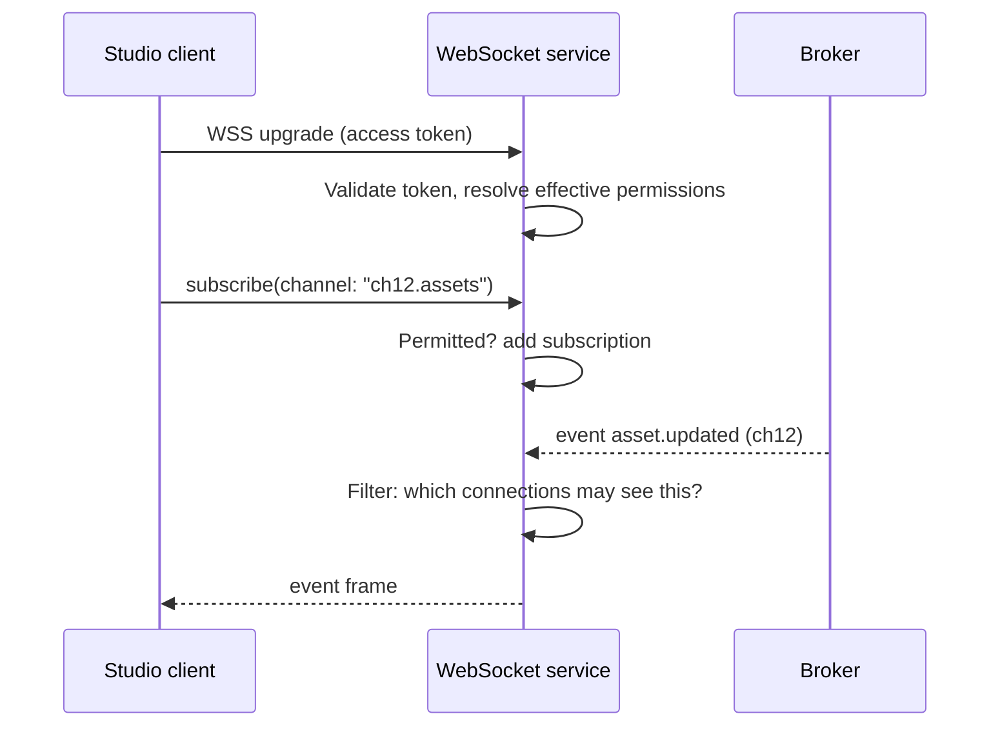

# WebSocket Service (Pusher) — Service Specification

> Permission-aware fan-out of platform events to Studio clients. Summary card:
> [Service Catalog §WebSocket](../03-service-catalog.md#32-websocket-service-pusher). Template:
> [services/README](README.md#spec-template).

## 1. Purpose & boundaries

The WebSocket service turns internal broker **events** into **live client updates** for Studio,
filtered by each connection's permissions. It is the mechanism behind "the UI updates without a
refresh". Like the gateway it holds **no domain logic** — it is a permission-aware fan-out with
backpressure, reconnection, and resume.

**In scope:** authenticated WSS connections; subscription management (public + private
channels); permission filtering of every outbound message; backpressure and slow-consumer
handling; reconnect/resume with missed-message replay within a window; presence (optional).

**Out of scope:** producing events (services do); persisting events (the broker/[Logging](logging-analytics.md)
do); business decisions about *what* changed; email/push delivery (that is
[Notifications](notifications.md), which may *use* this service for the live channel).

## 2. Requirements covered

- [FR-PLat-6](../../requirements/05-functional-requirements.md#platform) — stream live changes
  on public and private channels.
- [FR-UI-4](../../requirements/05-functional-requirements.md#studio) — Studio reflects live
  changes without manual refresh.
- Live delivery path for [FR-MSG-4](../../requirements/05-functional-requirements.md#messaging)
  (notifications live via WebSocket).
- NFR: [NFR-PERF-3](../../requirements/06-non-functional-requirements.md#performance)
  (event→client < 1 s), [NFR-AVAIL-7](../../requirements/06-non-functional-requirements.md#availability)
  (graceful degradation → Studio falls back to polling),
  [NFR-PERF-8](../../requirements/06-non-functional-requirements.md#performance) (≥100
  concurrent users).

## 3. Domain model

Connection/subscription state only — all ephemeral and rebuildable:

| State | Store | Notes |
|-------|-------|-------|
| Connection registry | In-memory per node + Redis presence | Which `connectionId` (user, channelId, node) is live. |
| Subscriptions | In-memory per node | Channels each connection is subscribed to, after permission check. |
| Resume cursors | Redis (short TTL) | Last-delivered message id per connection for replay on reconnect. |
| Fan-out routing | Derived | Broker subject → set of eligible connections. |

**Channel model.** *Public* channels carry data everyone in a `channelId`/tenant may see (new
media, schedule changes). *Private* channels are per-user streams (their messages, task
updates, their job progress). Eligibility is computed from the user's **effective permissions**
([FR-IAM-4](../../requirements/05-functional-requirements.md#iam)) at subscribe time and
re-checked on `permissions.changed`.

## 4. Public API

> **Contracts:** REST → [OpenAPI stub](../openapi/websocket.yaml) · events → [payload schemas](../schemas/).

Primarily a WSS endpoint, plus minimal HTTP for ops:

| Method | Path | Purpose | Authz |
|--------|------|---------|-------|
| `GET` (Upgrade) | `/ws` | Establish a WSS connection (access token in the upgrade). | Access token |
| `GET` | `/healthz`, `/readyz` | Health. | None |
| `GET` | `/ws/stats` | Connection/fan-out metrics (internal). | Service/admin |

**Client protocol (over WSS), JSON frames:**

| Frame | Direction | Purpose |
|-------|-----------|---------|
| `subscribe` / `unsubscribe` | client→server | Join/leave a public channel the user may see. |
| `event` | server→client | A permitted domain event (envelope-derived). |
| `progress` | server→client | Best-effort progress (transcode %, restore ETA). |
| `resume` | client→server | Reconnect with last message id → server replays the gap. |
| `ping`/`pong` | both | Heartbeat; drives slow-consumer detection. |

## 5. Messaging

- **Consumes** (broadcast subscriber): `asset.updated`, `asset.ready`, `taxonomy.updated`,
  `transcode.progress`, `restore.completed`, `schedule.updated`, `message.sent`,
  `task.created`/`task.updated`, `notification.raised`, `permissions.changed`, and any event
  Studio renders live. It is the largest fan-out consumer in the
  [broker topology](../04-messaging-and-data.md#2-broker-topology).
- **Emits** nothing to the domain bus (it is a sink→client). It may emit
  connection metrics to [Logging](logging-analytics.md).

Progress messages are consumed from **best-effort** subjects and may be dropped under load —
they drive progress bars, not state ([Messaging §1](../04-messaging-and-data.md#1-messaging-model)).

## 6. Key flows

### 6.1 Subscribe + deliver

### 6.2 Reconnect & resume
On drop, the client reconnects and sends `resume(lastMessageId)`. The service replays buffered
messages after that id from the Redis-backed window (bounded, e.g. last N seconds/messages); if
the gap exceeds the window it instructs the client to **re-sync via REST** and resubscribe.
If the socket is unavailable entirely, Studio **falls back to polling**
([NFR-AVAIL-7](../../requirements/06-non-functional-requirements.md#availability)).

### 6.3 Permission change mid-session
On `permissions.changed` for a connected user, the service re-evaluates that user's
subscriptions and drops any it no longer permits — so revocation is reflected live, not only at
next login.

## 7. Dependencies

- **Broker** — the event source (durable streams + ephemeral progress).
- **IAM** — token validation (cached JWKS) + effective-permission resolution + the
  `permissions.changed` stream.
- **Redis** — presence, resume cursors, cross-node routing for horizontal scale.
- **API Gateway** — may perform the upgrade auth before handing off.

## 8. Scaling & performance

- **Horizontally scaled**, sticky per connection (a connection lives on one node); Redis
  pub/sub (or the broker itself) fans an event to whichever nodes hold eligible connections.
- Node's event loop holds **tens of thousands of concurrent sockets** cheaply — the reason this
  is a Node service. Comfortably meets ≥100 concurrent users
  ([NFR-PERF-8](../../requirements/06-non-functional-requirements.md#performance)) with wide
  headroom.
- Target **event→client < 1 s** ([NFR-PERF-3](../../requirements/06-non-functional-requirements.md#performance));
  budget is broker delivery + filter + write.
- **Backpressure:** per-connection outbound queues with high-water marks; slow consumers get
  progress coalesced/dropped first, then disconnected with a resume hint.

## 9. Failure modes & degradation

| Failure | Effect | Mitigation |
|---------|--------|-----------|
| WebSocket service down | No live updates | Studio polls REST ([NFR-AVAIL-7](../../requirements/06-non-functional-requirements.md#availability)); "degraded UX only", not critical path. |
| A node dies | Its connections drop | Clients reconnect+resume to another node; presence in Redis reconciles. |
| Broker lag | Delayed updates | Progress coalesces; lifecycle events still delivered when they arrive. |
| Slow consumer | Memory pressure | Bounded queues; coalesce/drop progress; disconnect with resume. |

## 10. Security & data sensitivity

- **Every outbound frame is permission-filtered** — the service must never leak an event to a
  user who cannot see the underlying resource. Filtering uses the same effective-permission
  model as the services ([FR-IAM-4](../../requirements/05-functional-requirements.md#iam)).
- Token validated at upgrade and periodically re-checked; expiry closes or downgrades the
  socket.
- No PII stored; payloads are transient. Private-channel isolation is strict (per `userId`).

## 11. Configuration

Resume-window size/TTL; max connections per node; heartbeat interval; backpressure high-water
marks; which event subjects are eligible for live delivery; presence on/off.

## 12. Observability

- **Metrics:** concurrent connections (per node/total), subscribe rate, messages delivered/s,
  fan-out ratio, dropped-progress count, reconnect rate, per-message delivery latency, slow-
  consumer disconnects.
- **Logs:** connection lifecycle (connect/subscribe/disconnect with reason), permission-denied
  subscribe attempts.
- **Traces:** correlation id propagated from the originating event so an action can be traced
  from API call → event → live delivery.

## 13. Implementation notes

- **Node.js + Fastify** with `@fastify/websocket` (or the `ws` library); **`uWebSockets.js`**
  is the escape hatch for extreme connection counts ([Catalog §stack](../03-service-catalog.md#recommended-implementation-stack)).
- Redis (`ioredis`) for presence + cross-node routing; the broker's own JS client for
  consumption.
- Keep frames small and schema-versioned; reuse the [envelope](../04-messaging-and-data.md#13-message-envelope)
  fields (`type`, `channelId`, `occurredAt`, `correlationId`) in each `event` frame.

## 14. Open questions / future

- Presence/collaborative-cursor features for the [Newsroom](newsroom.md) and editor (Post-v1.0).
- Whether to expose an outbound webhook/SSE bridge for third parties via
  [Integration](integration-feeds.md) rather than raw WSS.
- Per-tenant fan-out isolation guarantees in large multi-tenant SaaS.

---
_Related: [API Gateway](api-gateway.md) · [Notifications & Messaging](notifications.md) ·
[Messaging & Data](../04-messaging-and-data.md)._
