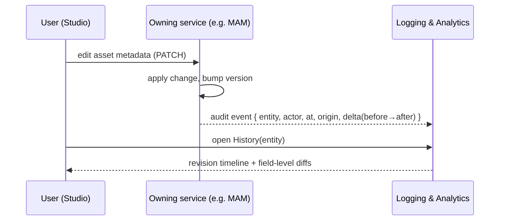

# Studio Front-End — Architecture & UX

> How the Angular Studio SPA is structured and how it feels to use. Studio is the **only**
> user-facing interface ([Brief §4.6](../01-technical-brief.md#46-studio)); everything here is
> permission-gated ([FR-UI-5](../requirements/05-functional-requirements.md#studio)) and live-updated
> over the [WebSocket service](services/websocket.md). Requirements: [FR-UI](../requirements/05-functional-requirements.md#studio),
> [FR-AUD](../requirements/05-functional-requirements.md#audit).

## 1. The workbench model (VS Code-like)

Studio adopts the **workbench** shell popularized by VS Code: a stable frame of regions around a
tabbed work area, so a broadcast operator juggling many assets, schedules and tasks works the way a
developer juggles files. This is a **deliberate UX decision** ([D9](../01-technical-brief.md#9-resolved-decisions)),
not a skin.

```
┌──┬───────────────────────┬──────────────────────────────────────────────┐
│  │  PRIMARY SIDE BAR      │  EDITOR AREA (tabbed, splittable)             │
│A │ ┌───────────────────┐ │  ┌─Asset: Clip 42─┬─Schedule 2026-07-24─┬─+─┐ │
│C │ │ ▸ View (collapsible)│ │  │                                        │ │
│T │ │ ▾ View              │ │  │   (active editor for the focused tab)  │ │
│I │ │    · item           │ │  │                                        │ │
│V │ │    · item           │ │  │                                        │ │
│I │ │ ▸ View              │ │  │                                        │ │
│T │ └───────────────────┘ │  └────────────────────────────────────────┘ │
│Y │                       │                                              │
├──┴───────────────────────┴──────────────────────────────────────────────┤
│ STATUS BAR: system health · channel · sync · notifications · user      🔔│
└──────────────────────────────────────────────────────────────────────────┘
                                              ┌─ Transfers ───────────┐(bottom-right,
                                              │ ▸ Uploads (3)  ▾      │ minimizable
                                              │ ▸ Downloads (1)       │ toast tray)
                                              └───────────────────────┘
```

### 1.1 Regions

| Region | Role |
|--------|------|
| **Activity Bar** (left icon rail) | One icon per **view container**; click switches the Primary Side Bar. Badges show counts (inbox, tasks). |
| **Primary Side Bar** | Hosts the active view container's **views** — each a **collapsible sub-panel** (`▸/▾`), reorderable, resizable. |
| **Editor Area** | **Tabbed**, and **splittable into editor groups** (side-by-side). Any number of items open at once ([FR-UI-7](../requirements/05-functional-requirements.md#studio)). |
| **Status Bar** (bottom) | System health, current channel, live-sync indicator, background-job summary, notifications bell, current user ([FR-UI-8](../requirements/05-functional-requirements.md#studio)). |
| **Notifications / Toasts** (bottom-right) | Transient alerts; **grouped transfer tray** for uploads/downloads, **minimizable** ([FR-UI-9](../requirements/05-functional-requirements.md#studio)). |
| **Command Palette** (Ctrl/Cmd-P style) | Quick navigation + actions, permission-filtered. *(Should)* |

### 1.2 Tabs & editor groups
Tabs are **typed** — an asset editor, a schedule editor, the workflow designer, a tag editor, a
history/diff view, the dashboard, all coexist. Tabs are **pinnable**, **dirty-marked** on unsaved
edits, restored on next login (workspace persistence, [FR-UI-3](../requirements/05-functional-requirements.md#studio)),
and can be **dragged between split groups**.

## 2. Panels (view containers) & their views

Each Activity-Bar icon opens a container; views inside are collapsible sub-panels. Visibility is
**permission-gated** per user.

| Panel | Views (collapsible sub-panels) | Opens editors of type |
|-------|--------------------------------|-----------------------|
| **Media** | Browse tree (categories), Recent, Collections/Saved searches, Filters (facets) | Asset detail / metadata editor |
| **Search** | Simple query, Advanced (faceted: category ∧ subject ∧ tag ∧ person), Results | Asset editor |
| **Ingest / Import** | Ingest queue, Watchers, Quarantine, Upload | Ingest-item editor |
| **Schedule** | Channels, Calendar, Schedule items, Rights windows | Schedule editor |
| **Newsroom** | Rundowns, Stories, Wires | Story / rundown editor |
| **Inbox / Tasks** | Tasks (assigned/created), Messages, Sent | Task / message view |
| **Workflows** | Flow definitions, Running instances | Workflow **designer** (Foblex Flow) |
| **People & Taxonomy** | People register, Categories, Subjects, Tags | Person / vocabulary editor |
| **Feeds & Integration** | Inbound feeds, Outbound APIs, Connectors | Feed / connector editor |
| **Admin** | Users, Groups, Roles/Rules, Field schemas, Theme | Admin editors |
| **Logs & Analytics** | Audit log, Reports, Statistics, **History/Diff** | Report / **diff** viewer |

### 2.1 The asset editor (tabs)

The most-used editor. Fields are **permission-gated per group** — a user edits only what their access
level allows, others render read-only ([data model](data-model.md#field-level-permissioning)).
Its tabs map directly to the [Asset aggregate](data-model.md#1-the-asset-aggregate):

| Tab | Shows | Source |
|-----|-------|--------|
| **Basic info** | media type, state, title, episode no, duration, **category** (with a side-panel of *other media in the same category*), allowed broadcast count, recommended broadcast window, created-by/at, comments | MAM |
| **Flow** | a table of the item's flow history — who assigned it to whom, which task, what the assignee did | [BMS](services/bms.md) |
| **Cast** | people in front of and behind the camera, each with a role (presenter/guest; **producer/director/editor/…**) | MAM ([AssetPerson](data-model.md#14-cast--crew--asset_person-join--person)) |
| **Versions** | previous and next **media-file** versions (not metadata edits — those are in History) | MAM (`replacesId` chain) |
| **Broadcast history** | a table of schedule rows where this media aired; usage vs allowed count | [Scheduling](services/scheduling.md) |
| **Rush / originals** | the raw camera/recorder assets used to make this item | MAM ([AssetRelation](data-model.md#18-rush--original--other-relations--asset_relation)) |
| **Shot list** | start/end timecode, thumbnail, and notes per notable segment | MAM |
| **Files** | every file — original, hi-res, low-res, thumbnail, … (set varies by category/BMS) — each with its integrity hash, online/offline state, and technical info (codec, bitrate, size) | [HSM](services/hsm.md) (files) + MAM (set) |
| **History** | git-style diff timeline of metadata edits | [Logging](services/logging-analytics.md#64-change-history--diff-read-model) |

### 2.2 The schedule editor (the reel)

The schedule editor **owns reel correctness** — deliberately, to keep the backend write path thin
([FR-SCH-9](../requirements/05-functional-requirements.md#scheduling), [data model §3.4](data-model.md#34-the-reel--the-fixed-anchor)):

- maintains the reel as items are added/moved/resized: **non-fixed items reflow**, bounded by
  **`fixed` time-locked anchors**;
- **prevents the user from saving overlaps**, and **flags gaps** without blocking them (gaps are legitimate);
- surfaces advisory warnings — an edit that would cross a fixed anchor, or a placement exceeding the
  media's **allowed broadcast count** ([FR-SCH-8](../requirements/05-functional-requirements.md#scheduling));
- supports **copy/duplicate** of a time-range (or whole day) to another date at an offset, with
  **merge or overwrite**;
- offers **on-demand validation** (and a pre-flight before send-to-air) rather than validating on every save.

## 3. Dashboard

A dashboard **editor tab** (the default landing view; customizable, [FR-UI-11](../requirements/05-functional-requirements.md#studio))
composed of widgets:

1. **System state** — charts + a table of asset counts by lifecycle state (created / processing /
   ready / **approved** / **rejected** / **expired**), transcode throughput, ingest volume, restore
   times. Fed by [Logging & Analytics](services/logging-analytics.md) and MAM lifecycle metrics.
2. **What's new** — a feed of recent items: new media, new categories, updated tags, new people,
   schedule changes — each a link that opens the item (and its [diff](#6-history--diff)).
3. **Inbox** — the user's new **tasks** and **messages** (from [Notifications](services/notifications.md)).
4. **My notifications** — changes to assets the user created/owns, approvals/rejections/expiries that
   concern them, mentions, job completions.

Widgets are **permission-aware**, **live** (WebSocket), rearrangeable, and the layout persists per user.

## 4. Welcome & What's New

On login **after a version rollout**, Studio shows a **Welcome / What's New** editor tab
([FR-UI-12](../requirements/05-functional-requirements.md#studio)): highlighted **new features** and
**bug fixes** for versions since the user last saw it. Dismissible ("don't show again for this
version"), re-openable from Help. Content is **release-notes data** the app ships/fetches, keyed by
build version; shown once per user per version (a per-user "last-seen version" flag).

## 5. Theming

- **Light, Dark, and High-Contrast** themes ([FR-UI-10](../requirements/05-functional-requirements.md#studio)),
  selectable per user (with "follow OS"), plus operator/per-tenant **brand theming**
  ([FR-PLat-3](../requirements/05-functional-requirements.md#platform)).
- Implemented as **design tokens** (CSS custom properties): color, spacing, elevation, typography.
  Components read tokens only — never hard-coded colors — so a new theme is a token set, not a
  restyle. Honors `prefers-color-scheme` and **RTL** ([FR-PLat-2](../requirements/05-functional-requirements.md#platform)).

## 6. History & Diff

Every versionable entity carries a **History** affordance that opens a **diff editor** — the UI face
of "[log/diff everything](../requirements/05-functional-requirements.md#audit)". It reads the
per-entity change history from [Logging & Analytics](services/logging-analytics.md#change-history--diff).

- **What has history:** asset core + extensible metadata, tags/categories/subjects, a schedule (per
  channel/date), people records, workflow definitions, feeds, permissions — anything mutated.
- **Diff view:** a **git-diff-style** visualization — a timeline of revisions, each showing **who,
  when, where** (the action's origin), and the **change** rendered as a **field-level, mostly-text
  diff** (added / removed / changed, before → after). JSON/structured fields diff key-by-key; long
  text (descriptions, scripts) diffs line-by-line.
- **Entry points:** an item's "History" button, the audit log (click a record → its diff), and the
  dashboard "what's new" feed.



## 7. Cross-cutting behavior

- **Live updates** ([FR-UI-4](../requirements/05-functional-requirements.md#studio)) — WebSocket
  topics drive lists, badges, dashboard widgets, and the transfer tray without manual refresh; **public**
  changes update everyone, **private** target the user.
- **Permission-gating** ([FR-UI-5](../requirements/05-functional-requirements.md#studio)) — panels,
  views, tabs, and actions render only for the user's effective permissions; the gateway still enforces.
- **Workspace persistence** ([FR-UI-3](../requirements/05-functional-requirements.md#studio)) — open
  tabs, editor groups, side-bar layout, theme, and panel state persist server-side, restored at next login.
- **Accessibility & i18n** — keyboard-navigable, WCAG 2.1 AA on core flows, full i18n incl. **RTL**.

## 8. Implementation approach (non-binding)

- **Angular** SPA ([A3](../README.md#assumptions-register)); **standalone components** + **signals**
  for state; typed API clients + event types from the shared [`contracts`](../../reference/contracts/README.md).
- **Workbench layout:** resizable/dockable regions via a split/dock library (e.g. `angular-split`, or
  a custom flex/grid workbench) + **CDK drag-drop** for tabs between editor groups; **CDK virtual
  scroll** for large media/log lists.
- **Theming:** CSS custom-property token sets; a small theme service toggling `data-theme` on the root.
- **Live:** a WebSocket client mapping topics → store updates; optimistic UI with server reconciliation.
- **Workflow designer** editor embeds **Foblex Flow** over the [WorkflowDefinition](schemas/workflow-definition.schema.json)
  ([design](bms-workflow-dsl-and-designer.md#12-studio-canvas-angular--foblex-flow)).
- **Diff rendering:** a structured-diff lib for JSON + a text-diff (line) lib; both fed by the
  Logging history read model.

## 9. Phasing

| Increment | Scope |
|-----------|-------|
| **MVP** | Workbench shell (activity bar, side bar, tabs, status bar); Media/Search/Ingest/Schedule(basic) panels; dashboard (basic); live updates; light/dark theme. |
| **Beta** | Workflow designer, Inbox/Tasks, Newsroom, transfer tray, faceted search UI, workspace persistence, full dashboard, History/Diff viewer, Welcome/What's-New. |
| **v1.0** | Feeds/Integration & Admin panels, high-contrast + brand theming, command palette, analytics/statistics depth, accessibility/i18n hardening. |

---
_Related: [Brief §4.6 Studio](../01-technical-brief.md#46-studio) · [FR Studio](../requirements/05-functional-requirements.md#studio) · [FR Audit/History/Diff](../requirements/05-functional-requirements.md#audit) · [Logging & Analytics](services/logging-analytics.md) · [WebSocket](services/websocket.md) · [BMS designer](bms-workflow-dsl-and-designer.md#12-studio-canvas-angular--foblex-flow)._
