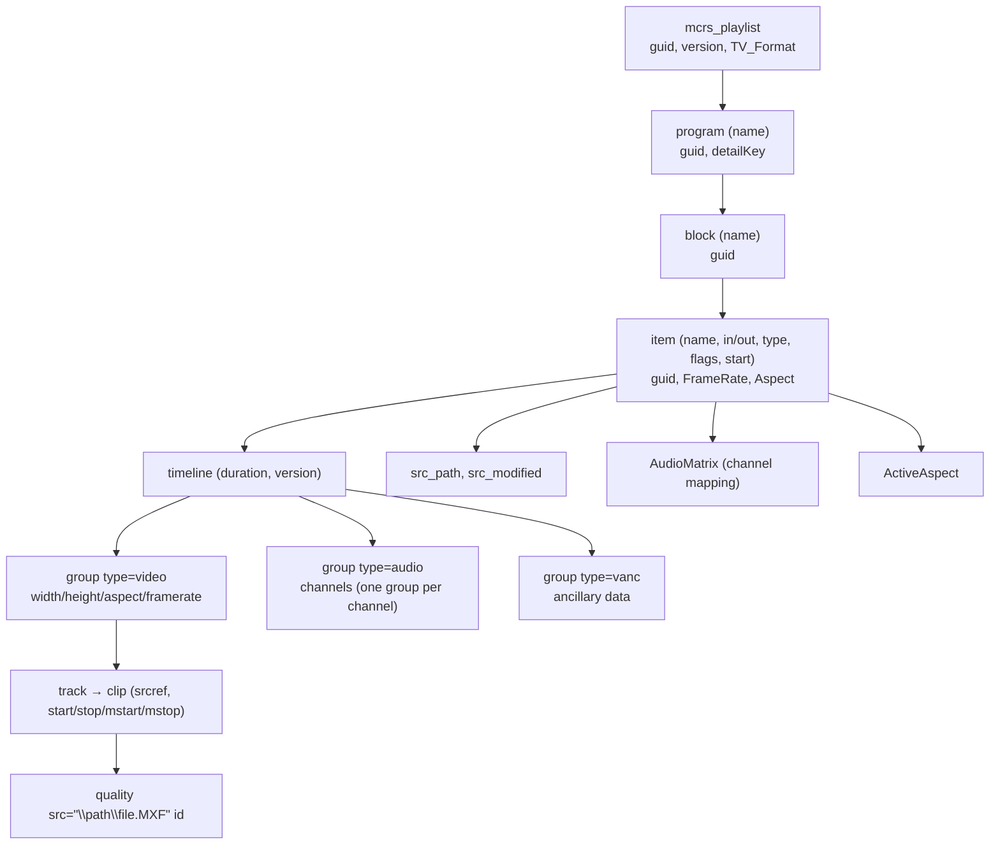

# Playout Export — MCRList (Cinegy Air) Format

> The concrete playlist format Atlas produces at **send-to-air** for third-party playout.
> This documents the **Cinegy Air `mcrs_playlist`** ("MCRList") XML, based on a real sample.
> Parent: [Integration Guide](10-third-party-developer-guide.md). Decision:
> [D1 — integrate with external playout](../01-technical-brief.md#9-resolved-decisions).
> Requirement: [FR-SCH-5](../requirements/05-functional-requirements.md#scheduling).

Atlas does **not** drive playout hardware ([D1](../01-technical-brief.md#9-resolved-decisions)).
Instead, [Scheduling](../architecture/03-service-catalog.md#scheduling) exports the approved
program as a standard playlist and [HSM](../architecture/03-service-catalog.md#hsm--hierarchical-storage-manager)
copies the referenced hi-res media to a control-room network destination. The first
supported format is **Cinegy Air MCRList**; the exporter is **pluggable** so other playout
systems' formats can be added.

## 1. What MCRList is

MCRList is an **XML** document (the sample carries a `.txt` extension only for transport; it
is XML). Its root element is `<mcrs_playlist>` and it begins with a Cinegy marker comment:

```xml
<?xml version="1.0"?>
<!--cinegy air control playlist-->
<mcrs_playlist>
  …
</mcrs_playlist>
```

## 2. Document structure

The hierarchy is **playlist → program → block → item**, where each item is a clip on the
timeline that references a media file (an MXF) by path.



## 3. Elements & attributes

### `mcrs_playlist` (root)
| Child | Meaning | Sample |
|-------|---------|--------|
| `guid` | Unique playlist id (GUID in braces) | `{0DB3F9CF-…}` |
| `version` | Playlist schema version | `3` |
| `TV_Format` | Channel raster + aspect + rate | `3840x2160 16:9 50p` |
| `program` | One or more program containers | see below |

### `program`
| Attribute / child | Meaning | Sample |
|-------------------|---------|--------|
| `name` (attr) | Program name | `New Program` |
| `guid` | Program id | `{23CB4B4A-…}` |
| `detailKey` | Cinegy internal key | `_7759c17a` |
| `block` | One or more blocks | see below |

### `block`
| Attribute / child | Meaning | Sample |
|-------------------|---------|--------|
| `name` (attr) | Block name | `New Block` |
| `guid` | Block id | `{D30EEF8F-…}` |
| `item` | Ordered playout items | see below |

### `item` (a clip on air)
| Attribute | Meaning | Sample |
|-----------|---------|--------|
| `name` | Display title of the clip | `23- …` |
| `src_in` / `src_out` | Source in/out **timecode** `HH:MM:SS:FF` | `00:00:00:00` / `00:03:17:13` |
| `in` / `out` | Playout in/out timecode (often = source) | `00:00:00:00` / `00:03:17:13` |
| `type` | Item type | `clip` |
| `flags` | Bit flags (hex or int) | `0x10`, `0` |
| `start` (optional) | Scheduled wall-clock start, UTC | `20:40:58.840Z` |

| Child | Meaning | Sample |
|-------|---------|--------|
| `guid` | Item id | `{3A986438-…}` |
| `FrameRate` | Frames/sec | `50` |
| `Aspect` | Display aspect | `16:9` |
| `timeline` | Media timeline (below) | — |
| `src_path` | Absolute path to the media file | `D:\…\clip.MXF` |
| `src_modified` | Source file mtime, ISO-8601 UTC | `2022-03-20T06:07:22.155Z` |
| `AudioMatrix` | Channel mapping matrix | see below |
| `ActiveAspect` | Active picture aspect | `16:9` |

### `timeline`
`duration` and clip `start/stop/mstart/mstop` are in **seconds** (float); item `in/out` are
in **timecode**. Contains one `<group>` per essence kind:

| `group type` | Attributes | Notes |
|--------------|-----------|-------|
| `video` | `width height aspect framerate progressive` | Single video track. |
| `audio` | `channels` | **One group per audio channel**; a mono source appears as several 1-channel groups. `<clip track="N">` selects the source channel. |
| `vanc` | `width height framerate startline` | Vertical ancillary data (captions/metadata). |

Each group contains `<track><clip srcref="…" start stop mstart mstop><quality src="…" id="…"/></clip></track>`.
`srcref` indexes the media file; `quality src` is the file path (and optional `track=` for the
source audio channel).

### `AudioMatrix`
| Attribute | Meaning | Sample |
|-----------|---------|--------|
| `name` | Preset name | `Default 8` |
| `description` | Human description | `Default mapping, 8 channels, direct` |
| `value` | Rows `;`-separated, columns `,`-separated (out×in gain matrix) | `1,0,0,…;0,1,0,…;…` |
| `default` | Is the default mapping | `True` |

## 4. How Atlas populates it

| MCRList field | Atlas source |
|---------------|--------------|
| `TV_Format` | Channel delivery spec (raster/aspect/rate) from channel config |
| `program` / `block` names | Schedule structure ([Scheduling](../architecture/03-service-catalog.md#scheduling)) |
| `item name` | Asset title from [MAM](../architecture/03-service-catalog.md#mam--mediametadata--asset-management) |
| `src_in/out`, `in/out`, `duration` | Schedule item trim + asset duration |
| `FrameRate`, `Aspect`, group rasters | Broadcast rendition's technical metadata |
| `src_path` | **Control-room network path** where HSM copied the hi-res file |
| `src_modified` | Rendition file mtime |
| `guid` (all levels) | Newly minted, stored on the schedule for round-tripping |
| `AudioMatrix` | Channel-mapping profile from channel config |
| `start` | Scheduled air time (for time-anchored items) |

**Critical coupling:** `src_path` must be valid **from the playout server's perspective**, so
HSM's send-to-air copy target and the paths written into the MCRList must agree. This mapping
is per-channel configuration (a "control-room destination" + path-rewrite rule).

## 5. Generation rules & validation

- **Path rewriting:** Atlas stores assets by its own tiering; the exporter rewrites each
  rendition's location to the **control-room path** the playout expects (UNC or mapped
  drive). Validate that every `src_path` resolves on the playout host.
- **Timecode vs seconds:** emit `in/out/src_in/src_out` as `HH:MM:SS:FF` at the channel frame
  rate; emit `duration`/clip `start/stop` as seconds. Keep them consistent (frames ÷ rate).
- **Audio layout:** emit one `audio` group per channel per the channel's audio config, and a
  matching `AudioMatrix`. Mono-per-track sources (as in the sample) produce N 1-channel
  groups with `track="0…N-1"`.
- **Only approved media:** items must reference **approved** renditions
  ([FR-SCH-3](../requirements/05-functional-requirements.md#scheduling)); the exporter fails
  closed if a referenced rendition is missing or unapproved.
- **Round-trip:** persist the generated GUIDs on the schedule so re-exports are stable and
  as-run reconciliation is possible.

## 6. Pluggable exporters

MCRList (Cinegy) is the first exporter. The Scheduling service exposes a **format-plugin
interface** so other playout targets can be added without touching scheduling logic:

| Target | Format | Status |
|--------|--------|--------|
| Cinegy Air / Playout | `mcrs_playlist` (this doc) | Planned (Beta) |
| Generic | CSV / simple XML | Candidate |
| Others | vendor-specific | On request |

> If the launch customer's playout is **not** Cinegy, confirm its exact schema early — the
> exporter interface stays the same, only the serializer changes.

---
_Back to the [Integration Guide](10-third-party-developer-guide.md)._
