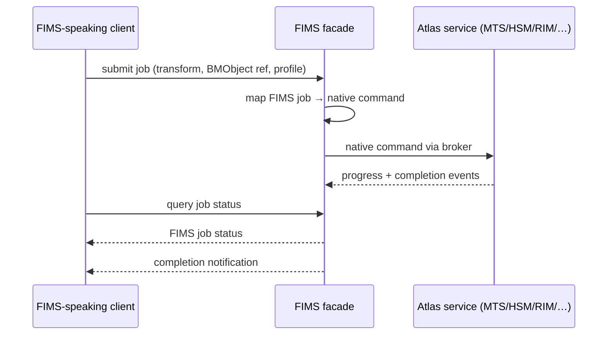

# Standards Conformance & FIMS Implementation

> How Atlas implements the **Framework for Interoperable Media Services (FIMS)** — both service
> interoperability and the universal data model — and which other industry standards it adopts.
> Parent: [Technical Brief](../01-technical-brief.md). Related:
> [Third-Party Developer Guide](10-third-party-developer-guide.md) ·
> [Lifecycle Scope](../strategy/19-production-lifecycle-scope.md).

## 1. Position: adopt FIMS as an adapter layer, not as the internal model

Atlas **will implement FIMS** — the stakeholder requirement is to support both its service
interfaces and its universal data model. One engineering judgment shapes *how*:

> **FIMS is implemented as a conformance layer at the boundary — a facade service plus a
> published data-model mapping — while Atlas's internal domain model and event backbone stay
> as designed.**

Reasoning, stated plainly so it can be challenged:

- **FIMS was designed in the SOAP/SOA era** (EBU–AMWA joint task force; core specs ~2012–2017)
  around synchronous, job-oriented service contracts. Atlas's core is
  [event-driven and asynchronous](../architecture/04-messaging-and-data.md). Forcing the FIMS
  job model inward would make the core heavier and slower to evolve for no user-visible gain.
- **Standards activity has largely moved on** — MovieLabs 2030, AMWA NMOS, IMF, and cloud-native
  patterns get most industry investment today. FIMS remains valuable primarily as a
  **procurement and interoperability credential**, which is exactly what a boundary layer
  delivers.
- **A facade gives the full benefit at a fraction of the cost.** Tenders that require FIMS are
  satisfied; FIMS-speaking third-party services interoperate; and the internal model remains
  free to evolve.

If a customer requires FIMS conformance *of internal service interactions* (unusual, but it
appears in some public-sector tenders), the facade can be extended per-service rather than
re-architecting the core — see [§6](#6-conformance-levels).

## 2. What FIMS defines, and Atlas's mapping

FIMS specifies a set of **media service interfaces** plus a **common data model**. Atlas already
has a service for each FIMS capability, so the mapping is direct:

| FIMS service | Purpose | Atlas implementation |
|--------------|---------|----------------------|
| **Capture** | Acquire content from a source/live feed | [RIM](../architecture/services/rim.md) — recorders, watchers, upload |
| **Transfer** | Move essence between locations | [HSM](../architecture/services/hsm.md) — tiering, copy/move, export |
| **Transform** | Transcode/rewrap to a target profile | [MTS](../architecture/services/mts.md) — FFmpeg profiles |
| **Repository** | Store/retrieve content and metadata | [MAM](../architecture/services/mam.md) + [HSM](../architecture/services/hsm.md) |
| **Quality Analysis (QA)** | Automated technical QC | [MTS](../architecture/services/mts.md) QC profiles ([lifecycle §4](../strategy/19-production-lifecycle-scope.md#4-post-production)) |
| **Automatic Metadata Extraction (AME)** | Derive metadata from essence | [AI Enrichment](../architecture/services/ai-enrichment.md) + RIM technical extraction |

### 2.1 The FIMS job model

Every FIMS service shares a **job** lifecycle — submit, query status, cancel, complete — with
job profiles and priorities. Atlas's services are already job/queue-shaped internally
(transcode jobs, file operations, enrichment jobs), so the facade maps FIMS jobs onto native
operations and reports status back:

Job state maps as: `queued → running → completed | failed | cancelled`, consistent with the
[MTS job states](../architecture/services/mts.md) and
[HSM operations](../architecture/services/hsm.md).

### 2.2 The universal data model

FIMS's content model (**BMContent** / **BMEssence**, derived from **EBUCore**) separates the
*editorial work* from its *physical essences* — which is exactly Atlas's existing split between
an **Asset** (MAM) and its **Renditions/FileEntries** (MAM/HSM). The mapping is therefore clean:

| FIMS / EBUCore concept | Atlas concept | Owner |
|------------------------|---------------|-------|
| `BMContent` (the editorial object) | **Asset** — core + extensible metadata | [MAM](../architecture/services/mam.md) |
| `BMEssence` (a physical instantiation) | **Rendition** + **FileEntry** (tier, path, checksum) | MAM + [HSM](../architecture/services/hsm.md) |
| Descriptive metadata | Core fields + extensible fields + taxonomy | MAM |
| Technical metadata | `TechnicalMetadata` ([schema](../architecture/schemas/common.schema.json)) | MAM/RIM |
| Identifiers | Asset ULID + external-id map | MAM |
| Rights | Rights windows | [Scheduling](../architecture/services/scheduling.md) |
| Format/profile | Transcode profile | [MTS](../architecture/services/mts.md) |

**The one deliberate addition to the internal model:** an **external-identifier map** on Asset
(`{scheme, value}` pairs — FIMS/EBUCore ids, IPTC ids, partner ids). This is cheap, belongs in
v1.0, and prevents a painful retrofit when the facade lands. It is the concrete "prepare now"
item from [lifecycle §6](../strategy/19-production-lifecycle-scope.md#6-delivery-consequence-this-is-a-v20-horizon).

## 3. The FIMS facade service

A thin, optional service — deployable or not per customer — exposing FIMS-conformant endpoints
and translating in both directions.

- **Placement:** alongside [Integration/Feeds](../architecture/services/integration-feeds.md);
  it is an interoperability adapter, not a domain service.
- **Interfaces:** FIMS service endpoints (Capture/Transfer/Transform/Repository/QA/AME) with the
  job lifecycle; content exchanged as **BMContent/BMEssence** documents.
- **Translation:** FIMS job ⇄ native command/event; BMContent ⇄ Asset (per the §2.2 mapping).
- **Direction:** both — Atlas can *expose* FIMS services to third parties, and *consume*
  third-party FIMS services (e.g. an external transcode farm) as a provider behind
  MTS's abstraction.
- **Optional by design:** off by default; no core service depends on it, consistent with
  [FR-PLat-8](../requirements/05-functional-requirements.md#platform).

## 4. The broader standards stack

FIMS is one of several standards worth conforming to. Ranked by **practical value to Atlas's
actual customers**:

| Standard | Domain | Priority | Atlas position |
|----------|--------|:--------:|----------------|
| **BXF** (SMPTE ST 2021) | Schedule / as-run / content metadata exchange between traffic, automation, and program management | **Highest** | **Arguably more valuable than FIMS for broadcast customers** — it is how schedules and as-run logs move between systems. Recommend as a first-class [Scheduling](../architecture/services/scheduling.md) export/import alongside [MCRList](14-playout-mcrlist-format.md). |
| **EBUCore** | Media metadata model | High | Already the basis of the FIMS mapping (§2.2); also the lingua franca for archive exchange. |
| **IPTC NewsML-G2 / ninjs** | News content exchange | High (news segment) | For [Newsroom](../architecture/services/newsroom.md) wires and publishing; what Superdesk uses ([positioning §2.3](../strategy/18-market-and-positioning.md)). |
| **MOS** | Newsroom ↔ playout/graphics device control | High (news) | Already a [Newsroom](../architecture/services/newsroom.md) target ([FR-NRC-3](../requirements/05-functional-requirements.md#newsroom)). |
| **OpenTimelineIO** | Editorial timeline interchange | High (v2.0) | **Recommended internal timeline model** for the [Editorial service](../architecture/services/editorial.md) ([lifecycle §4.2](../strategy/19-production-lifecycle-scope.md#42-interchange-what-is-actually-possible)). |
| **AAF / FCPXML / EDL** | NLE interchange | High (v2.0) | Delivered as OTIO adapters; the realistic path to Premiere/Avid/Resolve. |
| **FIMS** | Media service interoperability | Medium | This document — facade + data-model mapping. |
| **IMF / AS-11 / AS-02** | Delivery & mastering specifications | Medium | Deliverable profiles for content owners/distributors; MTS profiles + validation. |
| **XMLTV / TV-Anytime** | EPG | Medium | Already in [Integration](../architecture/services/integration-feeds.md) ([FR-INT-3](../requirements/05-functional-requirements.md#integration)). |
| **MovieLabs 2030** | Production ontology & security model | Watch | Aligns with the [lifecycle expansion](../strategy/19-production-lifecycle-scope.md); adopt vocabulary where cheap, don't chase the full model. |
| **SMPTE ST 2110 / AMWA NMOS** | IP video infrastructure | ⚪ Out | Infrastructure layer, below Atlas's boundary — playout/routing vendors' territory. |

> **The BXF recommendation is the practically important one in this table.** Customers in
> segments 1 and 4 ([positioning §1](../strategy/18-market-and-positioning.md)) routinely require
> schedule/as-run exchange with traffic systems, and BXF is how that is done. It is a smaller
> build than the FIMS facade with more immediate customer pull.

## 5. Integration-everywhere principle

The stakeholder requirement that *every part of the project must integrate with other
solutions* is met by three existing architectural commitments, now made explicit as a rule:

1. **Every service exposes a documented REST API** ([OpenAPI stubs](../architecture/openapi/))
   and **publishes events** ([payload schemas](../architecture/schemas/)) — nothing is reachable
   only through the UI.
2. **Every external-facing capability is behind a pluggable interface**: playout formats
   ([serializer](../architecture/services/scheduling.md)), AI providers
   ([abstraction](../architecture/services/ai-enrichment.md)), storage targets
   ([HSM](../architecture/services/hsm.md)), feeds/connectors
   ([Integration](../architecture/services/integration-feeds.md)), and now standards adapters.
3. **Standards adapters are optional deployments** — conformance never becomes a runtime
   dependency of the core, preserving air-gapped operation
   ([FR-PLat-7](../requirements/05-functional-requirements.md#platform)).

## 6. Conformance levels

Being explicit about what "FIMS support" means in a tender response:

| Level | What it means | Atlas |
|-------|---------------|-------|
| **L1 — Data model** | Content/metadata expressible as BMContent/BMEssence; documented mapping | v1.0 (mapping + external-id map) |
| **L2 — Service interfaces** | FIMS-conformant Capture/Transfer/Transform/Repository/QA/AME job endpoints | v2.0 (facade) |
| **L3 — Consumer** | Atlas can drive third-party FIMS services | v2.0 (facade, both directions) |
| **L4 — Internal** | Internal service-to-service traffic is FIMS-conformant | **Not planned** — see [§1](#1-position-adopt-fims-as-an-adapter-layer-not-as-the-internal-model) |

Publishing these levels honestly is better than an unqualified "FIMS compliant" claim, which
invites a failed conformance review.

---
_Next: [Planning service](../architecture/services/planning.md) ·
[Editorial service](../architecture/services/editorial.md) ·
[Lifecycle Scope](../strategy/19-production-lifecycle-scope.md)._
