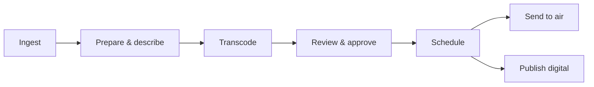

# Atlas Automation

## Media automation, rebuilt for the next decade

**One platform for TV, radio, news, and live events.** Atlas brings your content from ingest
to air — and to every digital destination — in a single, modern, service-based system that
adapts to how your teams actually work.

---

### Why Atlas

- 🎛️ **Many channels, one system** — run multiple stations of different types side by side,
  each isolated and branded to its team.
- 🔀 **Your workflows** — start from proven process flows, then adapt or build your own, no
  code release required.
- ⚡ **Scales on demand** — automatically adds processing power to clear content spikes, then
  releases it.
- 🌍 **Multilingual & themeable** — a workspace in your team's language and style, personalized
  per user.
- 🔒 **Secure & accountable** — central access control down to the department; every action
  logged.
- 🔌 **Connected** — import from anywhere, publish to EPG, HbbTV, web, social, and partners
  through configurable feeds.
- 🤖 **AI that assists** — face/content detection, subtitles, and metadata suggestions your
  team confirms.
- 🖥️ **Cross-platform & maintainable** — modern architecture that updates without disruption.

---

### What Atlas does

| Bring media in | Prepare it | Move it | Get it out |
|----------------|-----------|---------|-----------|
| Upload, FTP, watched folders, live recording | Auto proxy, thumbnail & broadcast versions; metadata & AI assist | Review, assign, approve; configurable workflow | Schedule, send to air, publish to digital |

---

### Built on modern foundations

Independent services over a shared messaging backbone mean Atlas is **reliable** (one part
can't take down the whole), **scalable** (grow by adding channels and capacity), and
**future-proof** (each piece evolves on its own). Storage is managed intelligently across
fast, near-line, and archive tiers — so day-to-day media is instant and everything is safely
retained.

---

### The workflow, at a glance

---

### Delivery you can plan around

A focused build takes Atlas from a working **MVP in months** to a **full-feature v1.0** — an
ingest-to-air spine first, then workflow and collaboration, then the full feature set with
high availability. See the [Delivery Roadmap](../roadmap/08-roadmap.md).

---

### From a team that's done it before

Atlas is the next generation of a media automation platform first built more than a decade ago
— rebuilt with everything learned since, for the multi-platform, always-on media world.

> **Learn more:** [White Paper](11-white-paper.md) · [Technical Brief](../01-technical-brief.md) ·
> [Integration Guide](../integrations/10-third-party-developer-guide.md)

_Atlas Automation — modular. multi-channel. built to last._
