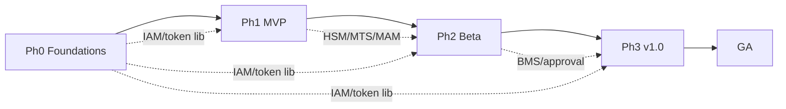

# Delivery Roadmap — MVP to v1.0

> The phased plan from a walking-skeleton MVP to the first stable full-feature release
> (v1.0). Effort, team, and cost detail live in
> [Resourcing, Time & Cost](09-resourcing-estimates.md); this document is the *what and
> when*. Parent: [Technical Brief](../01-technical-brief.md). Scope IDs reference the
> [Functional Requirements](../requirements/05-functional-requirements.md).

**Timeline is expressed in relative weeks from project start (T0).** The **phase sequence is
fixed; the calendar depends on team size.** Per [A7](../README.md#assumptions-register) the
operative plan is the **smallest agile team**, so the real dates track the **core/lean
timeline** in [Resourcing §Timeline](09-resourcing-estimates.md#timeline). The T-week numbers
shown below are the **standard-team reference** — a smaller team reaches the same milestones
later (e.g. MVP ~T32 instead of ~T22); see doc 09 for both calendars. **AI-assisted
development** ([A12](../README.md#assumptions-register)) compresses these further — roughly
15–20% across the program — so the operative plan (Core team + AI-assisted) targets **MVP in
~6 months, GA in ~16–18 months** ([Resourcing §8](09-resourcing-estimates.md#ai-assisted-development)).

## Phase overview

```mermaid
gantt
    title Atlas delivery (standard team) — relative weeks
    dateFormat X
    axisFormat %s
    section Foundations
    Phase 0 Foundations        :p0, 0, 6
    section MVP
    Phase 1 Ingest-to-Schedule :p1, 6, 16
    section Beta
    Phase 2 Workflow & Collab  :p2, 22, 16
    section v1.0
    Phase 3 Full-feature & HA  :p3, 38, 18
    section GA
    Hardening & GA             :ga, 56, 6
```

| Phase | Name | Weeks (rel.) | Exit = milestone |
|-------|------|:------------:|------------------|
| 0 | Foundations | T0 – T6 | Walking skeleton deployable |
| 1 | Ingest-to-Schedule spine | T6 – T22 | **MVP** |
| 2 | Workflow, approval & collaboration | T22 – T38 | **Beta** |
| 3 | Full-feature, integrations, HA | T38 – T56 | **v1.0 feature-complete** |
| GA | Hardening, perf, pen-test | T56 – T62 | **v1.0 GA** |

---

## Phase 0 — Foundations (T0–T6)

**Goal:** the platform's skeleton so features can be built on rails, not scaffolding.

- Repos, CI/CD, container build, IaC for dev/staging, environment templates.
- **Backbone up:** API gateway, message broker, service registry/discovery, WebSocket
  service, a service template (health, logging, tracing, config, auth middleware).
- **IAM v0:** login, JWT access+refresh, basic users/roles, token validation library shared
  by all services ([FR-IAM-1,5,6](../requirements/05-functional-requirements.md#iam)).
- **Data plane provisioned:** PostgreSQL, MongoDB, Redis, OpenSearch, object storage.
- **Studio shell:** Angular app, auth flow, layout shell, WebSocket client, i18n scaffolding.
- Observability baseline (logs/metrics/traces), one end-to-end "hello asset" trace.

**Exit criteria:** a trivial asset can be created through the gateway, stored, and its change
pushed live to Studio — proving the whole spine end-to-end.

**Key risks:** broker/orchestrator choice and the service template set the pace for
everything after; invest here.

---

## Phase 1 — Ingest-to-Schedule spine → **MVP** (T6–T22)

**Goal:** one real channel can take media from ingest to a schedule. This is the
[MVP definition](../01-technical-brief.md#8-what-done-means-per-milestone) ([A8](../README.md#assumptions-register)).

**Scope (Must):**
- **RIM:** upload + folder watch, acceptance rules, technical metadata, checksum
  ([FR-ING-1,2,4,5,6,7](../requirements/05-functional-requirements.md#ingest)).
- **HSM v1:** online tier, place/copy/move/delete, checksum on ingest, file-ops-only-via-HSM
  ([FR-HSM-1,2,4,5](../requirements/05-functional-requirements.md#hsm)).
- **MTS v1:** FFmpeg transcode to proxy + thumbnail + broadcast; progress/complete events;
  manual multi-instance scaling
  ([FR-MTS-1,2,3,4,5,6](../requirements/05-functional-requirements.md#transcode)).
- **MAM v1:** core fields, basic extensible fields, **free-form tags**, simple search,
  mandatory-metadata gate, cache
  ([FR-MAM-1,2,4,5,7](../requirements/05-functional-requirements.md#mam),
  [FR-TAX-1,6](../requirements/05-functional-requirements.md#classification)).
- **Scheduling v0:** basic program table CRUD ([FR-SCH-1](../requirements/05-functional-requirements.md#scheduling)).
- **Studio pages:** dashboard (basic), ingest/import, search/browse, asset metadata edit,
  schedule (basic), user management (basic), live updates
  ([FR-UI-1,4,5](../requirements/05-functional-requirements.md#studio)).
- **Logging v1:** append-only audit of all actions ([FR-LOG-1](../requirements/05-functional-requirements.md#analytics)).

**Explicitly deferred:** approval workflow, tasks/messaging, editor, near-line/offline, AI,
integrations, multi-channel, HA.

**Exit criteria (MVP done):** on a single channel, a user uploads a file, it's validated,
transcoded to proxy+broadcast+thumbnail, metadata entered, found via search, and placed on a
schedule — with every step audited and live-updated. Pilot-ready on the
[minimum viable footprint](../requirements/07-hardware-requirements.md#9-minimum-viable-footprint-for-the-mvp-milestone).

---

## Phase 2 — Workflow, approval & collaboration → **Beta** (T22–T38)

**Goal:** the platform becomes a multi-user, multi-channel product with real workflow.

**Scope (Must/Should):**
- **BMS v1:** preset flows incl. the canonical ingest-to-air flow; orchestration with
  retries/timeouts; human-in-the-loop steps
  ([FR-BMS-1,4,5](../requirements/05-functional-requirements.md#workflow)).
- **Approval & tasks:** review, assign, approve/reject, replace-with-clone
  ([FR-APP-1..4](../requirements/05-functional-requirements.md#approval), [FR-MAM-6](../requirements/05-functional-requirements.md#mam)).
- **Notifications & Messaging:** inbox, user/group messaging, event notifications
  ([FR-MSG-1,2,3](../requirements/05-functional-requirements.md#messaging)).
- **Media editor v1 (basic-NLE):** load list, preview, server-side render to Import;
  **video** trim/merge, static & animated titles, logo overlay; **audio** edit + add/replace/
  fade on video; **image** crop/resize (layers may slip to v1.0)
  ([FR-EDT-1..8](../requirements/05-functional-requirements.md#editor)).
- **MAM v2:** advanced search, shot-list, metadata schema editor, auto vs manual distinction
  ([FR-MAM-2,3,4,8](../requirements/05-functional-requirements.md#mam)).
- **Classification & discovery:** category taxonomy, subjects/controlled vocabularies,
  **people/cast register**, **faceted search** (category + subject + tag + person)
  ([FR-TAX-2..6](../requirements/05-functional-requirements.md#classification),
  [FR-PPL-1..4](../requirements/05-functional-requirements.md#people)).
- **MTS v2:** auto-scaling on queue depth, VTT filmstrip + hover preview, per-channel
  profiles ([FR-MTS-3,6,7](../requirements/05-functional-requirements.md#transcode)).
- **Multi-channel isolation** ([FR-PLat-1](../requirements/05-functional-requirements.md#platform)),
  **theming & i18n** ([FR-PLat-2,3](../requirements/05-functional-requirements.md#platform)),
  **workspace persistence** ([FR-UI-3](../requirements/05-functional-requirements.md#studio)).
- **Scheduling v1:** validation, approved-only, send-to-air export to control room in a
  **standard playlist format (e.g. MCRList)** for third-party playout
  ([FR-SCH-2,3,4,5](../requirements/05-functional-requirements.md#scheduling)).
- **Integration inbound:** JSON/XML import feeds ([FR-INT-1](../requirements/05-functional-requirements.md#integration)).

**Exit criteria (Beta):** a small pilot broadcaster runs day-to-day work across ≥2 channels:
ingest → workflow → approval → schedule → send-to-air, with tasks, messaging, and inbound
feeds. Feature-usable but not yet HA/hardened.

---

## Phase 3 — Full-feature, integrations & HA → **v1.0 feature-complete** (T38–T56)

**Goal:** everything in the vision, at production quality.

**Scope:**
- **BMS v2:** author/duplicate/modify flows; flow-position visibility
  ([FR-BMS-2,3,6](../requirements/05-functional-requirements.md#workflow)).
- **AI Enrichment:** provider-abstraction, **online-first** (cloud/vendor providers, full
  accuracy); detection, STT/subtitles, **face-matching against the people register**,
  suggestions (human-confirmed), off critical path. The **optional limited offline tier**
  (small local model for air-gapped sites) is a Post-v1.0 add-on
  ([FR-AI-1..9](../requirements/05-functional-requirements.md#ai),
  [FR-PPL-5](../requirements/05-functional-requirements.md#people)).
- **HSM v2:** near-line/offline tiering + restore + integrity sweeps
  ([FR-HSM-1,3,4](../requirements/05-functional-requirements.md#hsm)).
- **Integration outbound:** custom output APIs, EPG publish, HbbTV launchers, social/web
  ([FR-INT-2,3,4,5](../requirements/05-functional-requirements.md#integration)).
- **Newsroom:** rundowns, stories, scripts, assignment
  ([FR-NRC-1,2](../requirements/05-functional-requirements.md#newsroom)).
- **Recording:** stream/broadcast capture + segmentation ([FR-ING-3](../requirements/05-functional-requirements.md#ingest)).
- **IAM v2:** SSO/OIDC/SAML, MFA ([FR-IAM-9,10](../requirements/05-functional-requirements.md#iam)).
- **Analytics:** reports/charts/statistics, permission-filtered logs
  ([FR-LOG-2,3](../requirements/05-functional-requirements.md#analytics)).
- **HA across the critical path**, GPU transcoding, cloud burst
  ([NFR-AVAIL](../requirements/06-non-functional-requirements.md#availability)).

**Exit criteria:** all Must/Should requirements met; HA in place; non-critical services can
fail without stopping the media path.

---

## GA — Hardening, performance & security (T56–T62)

- Meet all [NFR performance/capacity targets](../requirements/06-non-functional-requirements.md#performance)
  under load; failover/chaos drills for RTO/RPO.
- External **penetration test** ([NFR-SEC-10](../requirements/06-non-functional-requirements.md#security--privacy)) and remediation.
- Accessibility pass (WCAG 2.1 AA on core flows), full i18n/RTL QA.
- Docs complete: ops runbooks, [Integration guide](../integrations/10-third-party-developer-guide.md), admin guide.
- **v1.0 GA** sign-off.

---

## v2.0 horizon — the production-lifecycle expansion {#v2}

Competitive research ([Market & Positioning](../strategy/18-market-and-positioning.md)) led to a
decision to extend Atlas across the **full production lifecycle** — pre-production planning,
production support, and a project-based web editor. The scope decision, activity by activity, is
[Production Lifecycle Scope](../strategy/19-production-lifecycle-scope.md).

**This is deliberately *after* v1.0 GA, not inside it.** The expansion adds **~125–205 PW
(≈ +35–45%)**; folding it into v1.0 would push GA from ~16–18 months to roughly **24–30 months**
with the Core team — two-plus years before any revenue or production feedback.

| Phase | Scope | Rough effort |
|-------|-------|:------------:|
| **v1.1 / v2.0-a — Planning** | Projects, planning items, assignments, resource registry, conflict-free bookings, call sheets, breakdown, shot lists ([FR-PLN](../requirements/05-functional-requirements.md#planning)) | ~30–45 PW |
| **v2.0-b — Production support** | Rushes/camera-card ingest, shot logging, dailies review, field contribution ([FR-PRD](../requirements/05-functional-requirements.md#production)) | ~15–25 PW |
| **v2.0-c — Editorial** | Project persistence, OTIO timeline, browser playback, render, interchange (AAF/FCPXML/EDL) ([FR-EDT-11..20](../requirements/05-functional-requirements.md#editor-v2)) | **~60–100 PW** |
| **v2.0-d — Standards** | FIMS facade (L2/L3), BXF, NewsML-G2 ([FR-STD](../requirements/05-functional-requirements.md#standards)) | ~20–35 PW |

**Sequencing:** Planning first (cheapest, most customer-visible, and it serves news immediately),
then production support, then the editor. **Validate the editor commercially before building
it** — at ~60–100 PW it is the dominant cost of the whole expansion.

### Three cheap preparations to make *inside* v1.0

These keep v2.0 additive rather than a rewrite, and cost very little now:

1. **OTIO-compatible timeline model** in the v1.0 basic-NLE ([FR-EDT-12](../requirements/05-functional-requirements.md#editor-v2)).
2. **FIMS/EBUCore mapping + external-identifier map** on Asset
   ([FR-STD-1/2](../requirements/05-functional-requirements.md#standards)) — a painful retrofit
   if skipped.
3. **`projectId` reserved as a first-class scope** alongside `channelId` in MAM/BMS
   ([FR-PLN-1](../requirements/05-functional-requirements.md#planning)), so planning attaches
   without a data migration.

## Milestone summary

| Milestone | Rel. week (standard) | One-line definition |
|-----------|:--------------------:|---------------------|
| Foundations | T6 | Walking skeleton deployable end-to-end. |
| **MVP** | T22 | One channel: ingest → transcode → metadata → search → schedule, audited & live. |
| **Beta** | T38 | Multi-channel workflow: approval, tasks, messaging, editor, inbound feeds, send-to-air. |
| **v1.0 feature-complete** | T56 | AI, near-line/offline, outbound integrations, newsroom, SSO, analytics, HA. |
| **v1.0 GA** | T62 | Hardened, perf-proven, pen-tested, documented. |

## Cross-phase workstreams (continuous)

- **Security & compliance** — threat modeling per phase, dependency scanning, audit.
- **Testing** — unit/contract/integration/perf grow with each phase (coverage gate from Ph1).
- **DevEx/Platform** — service template, CI/CD, IaC evolve; keep onboarding < 1 day.
- **Docs** — keep this set current; each feature lands with docs.

## Risks & mitigations {#risks}

| Risk | Impact | Mitigation |
|------|--------|------------|
| **Editor scope creep** — basic-NLE across video **+ audio + image** ([D3](../01-technical-brief.md#9-resolved-decisions)) is now three editors, not one | Medium; broader than a single video trimmer | Scope fixed to the [§4.10 table](../01-technical-brief.md#410-media-editor-scope); reuse FFmpeg for A/V, a light image worker; full NLE stays Post. |
| **AI value offline** ([D4/A9](../01-technical-brief.md#9-resolved-decisions)) — air-gapped sites only get the limited local tier, so full AI features won't be available there | Low–Medium; a capability gap, not a blocker (AI is non-critical) | Set expectations per deployment; the platform runs fine with AI disabled; offer the small local model as an optional add-on. |
| **Offline installability** — no internet means no package/model pulls at install | Medium; can block deploys on site | Build **offline install bundles** (local artifact + model registry) from Phase 0; test an air-gapped install before v1.0. |
| **Transcode capacity** underestimated | Ingest SLA misses | Size to peak; auto-scale (Phase 2); cloud burst only where internet exists. |
| **Broker/data choices** wrong | Expensive to change late | Validate in Phase 0 with a load spike test. |
| **Small team, broad surface** ([A7](../README.md#assumptions-register)) | Overload; slower v1.0 | Ruthless MoSCoW; ship MVP thin; add specialists (AI, extra FE) only as phases demand — see [Resourcing](09-resourcing-estimates.md#1-team-shape). |
| **Playlist-format interop** — third-party playout must accept the export | Blocks send-to-air acceptance | Make the format pluggable ([FR-SCH-5](../requirements/05-functional-requirements.md#scheduling)); validate MCRList (and any target system's format) against the real playout early. |
| **Lifecycle expansion pulled into v1.0** ([v2.0 horizon](#v2)) — planning/production/editor scope leaking left | **High**; GA slips from ~16–18 to ~24–30 months | Hold the line: v1.0 ships the automation spine. Make only the [three cheap preparations](#three-cheap-preparations-to-make-inside-v10); everything else is v2.0. |
| **Web editor underestimated** — project-based editing + interchange is ~60–100 PW, and browser playback needs scrub-optimised proxies | **High** (in v2.0); the expansion's dominant cost | Validate demand commercially first; build on an OTIO model; treat proxy design as an [MTS](../architecture/services/mts.md) workstream, not a UI detail. |
| **Interchange fidelity expectations** — customers may expect native `.prproj` round-trip | Medium; support burden and lost trust | Native project files are proprietary and out of scope ([FR-EDT-19](../requirements/05-functional-requirements.md#editor-v2)); ship a **fidelity report** on every import/export and set expectations in sales. |
| **Standards conformance over-promised** — "FIMS compliant" without qualification | Medium; failed conformance review | Publish explicit [conformance levels](../integrations/20-standards-and-fims.md#6-conformance-levels) (L1 in v1.0, L2/L3 in v2.0, L4 not planned). |

**Resolved (were risks, now closed by decisions):** playout boundary ([D1](../01-technical-brief.md#9-resolved-decisions) — integrate via standard formats), legacy migration ([D2](../01-technical-brief.md#9-resolved-decisions) — out of scope), editor depth and AI approach (bounded above). A **channel-in-the-box** (CG/playout) remains a **Post-v1.0** future product line, not a v1.0 risk.

## Dependencies between phases

---
_Next: [Resourcing, Time & Cost](09-resourcing-estimates.md)._
