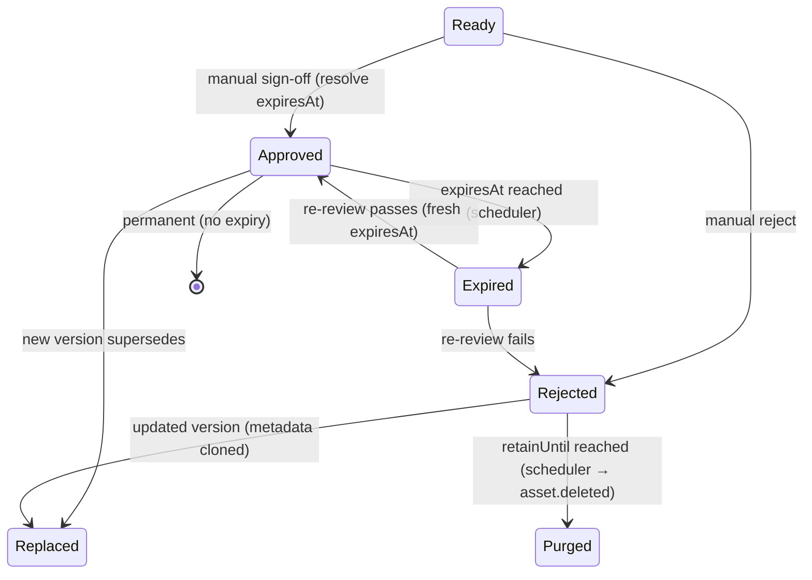

# Implementation Plan — Review, Approval, Expiry & Retention

> A step-by-step engineering plan to build the **manual review lifecycle**: multi-point human
> approval, **category-inherited media expiry** with re-review, and **rejected-retention purge**.
> Targets **Beta / [Phase 2](08-roadmap.md#phase-2--workflow-approval--collaboration--beta-t22t38)**.
>
> Requirements: [FR-APP-2/5/6/7/8](../requirements/05-functional-requirements.md#approval),
> [FR-TAX-7](../requirements/05-functional-requirements.md#classification),
> [FR-SCH-3](../requirements/05-functional-requirements.md#scheduling).
> Primary service: [MAM](../architecture/services/mam.md). Touches
> [Scheduling](../architecture/services/scheduling.md), [BMS](../architecture/services/bms.md),
> [Notifications](../architecture/services/notifications.md), [HSM](../architecture/services/hsm.md).

## 1. Scope & objectives

**In scope**

1. Media carries an **expiry** (`expiresAt`, "usable-until"). Past it the asset is **unusable** and
   must be **re-reviewed**. The value is **inherited from the asset's category** (nearest ancestor)
   and **overridable per asset**; absent ⇒ permanent.
2. Categories carry a **`defaultExpiry`** — an absolute date *or* a relative duration — inherited by
   descendant categories and by media assigned to them.
3. **Approval and rejection are manual human verdicts.** They may be requested at **multiple points**
   in a workflow (post-ingest, post-edit, pre-schedule, rights re-check). Every verdict is recorded
   and its **history retained** for audit.
4. An **internal MAM scheduler** fires two time-based transitions: `Approved → Expired` at
   `expiresAt`, and `Rejected → Purged` at `retainUntil`.
5. Only a **currently-valid** approved asset (approved **and not expired**) is schedulable; an
   approval that lapses between scheduling and send-to-air is blocked at export.

**Out of scope (this plan)**

- Automatic/AI approval (explicitly excluded — AI only advises, [FR-APP-6](../requirements/05-functional-requirements.md#approval)).
- Bulk "re-arm expiry" tooling when a category's `defaultExpiry` changes (future; §12).
- Rights-management as a domain (we model an expiry timestamp, not a rights catalog).

**Definition of done.** A reviewer approves media at any workflow step with an inherited or overridden
expiry; the asset leaves the schedulable set exactly when it expires and reappears after re-approval;
rejected media is purged after its retention window and its bytes released; every transition is
audited, idempotent under redelivery, and survives a scheduler outage (catch-up sweep).

## 2. Model recap

### 2.1 State machine



### 2.2 Transition table (authoritative)

| From | To | Trigger | Guard | Side effects (emit) |
|------|----|---------|-------|---------------------|
| Ready / Expired | Approved | `POST /approve` | actor has `asset:approve`; verdict recorded | resolve+store `expiresAt`; `asset.approved` |
| Ready / Expired | Rejected | `POST /reject` | actor has `asset:approve` | resolve+store `retainUntil`; `asset.rejected` |
| Approved | Expired | scheduler sweep | `expiresAt ≤ now` | clear schedulability; `asset.expired` |
| Rejected | Purged | scheduler sweep | `retainUntil ≤ now` **and** not replaced | `asset.deleted`; HSM releases bytes |
| Approved | Replaced | `POST /versions` | new version created | `asset.replaced`; cancel nothing |
| Rejected | Replaced | `POST /versions` | new version created | `asset.replaced`; **cancel retention purge** |

**Snapshot rule (critical).** Category inheritance is resolved **at verdict time** into a concrete
`expiresAt` stored on the asset. Re-categorizing an asset, or later editing a category's
`defaultExpiry`, does **not** retroactively change an existing approval — it only affects the *next*
verdict. This keeps "why did this expire?" auditable and avoids surprise mass-expiry.

## 3. Prerequisites

- Phase-2 MAM service scaffold exists (NestJS, Prisma/`pg`, Mongo, OpenSearch, `ioredis`, outbox
  relay) per [mam.md §13](../architecture/services/mam.md#13-implementation-notes).
- Broker subjects and the [message envelope](../architecture/schemas/envelope.schema.json) are live.
- Scheduling consumes `asset.approved`/`asset.replaced` already ([scheduling.md §5](../architecture/services/scheduling.md#5-messaging)).
- A shared TS contracts package (DTOs + event types) is published for Studio and services.

## 4. Workstreams & sequencing

Ordered by dependency. WS-A→D are the MAM core and are largely sequential; WS-E→H can parallelize once
the event contracts (WS-A step 4) are frozen.

```
WS-A Data model ──▶ WS-B Expiry resolver ──▶ WS-C Verdict API/state machine ──▶ WS-D Scheduler
                                   │                        │                        │
                                   └────────────── WS-E Event contracts (freeze early) ┘
                                                            ├─▶ WS-F Consumers (Sched/Notif/HSM/Search)
                                                            ├─▶ WS-G BMS multi-point review step
                                                            └─▶ WS-H Studio UI
WS-I Observability/Config/Authz · WS-J Testing · WS-K Rollout  (cross-cutting)
```

---

## WS-A — Data model & migrations

**Goal:** persist expiry, retention, verdict history, and category default expiry without breaking the
existing `asset` projection.

### Step A1 — Extend `asset` (relational, core)

Add nullable columns; nullable keeps the migration online and backfill-free (existing rows = permanent,
never-rejected):

```sql
ALTER TABLE asset
  ADD COLUMN expires_at    timestamptz NULL,   -- usable-until; NULL = permanent
  ADD COLUMN retain_until  timestamptz NULL,   -- for rejected media: purge time; NULL = keep
  ADD COLUMN expiry_source text NULL           -- 'asset' | 'category' (provenance of expires_at)
    CHECK (expiry_source IN ('asset','category'));

-- Sweep indexes: partial, so they stay tiny and the scheduler query is index-only.
CREATE INDEX idx_asset_expiry_due  ON asset (expires_at)
  WHERE state = 'approved' AND expires_at IS NOT NULL;
CREATE INDEX idx_asset_purge_due   ON asset (retain_until)
  WHERE state = 'rejected' AND retain_until IS NOT NULL;
```

Extend the `state` enum/domain to include `expired` and `purged` (see [mam.yaml](../architecture/openapi/mam.yaml)
Asset schema, already updated).

### Step A2 — `review_verdict` (history, retained)

One row per verdict; **never updated or deleted** — this is the audit trail ([FR-APP-5](../requirements/05-functional-requirements.md#approval)).

```sql
CREATE TABLE review_verdict (
  id              text PRIMARY KEY,            -- ULID
  asset_id        text NOT NULL REFERENCES asset(id),
  channel_id      text NOT NULL,
  verdict         text NOT NULL CHECK (verdict IN ('approved','rejected')),
  decided_by      text NOT NULL,              -- user id (manual actor)
  decided_at      timestamptz NOT NULL DEFAULT now(),
  reason          text NULL,                  -- required by app logic for 'rejected'
  review_point_id text NULL,                  -- BMS step that requested the review (FR-APP-5)
  expires_at      timestamptz NULL,           -- snapshot stored on the asset at approval
  retain_until    timestamptz NULL
);
CREATE INDEX idx_verdict_asset ON review_verdict (asset_id, decided_at DESC);
```

### Step A3 — Category `default_expiry`

A category default is **either** absolute **or** relative. Model both, mutually exclusive:

```sql
ALTER TABLE category
  ADD COLUMN default_expiry_at        timestamptz NULL,   -- absolute (e.g. rights window end)
  ADD COLUMN default_expiry_duration  interval    NULL,   -- relative (e.g. '90 days')
  ADD COLUMN default_expiry_basis     text NULL           -- base for relative: 'approval' (default) | 'ingest'
    CHECK (default_expiry_basis IN ('approval','ingest')),
  ADD CONSTRAINT chk_category_expiry_one
    CHECK (NOT (default_expiry_at IS NOT NULL AND default_expiry_duration IS NOT NULL));
```

> **Decision baked in:** relative durations count **from approval** by default, so re-approval re-arms
> the clock. `ingest` basis is available where a fixed shelf-life from arrival is wanted.

### Step A4 — Freeze event contracts

Lock the four payload schemas (already drafted) so downstream teams can code against them:
[asset.approved](../architecture/schemas/events/asset.approved.payload.schema.json) (`+expiresAt`,
`reviewPointId`), [asset.rejected](../architecture/schemas/events/asset.rejected.payload.schema.json)
(`+retainUntil`), [asset.expired](../architecture/schemas/events/asset.expired.payload.schema.json)
(new), [asset.deleted](../architecture/schemas/events/asset.deleted.payload.schema.json) (new).
Publish the matching TS types in the shared contracts package. **This is the parallelization gate.**

**Exit A:** migrations apply forward/backward on a copy of the Beta DB; contract types published.

---

## WS-B — Expiry resolution engine

**Goal:** a pure, unit-testable function that computes an asset's `expiresAt` at verdict time.

### Step B1 — Resolver algorithm

```
resolveExpiry(asset, explicitExpiresAt?, now) -> { expiresAt | null, source }

1. If explicitExpiresAt is provided (per-asset override):
     return { expiresAt: explicitExpiresAt, source: 'asset' }.
2. Walk the category chain from the asset's category up to the root (Category.path / parentId),
   choosing the NEAREST ancestor that defines a default_expiry:
     - absolute  -> expiresAt = default_expiry_at
     - relative  -> base = (basis == 'ingest' ? asset.ingestedAt : now)
                    expiresAt = base + default_expiry_duration
     return { expiresAt, source: 'category' }.
3. No override and no ancestor default -> return { expiresAt: null, source: null }  (permanent).
```

- Use the materialized `category.path` to fetch the whole ancestor chain in one query; evaluate
  nearest-first. Cache category expiry config in Redis (invalidate on `taxonomy.updated`).
- Guard: a resolved `expiresAt` **in the past** is rejected at the API with `422` (a reviewer can't
  approve into an already-expired state); force an explicit future value or fix the category.

### Step B2 — Edge cases & tests

| Case | Expected |
|------|----------|
| Per-asset override present | override wins, `source='asset'` |
| Nearest ancestor absolute, farther ancestor relative | nearest (absolute) wins |
| No override, no ancestor default | `null` (permanent) |
| Relative, basis=approval | `now + duration` |
| Relative, basis=ingest | `ingestedAt + duration` |
| Resolved value already past | `422`, no state change |

**Exit B:** resolver has 100% branch coverage; no I/O in the pure core (stores injected).

---

## WS-C — Verdict API & state machine

**Goal:** the manual approve/reject endpoints, verdict history, and enforced transitions.

### Step C1 — Transition service

A single `AssetLifecycleService.transition(assetId, event, ctx)` is the **only** writer of `asset.state`.
It runs inside one relational transaction:

1. `SELECT ... FOR UPDATE` the asset row (optimistic `version` also bumped) — prevents concurrent
   approve/reject races.
2. Validate the transition against the WS-A2 table; reject illegal transitions with `409 Conflict`.
3. For approve/reject: call the WS-B resolver (approve) / retention config (reject), write the
   `review_verdict` row, set `asset.state` + `expires_at`/`retain_until`/`expiry_source`.
4. Append the outgoing event to the **outbox** in the same transaction (no dual-write).

### Step C2 — Endpoints ([mam.yaml](../architecture/openapi/mam.yaml), already stubbed)

- `POST /assets/{id}/approve` — body `{ expiresAt?, reviewPointId? }`. `expiresAt` omitted ⇒ inherit;
  explicit `null` ⇒ permanent; a value ⇒ override. Scope `asset:approve`.
- `POST /assets/{id}/reject` — body `{ reason, retainUntil?, reviewPointId? }`. `reason` **required**.
  `retainUntil` omitted ⇒ channel/policy default. Scope `asset:approve`.
- `GET /assets/{id}/verdicts` — retained history, newest first. Scope `asset:read`.

### Step C3 — Retention resolution (reject)

Mirror of B but simpler: `retainUntil = explicit ?? now + channelPolicy.rejectedRetention`
(configurable, §WS-I). `null`/disabled policy ⇒ keep until manual/policy disposition (no auto-purge).

**Exit C:** approve/reject/verdicts pass integration tests against a real Postgres; illegal transitions
return `409`; concurrent double-approve yields exactly one verdict.

---

## WS-D — Internal scheduler (expiry & purge)

**Goal:** fire time-based transitions reliably, idempotently, and with catch-up after downtime.

### Step D1 — Sweep design (not per-asset timers)

A **periodic sweep worker** inside MAM (BullMQ repeatable job on Redis, or a leader-elected `setInterval`
worker), interval configurable (default 60 s). Per tick it runs two **batched, idempotent** queries:

```sql
-- Expiry sweep: approved & due -> expired
UPDATE asset
   SET state = 'expired', version = version + 1
 WHERE state = 'approved' AND expires_at IS NOT NULL AND expires_at <= now()
 RETURNING id, expires_at, expiry_source;         -- feed asset.expired via outbox

-- Purge sweep: rejected & retention lapsed -> purged
UPDATE asset
   SET state = 'purged', version = version + 1
 WHERE state = 'rejected' AND retain_until IS NOT NULL AND retain_until <= now()
 RETURNING id;                                     -- feed asset.deleted via outbox
```

- The **conditional `WHERE state = ...`** makes each transition naturally idempotent — a second sweep
  (or a duplicate worker) affects zero rows.
- Insert outbox rows for the returned ids **in the same transaction** as the `UPDATE`.
- Batch with `LIMIT` + loop for large catch-up backlogs; order by due time.
- **Catch-up is automatic:** after an outage the first sweep processes everything with a past due time
  — no lost timers, because state lives in the row, not in a queue delay.

### Step D2 — "Expiring soon" reminders

A third sweep emits a one-time reminder for assets entering a warning window
(`expires_at BETWEEN now() AND now() + warnWindow`). Track a `reminder_sent_at` column (or a Redis set)
so each asset warns once. Emits a notification trigger (WS-F), **not** a lifecycle transition.

### Step D3 — Concurrency & leadership

Exactly-once sweeping isn't required (idempotent), but avoid thundering herds: use a Redis lock / BullMQ
single repeatable job so one instance sweeps at a time. Document the fallback (all instances sweeping) as
safe-but-wasteful.

**Exit D:** time-travel tests (inject a clock) prove: due assets expire within one interval; a simulated
2-hour outage catches up in one sweep; running two workers produces exactly one event per asset.

---

## WS-E — Event contracts & emission

Already frozen in WS-A4. Emission happens via the outbox relay in WS-C/WS-D. Verify:

- `asset.approved` now carries `expiresAt?` + `reviewPointId?`; `asset.rejected` carries `retainUntil?`.
- `asset.expired` / `asset.deleted` are published on the correct subjects and registered in
  [schemas/README](../architecture/schemas/README.md) and [messaging §Asset lifecycle](../architecture/04-messaging-and-data.md#asset-lifecycle).
- Envelope `correlationId` threads the originating verdict / sweep id for traceability.

**Exit E:** contract tests validate every emitted payload against its JSON Schema in CI.

---

## WS-F — Downstream consumers

### Step F1 — Scheduling ([scheduling.md §5](../architecture/services/scheduling.md#5-messaging))

> **Proven in code:** this whole step — the schedulable projection and the export guard — is
> implemented and tested in [`reference/scheduling-service/`](../../reference/scheduling-service/README.md),
> including a two-service integration test (MAM approves → airs; MAM expires → pulled).

- Consume `asset.expired` → mark the asset **not schedulable**; **flag** (don't silently drop) any
  schedule items referencing it, surfacing a re-review gap to operators.
- Consume `asset.deleted` → drop item references.
- **Export guard:** at send-to-air serialization, re-check each item is `approved` **and not** past
  `expiresAt` — this catches an approval lapsing between scheduling and export
  ([FR-SCH-3](../requirements/05-functional-requirements.md#scheduling)/[5a](../requirements/05-functional-requirements.md#scheduling)).

### Step F2 — Notifications ([notifications.md](../architecture/services/notifications.md))

Map to user-facing alerts ([FR-MSG-3](../requirements/05-functional-requirements.md#messaging)):
"re-review due" (`asset.expired`), "expiring soon" (WS-D2 reminder), "review requested" (BMS step),
"media purged" (`asset.deleted`, to owners).

### Step F3 — HSM ([hsm.md §5](../architecture/services/hsm.md#5-messaging))

**No change** — HSM already consumes `asset.deleted` to remove bytes per policy. Verify the delete
operation is idempotent (repeat `asset.deleted` = no-op if bytes already gone).

### Step F4 — Search projection ([mam.md §6.2](../architecture/services/mam.md#62-faceted-search))

Extend the OpenSearch asset projection with `state`, `expiresAt`, and a derived `usable` boolean
(`state=='approved' && (expiresAt==null || expiresAt>now)`). Enables a **"re-review queue"** facet and
"expiring in 7 days" saved searches. Projection is rebuilt by event replay — add the new events to the
projector.

**Exit F:** an expired asset disappears from schedulable results and appears in the re-review facet
within one projection lag window; export refuses an item whose approval lapsed.

---

## WS-G — BMS multi-point review step

**Goal:** make "manual review" a reusable workflow step BMS can place anywhere ([FR-APP-5](../requirements/05-functional-requirements.md#approval), [FR-BMS-5](../requirements/05-functional-requirements.md#workflow)).

### Step G1 — `manual-review` step type

- BMS emits `workflow.task.created` assigning the review to a user/role, carrying a `reviewPointId`
  identifying the step instance.
- The step **waits** on a correlated `asset.approved` **or** `asset.rejected` whose `reviewPointId`
  matches, then routes the flow (approved → continue; rejected → replacement/discard branch).
- Because the same step type can appear multiple times in one flow (post-ingest, pre-schedule,
  rights re-check), each instance gets a distinct `reviewPointId`. The MAM verdict history therefore
  records *where* each decision was made.

### Step G2 — Re-review re-entry

`asset.expired` can be wired to auto-open a fresh `manual-review` task (a preset flow), closing the loop
without manual chasing.

**Exit G:** a preset flow with two review points drives an asset through both; verdict history shows both
`reviewPointId`s.

---

## WS-H — Studio (Angular) surfaces

- **Review panel:** approve/reject with reason; expiry control (inherit shown as read-only resolved
  value, with an "override" toggle → date picker, and a "permanent" option).
- **Badges:** asset cards/detail show `Approved · expires in 12d`, `Expired — re-review`, `Rejected —
  purges in 5d`.
- **Re-review queue:** a saved faceted search (`usable=false` ∧ `state=expired`), assignable via tasks.
- **Category admin:** edit `defaultExpiry` (absolute date | duration + basis) with an explanation that it
  applies to *future* verdicts only (snapshot rule).
- **Verdict history:** timeline from `GET /assets/{id}/verdicts`.

**Exit H:** a reviewer completes the full loop from the UI; expiry state is visible at a glance.

---

## WS-I — Observability, configuration & security

**Config** ([mam.md §11](../architecture/services/mam.md#11-configuration)): per-category `defaultExpiry`
(absolute|duration+basis); per-channel **rejected-retention** period; scheduler **interval** and warning
**lookahead**; "expiring soon" window.

**Observability** ([mam.md §12](../architecture/services/mam.md#12-observability)): metrics for
`assets_expiring_soon`, `re_reviews_raised_total`, `purges_total`, `scheduler_sweep_lag_seconds`,
`sweep_batch_size`, `illegal_transition_total`. Structured logs on every transition with actor + reason +
`reviewPointId` (provenance). Traces spanning verdict → outbox → consumer.

**Security/authz:** `asset:approve` gates verdicts; category `defaultExpiry` edits gated by
`taxonomy:admin`; department/channel scoping enforced in-service ([mam.md §10](../architecture/services/mam.md#10-security--data-sensitivity)).
Send-to-air remains privileged + audited. Verdict rows are immutable (append-only).

---

## WS-J — Testing strategy

| Layer | Coverage |
|-------|----------|
| **Unit** | WS-B resolver (all rows in B2); retention resolver; transition-table validation. |
| **Integration (real PG)** | approve/reject/verdicts; illegal transition `409`; concurrent double-approve → one verdict; snapshot rule (category edit doesn't move an existing `expiresAt`). |
| **Scheduler / time-travel** | injectable clock: due asset expires ≤ 1 interval; outage catch-up in one sweep; two workers → one event/asset; reminder fires once. |
| **Contract** | every emitted payload validates against its JSON Schema; envelope well-formed. |
| **Idempotency** | replay `asset.expired`/`asset.deleted` → consumers no-op; HSM double-delete safe. |
| **End-to-end** | ingest → ready → approve (inherit expiry) → schedule → expire → item flagged → re-review → re-approve → schedulable again; and reject → retention → purge → bytes released. |
| **Export guard** | approval lapses after scheduling but before send-to-air → item blocked at export. |

---

## WS-K — Rollout & sequencing

1. **Ship dark:** deploy WS-A migrations (nullable, safe) + WS-B/C behind a feature flag
   `reviewLifecycle.enabled`. Existing single-gate approval keeps working (no expiry = permanent).
2. **Enable verdict history + expiry** for one pilot channel; seed a couple of category defaults;
   watch metrics.
3. **Enable the scheduler** (expiry sweep) once verdicts look right — start with a long interval, then
   tighten. Purge sweep last, after confirming HSM delete behavior on a test asset.
4. **Wire consumers** (Scheduling flagging, Notifications) and the BMS review step.
5. **Studio surfaces** and the re-review queue.
6. **Backfill (optional):** none required — legacy approved assets are permanent by absence of
   `expiresAt`. If a customer wants retroactive expiry, that's the future bulk re-arm tool (§12).

**Rollback:** disable the flag → scheduler stops firing, endpoints revert to plain approve/reject; the
nullable columns and `review_verdict` table are inert and can stay.

## 12. Deferred / follow-ups

- **Bulk re-arm** existing approvals when a category `defaultExpiry` changes (opt-in, audited).
- **Grace period** policy (e.g. keep on-air but flag) vs. hard-drop at expiry — currently flag-not-drop.
- **Per-usage expiry** (same media, different expiry per placement/channel) if a customer needs it.
- **Appeal workflow** for rejected media during the retention window before purge.

---
_Related: [MAM spec](../architecture/services/mam.md) · [Functional Requirements §Approval](../requirements/05-functional-requirements.md#approval) · [Messaging §Asset lifecycle](../architecture/04-messaging-and-data.md#asset-lifecycle) · [Roadmap Phase 2](08-roadmap.md#phase-2--workflow-approval--collaboration--beta-t22t38)._
