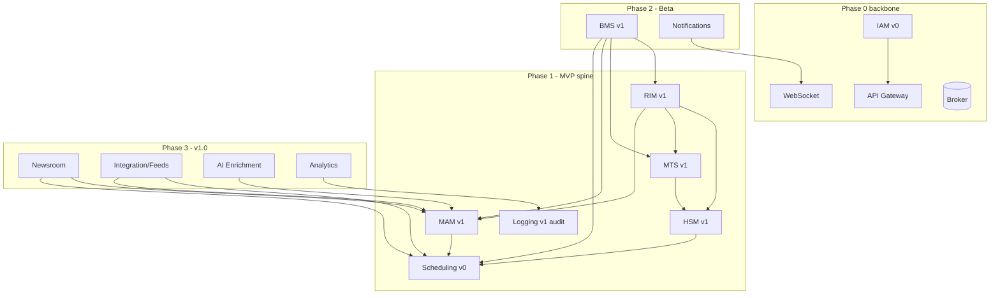

# System Implementation Plan

> The **general engineering plan** for building Atlas: how the monorepo, shared contracts,
> backbone, data plane, and delivery pipeline come up first, in what order the services are
> built, and how each roadmap phase turns into concrete technical deliverables. Per-service
> build plans live in [`roadmap/services/`](services/README.md).
>
> Parents: [Delivery Roadmap](08-roadmap.md) (phases/dates), [System Architecture](../architecture/02-system-architecture.md)
> (topology), [Service Catalog](../architecture/03-service-catalog.md) (per-service cards + stack).
> This document is the **bridge** between the roadmap's phases and the code.

## 1. Purpose & how to use this set

The roadmap ([08](08-roadmap.md)) says *what ships when*; the architecture and service specs say
*what each thing is*. This plan says *how we build it* — the engineering sequence, the foundations
everything else stands on, and the cross-cutting rules every service follows. Then each
[per-service plan](services/README.md) drills into that one service's build.

**Reading order for an engineer joining a workstream:** this doc → the service's
[spec](../architecture/services/) → the service's [implementation plan](services/README.md) → its
[OpenAPI stub](../architecture/openapi/) and [event schemas](../architecture/schemas/).

## 2. Engineering principles

1. **Contracts before code.** Every service boundary is a **published contract** — an
   [OpenAPI 3.1 stub](../architecture/openapi/) for REST and a [JSON Schema](../architecture/schemas/)
   per event — generated into shared TypeScript types **before** either side is implemented. A
   service is "started" only once its contracts are frozen for the phase.
2. **One language, shared types.** Node.js LTS + TypeScript everywhere ([A2](../README.md#assumptions-register));
   the envelope, event payloads, DTOs, and API clients live in shared monorepo packages consumed by
   every service **and** the Angular Studio. This is the small team's biggest force-multiplier.
3. **Events are the backbone; REST is the edge.** Cross-service state changes flow as broker events;
   synchronous REST is for user-facing reads/commands through the gateway. No service reaches into
   another's database.
4. **Outbox, never dual-write.** State change + event emission happen in one relational transaction
   via an **outbox table + relay**; consumers are **idempotent** (at-least-once delivery).
5. **Offline-first core.** The core platform must run fully **air-gapped** ([A9](../README.md#assumptions-register));
   only AI degrades. Every dependency must have an offline install path (§7).
6. **Critical path is sacred.** Ingest → transcode → catalog → schedule → send-to-air must keep
   working even when non-critical services (AI, analytics, feeds) are down
   ([Architecture §8](../architecture/02-system-architecture.md#8-failure-and-degradation-model)).
7. **Walking skeleton first.** Build the thinnest end-to-end path early (Phase 0's "hello asset"),
   then thicken it — never a big-bang integration at the end.

## 3. Foundations — build these before any feature (Phase 0)

These are the rails. They are the highest-leverage, highest-risk work; invest here
([Roadmap Phase 0](08-roadmap.md#phase-0--foundations-t0t6)).

### 3.1 Monorepo & shared libraries

- **Nx or Turborepo** monorepo; one deployable per service under `apps/`, shared code under
  `libs/`. Strict TypeScript, one lint/format/test config.
- **Foundational shared libs** (build first, version carefully — everything depends on them). The
  first three exist as **tested reference implementations** in [`reference/`](../../reference/README.md)
  — lift them into `libs/`:
  - `contracts` — types + the envelope build/validate + a payload validator for every event.
    **The single source of cross-service truth.** → [`reference/contracts`](../../reference/contracts/README.md) (8 tests).
  - `messaging` — broker client: publish-with-outbox, subscribe-with-idempotency, retry/DLQ,
    correlation propagation; in-memory broker for dev. → [`reference/messaging`](../../reference/messaging/README.md) (6 tests).
  - `service-kit` — the **service template**: health/readiness, structured logging, config
    load/validate, JWT/JWKS auth, error taxonomy, correlation context (+ OTel tracing, graceful
    shutdown to add). → [`reference/service-kit`](../../reference/service-kit/README.md) (8 tests).
  - `policy` — the **pure authorization evaluator** (`can()`), zero runtime deps and **browser-safe**,
    imported by every service *and* Studio so both reach the same decision
    ([Authorization Model §10](../architecture/authorization-model.md#10-packaging--keep-policy-separate-from-iam)).
    Deliberately **separate from the IAM service**. *(not yet in reference)*
  - `reference` — **admin-editable runtime configuration**: the setting-descriptor registry
    (`defineSettings`), validation, nearest-wins scope resolution, and the cached snapshot client.
    Browser-safe, so Studio generates its admin UI from the same descriptors
    ([Configuration & Reference Data](../architecture/configuration-and-reference-data.md)).
    Distinct from `service-kit`'s **bootstrap** config (env/secrets, needed before the DB exists).
    *(not yet in reference)*
  - `data` — store clients + migration-runner conventions, `withTransaction`, and a SQL-backed
    outbox (the real transactional outbox). → [`reference/data`](../../reference/data/README.md)
    (6 tests; `node:sqlite`, maps 1:1 to `pg`/Prisma + Mongo + `ioredis` + OpenSearch).

### 3.2 Backbone services (Phase 0)

Stand up the spine so features have somewhere to plug in:

- **[API Gateway / BFF](services/api-gateway-plan.md)** (Fastify) — routing, authN verification,
  request aggregation, rate limiting.
- **[WebSocket service](services/websocket-plan.md)** — authenticated live push to Studio.
- **[Message broker](../architecture/02-system-architecture.md#34-message-broker)** — NATS
  JetStream (or RabbitMQ) with subjects, durable streams, DLQs; load-spike test in Phase 0
  ([Roadmap risks](08-roadmap.md#risks)).
- **[IAM v0](services/iam-plan.md)** — login, JWT access+refresh, JWKS, basic users/roles; the
  token-validation library every service imports.
- **Service discovery** — provided by Kubernetes + broker, not a bespoke service
  ([Architecture §3.3](../architecture/02-system-architecture.md#33-service-registry--discovery)).

### 3.3 Data plane

Provision and templatize **PostgreSQL, MongoDB, Redis, OpenSearch, object storage** (S3-compatible /
MinIO for on-prem). Per-service schema/database ownership; migration runner wired into CI; seed/reset
scripts for dev.

### 3.4 Delivery pipeline & environments

- **CI:** typecheck → lint → unit → contract-validate (payloads against schemas) → build images →
  integration tests (ephemeral stores via testcontainers) → publish.
- **CD:** IaC (Terraform/Helm) for **dev → staging → prod**; per-service deployables; DB migrations
  gated in the pipeline.
- **Environments:** dev (shared), staging (prod-like, pilot data), prod (per-customer, on-prem or
  [SaaS](../architecture/02-system-architecture.md#saas)).

### 3.5 Studio shell (Angular)

Auth flow, layout shell, WebSocket client, i18n/RTL scaffolding, generated API clients from the
`contracts` lib. Feature pages land per phase.

### 3.6 Observability baseline

Logs/metrics/traces from `service-kit`; one **end-to-end "hello asset" trace** through gateway →
service → broker → WebSocket proves the spine ([Roadmap Phase 0 exit](08-roadmap.md#phase-0--foundations-t0t6)).

**Phase 0 exit:** a trivial asset is created through the gateway, stored, and pushed live to Studio —
the whole spine proven end to end.

## 4. Service build order & dependency graph

Build bottom-up: storage & identity before the services that use them; orchestration after the
services it orchestrates.

**Build sequence (critical path first):**

| Order | Service | First version | Phase | Blocks |
|------:|---------|---------------|-------|--------|
| 1 | API Gateway, WebSocket, IAM | backbone | 0 | everything |
| 2 | HSM | v1 (online tier) | 1 | RIM, MTS, Scheduling |
| 3 | RIM | v1 (upload/watch) | 1 | the whole ingest flow |
| 4 | MTS | v1 (FFmpeg) | 1 | MAM ready-assembly |
| 5 | MAM | v1 (catalog/search) | 1 | Scheduling, everything downstream |
| 6 | Scheduling | v0 → v1 | 1 → 2 | send-to-air |
| 7 | Logging | v1 (audit) | 1 | compliance (parallel) |
| 8 | BMS | v1 | 2 | automated flows |
| 9 | Notifications | v1 | 2 | tasks/approval UX |
| 10 | Newsroom, Integration, AI, Analytics | v1 | 3 | feature-complete |

## 5. Phase → technical deliverables

Each cell links the roadmap scope to the concrete engineering. Detail is in the per-service plans.

### Phase 0 — Foundations
Monorepo + shared libs (§3.1); backbone services + broker + data plane (§3.2–3.3); CI/CD +
environments (§3.4); Studio shell (§3.5); observability + hello-asset trace (§3.6).

### Phase 1 — MVP spine
[HSM v1](services/hsm-plan.md) online tier · [RIM v1](services/rim-plan.md) upload/watch/acceptance ·
[MTS v1](services/mts-plan.md) FFmpeg proxy/broadcast/thumbnail · [MAM v1](services/mam-plan.md)
core+tags+simple search · [Scheduling v0](services/scheduling-plan.md) table CRUD ·
[Logging v1](services/logging-analytics-plan.md) audit. Studio: ingest, search, metadata edit,
schedule (basic), live updates. **Exit:** upload → transcode → catalog → search → schedule, audited.

### Phase 2 — Beta
[BMS v1](services/bms-plan.md) preset flows + human steps · **Review lifecycle** (manual approval,
expiry, retention — its own [feature plan](15-review-lifecycle-implementation-plan.md)) ·
[Notifications v1](services/notifications-plan.md) inbox/messaging · [MAM v2](services/mam-plan.md)
advanced/faceted search + taxonomy + people · [MTS v2](services/mts-plan.md) autoscale + VTT/hover ·
[Scheduling v1](services/scheduling-plan.md) validation + send-to-air · [Integration inbound](services/integration-feeds-plan.md) ·
media editor v1 · multi-channel isolation + theming/i18n.

### Phase 3 — v1.0
[BMS v2](services/bms-plan.md) authoring · [AI Enrichment](services/ai-enrichment-plan.md) online-first ·
[HSM v2](services/hsm-plan.md) near-line/offline + restore + integrity · [Integration outbound](services/integration-feeds-plan.md)
EPG/HbbTV/social · [Newsroom](services/newsroom-plan.md) · [RIM recording](services/rim-plan.md) ·
[IAM v2](services/iam-plan.md) SSO/MFA · [Analytics](services/logging-analytics-plan.md) · HA across
the critical path.

### GA — Hardening
NFR load/perf, failover/chaos drills, external pen-test, WCAG 2.1 AA, i18n/RTL QA, runbooks.

## 6. Cross-cutting engineering standards

Every service adheres to these (enforced by `service-kit` + CI):

- **Auth:** validate JWT locally via shared JWKS; enforce resource-level authz **in-service**
  (department/channel scope), not only at the gateway ([Architecture §5.2](../architecture/02-system-architecture.md#52-authorization)).
- **Multi-channel:** `channelId` on every row and every message; tenant isolation enforced in queries
  ([Architecture §4](../architecture/02-system-architecture.md#4-tenancy-and-multi-channel)).
- **Idempotency:** consumers key on `messageId`/entity id; transitions are conditional; redelivery is a
  no-op.
- **Errors:** shared error taxonomy → consistent HTTP problem+JSON and event failure semantics.
- **Observability:** RED metrics per endpoint, event lag/DLQ metrics per consumer, traces threaded by
  `correlationId`, structured audit logs to [Logging](services/logging-analytics-plan.md).
- **Config:** validated at boot; no deploy needed to change vocabularies/policies where the spec says so.
- **Migrations:** forward/backward tested; additive-first (nullable columns) to keep deploys online.

## 7. Offline / air-gapped delivery

A recurring risk ([Roadmap risks](08-roadmap.md#risks)) built in from Phase 0:

- **Offline install bundle:** pinned container images + Helm charts + a local artifact/model registry,
  buildable and installable with **no internet**; test an air-gapped install before v1.0.
- **No runtime internet assumption** on the core path; AI online tier is the only feature allowed to
  require egress, and it degrades to off/local ([A12b](../README.md#assumptions-register)).

## 8. System-level testing strategy

| Level | What | Where |
|-------|------|-------|
| Unit | pure logic (resolvers, validators, serializers) | each service |
| Contract | every payload validates against its JSON Schema; OpenAPI conformance | CI, all services |
| Integration | service + real stores (testcontainers) + broker | per service |
| Flow / e2e | the canonical ingest→air path across services | staging |
| Idempotency/chaos | duplicate delivery, consumer restart, broker outage | Phase 2+ |
| Non-functional | perf/capacity ([NFR](../requirements/06-non-functional-requirements.md)), failover RTO/RPO | GA |

## 9. Risk register (engineering)

| Risk | Mitigation |
|------|-----------|
| Broker/orchestrator choice sets the pace | Validate in Phase 0 with a load-spike test; keep contracts broker-agnostic. |
| Shared-lib churn breaks many services | Version `contracts`/`messaging` semantically; CI runs all consumers on change. |
| HSM byte-movement is the one CPU/IO hot path | Node streams + worker-threads first; **escape hatch** to a native/Go mover only if profiling demands ([Catalog stack](../architecture/03-service-catalog.md#recommended-implementation-stack)). |
| Small team, broad surface ([A7](../README.md#assumptions-register)) | Ruthless MoSCoW; ship each service thin (vN) then thicken; build in dependency order. |
| Air-gapped install blocked by missing artifacts | Offline bundle from Phase 0 (§7); rehearse air-gapped install. |
| Big-bang integration at the end | Walking skeleton in Phase 0; thicken the same path each phase. |

---
_Next: [per-service implementation plans](services/README.md) · [Review lifecycle plan](15-review-lifecycle-implementation-plan.md)._
