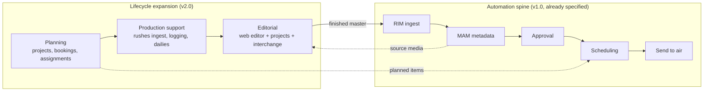

# Production Lifecycle Scope — What Atlas Builds, Integrates, and Excludes

> The scope decision for pre-production, production, and post-production, activity by
> activity. This document answers *"which parts of the lifecycle can Atlas cover?"* Parent:
> [Technical Brief](../01-technical-brief.md). Market context:
> [Market & Positioning](18-market-and-positioning.md). Delivery consequences:
> [Roadmap](../roadmap/08-roadmap.md) · [Resourcing](../roadmap/09-resourcing-estimates.md).

## 1. The decision rule

Atlas cannot cover every aspect of a stage, and trying to would produce a shallow version of
tools that already exist. One rule decides each activity:

> **Build what is data- and workflow-shaped and connects to the spine.
> Integrate what is craft-tool-shaped.
> Exclude what needs physical hardware, a specialist discipline, or a regulated back office.**

Atlas's defensible core is the **metadata + workflow + automation spine**. An activity belongs
in Atlas when its output is *structured data other stages consume* — a schedule, an assignment,
a shot list, an approval, a rendition. It belongs outside when its output is *craft* — a graded
image, a mixed track, a designed graphic.

Each activity below is marked:

| Mark | Meaning |
|:----:|---------|
| 🟢 **Build** | Atlas implements it |
| 🟡 **Build light** | Atlas implements a deliberately shallow version that feeds the spine; depth comes from integration |
| 🔵 **Integrate** | Atlas connects to a specialist tool; it does not reimplement it |
| ⚪ **Exclude** | Out of scope entirely |

A **release** column indicates when — noting that most of this is **v2.0**, not v1.0
([§6](#6-delivery-consequence-this-is-a-v20-horizon)).

---

## 2. Pre-production

The stakeholder flow: **planning → budgeting → scheduling → staffing → preparing**.

| Activity | Decision | Release | Rationale |
|----------|:--------:|:-------:|-----------|
| **Editorial/production planning** (projects, stories, events, calendars, coverage plans) | 🟢 Build | v2.0 (news: v1.0) | Pure data + workflow; it is the front end of the same spine. Superdesk proves the shape in news. |
| **Assignments & briefs** (who covers what, with what kit, by when) | 🟢 Build | v2.0 (news: v1.0) | Feeds tasks/notifications that already exist; closes the loop from plan → footage → publish. |
| **Resource scheduling** (crew, studios, edit suites, cameras, vehicles, rooms) | 🟢 Build | v2.0 | Stakeholder-flagged as the most important step. It is booking + conflict detection + availability — classic structured data. **See the naming warning in [§2.1](#21-two-different-things-called-scheduling).** |
| **Staffing / crewing** (availability, roles, call sheets) | 🟡 Build light | v2.0 | Assignment and availability belong with scheduling; **contracts, payroll, HR records do not** — integrate to HR. |
| **Budgeting** | 🔵 Integrate (+🟡 cost tracking) | v2.0 | Atlas tracks **estimated vs actual cost per project** using rate cards, and exports to finance. Full accounting is a tax/regulatory/localization sinkhole with entrenched incumbents (Movie Magic Budgeting, ERP). Do not build a ledger. |
| **Script writing & editing — news** | 🟢 Build | v1.0 | Already in [Newsroom](../architecture/services/newsroom.md); news scripts are short, structured, and rundown-bound. Essential, per stakeholder. |
| **Script writing & editing — scripted/long-form** | 🔵 Integrate | v2.0 | Final Draft/Celtx own this. Import/export via **Fountain** and **FDX**; store the script as an asset with versions. |
| **Script breakdown** (tag elements: cast, props, locations, VFX → requirements) | 🟡 Build light | v2.0 | High-value *glue*: breakdown output is exactly the structured input resource scheduling needs. Build the tagging + requirement generation, not a rival to Movie Magic. |
| **Storyboarding** | 🔵 Integrate | v2.0 | A drawing tool. Atlas stores boards as assets, links them to scenes/shots, and supports review — it does not draw. |
| **Shot lists** | 🟡 Build light | v2.0 | List-shaped data that links script → schedule → captured footage. Cheap to build, high connective value. |
| **Rights & clearances planning** | 🟡 Build light | v2.0 | Rights windows already exist in [Scheduling](../architecture/services/scheduling.md); extend to acquisition-time clearance tracking. |

### 2.1 Two different things called "scheduling"

This is a real source of confusion and must stay explicit in the product and the data model:

| Term | Meaning | Owner |
|------|---------|-------|
| **Resource scheduling** (pre-production) | Booking people, facilities, and equipment against time | New [Planning service](../architecture/services/planning.md) |
| **Broadcast scheduling** (transmission) | The program table / playlist that goes to air | Existing [Scheduling service](../architecture/services/scheduling.md) |

They share a calendar metaphor and nothing else — different entities, constraints, permissions,
and consumers. Keep them as **separate services with separate vocabulary** in the UI
("Bookings" vs "Program table") to prevent an expensive conceptual merge.

---

## 3. Production

The stakeholder assessment is correct: **filming, directing, lighting, cinematography, audio
recording, and B-roll capture are ⚪ excluded** — they are physical-craft activities on set.

**But production is not zero for Atlas.** The activities *around* the shoot are exactly the
data-shaped ones that make the rest of the platform work:

| Activity | Decision | Release | Rationale |
|----------|:--------:|:-------:|-----------|
| Filming, directing, lighting, cinematography, sound recording | ⚪ Exclude | — | Physical craft; no software substitute. |
| Studio/gallery hardware control (vision mixers, robotic cameras, tally) | ⚪ Exclude | — | Vizrt Mosart / GV territory; integrate via MOS at most. |
| **Camera-card / rushes ingest** (offload, verify, checksum, register) | 🟢 Build | v1.0 (extends [RIM](../architecture/services/rim.md)) | This is ingest — Atlas already does it. Add card-offload semantics and verification. |
| **Shot logging / footage tagging** (mark good takes, log against the shot list) | 🟢 Build | v2.0 | Structured metadata created at the point of capture; hugely valuable downstream for search. |
| **Dailies / rushes review & approval** | 🟢 Build | v2.0 | Proxy playback + comments + approval is [MAM](../architecture/services/mam.md) + [BMS](../architecture/services/bms.md) with a review UI — near-free given the existing spine. |
| **Call sheets & production status** | 🟡 Build light | v2.0 | Generated from planning/scheduling data; a document output, not a new domain. |
| **Field/remote contribution** (upload from location, low-bandwidth proxies) | 🟢 Build | v2.0 | An ingest path; matters for news especially. |
| **Live-event coordination** (run order, cues for live shows) | 🟡 Build light | v2.0 | Adjacent to rundowns; keep shallow and avoid drifting into studio automation. |

**The correction worth noting:** treating production as entirely out of scope would lose the
single best opportunity to capture metadata *at the moment it is cheapest to capture* — on set,
when someone knows which take was good. Shot logging and dailies review are where Atlas earns
its search and AI value later.

---

## 4. Post-production

| Activity | Decision | Release | Rationale |
|----------|:--------:|:-------:|-----------|
| Colour correction / grading | ⚪ Exclude | — | DaVinci territory; specialist, hardware-accelerated, deeply craft. |
| Visual effects / compositing | ⚪ Exclude | — | After Effects/Nuke territory. |
| Sound design, music scoring, audio mastering | ⚪ Exclude | — | Pro Tools/Audition territory. |
| **Web editor — cut, assemble, title, overlay, audio adjust, image edit** | 🟢 Build | v1.0 (basic) → **v2.0 (project-based)** | Stakeholder-core. See [§4.1](#41-the-web-editor-is-the-largest-single-commitment). |
| **Editing project persistence** (save, reopen, continue later) | 🟢 Build | v2.0 | Turns the editor from a one-shot tool into a real workspace; requires a project model, locking, and versioning. |
| **Timeline interchange with desktop NLEs** | 🟢 Build | v2.0 | The integration requirement. See [§4.2](#42-interchange-what-is-actually-possible) — this is where a common assumption needs correcting. |
| **Review & approval of cuts** (comments, frame-accurate notes, versions) | 🟢 Build | v2.0 | Spine-native; a strong differentiator versus emailing files around. |
| **Final QC / compliance check** | 🟡 Build light | v2.0 | Automated checks (loudness, black frames, duration) via [MTS](../architecture/services/mts.md); human sign-off via existing approval. |

### 4.1 The web editor is the largest single commitment

Moving from the current **basic-NLE** ([D3](../01-technical-brief.md#9-resolved-decisions)) to a
**project-based web editor with desktop interchange** is the biggest cost and risk in this
entire expansion — larger than planning and production support combined. Avid's web editing
product is the output of a large team over years.

What changes technically:

- A **persistent project/timeline model** (not a one-shot render request) — the domain of the
  new [Editorial service](../architecture/services/editorial.md).
- **Frame-accurate browser playback** of multi-clip timelines, which means proxy renditions
  designed for scrubbing (segmented, keyframe-dense) — an [MTS](../architecture/services/mts.md)
  profile change, not just a UI feature.
- **Server-side render** of an edit-decision graph, with progress and versioning (already
  MTS-shaped, but far more complex graphs).
- **Concurrency**: locking or collaborative editing on a project.
- **Interchange fidelity**, below.

**Recommendation:** keep the **v1.0 basic-NLE exactly as specified** and treat the project-based
editor as the flagship of **v2.0**. Do not let it expand v1.0 — it is the single most likely
cause of a missed GA.

### 4.2 Interchange: what is actually possible

One correction matters here, because the plan depends on it:

> **Adobe Premiere's `.prproj` is a proprietary, undocumented format. You cannot reliably read
> or write it**, and no stable third-party library does. "Export to Premiere" and "import a
> Premiere project" must be delivered through **interchange formats**, not the native project
> file. This is a limitation of Adobe's format, not of Atlas's design — and it is how every
> other vendor does it too.

The realistic interchange matrix:

| Format | Direction | Carries | Notes |
|--------|-----------|---------|-------|
| **OpenTimelineIO (OTIO)** | both | Timeline structure, tracks, clips, markers, some effects | **Recommended internal timeline model.** Open, actively maintained, with adapters to most other formats — adopt it as the hub and get the rest via adapters. |
| **AAF** | both | Timeline + media references + some effects | The professional standard; Premiere and Media Composer both import/export it. Best fidelity for round-trip to Avid. |
| **FCPXML** | both | Timeline, clips, effects metadata | Final Cut Pro and DaVinci Resolve; Premiere imports it. |
| **EDL (CMX3600)** | both | Cuts, basic transitions only | Universal, ancient, lossy — a guaranteed fallback, never the primary path. |
| **XMEML** (legacy Premiere XML) | both | Timeline structure | Older Premiere interchange; useful, being superseded. |
| `.prproj`, `.aep`, `.drp` | — | — | **Native project files — not interchangeable.** Do not promise these. |

**Architectural consequence:** build the editor's timeline on an **OTIO-compatible model** from
the start. Interchange then becomes adapters at the boundary rather than a translation layer
bolted on late — and it aligns with the standards commitment in
[Standards & FIMS](../integrations/20-standards-and-fims.md).

**Set expectations honestly with customers:** round-trip interchange is *lossy*. Cuts, clip
references, and basic transitions survive; complex effects, plugins, and grades do not. Every
vendor has this limitation; the ones that seem not to are round-tripping within their own
ecosystem.

---

## 5. Where the completed media rejoins the existing platform

The stakeholder's framing is right and worth stating as an architectural invariant:

> Media entering the **automation** workflow is normally **complete and ready to distribute**.

So the lifecycle expansion sits *in front of* the platform already specified, and the handoff
point is the existing ingest boundary:

Two connections are worth building deliberately:

1. **Editorial → RIM**: a rendered cut enters as a normal asset version, so approval,
   scheduling, and playout need no special case.
2. **Planning → Scheduling**: a planned programme/event can pre-populate a program-table slot
   long before the media exists — this is the loop that makes the "one spine" claim real.

---

## 6. Delivery consequence: this is a v2.0 horizon

**This expansion does not fit in v1.0.** Rough incremental effort against the existing
[~305–490 PW](../roadmap/09-resourcing-estimates.md#2-effort-estimate-by-area) baseline:

| Expansion area | Incremental effort | Note |
|----------------|:------------------:|------|
| Planning service (projects, bookings, assignments, breakdown, shot lists) | ~30–45 PW | Largely CRUD + constraint logic; well-understood |
| Production support (rushes ingest, logging, dailies review, call sheets) | ~15–25 PW | Mostly reuses MAM/BMS/RIM |
| **Editorial service** (project model, timeline, playback, render graph, interchange) | **~60–100 PW** | The dominant cost and risk |
| Standards & FIMS conformance ([doc 17](../integrations/20-standards-and-fims.md)) | ~20–35 PW | Adapters + data-model mapping |
| **Total** | **~125–205 PW** | **≈ +35–45%** on the v1.0 baseline |

**Recommended plan:**

1. **Do not change the v1.0 scope.** Ship the automation spine as specified — MVP ~6 months, GA
   ~16–18 months ([Resourcing §8](../roadmap/09-resourcing-estimates.md#ai-assisted-development)).
2. **Make three cheap, high-leverage preparations inside v1.0** so v2.0 is additive rather than
   a rewrite:
   - Build the editor's timeline on an **OTIO-compatible model** ([§4.2](#42-interchange-what-is-actually-possible)).
   - Keep the **FIMS/EBUCore mapping** in the data model from the start ([doc 17](../integrations/20-standards-and-fims.md)).
   - Reserve **`projectId`** as a first-class scope alongside `channelId` in MAM/BMS, so
     planning can attach to existing entities without a migration.
3. **Sequence v2.0**: Planning first (cheapest, highest customer-visible value, and it feeds
   news immediately), then production support, then the editor.
4. **Validate the editor commercially before building it.** It is ~60–100 PW; confirm that
   target customers will pay for a web editor rather than continuing to use Premiere.

**If the expansion were forced into v1.0**, GA moves from ~16–18 months to roughly **24–30
months** with the Core team — which would also mean no revenue and no production feedback for
two-plus years. That is the trade this document exists to make visible.

---
_Next: [Standards & FIMS](../integrations/20-standards-and-fims.md) ·
[Planning service](../architecture/services/planning.md) ·
[Editorial service](../architecture/services/editorial.md)._
